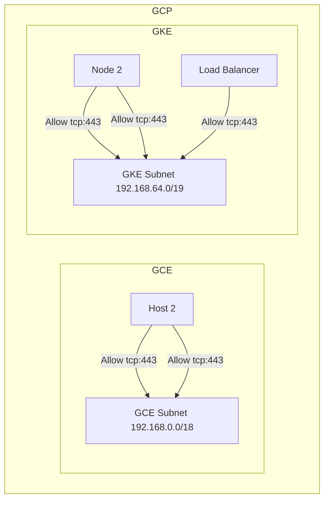

How to understand the rules of the network
先介绍我的环境大概信息如下：
GCP工程里面允许了GKE，且GKE的网络和GCE在同一个subnetwork 
比如GCE的网络IP地址范围是192.168.0.0/18
GKE的IP地址范围是192.168.64.0/19
我的配置GKE的Namespace规则默认Deny ALL egress and Deny all ingress 

A GCP project with GKE enabled, and GKE is running in the same subnetwork as GCE.
GCE has an IP address range of 192.168.0.0/18.
GKE has an IP address range of 192.168.64.0/19.
You have multiple namespaces in GKE, and each namespace has a default deny-all network policy.
Your services (SVC) expose port 443, but the containers listen on port 8443.
You want to allow Load Balancer IP-based communication from GCE to GKE.
```yaml
apiVersion: networking.k8s.io/v1
kind: NetworkPolicy
metadata:
  name: default-deny-all
  namespace: $namespace
spec:
  podSelector: {}
  policyTypes:
    - Ingress
    - Egress
```
我的Namespace肯定是有多个的
我要要逐步放开 GKE 中的 Network Policy 防火墙以允许通过 Load Balancer IP 的通信
我的所有的SVC暴露服务的端口都是443 但是我的Container的默认端口都是8443。也就是我的SVC中有类似下面这种配置
```yaml
spec:
  ports:
    - port: 443
      protocol: TCP
      targetPort: 8443
```
那么我现在需要考虑允许SVC的Loadbalance类型的服务能够通过GCE的主机访问过来，应该会涉及到允许Node之间跳转
```yaml
apiVersion: networking.k8s.io/v1
kind: NetworkPolicy
metadata:
  name: allow-node-cidr-ingress-$namespace
  namespace: $namespace
spec:
  podSelector: {}
  policyTypes:
    - Ingress
  ingress:
    - from:
        - ipBlock:
            cidr: 192.168.64.0/19
      ports:
        - port: 443
```
允许GCENode的IP访问我的namespace 443 ports
上面仅仅是一些例子，请帮我核对并规划我的networkpolicy 以及哪些firewall可能需要开放
比如我的Ingress规则是不是可以基于我的GCE的service account 允许其Ingress到我的GKE node运行的service account 

# a

好的，我会帮助你核对并规划你的网络策略和防火墙规则。

### 规划网络策略

你的目标是允许通过Load Balancer IP的通信，并允许GCE的主机访问GKE的服务。你已经有了默认的`Deny All`策略，现在需要逐步开放通信。

#### 1. 允许从GCE到GKE的Ingress流量

要允许GCE的主机访问GKE中的服务，你需要根据GCE主机的IP地址范围（例如192.168.0.0/18）来配置网络策略。

```yaml
apiVersion: networking.k8s.io/v1
kind: NetworkPolicy
metadata:
  name: allow-gce-ingress
  namespace: $namespace
spec:
  podSelector: {}
  policyTypes:
    - Ingress
  ingress:
    - from:
        - ipBlock:
            cidr: 192.168.0.0/18
      ports:
        - port: 443
          protocol: TCP
```

#### 2. 允许Node间的通信

为了允许Node之间的通信，你可以允许特定IP范围的Node间的通信，例如192.168.64.0/19。

```yaml
apiVersion: networking.k8s.io/v1
kind: NetworkPolicy
metadata:
  name: allow-node-cidr-ingress
  namespace: $namespace
spec:
  podSelector: {}
  policyTypes:
    - Ingress
  ingress:
    - from:
        - ipBlock:
            cidr: 192.168.64.0/19
      ports:
        - port: 443
          protocol: TCP
```

#### 3. 允许Load Balancer访问Pod的通信

```yaml
apiVersion: networking.k8s.io/v1
kind: NetworkPolicy
metadata:
  name: allow-loadbalancer-ingress
  namespace: $namespace
spec:
  podSelector: {}
  policyTypes:
    - Ingress
  ingress:
    - from:
        - ipBlock:
            cidr: 192.168.64.0/19
      ports:
        - port: 443
          protocol: TCP
```

### 规划防火墙规则

除了配置K8s网络策略，你还需要配置GCP防火墙规则来允许相应的流量。以下是需要配置的防火墙规则：

#### 1. 允许GCE到GKE节点的流量

创建一个防火墙规则，允许从GCE子网到GKE节点子网的流量。

```bash
gcloud compute firewall-rules create allow-gce-to-gke \
    --network $your-network \
    --allow tcp:443 \
    --source-ranges 192.168.0.0/18 \
    --target-tags gke-node
```

#### 2. 允许GKE节点间的流量

创建一个防火墙规则，允许GKE节点之间的流量。

```bash
gcloud compute firewall-rules create allow-gke-node-to-node \
    --network $your-network \
    --allow tcp:443 \
    --source-ranges 192.168.64.0/19 \
    --target-tags gke-node
```

### 规划Mermaid流程图

以下是Mermaid流程图，帮助你更直观地理解流量的允许路径：



### 总结

1. **Network Policies**:
    - `allow-gce-ingress`：允许GCE主机访问GKE服务。
    - `allow-node-cidr-ingress`：允许GKE节点间的通信。
    - `allow-loadbalancer-ingress`：允许Load Balancer访问GKE服务。

2. **Firewall Rules**:
    - `allow-gce-to-gke`：允许GCE到GKE节点的流量。
    - `allow-gke-node-to-node`：允许GKE节点之间的流量。

通过以上配置，你应该能够逐步放开GKE中的Network Policy防火墙，并允许通过Load Balancer IP的通信。请根据你的实际需求调整具体的IP范围和防火墙规则。
