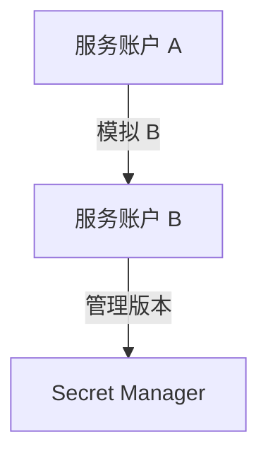
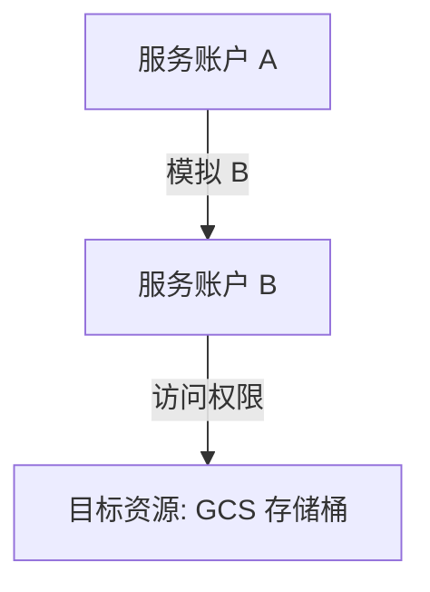

# Google服务账户模拟

Google服务账户模拟
https://cloud.google.com/docs/authentication/use-service-account-impersonation?hl=zh-cn
如何使用 Google 服务账户模拟。
使用 Google 服务账户模拟可以让一个服务账户（模拟账户）获取另一个 Google 账户（被模拟账户）的权限，从而代表被模拟账户执行操作
给我一个具体的例子,比如一个A账户如何获取B账户的权限,从而代表B账户去执行只有B账户拥有的权限?


使用 Google 服务账户模拟的核心步骤是通过 **IAM角色绑定** 和 **模拟请求**，让服务账户 A 能够代表服务账户 B 执行操作。以下是具体步骤和示例实现：


我想实现的一个场景是
B用户有 roles/secretmanager.secretVersionManager
A用户有roles/secretmanager.secretAccessor 但是B用户没有roles/secretmanager.secretVersionManager


要模拟实现 **A 用户使用服务账户 B 的 `roles/secretmanager.secretVersionManager` 权限**，以下是具体步骤：

---
# GCP secret manager 模拟
### 场景说明

- **A 用户**：有 `roles/secretmanager.secretAccessor`（可以读取 Secret）。
- **B 用户**：没有直接的 `roles/secretmanager.secretAccessor`，但有 `roles/secretmanager.secretVersionManager`（可以管理 Secret 版本，如启用、禁用或删除版本）。

目标：A 用户通过模拟 B 来管理 Secret 版本，而不直接授予 A `roles/secretmanager.secretVersionManager`。

---

### 配置步骤

#### 1. 授予 A 模拟 B 的权限
通过 IAM 配置，让 **A** 能模拟 **B**：

```bash
gcloud iam service-accounts add-iam-policy-binding \
  service-account-b@project-id.iam.gserviceaccount.com \
  --member="serviceAccount:service-account-a@project-id.iam.gserviceaccount.com" \
  --role="roles/iam.serviceAccountTokenCreator"
```

**解释**:
- **`roles/iam.serviceAccountTokenCreator`**：允许 A 生成 B 的访问令牌。
- **`service-account-b`** 是被模拟的服务账户。

---

#### 2. 确保 B 用户有管理 Secret 版本的权限
授予 B 用户 `roles/secretmanager.secretVersionManager`：

```bash
gcloud secrets add-iam-policy-binding secret-id \
  --member="serviceAccount:service-account-b@project-id.iam.gserviceaccount.com" \
  --role="roles/secretmanager.secretVersionManager"
```

**解释**:
- **`secret-id`**：目标 Secret 的名称。
- B 将有权限管理 Secret 版本。

---

#### 3. 确保 A 用户没有直接的版本管理权限
验证 A 的权限，确保只拥有 `roles/secretmanager.secretAccessor`：

```bash
gcloud secrets add-iam-policy-binding secret-id \
  --member="serviceAccount:service-account-a@project-id.iam.gserviceaccount.com" \
  --role="roles/secretmanager.secretAccessor"
```

---

#### 4. 使用 A 模拟 B 执行操作

##### （1）通过 `gcloud` CLI 模拟
```bash
gcloud auth activate-service-account service-account-a@project-id.iam.gserviceaccount.com --key-file=/path/to/key.json

gcloud auth print-access-token \
  --impersonate-service-account=service-account-b@project-id.iam.gserviceaccount.com | \
xargs -I {} curl -H "Authorization: Bearer {}" \
"https://secretmanager.googleapis.com/v1/projects/project-id/secrets/secret-id/versions/5:setEnabled"
```

- **解释**:
  - `--impersonate-service-account`: 使用 A 模拟 B。
  - API 调用将指定 Secret 版本 5 的状态设置为启用。

##### （2）通过 Python 模拟
以下是使用 Python 的完整示例：

```python
from google.auth.transport.requests import Request
from google.oauth2.service_account import Credentials
from google.auth import impersonated_credentials
from googleapiclient.discovery import build

# 1. 使用服务账户 A 的密钥文件加载初始凭据
service_account_file = "/path/to/service-account-a-key.json"
target_account = "service-account-b@project-id.iam.gserviceaccount.com"

credentials = Credentials.from_service_account_file(
    service_account_file,
    scopes=["https://www.googleapis.com/auth/cloud-platform"]
)

# 2. 模拟服务账户 B
impersonated_creds = impersonated_credentials.Credentials(
    source_credentials=credentials,
    target_principal=target_account,
    target_scopes=["https://www.googleapis.com/auth/cloud-platform"]
)

# 3. 使用模拟的 B 凭据访问 Secret Manager
secret_manager_service = build("secretmanager", "v1", credentials=impersonated_creds)

# 目标 Secret 及版本
secret_name = "projects/project-id/secrets/secret-id/versions/5"

# 设置版本状态为启用
request = secret_manager_service.projects().secrets().versions().patch(
    name=secret_name,
    body={"state": "ENABLED"}
)
response = request.execute()
print("Secret version enabled:", response)
```

---

### 验证配置

1. **确保 B 能管理 Secret 版本**：
   - 独立验证 B 是否具有 `roles/secretmanager.secretVersionManager` 权限。

2. **确保 A 无法直接管理版本**：
   - 尝试用 A 单独调用管理版本 API，应返回权限不足的错误。

3. **通过模拟成功执行操作**：
   - 确认 A 模拟 B 后，可以完成版本管理操作。

---

### 流程图



---

通过这种方式，可以实现 **服务账户 A 通过模拟 B 使用 B 的权限**，同时分离职责并确保最小权限原则。


# Buckets 模拟

### 示例场景

- 服务账户 **`service-account-a@project-id.iam.gserviceaccount.com`**（简称 A）希望模拟服务账户 **`service-account-b@project-id.iam.gserviceaccount.com`**（简称 B）。
- 服务账户 B 有权限访问 Google Cloud Storage（GCS），比如列出某个存储桶中的文件。
- 服务账户 A 没有 GCS 访问权限，需要通过模拟 B 来执行这个操作。

---

### 配置步骤

#### 1. 授予服务账户 A 模拟权限
通过 IAM 授予 **`service-account-a`** 对 **`service-account-b`** 的模拟权限：

```bash
gcloud iam service-accounts add-iam-policy-binding \
  service-account-b@project-id.iam.gserviceaccount.com \
  --member="serviceAccount:service-account-a@project-id.iam.gserviceaccount.com" \
  --role="roles/iam.serviceAccountTokenCreator"
```

**解释**:
- **`roles/iam.serviceAccountTokenCreator`**：允许 A 为 B 创建访问令牌，从而模拟 B。
- **`add-iam-policy-binding`**：将权限绑定到被模拟的服务账户（B）。

---

#### 2. 验证服务账户 A 和 B 的权限

- 服务账户 **B** 需要有目标操作权限（例如访问 GCS 的权限）：
  ```bash
  gcloud projects add-iam-policy-binding project-id \
    --member="serviceAccount:service-account-b@project-id.iam.gserviceaccount.com" \
    --role="roles/storage.objectViewer"
  ```

- 服务账户 **A** 仅需要模拟权限。

---

#### 3. 使用服务账户 A 模拟 B 执行操作

在程序中或命令行中模拟服务账户 B 并使用其权限。以下是使用 Python 和 Google Cloud SDK 的示例：

##### （1）通过 `gcloud` CLI 执行
使用服务账户 A 模拟 B 列出 GCS 存储桶中的文件：

```bash
gcloud auth activate-service-account service-account-a@project-id.iam.gserviceaccount.com --key-file=/path/to/key.json

gcloud auth print-access-token \
  --impersonate-service-account=service-account-b@project-id.iam.gserviceaccount.com | \
xargs -I {} curl -H "Authorization: Bearer {}" "https://storage.googleapis.com/storage/v1/b/your-bucket-name/o"
```

##### （2）通过 Python 执行
安装依赖库：

```bash
pip install google-auth google-auth-httplib2 google-api-python-client
```

代码示例：

```python
from google.auth.transport.requests import Request
from google.oauth2.service_account import Credentials
from google.auth import impersonated_credentials
from googleapiclient.discovery import build

# 1. 使用服务账户 A 的密钥文件加载初始凭据
service_account_file = "/path/to/service-account-a-key.json"
target_account = "service-account-b@project-id.iam.gserviceaccount.com"

credentials = Credentials.from_service_account_file(
    service_account_file,
    scopes=["https://www.googleapis.com/auth/cloud-platform"]
)

# 2. 模拟服务账户 B
impersonated_creds = impersonated_credentials.Credentials(
    source_credentials=credentials,
    target_principal=target_account,
    target_scopes=["https://www.googleapis.com/auth/cloud-platform"]
)

# 3. 使用模拟的 B 凭据访问 GCS
storage_service = build("storage", "v1", credentials=impersonated_creds)
bucket_name = "your-bucket-name"

response = storage_service.objects().list(bucket=bucket_name).execute()
print("Objects in bucket:")
for obj in response.get("items", []):
    print(obj["name"])
```

---

### 工作原理
1. **服务账户 A 的模拟权限**：通过 `roles/iam.serviceAccountTokenCreator` 授权，A 可以生成 B 的访问令牌。
2. **服务账户 B 的资源访问权限**：B 必须具备对目标资源的访问权限（例如 `roles/storage.objectViewer`）。
3. **模拟过程**：服务账户 A 使用模拟凭据代表服务账户 B 进行 API 调用。

---

### 流程图



---

通过这种方式，可以安全地实现服务账户模拟，从而分离职责和权限管理，同时最小化直接暴露敏感服务账户（B）的风险。