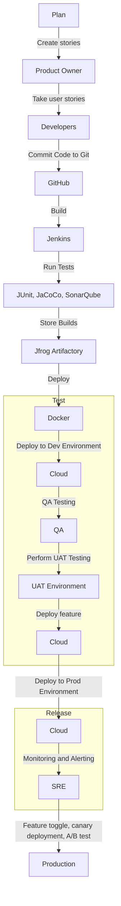

rkdown支持的Mermaid流图的示例：

```mermaid
graph TD
    A[Plan] -->|Create stories| B[Product Owner]
    B -->|Take user stories| C[Developers]
    C -->|Commit Code to Git| D[GitHub]
    D -->|Build| E[Jenkins]
    E -->|Run Tests| F[JUnit, JaCoCo, SonarQube]
    F -->|Store Builds| G[Jfrog Artifactory]
    G -->|Deploy| H[Docker]
    
    subgraph Test
        H -->|Deploy to Dev Environment| I[Cloud]
        I -->|QA Testing| J[QA]
        J -->|Perform UAT Testing| K[UAT Environment]
        K -->|Deploy feature| L[Cloud]
    end
    
    subgraph Release
        L -->|Deploy to Prod Environment| M[Cloud]
        M -->|Monitoring and Alerting| N[SRE]
    end
    
    N -->|Feature toggle, canary deployment, A/B test| O[Production]
```

### 使用说明
- 复制上述代码，并粘贴到支持Mermaid的Markdown编辑器中（如Typora、Obsidian等）以查看流程图。
- 此流程图展示了产品从计划到生产的全过程，包括开发、构建与打包、测试和发布的各个环节。
