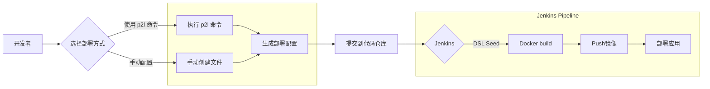

## 图片信息提取和流程梳理 - 以p2l为核心

### p2l是什么？

根据图片信息，p2l 是一款命令行工具 (CLI)，用于在 **服务托管平台 (Service Hosting Platform, SHP)** 上进行应用部署。 它可以通过预设的命令或手动配置来生成部署所需的结构和文件。

### 流程梳理

以下是基于图片信息，以 **p2l** 为核心的流程图：

**流程说明：**

1. **开发者** 需要选择使用 **p2l 命令** 或 **手动配置** 的方式来生成部署所需的结构和文件。
2. **使用 p2l 命令**: 开发者可以直接执行 p2l 提供的 onboarding 命令来进行初始化设置，生成基础的部署配置。
3. **手动配置**: 开发者需要手动创建以下文件：
   - Application Scheme file
   - Deployment Configuration file
   - Application configuration file
   - Jenkins configuration file(s)
   - Deployment files
   - Seeds jobs
4. 无论选择哪种方式，最终都需要将生成的 **部署配置** 提交到 **代码仓库**。
5. **Jenkins** 从代码仓库获取代码和配置，并使用 **DSL Seed** 生成具体的 Jenkins Job。
6. Jenkins Pipeline 启动，执行以下步骤：
   - **Docker build**: 构建应用镜像
   - **Push 镜像**: 将镜像推送到镜像仓库
   - **部署应用**: 将应用部署到目标环境

**p2l 的作用:**

- 简化部署流程，提供一键式部署体验
- 通过预设的命令和模板，确保部署配置的规范性和一致性
- 降低手动配置出错的风险

希望以上信息对您有所帮助! 如果您还有其他问题，请随时提出。
