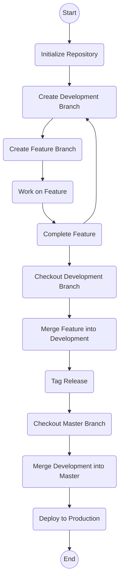
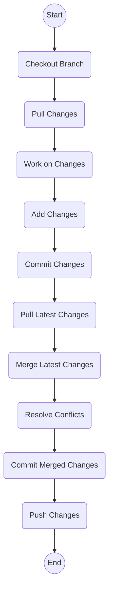

当涉及到Git的工作流程时，有很多不同的工作流程模型，最常见的是Git Flow。以下是一个简单的Git Flow的Mermaid流程图示例：

在这个示例中：
- 初始化仓库后，创建了一个开发分支（通常称为`develop`）。
- 从开发分支创建功能分支，进行特性开发。
- 完成特性后，将其合并回开发分支。
- 从开发分支创建发布分支，进行发布前的准备工作。
- 将发布分支合并回主分支（通常称为`master`）。
- 部署到生产环境。

请根据你实际使用的Git工作流程进行调整。这只是一个通用的示例，你可能需要根据实际情况添加其他步骤或自定义流程。

当涉及到常见的Git操作，例如pull、merge、add等，可以使用以下Mermaid流程图示例：

在这个示例中：
- 从开始（A）开始，首先检出工作分支（B）。
- 拉取最新的更改（C）。
- 进行工作并添加更改（D、E、F）。
- 再次拉取最新的更改（G）。
- 合并最新的更改，可能需要解决冲突（H、I、J）。
- 推送更改（K）。
- 最终结束（L）。

这是一个通用的流程图，你可以根据具体情况调整步骤或添加其他操作。