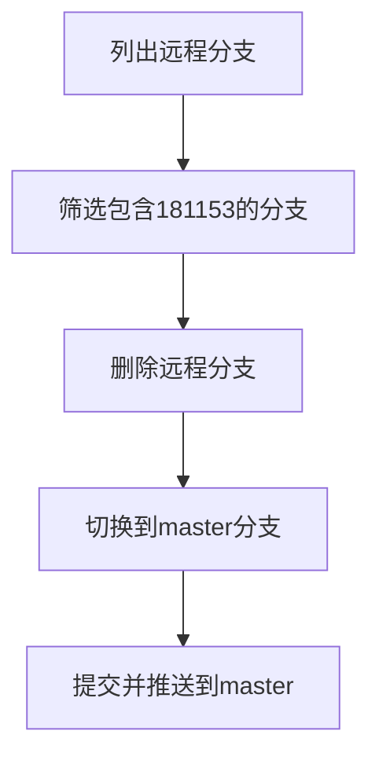

我来帮你处理这个Git分支清理的任务。我会给你一系列命令来完成这个操作。​​​​​​​​​​​​​​​​

使用方法：

1. 首先保存上面的脚本到一个文件，比如 `cleanup-branches.sh`
2. 给脚本添加执行权限：
```bash
chmod +x cleanup-branches.sh
```

3. 在你的仓库目录下运行这个脚本：
```bash
./cleanup-branches.sh
```

这个脚本会：
1. 切换到master分支并更新
2. 找出所有包含"181153"的分支
3. 显示要删除的分支列表
4. 询问确认
5. 对每个分支：
   - 尝试合并到master
   - 删除本地分支
   - 删除远程分支
6. 最后推送所有更改到master

如果你只想查看包含关键字的分支而不删除，可以使用：
```bash
git branch | grep "181153"
```

如果你想同时查看远程分支：
```bash
git branch -a | grep "181153"
```

需要注意的是，这个脚本会尝试合并所有分支到master。如果你确定某些分支的更改已经合并，你也可以直接使用：
```bash
git branch | grep "181153" | xargs git branch -D
```


- bash
```bash
#!/bin/bash

# 切换到主分支
git checkout master
git pull origin master

# 列出包含关键字的本地分支
echo "Finding branches containing '181153'..."
branches_to_delete=$(git branch | grep "181153")

# 显示要删除的分支
echo "Branches to be deleted:"
echo "$branches_to_delete"

# 确认是否继续
read -p "Continue with deletion? (y/n) " confirm

if [ "$confirm" = "y" ]; then
    # 遍历每个分支
    echo "$branches_to_delete" | while read branch; do
        # 去除分支名前的空格和*号
        branch_name=$(echo "$branch" | sed 's/^[ *]*//')
        
        if [ ! -z "$branch_name" ]; then
            # 确保更改已合并到master
            echo "Checking if $branch_name can be merged to master..."
            git checkout "$branch_name"
            
            # 尝试合并到master
            git checkout master
            git merge "$branch_name"
            
            # 删除本地分支
            git branch -d "$branch_name"
            
            # 删除远程分支
            git push origin --delete "$branch_name"
            
            echo "Deleted branch: $branch_name"
        fi
    done
    
    # 最后推送所有更改到master
    git push origin master
    
    echo "Cleanup completed!"
else
    echo "Operation cancelled."
fi
```


从描述来看，你想删除远程分支（remotes/origin 下的分支），但直接使用 git branch -D 命令会报错，这是因为 git branch 默认操作的是本地分支，而 git branch -D 不能直接删除远程分支。

下面是解决步骤，包括列出目标分支、删除它们，以及提交到 master 分支：

1. 列出包含关键字的远程分支

使用以下命令查看所有包含 181153 的远程分支：
```bash
git fetch --all  # 确保同步远程分支信息
git branch -r | grep 181153
```
这会列出所有远程分支，例如：
```bash
origin/181153-path-99
origin/181153-path-101
origin/181153-path-test
```
2. 批量删除远程分支

运行以下命令批量删除包含 181153 的远程分支：

# 列出包含 181153 的分支并删除
```
for branch in $(git branch -r | grep 181153 | sed 's|origin/||'); do
    echo "Deleting remote branch: $branch"
    git push origin --delete $branch
done
```
解释：
	•	git branch -r: 列出所有远程分支。
	•	grep 181153: 筛选包含关键字 181153 的分支。
	•	sed 's|origin/||': 去掉 origin/ 前缀以获取真实分支名。
	•	git push origin --delete <branch>: 删除远程分支。

3. 切换到 master 分支并提交

在完成远程分支的删除后，切换到 master 分支，合并更改并提交：

# 确保在 master 分支上
`git checkout master`

# 拉取最新的 master 更新
`git pull origin master`

# 如果需要合并某些内容到 master，运行以下命令（根据实际需要调整）
`git merge <your-feature-branch>`

# 推送最新的 master 更新到远程
git push origin master

4. 附加：快速清理本地分支

在删除远程分支后，可以清理本地无用分支（如果有）：

# 列出所有本地包含 181153 的分支
git branch | grep 181153

# 删除本地分支（批量操作）
```bash
for branch in $(git branch | grep 181153); do
    echo "Deleting local branch: $branch"
    git branch -D $branch
done
```
最终流程图

通过以上步骤，你可以高效地完成远程分支清理和提交操作。
