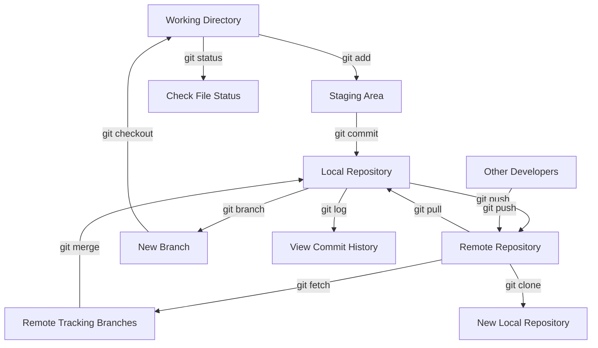

Certainly! I'd be happy to create a flowchart that illustrates how Git works. Git is a distributed version control system, and its workflow can be visualized effectively using a diagram. Let me create a flowchart for you using Mermaid syntax.



This flowchart illustrates the basic workflow and key concepts in Git:

1. Working Directory: This is where you make changes to your files.
2. Staging Area: Files are prepared here before committing (using `git add`).
3. Local Repository: Committed changes are stored here (using `git commit`).
4. Remote Repository: The shared repository where changes are pushed to and pulled from.
5. Remote Tracking Branches: Local copies of remote branches.
6. Branching: Creating new lines of development.
7. Logging and Status: Checking the history and current state of your repository.

The arrows show the flow of actions and data between these different areas. For example:

- `git add` moves changes from the Working Directory to the Staging Area.
- `git commit` moves staged changes to the Local Repository.
- `git push` sends commits from the Local Repository to the Remote Repository.
- `git pull` fetches and merges changes from the Remote Repository to the Local Repository and Working Directory.

This diagram provides a high-level overview of Git's distributed nature and how changes flow between different states and repositories. It's important to note that Git is very flexible, and there are many more commands and workflows possible beyond what's shown here.

Would you like me to explain any specific part of the Git workflow in more detail?


```

```
