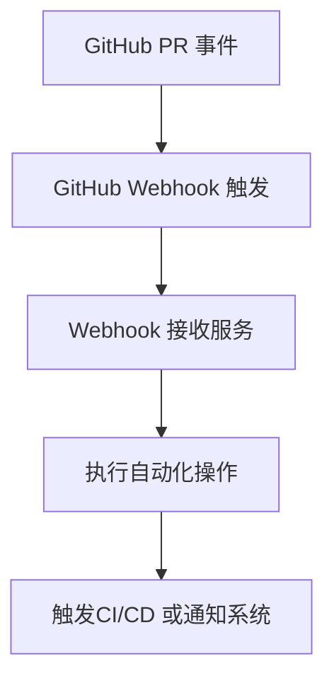
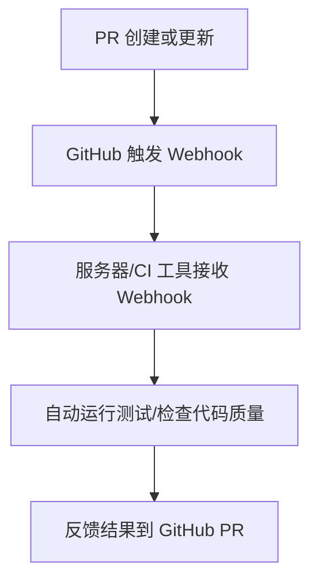

利用 GitHub Webhook 实现 Pull Request 自动触发，您可以实现多种自动化操作，简化开发流程。以下详细介绍其实现方法和功能：

## Webhook 功能

GitHub Webhooks 允许您在仓库发生特定事件时，自动向外部服务器发送 HTTP POST 请求。 

**针对 Pull Request，您可以监听以下事件：**

* **pull_request.opened:**  当新的 Pull Request 被打开时触发。
* **pull_request.closed:** 当 Pull Request 被关闭时触发（包括合并和取消）。
* **pull_request.reopened:** 当关闭的 Pull Request 被重新打开时触发。
* **pull_request.synchronized:** 当 Pull Request 的源分支更新时触发，例如提交了新的代码。
* **pull_request.labeled:** 当 Pull Request 被添加标签时触发。
* **pull_request.unlabeled:** 当 Pull Request 的标签被移除时触发。
* **pull_request.review_requested:** 当 Pull Request 发起代码审查请求时触发。
* **pull_request.review_request_removed:** 当 Pull Request 的代码审查请求被移除时触发。
* **pull_request.edited:** 当 Pull Request 的标题、内容或分支发生更改时触发。

## 实现自动触发 Pull Request

### 1.  确定触发条件和目标操作：

* 您希望在哪个事件发生时触发自动化操作？
* 您希望执行什么操作？ 例如：
    * 自动运行测试
    * 自动部署到测试环境
    * 自动添加代码审查人员
    * 发送通知到团队协作工具

### 2.  设置 Webhook：

* **在您的 GitHub 仓库中，导航到 "Settings" -> "Webhooks" -> "Add webhook"。**
* **Payload URL:** 输入接收 Webhook 事件的服务器地址。
* **Content type:** 选择 `application/json`。
* **Secret:**  设置一个密钥，用于验证来自 GitHub 的请求。
* **Events:**  选择您希望监听的事件，例如 `pull_request`。

### 3.  编写接收服务器代码：

* 使用您熟悉的语言 (例如 Python, Node.js, Ruby) 编写代码，监听来自 GitHub 的 POST 请求。
* 解析 JSON 格式的事件数据，获取 Pull Request 相关信息。
* 根据触发条件和目标操作，执行相应的逻辑。

**示例代码 (Python Flask):**

```python
from flask import Flask, request, json

app = Flask(__name__)

@app.route('/webhook', methods=['POST'])
def webhook():
    data = json.loads(request.data)

    if data['action'] == 'opened' and data['pull_request']['base']['ref'] == 'main':
        # 执行自动触发操作，例如运行测试
        run_tests(data['pull_request']['url'])

    return 'OK'

if __name__ == '__main__':
    app.run(port=5000)
```

### 4. 部署接收服务器：

* 将您的代码部署到可以公开访问的服务器，并确保您的 GitHub Webhook 可以访问该地址。

## 安全性

*  **使用 Secret:**  配置 Webhook 时设置 Secret，并在服务器端验证请求签名，确保请求来自 GitHub。
* **限制 IP 地址:**  在服务器防火墙中，限制只允许来自 GitHub IP 地址的请求。


## 总结

通过 GitHub Webhooks，您可以轻松实现 Pull Request 的自动触发，从而实现各种自动化操作，提高开发效率。 


# chatgpt


通过 GitHub 的 webhook 实现自动触发 PR 的机制，可以帮助开发团队实现更自动化的 CI/CD 流程，简化代码审查、测试和部署等工作流程。要实现 auto Trigger PR，通常需要以下步骤：

1. 设置 GitHub Webhook

GitHub webhook 是一种通知机制，它在仓库中发生特定事件时（例如 PR 创建、push 等）发送 HTTP 请求（通常为 POST 请求）到指定的 URL（即你的服务器或服务端点）。

设置步骤：

	1.	进入仓库设置：
	•	打开 GitHub 仓库，点击 Settings > Webhooks。
	2.	创建 Webhook：
	•	点击 Add webhook 按钮。
	•	设置 Payload URL：填写用于接收 webhook 请求的服务器端点。
	•	选择 Content type 为 application/json。
	•	在 Which events would you like to trigger this webhook? 中，选择 Pull Requests 事件，或者根据需要选择 Let me select individual events，然后选中 Pull request。
	•	保存 webhook 设置。

2. 配置 Webhook 接收端（服务器或服务）

需要配置一个服务来接收 GitHub 发送的 webhook 请求。当发生 PR 创建、更新、合并等事件时，GitHub 会向配置的 URL 发送包含事件详细信息的 POST 请求。

示例代码 (Python Flask):
```python
from flask import Flask, request, jsonify

app = Flask(__name__)

@app.route("/webhook", methods=["POST"])
def webhook():
    data = request.json
    if data and data.get("action") == "opened":
        pr_data = data.get("pull_request")
        print(f"Pull Request #{pr_data['number']} opened: {pr_data['title']}")
        # 在此处添加自动化操作逻辑，例如发送通知或触发CI任务
    return jsonify({"message": "PR Trigger processed"}), 200

if __name__ == "__main__":
    app.run(port=5000)
```
3. 自动化处理逻辑

在接收到 PR webhook 事件后，可以进行进一步的自动化操作，例如：

	•	自动合并代码（根据条件自动合并 PR）。
	•	触发 CI/CD 管道，在收到 PR 事件时触发构建、测试等流程。
	•	通知系统，例如通过 Slack、电子邮件等方式发送通知。

4. Webhook 的作用

Webhook 在 GitHub 中的主要作用是：

	1.	自动触发构建和测试：当 PR 创建、更新时，触发 CI/CD 工具（如 Jenkins、GitLab CI、GitHub Actions 等）来构建和测试代码。
	2.	发送通知：通知开发团队 PR 状态的更新，例如通过集成 Slack 进行实时消息推送。
	3.	自动代码审查和合并：通过自动化工具，如 linting、代码审查机器人，帮助在 PR 阶段就审查代码质量，并根据 PR 状态自动合并。

Mermaid 流程图

总结

通过 GitHub 的 webhook 机制，你可以在 PR 创建或更新时自动触发一系列操作，如构建、测试、通知和自动合并代码。具体的操作可以根据 webhook 事件和项目需求进行定制。


GitHub 的 Webhook 是一种通过 HTTP POST 请求，将特定事件发生时的信息发送到一个指定 URL 的方式，常用于集成其他服务。对于你提到的 自动触发 Pull Request (PR) 相关操作，GitHub 的 Webhook 可以监听和响应各种与 PR 相关的事件，并触发相应的操作或自动化任务。

Webhook 在自动触发 PR 中能实现什么？

	1.	监听 PR 相关事件:
GitHub Webhook 可以监听 PR 相关的多个事件，包括但不限于：
	•	pull_request: PR 的创建、关闭、合并、更新等操作都会触发该事件。
	•	pull_request_review: 当一个 PR 收到代码审查时触发。
	•	pull_request_review_comment: 当有人在 PR 中发表评论时触发。
	2.	实现自动化工作流：
当指定的事件发生时，可以将事件信息发送到你的服务器或 CI/CD 工具（如 Jenkins、GitLab CI、GitHub Actions），然后根据这些事件自动触发某些操作，比如：
	•	自动运行测试
	•	自动检查代码质量
	•	自动部署到开发环境
	•	自动合并符合条件的 PR
	3.	与 CI/CD 工具集成:
通过 Webhook，可以将 GitHub 与 CI/CD 工具无缝集成，在 PR 提交后自动触发构建、测试和部署。例如：
	•	通过监听 pull_request 事件，CI 工具可以拉取最新的代码，自动运行测试。
	•	构建成功后可以自动通知 GitHub，并更新 PR 的状态（例如通过设置状态检查让 PR 只有在通过测试后才能被合并）。
	4.	自动执行安全扫描或其他任务：
你也可以利用 Webhook 事件自动执行安全扫描、代码风格检查等任务，并将结果反馈到 PR 上，减少手动操作。

实现自动触发 PR 的步骤

	1.	设置 Webhook:
在 GitHub 仓库中，转到 Settings -> Webhooks -> Add webhook，填写目标服务器的 URL，选择你希望监听的事件（例如 pull_request 或 push）。
	2.	配置服务器:
你需要配置一个服务器（或者使用现有的 CI 工具），接收 GitHub 发送的 HTTP POST 请求。请求的 payload 中会包含与 PR 相关的信息，你可以根据这些信息进行自动化操作。
	3.	实现自动化操作：
你可以使用服务器端脚本或 CI 工具处理 Webhook 事件。例如：
	•	在服务器端编写一个脚本，收到 pull_request 事件时，拉取代码并运行单元测试。
	•	配置 GitHub Actions，监听 pull_request 事件并自动执行测试、构建和部署工作流。

示例：GitHub Webhook 流程

注意事项

	•	Webhook 是基于 HTTP POST 的，因此确保你的服务器可以接收和处理 POST 请求。
	•	GitHub Webhook 的 payload 包含丰富的 PR 事件信息，如提交者、目标分支、修改文件等，可用于自定义复杂的自动化工作流。
	•	使用 CI/CD 工具时，确保正确配置身份验证和凭据，确保安全和稳定。
