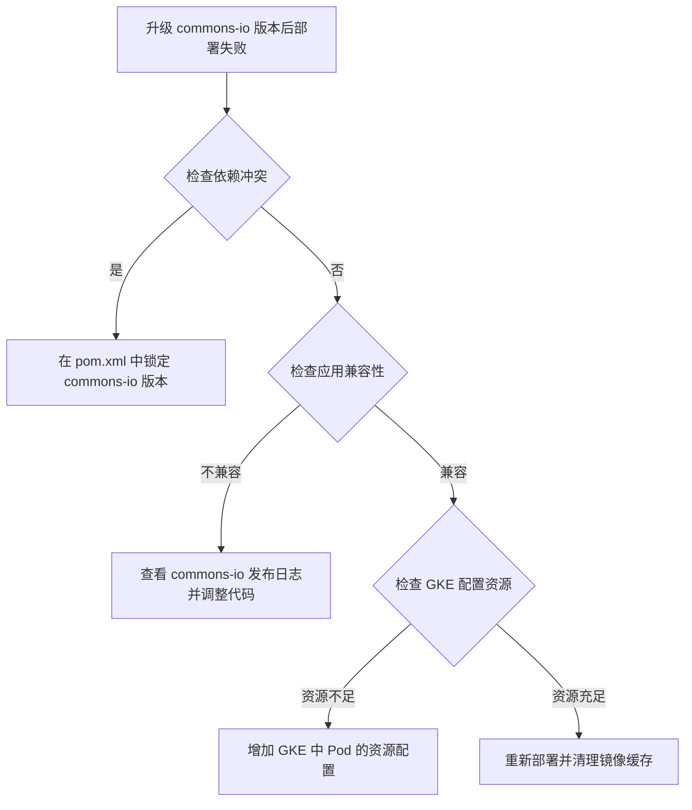
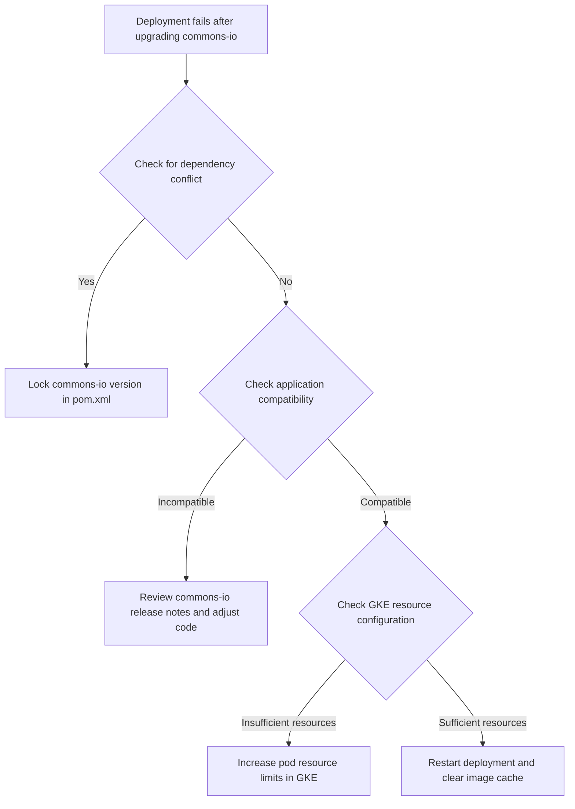

在 GKE 上部署的 Java 应用中，出现“升级 commons-io 版本导致部署失败”的问题，通常可能涉及以下几种情况：

1. 依赖冲突

在 Java 应用的 pom.xml 中，升级 commons-io 依赖版本（从 2.7 到 2.12.0）可能会导致与其他依赖项发生冲突。例如，某些库可能依赖于 commons-io 2.7，导致运行时无法兼容 2.12.0 版本。

解决方案：

	•	使用 mvn dependency:tree 命令生成依赖树，查找是否存在依赖冲突。特别关注与 commons-io 相关的任何依赖项，确认版本是否有冲突。

mvn dependency:tree | grep commons-io

2. 应用兼容性问题

在某些情况下，commons-io 的新版本可能引入了不向后兼容的更改。应用中某些调用的 API 在 2.12.0 版本中发生了更改，导致 Java 应用在编译或运行时出错。

解决方案：

	•	检查应用中的 commons-io 相关调用代码。可以参考 commons-io 的发布说明 了解升级版本间的更改。
	•	如果不影响应用功能，考虑使用版本锁定（<version>2.7</version>）避免升级，或在 pom.xml 中设置全局依赖排除规则。

3. GKE 的配置问题

在 GKE 中，有时依赖升级后可能会增加容器启动所需的资源（CPU、内存等），导致容器无法正常启动。特别是在内存或 CPU 配置不足的情况下，容器可能因资源限制而被重启或强制终止。

解决方案：

	•	增加 GKE 中 Pod 的资源配置。例如，检查并适当增加 Deployment YAML 文件中的 resources.requests 和 resources.limits 配置。

resources:
  requests:
    memory: "512Mi"
    cpu: "500m"
  limits:
    memory: "1Gi"
    cpu: "1000m"

4. 镜像缓存与更新问题

GKE 中的容器可能使用了旧的 Docker 镜像。即使 commons-io 版本在代码中更新，旧的镜像缓存可能仍在被使用，导致依赖没有更新到最新版本。

解决方案：

	•	使用 kubectl rollout restart 命令重新部署应用，确保 GKE 使用的是最新的容器镜像。

kubectl rollout restart deployment <your-deployment-name> -n <your-namespace>

	•	也可以在 CI/CD 中确保 mvn clean install 时不会使用缓存。

总结

综上所述，升级 commons-io 依赖可能导致 依赖冲突、应用兼容性问题 或 资源不足，可按如下步骤排查：

	1.	使用 mvn dependency:tree 检查依赖冲突。
	2.	查阅 commons-io 版本发布日志，确认升级版本的 API 兼容性。
	3.	确认 GKE 配置资源足够，并重启 Deployment 以确保使用最新镜像。

示例流程图

以下流程图展示了如何排查和解决此类问题：

For Java applications deployed in GKE, encountering an issue like “upgrading the commons-io version from 2.7 to 2.12.0 causes the deployment to fail” typically points to one of several potential issues:

1. Dependency Conflict

Upgrading the commons-io dependency in the pom.xml (from 2.7 to 2.12.0) may lead to conflicts with other dependencies. For instance, some libraries might specifically depend on version 2.7, causing incompatibility issues with version 2.12.0 at runtime.

Solution:

	•	Use mvn dependency:tree to generate a dependency tree, checking for conflicts involving commons-io. This helps identify any dependency conflicts.

mvn dependency:tree | grep commons-io

2. Application Compatibility Issues

Sometimes, newer versions of commons-io introduce non-backward-compatible changes. This can result in compilation or runtime errors in applications that rely on older APIs.

Solution:

	•	Review the code that uses commons-io and refer to the commons-io release notes to identify any relevant changes in the upgraded version.
	•	If functionality allows, consider version-locking (e.g., <version>2.7</version>) to avoid upgrading, or set up global exclusion rules in the pom.xml.

3. GKE Resource Configuration Issue

In GKE, upgrading dependencies may increase the application’s resource requirements (CPU, memory), which can cause the container to fail during startup, especially if the pod’s memory or CPU is under-provisioned.

Solution:

	•	Increase resource limits in the GKE pod configuration. For example, check and adjust the resources.requests and resources.limits fields in the deployment YAML.

resources:
  requests:
    memory: "512Mi"
    cpu: "500m"
  limits:
    memory: "1Gi"
    cpu: "1000m"

4. Cached Image Issues in GKE

Sometimes GKE may use an outdated Docker image despite the updated commons-io version in the code, resulting in the application still running with the old dependency.

Solution:

	•	Run kubectl rollout restart to redeploy and ensure GKE uses the latest container image.

kubectl rollout restart deployment <your-deployment-name> -n <your-namespace>

	•	Additionally, ensure your CI/CD pipeline rebuilds without caching by using mvn clean install.

Summary

Upgrading commons-io can lead to dependency conflicts, application compatibility issues, or insufficient resources. The steps to resolve these are:

	1.	Use mvn dependency:tree to check for dependency conflicts.
	2.	Review commons-io release notes to ensure compatibility with your code.
	3.	Confirm GKE resource limits are adequate, then restart the deployment to use the latest image.

Example Flowchart

The flowchart below shows the troubleshooting steps for this issue:

This approach helps ensure you’re running the correct version of the application with the upgraded dependency
