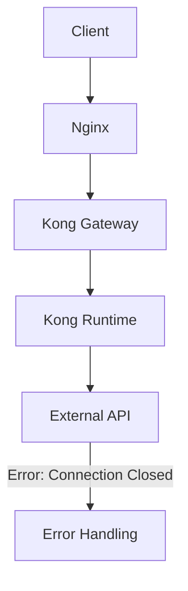

通过完整的错误信息，我现在可以做更详细的分析：

1. 错误的具体场景：
- 应用正在尝试访问URL: `https://
- 这是一个GET请求，查询参数包含 `accountStatus=AA`
- 使用的是 Spring WebClient 进行调用

2. 错误堆栈分析：
- 主要错误: `WebClientRequestException` 和 `PrematureCloseException`
- 错误发生在连接池处理器: `reactor.netty.resources.DefaultPooledConnectionProvider`
- 涉及到 Netty 的 HTTP 客户端操作

3. 可能的原因：
- 连接池配置问题
- 目标服务响应时间过长导致连接被提前关闭
- 网络不稳定导致连接断开
- SSL/TLS握手问题（因为使用的是HTTPS）

4. 调试步骤：

第一步：检查连接池配置
```java
// 建议的WebClient配置
WebClient webClient = WebClient.builder()
    .clientConnector(new ReactorClientHttpConnector(HttpClient.create()
        .option(ChannelOption.CONNECT_TIMEOUT_MILLIS, 30000)
        .responseTimeout(Duration.ofSeconds(30))
        .pool(ConnectionProvider.builder("custom")
            .maxConnections(500)
            .pendingAcquireTimeout(Duration.ofSeconds(60))
            .maxIdleTime(Duration.ofSeconds(20))
            .build())))
    .build();
```

第二步：检查网络连接
```bash
# 检查DNS解析
kubectl exec -it <pod-name> -- nslookup aibang

# 检查SSL证书
kubectl exec -it <pod-name> -- openssl s_client -connect aibang

# 检查网络延迟
kubectl exec -it <pod-name> -- curl -v -k https://
```

第三步：监控和日志分析
```bash
# 查看详细的应用日志
kubectl logs <pod-name> -n <namespace> --tail=1000 | grep "PrematureCloseException"

# 检查目标服务的状态
kubectl get endpoints <service-name> -n <namespace>
```

5. 建议的解决方案：

```java
// 1. 增加重试机制
WebClient.builder()
    .clientConnector(new ReactorClientHttpConnector(HttpClient.create()
        .responseTimeout(Duration.ofSeconds(30))))
    .filter(ExchangeFilterFunction.ofResponseProcessor(clientResponse -> {
        if (clientResponse.statusCode().is5xxServerError()) {
            return Mono.error(new RuntimeException("Server error: " + clientResponse.statusCode()));
        }
        return Mono.just(clientResponse);
    }))
    .build();

// 2. 添加断路器
Resilience4JCircuitBreakerFactory circuitBreakerFactory = new Resilience4JCircuitBreakerFactory();
CircuitBreaker circuitBreaker = circuitBreakerFactory.create("customCircuitBreaker");

webClient.get()
    .uri(uri)
    .retrieve()
    .bodyToMono(String.class)
    .transform(CircuitBreakerOperator.of(circuitBreaker));
```

6. 长期改进建议：
- 实施服务健康检查
- 添加详细的监控指标
- 配置适当的超时时间
- 考虑使用服务网格（如Istio）来管理服务间通信

要继续深入排查，建议：
1. 确认问题的发生频率
2. 检查目标服务的负载情况
3. 验证网络策略是否正确配置
4. 检查是否存在代理或负载均衡器配置问题


根据您的日志和流程描述，问题很可能出在外部API连接阶段。以下是可能的排查思路和规避措施：

排查步骤

	1.	外部API可用性检测：
	•	使用工具（如curl或Postman）直接对外部API进行测试，验证是否能正常响应。
	•	检查是否有网络中断或服务不可用的情况。
	2.	连接超时和重试机制：
	•	查看您的Java WebClient配置，确保合理设置了连接超时（例如，connectTimeout）和读取超时（例如，readTimeout）。
	•	使用retry机制设置合理的重试次数，但避免无限重试导致服务阻塞。
	3.	连接池和资源限制：
	•	检查是否存在连接池耗尽的问题（例如，连接池大小过小，导致排队等待连接）。
	•	若出现“Connection prematurely closed”异常，可能表明连接池设置或外部服务配置需要调整。
	4.	异常日志细化：
	•	针对连接失败异常，添加更详细的日志记录。这样可以在后续分析时快速定位问题。

流程图

以下是您描述的服务流程图：

规避措施

	1.	健康检查：
	•	在连接外部API之前，增加对其健康状态的检查（如调用API的健康检查端点）。
	2.	熔断机制：
	•	使用Circuit Breaker模式，当外部API发生多次失败后，短时间内阻止请求，减少服务依赖。
	3.	日志和监控：
	•	增加实时监控和告警，监测API调用的响应时间和成功率。
	•	将日志发送到监控工具以便分析。
	4.	分布式跟踪：
	•	在整个调用链中，使用分布式追踪工具（如OpenTracing或Jaeger）来追踪请求流和故障发生位置，提升故障定位的效率。

以上这些措施将有助于在Java应用的WebClient与外部API集成时更好地监控和处理连接错误。

aibang-int-brwm.hsbcbgtdgmds-ecp-280-cds-search-gry-hk-hbap-cert-internal-proxy/health
aibang-int-brwm.hsbcbgtdgmds-ecp-280-cds-search-gry-hk-hbap-cert-internal-proxy/health
aibang-int-brwm.hsbcbgtdgmds-ecp-280-cds-search-gry-hk-hbap-cert-internal-proxy/health
aibang-int-brwm.hsbcbgtdgmds-ecp-280-cds-search-gry-hk-hbap-cert-internal-proxy/health
aibang-int-brwm.hsbcbgtdgmds-ecp-280-cds-search-gry-hk-hbap-cert-internal-proxy/health
aibang-int-brwm.hsbcbgtdgmds-ecp-280-cds-search-gry-hk-hbap-cert-internal-proxy/health
aibang-int-brwm.hsbcbgtdgmds-ecp-280-cds-search-gry-hk-hbap-cert-internal-proxy/lient.builder()
        .clientConnector(new ReactorClientHttpConnector(
            HttpClient.create().option(ChannelOption.SO_KEEPALIVE, false)
        ))
        .build();

2. 配置连接池清理和连接重试

	•	空闲连接回收：可以在连接池配置中设置连接空闲时间，例如 maxIdleTime，让超时的连接自动从池中移除。
	•	连接重试机制：确保客户端在遇到连接问题时有重试机制。比如在 WebClient 中可以通过 retry 操作符进行重试。

示例代码：

WebClient.builder()
    .clientConnector(new ReactorClientHttpConnector(HttpClient.create()
        .option(ChannelOption.CONNECT_TIMEOUT_MILLIS, 5000)
        .doOnConnected(conn ->
            conn.addHandlerLast(new ReadTimeoutHandler(10))
                .addHandlerLast(new WriteTimeoutHandler(10)))
        .connectionProvider(ConnectionProvider.builder("custom")
            .maxConnections(100) // 最大连接数
            .maxIdleTime(Duration.ofSeconds(30)) // 最大空闲时间
            .maxLifeTime(Duration.ofMinutes(5)) // 最大存活时间
            .build())
    ))
    .build();

3. 增加连接有效性检查

	•	在使用连接前进行有效性检测，比如发送一个探测请求以确认连接仍然有效（类似于“心跳”机制），但这会增加请求前的检查开销。
	•	某些库允许配置 keep-alive 机制，确保连接的健康状态。例如 OkHttp 中可以配置连接健康检查。

4. 降低连接池容量

	•	将连接池大小设置得较小，减少空闲连接数量，强制更多的请求使用新建连接。这虽然也有性能损耗，但可能对可靠性有帮助。

5. 捕获和处理特定的连接错误

	•	捕获 IOException 或其他连接失效异常，进行重试或释放连接。

适用场景分析

	•	不频繁请求：如果请求量不高，可以考虑每次创建新连接，这样能完全避免连接失效问题。
	•	高并发高请求量：如果是高并发高请求场景，建议在保持连接池的前提下优化连接池设置，如缩短空闲时间、增加重试逻辑等。

结论

从减少错误的角度来看，如果请求不频繁、对性能要求不高，每次创建新连接是最简单的方法。但如果请求频繁，建议调整连接池策略，减少空闲连接时间，并确保有失效连接的重试机制。

这样做可以在减少错误的同时维持较高的请求性能。
