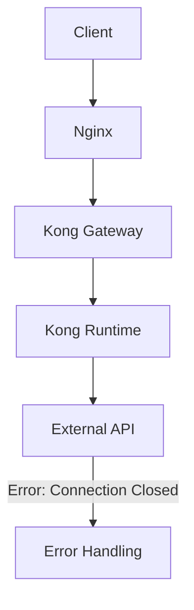

我看到这是一个 WebClient 请求过程中出现的 `Connection prematurely closed BEFORE response` 错误。这表明连接在收到完整响应之前就被提前关闭了。让我分析一下这个错误：

1. 错误的关键信息：

```
org.springframework.web.reactive.function.client.WebClientRequestException:
Connection prematurely closed BEFORE response;
nested exception is reactor.netty.http.client.PrematureCloseException
```

2. 堆栈跟踪显示这是发生在：

- 一个 HTTPS 请求（端口8443）
- 目标URL是一个内部服务：`url`
- 请求方法是 GET
- 路径是 `/v1/account/adada`

让我提供一个解决方案：

```java
import org.springframework.web.reactive.function.client.WebClient;
import reactor.netty.http.client.HttpClient;
import reactor.netty.resources.ConnectionProvider;
import org.springframework.context.annotation.Bean;
import org.springframework.context.annotation.Configuration;
import org.springframework.http.client.reactive.ReactorClientHttpConnector;
import reactor.netty.transport.logging.AdvancedByteBufFormat;
import io.netty.handler.timeout.ReadTimeoutHandler;
import io.netty.handler.timeout.WriteTimeoutHandler;
import java.time.Duration;
import java.util.concurrent.TimeUnit;

@Configuration
public class WebClientConfig {

    @Bean
    public WebClient webClient() {
        // 创建自定义的连接提供者
        ConnectionProvider provider = ConnectionProvider.builder("custom-provider")
            .maxConnections(500)
            .maxIdleTime(Duration.ofSeconds(20))
            .maxLifeTime(Duration.ofMinutes(5))
            .pendingAcquireTimeout(Duration.ofSeconds(60))
            .evictInBackground(Duration.ofSeconds(120))
            .build();

        // 配置 HTTP 客户端
        HttpClient httpClient = HttpClient.create(provider)
            .responseTimeout(Duration.ofSeconds(30))
            .doOnConnected(conn ->
                conn.addHandlerFirst(new ReadTimeoutHandler(30, TimeUnit.SECONDS))
                    .addHandlerFirst(new WriteTimeoutHandler(30, TimeUnit.SECONDS)))
            .wiretap("reactor.netty.http.client.HttpClient",
                     LogLevel.DEBUG, AdvancedByteBufFormat.TEXTUAL)
            .keepAlive(true)
            .option(ChannelOption.CONNECT_TIMEOUT_MILLIS, 30000)
            .option(ChannelOption.SO_KEEPALIVE, true);

        return WebClient.builder()
            .clientConnector(new ReactorClientHttpConnector(httpClient))
            .filter(ExchangeFilterFunction.ofResponseProcessor(clientResponse -> {
                log.debug("Response status: {}", clientResponse.statusCode());
                return Mono.just(clientResponse);
            }))
            .build();
    }

    @Component
    @Slf4j
    public class WebClientService {
        private final WebClient webClient;

        public WebClientService(WebClient webClient) {
            this.webClient = webClient;
        }

        public <T> Mono<T> makeRequest(String url, Class<T> responseType) {
            return webClient.get()
                .uri(url)
                .retrieve()
                .bodyToMono(responseType)
                .timeout(Duration.ofSeconds(30))
                .retryWhen(Retry.backoff(3, Duration.ofSeconds(1))
                    .filter(throwable -> {
                        log.error("Error occurred: ", throwable);
                        return throwable instanceof PrematureCloseException ||
                               throwable instanceof TimeoutException;
                    })
                    .doBeforeRetry(retrySignal ->
                        log.info("Retrying request, attempt: {}",
                                retrySignal.totalRetries() + 1)))
                .doOnError(error ->
                    log.error("Request failed after retries: {}", error.getMessage()));
        }
    }

    @Component
    public class ConnectionMonitor {
        private final ConnectionProvider provider;

        @Scheduled(fixedRate = 60000) // 每分钟执行一次
        public void monitorConnections() {
            ConnectionPoolMetrics metrics = provider.metrics();
            log.info("Connection pool metrics - Active: {}, Idle: {}, Pending: {}",
                    metrics.activeConnections(),
                    metrics.idleConnections(),
                    metrics.pendingAcquireConnections());
        }
    }
}

```

为了解决这个问题，建议采取以下措施：

1. **排查可能原因**：

- 网络不稳定
- 目标服务器提前关闭连接
- 连接超时设置不合理
- 负载均衡器的配置问题

2. **添加详细日志**：

```java
// 在application.properties中添加
logging.level.reactor.netty.http.client=DEBUG
logging.level.org.springframework.web.reactive.function.client.ExchangeFunctions=DEBUG
```

3. **监控指标**：

```java
// 添加Micrometer指标
connectionProvider.metrics().forEach(metric -> {
    meterRegistry.gauge(
        "webclient.connections." + metric.name(),
        metric::value
    );
});
```

4. **实施最佳实践**：

```java
// 使用示例
@Service
public class YourService {
    private final WebClientService webClientService;

    public Mono<YourResponse> fetchData(String id) {
        return webClientService.makeRequest(
            "/v1/account/" + id,
            YourResponse.class
        ).doOnSuccess(response ->
            log.info("Successfully received response for ID: {}", id)
        );
    }
}
```

5. **故障排除步骤**：

- 检查网络连接质量
- 验证目标服务的健康状况
- 检查负载均衡器配置
- 监控连接池指标
- 分析详细的网络日志

6. **预防措施**：

- 启用连接保活
- 实现优雅的重试策略
- 设置合理的超时时间
- 监控连接池状态

需要注意的是，这个错误通常与网络稳定性或服务端配置有关。建议：

1. 检查服务端的 keep-alive 设置
2. 验证负载均衡器的超时配置
3. 确保网络连接稳定
4. 适当增加连接超时时间
5. 实现重试机制

你想了解更具体的哪个部分吗？或者需要针对特定场景进行调整？

通过完整的错误信息，我现在可以做更详细的分析：

1. 错误的具体场景：

- 应用正在尝试访问URL: `https://
- 这是一个GET请求，查询参数包含 `accountStatus=AA`
- 使用的是 Spring WebClient 进行调用

2. 错误堆栈分析：

- 主要错误: `WebClientRequestException` 和 `PrematureCloseException`
- 错误发生在连接池处理器: `reactor.netty.resources.DefaultPooledConnectionProvider`
- 涉及到 Netty 的 HTTP 客户端操作

3. 可能的原因：

- 连接池配置问题
- 目标服务响应时间过长导致连接被提前关闭
- 网络不稳定导致连接断开
- SSL/TLS握手问题（因为使用的是HTTPS）

4. 调试步骤：

第一步：检查连接池配置

```java
// 建议的WebClient配置
WebClient webClient = WebClient.builder()
    .clientConnector(new ReactorClientHttpConnector(HttpClient.create()
        .option(ChannelOption.CONNECT_TIMEOUT_MILLIS, 30000)
        .responseTimeout(Duration.ofSeconds(30))
        .pool(ConnectionProvider.builder("custom")
            .maxConnections(500)
            .pendingAcquireTimeout(Duration.ofSeconds(60))
            .maxIdleTime(Duration.ofSeconds(20))
            .build())))
    .build();
```

第二步：检查网络连接

```bash
# 检查DNS解析
kubectl exec -it <pod-name> -- nslookup aibang

# 检查SSL证书
kubectl exec -it <pod-name> -- openssl s_client -connect aibang

# 检查网络延迟
kubectl exec -it <pod-name> -- curl -v -k https://
```

第三步：监控和日志分析

```bash
# 查看详细的应用日志
kubectl logs <pod-name> -n <namespace> --tail=1000 | grep "PrematureCloseException"

# 检查目标服务的状态
kubectl get endpoints <service-name> -n <namespace>
```

5. 建议的解决方案：

```java
// 1. 增加重试机制
WebClient.builder()
    .clientConnector(new ReactorClientHttpConnector(HttpClient.create()
        .responseTimeout(Duration.ofSeconds(30))))
    .filter(ExchangeFilterFunction.ofResponseProcessor(clientResponse -> {
        if (clientResponse.statusCode().is5xxServerError()) {
            return Mono.error(new RuntimeException("Server error: " + clientResponse.statusCode()));
        }
        return Mono.just(clientResponse);
    }))
    .build();

// 2. 添加断路器
Resilience4JCircuitBreakerFactory circuitBreakerFactory = new Resilience4JCircuitBreakerFactory();
CircuitBreaker circuitBreaker = circuitBreakerFactory.create("customCircuitBreaker");

webClient.get()
    .uri(uri)
    .retrieve()
    .bodyToMono(String.class)
    .transform(CircuitBreakerOperator.of(circuitBreaker));
```

6. 长期改进建议：

- 实施服务健康检查
- 添加详细的监控指标
- 配置适当的超时时间
- 考虑使用服务网格（如Istio）来管理服务间通信

要继续深入排查，建议：

1. 确认问题的发生频率
2. 检查目标服务的负载情况
3. 验证网络策略是否正确配置
4. 检查是否存在代理或负载均衡器配置问题

根据您的日志和流程描述，问题很可能出在外部API连接阶段。以下是可能的排查思路和规避措施：

排查步骤

    1. 外部API可用性检测：
    • 使用工具（如curl或Postman）直接对外部API进行测试，验证是否能正常响应。
    • 检查是否有网络中断或服务不可用的情况。
    2. 连接超时和重试机制：
    • 查看您的Java WebClient配置，确保合理设置了连接超时（例如，connectTimeout）和读取超时（例如，readTimeout）。
    • 使用retry机制设置合理的重试次数，但避免无限重试导致服务阻塞。
    3. 连接池和资源限制：
    • 检查是否存在连接池耗尽的问题（例如，连接池大小过小，导致排队等待连接）。
    • 若出现“Connection prematurely closed”异常，可能表明连接池设置或外部服务配置需要调整。
    4. 异常日志细化：
    • 针对连接失败异常，添加更详细的日志记录。这样可以在后续分析时快速定位问题。

流程图

以下是您描述的服务流程图：



规避措施

    1. 健康检查：
    • 在连接外部API之前，增加对其健康状态的检查（如调用API的健康检查端点）。
    2. 熔断机制：
    • 使用Circuit Breaker模式，当外部API发生多次失败后，短时间内阻止请求，减少服务依赖。
    3. 日志和监控：
    • 增加实时监控和告警，监测API调用的响应时间和成功率。
    • 将日志发送到监控工具以便分析。
    4. 分布式跟踪：
    • 在整个调用链中，使用分布式追踪工具（如OpenTracing或Jaeger）来追踪请求流和故障发生位置，提升故障定位的效率。

以上这些措施将有助于在Java应用的WebClient与外部API集成时更好地监控和处理连接错误。

aibang-int-brwm.aibangbgtdgmds-ecp-280-cds-search-gry-hk-hbap-cert-internal-proxy/health
aibang-int-brwm.aibangbgtdgmds-ecp-280-cds-search-gry-hk-hbap-cert-internal-proxy/health
aibang-int-brwm.aibangbgtdgmds-ecp-280-cds-search-gry-hk-hbap-cert-internal-proxy/health
aibang-int-brwm.aibangbgtdgmds-ecp-280-cds-search-gry-hk-hbap-cert-internal-proxy/health
aibang-int-brwm.aibangbgtdgmds-ecp-280-cds-search-gry-hk-hbap-cert-internal-proxy/health
aibang-int-brwm.aibangbgtdgmds-ecp-280-cds-search-gry-hk-hbap-cert-internal-proxy/health
aibang-int-brwm.aibangbgtdgmds-ecp-280-cds-search-gry-hk-hbap-cert-internal-proxy/lient.builder()
.clientConnector(new ReactorClientHttpConnector(
HttpClient.create().option(ChannelOption.SO_KEEPALIVE, false)
))
.build();

2. 配置连接池清理和连接重试

   • 空闲连接回收：可以在连接池配置中设置连接空闲时间，例如 maxIdleTime，让超时的连接自动从池中移除。
   • 连接重试机制：确保客户端在遇到连接问题时有重试机制。比如在 WebClient 中可以通过 retry 操作符进行重试。

示例代码：

WebClient.builder()
.clientConnector(new ReactorClientHttpConnector(HttpClient.create()
.option(ChannelOption.CONNECT_TIMEOUT_MILLIS, 5000)
.doOnConnected(conn ->
conn.addHandlerLast(new ReadTimeoutHandler(10))
.addHandlerLast(new WriteTimeoutHandler(10)))
.connectionProvider(ConnectionProvider.builder("custom")
.maxConnections(100) // 最大连接数
.maxIdleTime(Duration.ofSeconds(30)) // 最大空闲时间
.maxLifeTime(Duration.ofMinutes(5)) // 最大存活时间
.build())
))
.build();

3. 增加连接有效性检查

   • 在使用连接前进行有效性检测，比如发送一个探测请求以确认连接仍然有效（类似于“心跳”机制），但这会增加请求前的检查开销。
   • 某些库允许配置 keep-alive 机制，确保连接的健康状态。例如 OkHttp 中可以配置连接健康检查。

4. 降低连接池容量

   • 将连接池大小设置得较小，减少空闲连接数量，强制更多的请求使用新建连接。这虽然也有性能损耗，但可能对可靠性有帮助。

5. 捕获和处理特定的连接错误

   • 捕获 IOException 或其他连接失效异常，进行重试或释放连接。

适用场景分析

    • 不频繁请求：如果请求量不高，可以考虑每次创建新连接，这样能完全避免连接失效问题。
    • 高并发高请求量：如果是高并发高请求场景，建议在保持连接池的前提下优化连接池设置，如缩短空闲时间、增加重试逻辑等。

结论

从减少错误的角度来看，如果请求不频繁、对性能要求不高，每次创建新连接是最简单的方法。但如果请求频繁，建议调整连接池策略，减少空闲连接时间，并确保有失效连接的重试机制。

这样做可以在减少错误的同时维持较高的请求性能。

对于您描述的这种间歇性的连接关闭问题,我建议您可以从以下几个方面进行排查:

1. 检查连接池配置:
   - 确保连接池的大小足以支持并发请求
   - 检查最大空闲连接时间和最大生命周期是否合理
   - 确保连接回收策略不会导致过早关闭连接

```java
@Configuration
public class WebClientConfig {
    @Bean
    public WebClient webClient() {
        HttpClient httpClient = HttpClient.create()
            .option(ChannelOption.CONNECT_TIMEOUT_MILLIS, 30000)
            .responseTimeout(Duration.ofSeconds(30))
            .pool(ConnectionProvider.builder("custom")
                .maxConnections(200)
                .maxIdleTime(Duration.ofSeconds(60))
                .maxLifeTime(Duration.ofSeconds(180))
                .pendingAcquireTimeout(Duration.ofSeconds(60))
                .build());

        return WebClient.builder()
            .clientConnector(new ReactorClientHttpConnector(httpClient))
            .build();
    }
}
```

2. 添加重试和熔断机制:
   - 在出现PrematureCloseException时,自动重试请求
   - 使用断路器模式保护目标服务,防止级联故障

```java
@Service
public class ExternalServiceClient {
    private final WebClient webClient;
    private final CircuitBreaker circuitBreaker;

    public Mono<ResponseEntity<String>> callExternalService() {
        return circuitBreaker.run(
            webClient.get()
                .uri("/your-endpoint")
                .retrieve()
                .toEntity(String.class)
                .retryWhen(Retry.backoff(3, Duration.ofSeconds(1))
                    .filter(throwable -> throwable instanceof PrematureCloseException)),
            throwable -> Mono.just(ResponseEntity
                .status(HttpStatus.SERVICE_UNAVAILABLE)
                .body("Service temporarily unavailable")));
    }
}
```

3. 监控指标和告警:
   - 监控连接池使用情况,如连接创建/关闭/活跃数等
   - 监控PrematureCloseException错误计数
   - 设置合理的告警阈值,及时发现问题

```java
@Component
public class WebClientMetrics {
    private final MeterRegistry registry;

    public void recordWebClientMetrics(String endpoint, Timer.Sample sample, Throwable throwable) {
        Tags tags = Tags.of(
            Tag.of("endpoint", endpoint),
            Tag.of("error", throwable != null ? throwable.getClass().getSimpleName() : "none")
        );

        sample.stop(registry.timer("webclient.request", tags));

        if (throwable instanceof PrematureCloseException) {
            registry.counter("webclient.premature.close", tags).increment();
        }
    }
}
```

4. 排查网络与目标服务问题:
   - 检查网络连通性,如DNS解析、SSL证书、防火墙等
   - 测试目标服务的响应时间,确保在预期范围内
   - 检查目标服务的健康状况和错误率

```bash
# 检查网络连通性
kubectl exec -it <pod-name> -- ping <target-domain>
kubectl exec -it <pod-name> -- openssl s_client -connect <target-domain>:443

# 检查目标服务响应
kubectl exec -it <pod-name> -- curl -w "\ntime_total: %{time_total}s\n" -o /dev/null -s https://<target-domain>
```

5. 优化配置并监控:
   - 根据上述排查结果,调整连接池、超时时间等配置
   - 持续监控指标,确保修复方案有效
   - 设置合理的告警策略,及时发现新的问题

请问这个排查思路是否清晰?还有哪些需要补充的地方吗?​​​​​​​​​​​​​​​​

以下是一些可以用来调试该问题的步骤：

1. **检查日志文件**：查看应用程序的日志，特别是与连接池和请求相关的部分，看看是否有任何错误消息或异常被记录下来。
2. **确认连接池配置**：检查连接池的配置参数，确保它们与第三方服务的要求相匹配。可能需要调整连接池的大小、超时时间等参数。
3. **检查网络连接**：确保你的应用程序与第三方服务之间的网络连接正常。可以尝试使用网络工具进行测试，例如ping或telnet。
4. **模拟并发请求**：在本地环境中模拟并发请求，以重现问题。可以使用工具如JMeter或Locust来生成并发请求。
5. **分析线程堆栈**：当问题发生时，获取应用程序的线程堆栈信息，以了解哪些线程正在运行以及它们的状态。
6. **检查第三方服务的限制**：了解第三方服务是否对并发请求有任何限制。可能需要与服务提供商联系以获取更多信息。
7. **使用调试工具**：在代码中添加调试语句或使用调试工具来跟踪请求的执行过程。可以使用IDE的调试功能来逐步执行代码。
8. **考虑重试机制**：如果请求偶尔失败，可以考虑添加重试机制来处理这种情况。
9. **进行性能分析**：使用性能分析工具来确定是否存在性能瓶颈，例如连接池的使用是否高效。

通过以上步骤，你应该能够更好地理解问题的原因，并采取适当的措施来解决它。

我来帮你分析这个问题并提供一个可以帮助调试的解决方案。

```java
import org.springframework.boot.web.client.RestTemplateBuilder;
import org.springframework.http.client.ClientHttpRequestFactory;
import org.springframework.http.client.HttpComponentsClientHttpRequestFactory;
import org.springframework.web.client.RestTemplate;
import org.apache.http.impl.client.CloseableHttpClient;
import org.apache.http.impl.client.HttpClients;
import org.apache.http.impl.conn.PoolingHttpClientConnectionManager;
import org.slf4j.Logger;
import org.slf4j.LoggerFactory;
import java.util.concurrent.*;
import java.util.List;
import java.util.ArrayList;

@Configuration
public class HttpClientConfig {
    private static final Logger logger = LoggerFactory.getLogger(HttpClientConfig.class);

    @Bean
    public RestTemplate restTemplate() {
        // 创建连接池管理器
        PoolingHttpClientConnectionManager connectionManager = new PoolingHttpClientConnectionManager();
        connectionManager.setMaxTotal(100); // 最大连接数
        connectionManager.setDefaultMaxPerRoute(20); // 每个路由的最大连接数

        // 创建HTTP客户端
        CloseableHttpClient httpClient = HttpClients.custom()
                .setConnectionManager(connectionManager)
                .evictIdleConnections(30, TimeUnit.SECONDS) // 清除空闲连接
                .setConnectionTimeToLive(30, TimeUnit.SECONDS) // 连接存活时间
                .build();

        // 配置请求工厂
        HttpComponentsClientHttpRequestFactory requestFactory =
                new HttpComponentsClientHttpRequestFactory(httpClient);
        requestFactory.setConnectTimeout(5000); // 连接超时
        requestFactory.setReadTimeout(5000);    // 读取超时

        return new RestTemplateBuilder()
                .requestFactory(() -> requestFactory)
                .build();
    }

    @Service
    public class HttpClientService {
        private final RestTemplate restTemplate;
        private final ExecutorService executorService;

        public HttpClientService(RestTemplate restTemplate) {
            this.restTemplate = restTemplate;
            this.executorService = Executors.newFixedThreadPool(20);
        }

        public <T> Future<T> asyncHttpGet(String url, Class<T> responseType) {
            return executorService.submit(() -> {
                try {
                    logger.info("Starting request to URL: {}", url);
                    long startTime = System.currentTimeMillis();

                    T result = restTemplate.getForObject(url, responseType);

                    long endTime = System.currentTimeMillis();
                    logger.info("Completed request to URL: {}, Time taken: {}ms",
                              url, (endTime - startTime));

                    return result;
                } catch (Exception e) {
                    logger.error("Error fetching from URL: {}", url, e);
                    throw e;
                }
            });
        }

        // 批量请求方法
        public <T> List<T> batchHttpGet(List<String> urls, Class<T> responseType) {
            List<Future<T>> futures = new ArrayList<>();
            List<T> results = new ArrayList<>();

            try {
                // 提交所有请求
                for (String url : urls) {
                    futures.add(asyncHttpGet(url, responseType));
                }

                // 收集结果
                for (Future<T> future : futures) {
                    try {
                        results.add(future.get(10, TimeUnit.SECONDS));
                    } catch (TimeoutException e) {
                        logger.error("Request timed out", e);
                    } catch (ExecutionException e) {
                        logger.error("Request failed", e);
                    }
                }
            } catch (InterruptedException e) {
                logger.error("Batch processing interrupted", e);
                Thread.currentThread().interrupt();
            }

            return results;
        }

        // 用于监控连接池状态的方法
        @Scheduled(fixedRate = 60000) // 每分钟执行一次
        public void monitorConnectionPool() {
            PoolingHttpClientConnectionManager connectionManager =
                    (PoolingHttpClientConnectionManager) ((HttpComponentsClientHttpRequestFactory)
                    restTemplate.getRequestFactory()).getHttpClient().getConnectionManager();

            logger.info("Connection pool stats: " +
                    "Max total: {}, " +
                    "Available: {}, " +
                    "Leased: {}, " +
                    "Pending: {}",
                    connectionManager.getTotalStats().getMax(),
                    connectionManager.getTotalStats().getAvailable(),
                    connectionManager.getTotalStats().getLeased(),
                    connectionManager.getTotalStats().getPending());
        }
    }
}

```

这个实现提供了几个关键的调试和监控功能：

1. 详细的日志记录：

- 记录每个请求的开始时间和完成时间
- 记录请求URL和响应时间
- 详细的错误日志，包括完整的异常堆栈

2. 连接池监控：

- 定期监控连接池状态
- 跟踪可用连接数、租用连接数和待处理请求数
- 有助于识别连接池耗尽或连接泄漏问题

3. 超时处理：

- 设置了连接超时和读取超时
- 为异步任务设置了执行超时
- 自动清理空闲连接

要调试你遇到的问题，建议：

1. 查看日志模式：

- 检查失败请求是否集中在特定时间段
- 观察是否有连接池耗尽的情况
- 查看请求的响应时间模式

2. 连接池配置调整：

```java
connectionManager.setMaxTotal(100); // 可以根据需求调整
connectionManager.setDefaultMaxPerRoute(20); // 可以根据需求调整
```

3. 超时设置优化：

```java
requestFactory.setConnectTimeout(5000); // 可以根据实际情况调整
requestFactory.setReadTimeout(5000);    // 可以根据实际情况调整
```

4. 添加请求重试机制：
   如果需要，可以在捕获到异常时实现重试逻辑。

5. 监控指标：

- 可以添加Micrometer或Prometheus指标来监控请求成功率
- 监控连接池使用情况
- 跟踪请求延迟

你也可以通过添加以下依赖来使用Spring Boot Actuator进行监控：

```xml
<dependency>
    <groupId>org.springframework.boot</groupId>
    <artifactId>spring-boot-starter-actuator</artifactId>
</dependency>
```

需要特别关注的可能问题原因：

1. 连接池配置不当导致连接耗尽
2. 目标服务器负载过高
3. 网络问题导致的超时
4. 连接未正确释放导致泄漏

你觉得这些建议对解决你的问题有帮助吗？需要我详细解释某个具体部分吗？

# 未正确释放导致泄漏?如何Debug

我来详细说明如何调试和解决连接泄漏问题。

```java
import org.apache.http.impl.client.HttpClients;
import org.apache.http.impl.conn.PoolingHttpClientConnectionManager;
import org.apache.http.pool.PoolStats;
import org.springframework.http.client.ClientHttpResponse;
import org.springframework.http.client.HttpComponentsClientHttpRequestFactory;
import org.springframework.web.client.RestTemplate;
import org.slf4j.Logger;
import org.slf4j.LoggerFactory;
import java.io.IOException;
import java.util.Map;
import java.util.concurrent.ConcurrentHashMap;
import java.util.concurrent.ScheduledExecutorService;
import java.util.concurrent.ScheduledFuture;
import java.util.concurrent.TimeUnit;

@Configuration
public class ConnectionLeakDetectorConfig {
    private static final Logger logger = LoggerFactory.getLogger(ConnectionLeakDetectorConfig.class);

    @Bean
    public ConnectionTracker connectionTracker() {
        return new ConnectionTracker();
    }

    public class ConnectionTracker {
        private final Map<String, Long> activeConnections = new ConcurrentHashMap<>();
        private final Map<String, StackTraceElement[]> connectionStackTraces = new ConcurrentHashMap<>();

        public void trackConnection(String url, ClientHttpResponse response) {
            String connectionId = System.identityHashCode(response) + "-" + url;
            activeConnections.put(connectionId, System.currentTimeMillis());
            connectionStackTraces.put(connectionId, Thread.currentThread().getStackTrace());

            logger.debug("Connection opened: {} at {}", connectionId,
                        new java.util.Date(activeConnections.get(connectionId)));
        }

        public void releaseConnection(String url, ClientHttpResponse response) {
            String connectionId = System.identityHashCode(response) + "-" + url;
            Long startTime = activeConnections.remove(connectionId);
            connectionStackTraces.remove(connectionId);

            if (startTime != null) {
                long duration = System.currentTimeMillis() - startTime;
                logger.debug("Connection closed: {} after {} ms", connectionId, duration);
            }
        }

        public void checkForLeaks() {
            long currentTime = System.currentTimeMillis();
            activeConnections.forEach((connectionId, startTime) -> {
                long duration = currentTime - startTime;
                if (duration > 30000) { // 30秒以上视为可能的泄漏
                    logger.warn("Potential connection leak detected: {}", connectionId);
                    logger.warn("Connection age: {} ms", duration);
                    StackTraceElement[] stackTrace = connectionStackTraces.get(connectionId);
                    if (stackTrace != null) {
                        logger.warn("Connection was created at:");
                        for (StackTraceElement element : stackTrace) {
                            logger.warn("\tat {}", element);
                        }
                    }
                }
            });
        }
    }

    @Bean
    public RestTemplate restTemplateWithLeakDetection(ConnectionTracker connectionTracker) {
        PoolingHttpClientConnectionManager connectionManager = new PoolingHttpClientConnectionManager();
        connectionManager.setMaxTotal(100);
        connectionManager.setDefaultMaxPerRoute(20);

        // 创建带有连接监控的请求拦截器
        ClientHttpRequestInterceptor leakDetectionInterceptor = (request, body, execution) -> {
            ClientHttpResponse response = execution.execute(request, body);

            // 追踪连接
            connectionTracker.trackConnection(request.getURI().toString(), response);

            // 包装响应以在关闭时释放追踪
            return new ClientHttpResponseWrapper(response) {
                @Override
                public void close() throws IOException {
                    try {
                        super.close();
                    } finally {
                        connectionTracker.releaseConnection(
                            request.getURI().toString(), response);
                    }
                }
            };
        };

        RestTemplate restTemplate = new RestTemplate();
        restTemplate.getInterceptors().add(leakDetectionInterceptor);

        return restTemplate;
    }

    @Bean
    public ConnectionLeakMonitor connectionLeakMonitor(
            ConnectionTracker connectionTracker,
            PoolingHttpClientConnectionManager connectionManager) {
        return new ConnectionLeakMonitor(connectionTracker, connectionManager);
    }

    public class ConnectionLeakMonitor {
        private final ConnectionTracker connectionTracker;
        private final PoolingHttpClientConnectionManager connectionManager;
        private final ScheduledExecutorService scheduler =
                Executors.newSingleThreadScheduledExecutor();

        public ConnectionLeakMonitor(
                ConnectionTracker connectionTracker,
                PoolingHttpClientConnectionManager connectionManager) {
            this.connectionTracker = connectionTracker;
            this.connectionManager = connectionManager;

            // 启动定期检查
            scheduler.scheduleAtFixedRate(this::checkForLeaks,
                    30, 30, TimeUnit.SECONDS);
        }

        private void checkForLeaks() {
            // 检查长时间未释放的连接
            connectionTracker.checkForLeaks();

            // 输出连接池状态
            PoolStats stats = connectionManager.getTotalStats();
            logger.info("Connection pool status - Available: {}, Leased: {}, " +
                    "Pending: {}, Max: {}",
                    stats.getAvailable(), stats.getLeased(),
                    stats.getPending(), stats.getMax());

            // 如果租用连接数异常高，发出警告
            if (stats.getLeased() > stats.getMax() * 0.8) {
                logger.warn("High number of leased connections detected!");
            }
        }

        @PreDestroy
        public void shutdown() {
            scheduler.shutdown();
        }
    }
}

```

这个实现提供了全面的连接泄漏检测和监控功能。以下是如何使用和调试连接泄漏的关键步骤：

1. 识别连接泄漏的方法：

```java
// 在你的服务类中注入监控组件
@Autowired
private ConnectionTracker connectionTracker;
@Autowired
private ConnectionLeakMonitor leakMonitor;

// 在可疑的地方添加额外的日志
try {
    ResponseEntity<String> response = restTemplate.getForEntity(url, String.class);
    // 处理响应
} catch (Exception e) {
    logger.error("Request failed for URL: " + url, e);
    throw e;
} finally {
    // 可以在这里添加额外的检查
}
```

2. 常见的连接泄漏原因和解决方案：

```java
// 1. 未正确关闭响应流
try (ClientHttpResponse response = request.execute()) {
    // 处理响应
} // 自动关闭

// 2. 异常处理中未释放资源
try {
    // 发送请求
} catch (Exception e) {
    // 处理异常
} finally {
    // 确保释放资源
}

// 3. 使用try-with-resources处理响应体
try (InputStream is = response.getBody()) {
    // 读取响应体
}
```

3. 添加JVM参数来追踪连接问题：

```bash
-Dorg.apache.http.impl.conn.PoolingHttpClientConnectionManager.level=TRACE
-Dorg.apache.http.impl.conn.DefaultHttpClientConnectionOperator.level=TRACE
```

4. 设置告警阈值：

```java
// 在你的配置类中添加
@Value("${http.client.leak.threshold.ms:30000}")
private long leakThresholdMs;

@Value("${http.client.max.connections:100}")
private int maxConnections;
```

5. 监控指标的添加：

```java
// 添加Micrometer指标
@Bean
public MeterRegistry meterRegistry() {
    return new SimpleMeterRegistry();
}

// 在ConnectionTracker中添加指标
private final Counter leakDetectedCounter;

public ConnectionTracker(MeterRegistry registry) {
    this.leakDetectedCounter = registry.counter("http.client.connection.leaks");
}
```

调试步骤：

1. 检查日志中的连接泄漏警告
2. 查看连接池统计信息
3. 分析泄漏连接的堆栈跟踪
4. 检查连接使用时间
5. 监控连接池饱和度

最佳实践：

1. 始终使用try-with-resources语句
2. 设置合适的超时时间
3. 定期监控连接池状态
4. 实现优雅的错误处理
5. 使用连接池配置优化

如果你在特定场景下遇到连接泄漏，可以：

1. 使用上面的代码启用详细监控
2. 分析日志中的堆栈跟踪
3. 检查连接的生命周期
4. 验证所有资源是否正确关闭

需要我详细解释某个具体部分吗？或者你有遇到特定的连接泄漏场景需要讨论？
