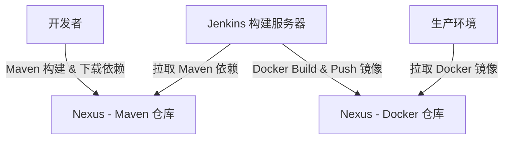

在您描述的情境中，有两个不同的构建过程：Maven Build 和 Docker Image Build，它们之间有明确的目的和实现区别。以下是对两者的详细说明：

1. Maven Build

Maven 是一个专注于 Java 项目管理和构建的工具，用于编译、打包和管理 Java 依赖。

Maven Build 的主要任务

	•	依赖管理：Maven 使用 pom.xml 文件来管理项目所需的依赖项，并会从中央仓库（如 Maven 中央仓库或私有仓库）下载它们。
	•	编译源码：将 Java 源代码编译成字节码（.class 文件）。
	•	打包：将编译好的 .class 文件、资源文件和依赖项打包成 .jar 或 .war 文件，供运行或部署使用。
	•	执行测试：通过 mvn test 命令运行单元测试，确保代码的正确性。
	•	安装和发布：可以将生成的 .jar 文件发布到私有仓库或远程仓库中。

Maven 只关注 Java 项目的构建、依赖管理和测试，而不涉及将项目部署到容器化环境中运行。

2. Docker Image Build

Docker Image Build 是通过 Dockerfile 构建一个包含所有依赖、应用和环境的 操作系统级镜像。这是一个独立的打包过程，可以在任何支持 Docker 的环境中运行。

Docker Image Build 的主要任务

	•	定义运行环境：通过 Dockerfile 指定基础镜像（如 openjdk），提供运行 Java 应用所需的基础环境。
	•	复制文件：可以将编译好的 .jar 文件或整个项目文件复制到镜像中。
	•	安装依赖：除了应用程序之外，还可以安装系统级的依赖（例如系统工具、库等），这在应用运行时可能需要。
	•	执行命令：可以通过 Dockerfile 指定容器启动时执行的命令（如 java -jar app.jar），保证应用启动运行。
	•	生成镜像：最终将所有内容打包成一个 Docker 镜像，可以在任何容器环境中运行并保证一致性。

Docker Build 是以容器为基础，将整个应用及其运行时环境封装在一个镜像中，适合于跨平台、跨环境的部署。

两者的区别总结

比较项	Maven Build	Docker Image Build
目标	编译、打包 Java 项目，生成 .jar 或 .war 文件	创建应用和环境的完整镜像，便于跨环境运行
依赖管理	使用 pom.xml 管理 Java 依赖	使用基础镜像提供环境，支持系统级依赖的安装
构建输出	.jar 或 .war 文件	可运行的 Docker 镜像
是否独立运行	不能独立运行，需要 Java 环境支持	完全独立的可运行单元，在容器中运行
部署方式	需要依赖应用服务器或 Java 环境进行部署	可直接部署至任何支持 Docker 的环境，如 Kubernetes 或本地机器

应用示例

	1.	Maven Build：您可以通过以下命令构建项目

mvn clean package

生成的 .jar 文件可以发布到 Maven 仓库，也可以手动添加到 Docker 镜像中。

	2.	Docker Image Build：在 Dockerfile 中指定了构建环境，构建镜像时可以使用

docker build -t my-java-app .
docker push my-java-app nexus:5000/my-java-app

这将生成一个镜像并推送至 Nexus 仓库，以供在其他环境中部署使用。

构建过程的关系图

以下 Mermaid 图示展示了两种构建方式的区别和关联：

希望这可以清晰展示两者的作用区别。

是的，将 Docker 镜像 和 Maven 依赖 分别存储在不同的 Nexus 仓库中是完全可行的。这种分离不仅符合实际应用中的分工需求，还能增强系统管理和访问控制。具体如下：

优势

	1.	分离管理：Docker 镜像和 Maven 依赖各自有不同的管理需求，分开存储能更清晰地管理这些资源。
	2.	访问控制：您可以针对不同仓库设置独立的访问权限，例如限制构建工具（如 Jenkins）只访问 Docker 镜像的 Nexus，而开发人员主要访问 Maven 依赖仓库。
	3.	性能优化：根据使用场景优化每个 Nexus 仓库的缓存、备份和更新策略。例如，Docker 镜像可能需要较大的存储空间，而 Maven 仓库则可以更专注于依赖版本的缓存。
	4.	灾备分离：不同仓库可以采取独立的备份和灾难恢复策略，避免单点故障的影响。

实施要点

	•	Docker 仓库配置：在 Nexus 中创建 Docker（Hosted）仓库，用于存储和管理构建的 Docker 镜像，并配置合适的端口号（例如 5000），便于推送和拉取镜像。
	•	Maven 仓库配置：在 Nexus 中创建 Maven（Hosted/Proxy）仓库用于存储项目的依赖项和构建产物（如 .jar 和 .war），并指定为 Maven 项目使用的仓库地址。
	•	构建配置示例：
	•	Maven 构建：指定 Maven 仓库地址，构建和下载依赖。例如，在 settings.xml 中配置：

<repository>
    <id>maven-repo</id>
    <url>http://your-nexus-server:8081/repository/maven-releases/</url>
</repository>

	•	Docker 构建和推送：使用 Dockerfile 构建镜像并推送至 Docker Nexus 仓库。例如：

docker build -t my-java-app .
docker tag my-java-app your-nexus-server:5000/my-java-app
docker push your-nexus-server:5000/my-java-app

关系图示

以下 Mermaid 图展示了两种 Nexus 仓库的分工和数据流动：

总结

这种分离不仅提升管理灵活性，而且有助于控制不同资源的使用权限、优化性能。
