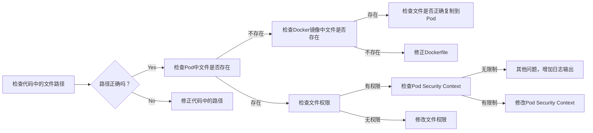

报错信息显示 Java 程序找不到文件，抛出 `java.nio.file.NoSuchFileException` 异常。  路径类似 `src/main/resources/...xlsm`。

**可能原因分析：**

1. **文件路径错误:**  `src/main/resources` 看起来像是编译时的资源路径，而不是 Pod 运行时的路径。在 Pod 中，该路径可能不存在或文件被放置在其他位置。

2. **文件未打包到镜像:**  如果 Excel 模板文件应该被打包到 Docker 镜像中，可能构建过程中出现问题，导致文件未正确包含。

3. **Pod 内存限制:**  虽然不太可能，但如果 Pod 的内存资源非常有限，可能会导致在创建临时文件时出现问题。

4. **安全上下文限制:** Pod 的 Security Context 可能限制了对文件系统的访问权限。


**如何确认功能可行：**

1. **确认文件路径:**
    * 在 Pod 中执行 `ls -l /path/to/your/expected/location`  (将 `/path/to/your/expected/location` 替换为预期的文件路径，例如 `/app/resources` 或 `/opt/app/resources`)，确认模板文件是否存在于 Pod 的文件系统中。
    * 检查代码中使用的文件路径是否与 Pod 中的实际路径一致。  打印出代码尝试访问的完整路径进行确认。

2. **检查 Docker 镜像:**  在构建 Docker 镜像后，使用 `docker run -it <image_name> bash` 进入容器内部，确认 `src/main/resources` (或其他预期路径) 下是否存在模板文件。

3. **Pod 中的测试:**
    * 创建一个简单的测试 Pod，其中包含与你的应用程序相同的基础镜像和配置。
    * 在测试 Pod 中运行一个简单的脚本，尝试复制、填充和读取一个测试文件，以验证文件系统操作是否正常。 例如：

    ```bash
    kubectl run test-pod --image=<your_image_name> --restart=Never --command -- /bin/sh -c "
    touch /tmp/test.txt;
    echo 'test content' > /tmp/test.txt;
    cat /tmp/test.txt;
    "
    kubectl logs test-pod
    ```

4. **检查 Pod 的 Security Context:**  确认 Pod 的 Security Context 没有限制对所需目录的写入权限。  尤其注意 `readOnlyRootFilesystem`、`runAsUser`、`runAsGroup` 和 `fsGroup`  这些设置。  如果没有设置 Security Context，则使用默认的设置，这通常允许写入 `/tmp` 目录。

5. **增加日志输出:**  在代码中添加更详细的日志记录，尤其是在文件操作前后，以便更精确地定位问题所在。


通过以上步骤，可以逐步排查问题，最终确认 Pod 创建临时文件的功能是否正常。




提取的文本内容：


错误原因分析：

核心错误是 `java.nio.file.NoSuchFileException`，表明程序找不到指定的Excel文件。错误发生在尝试更新现有Excel文件时，说明程序的逻辑是先找到文件，然后进行修改。结合错误信息中的文件路径 `src/main/resources/...`，可以推断出以下几种可能的原因：

1. **文件路径错误:**  在GKE的Pod环境中，`src/main/resources` 路径可能并不存在或者程序无法访问。这个路径通常在Java项目的编译阶段会被打包到JAR文件中，而不是在文件系统中以目录形式存在。程序应该使用 `ClassLoader.getResourceAsStream()` 或类似的方法来访问JAR包内的资源文件。

2. **文件未正确打包:** 编译打包过程中，Excel模板文件可能未被正确包含到JAR文件中。需要检查构建配置（例如Maven或Gradle）是否正确配置了资源文件的打包。

3. **尝试修改只读文件/目录:**  即使文件存在于 `src/main/resources` 对应的JAR包内，程序也无法直接修改JAR包内的文件。程序应该先将模板文件复制到一个可写的临时目录（例如 `/tmp`），然后对复制后的文件进行修改，最后再返回给用户。


确认功能可行性：

1. **确认文件存在:**  在Pod中执行以下命令，检查JAR包中是否存在对应的Excel模板文件：

    ```bash
    kubectl exec -it <pod-name> -- jar tf <your-application.jar> | grep <template-file-name>
    ```
    例如，如果你的JAR文件名为 `my-app.jar`，模板文件名是 `MonitoringSummary.xlsm`，则命令为：
    ```bash
    kubectl exec -it <pod-name> -- jar tf my-app.jar | grep MonitoringSummary.xlsm
    ```
    如果命令没有输出，说明文件未打包到JAR中。

2. **修改文件访问方式:** 将代码中访问Excel文件的方式修改为从JAR包中读取资源流，而不是直接访问文件路径。例如：

    ```java
    InputStream inputStream = getClass().getClassLoader().getResourceAsStream("MonitoringSummary.xlsm");
    // 使用 inputStream 读取模板文件内容
    ```

3. **使用临时文件:**  将模板文件复制到Pod的临时目录（例如`/tmp`）中，对副本进行修改，然后返回修改后的文件。

4. **检查Pod日志:**  仔细检查Pod的日志，寻找更详细的错误信息和堆栈跟踪，这有助于进一步定位问题。


通过以上步骤，可以确认在GKE中创建和修改报告的功能是否可行，并找到相应的解决方案。

The extracted text content:


Error Analysis:

The core error is `java.nio.file.NoSuchFileException`, indicating that the program cannot find the specified Excel file. The error occurs when attempting to update an existing Excel file, suggesting the program's logic is to find the file first, then modify it.  Combined with the file path in the error message `src/main/resources/...`, we can infer the following possible causes:

1. **Incorrect File Path:** The `src/main/resources` path likely does not exist or is inaccessible within the GKE Pod environment. This path is typically packaged into the JAR file during the Java project's compilation phase, rather than existing as a directory in the file system. The program should use `ClassLoader.getResourceAsStream()` or a similar method to access resource files within the JAR.

2. **File Not Packaged Correctly:** The Excel template files may not have been included in the JAR file correctly during the build process.  You need to check if the build configuration (e.g., Maven or Gradle) has correctly configured the packaging of resource files.

3. **Attempting to Modify a Read-Only File/Directory:** Even if the file exists within the JAR corresponding to `src/main/resources`, the program cannot directly modify files within a JAR.  The program should first copy the template file to a writable temporary directory (e.g., `/tmp`), modify the copied file, and then return it to the user.


Confirming Functionality:

1. **Verify File Existence:** Execute the following command within the Pod to check if the Excel template file exists within the JAR:

    ```bash
    kubectl exec -it <pod-name> -- jar tf <your-application.jar> | grep <template-file-name>
    ```
    For example, if your JAR file is named `my-app.jar` and the template file is named `MonitoringSummary.xlsm`, the command would be:
    ```bash
    kubectl exec -it <pod-name> -- jar tf my-app.jar | grep MonitoringSummary.xlsm
    ```
    If the command has no output, the file is not packaged in the JAR.

2. **Modify File Access Method:** Change the way the code accesses the Excel file to read from the JAR's resource stream, rather than directly accessing the file path. For example:

    ```java
    InputStream inputStream = getClass().getClassLoader().getResourceAsStream("MonitoringSummary.xlsm");
    // Use inputStream to read the template file content
    ```

3. **Use Temporary Files:** Copy the template file to the Pod's temporary directory (e.g., `/tmp`), modify the copy, and then return the modified file.

4. **Check Pod Logs:** Carefully examine the Pod logs for more detailed error messages and stack traces, which can help further pinpoint the issue.


By following these steps, you can confirm the feasibility of creating and modifying reports within GKE and find the appropriate solution.

