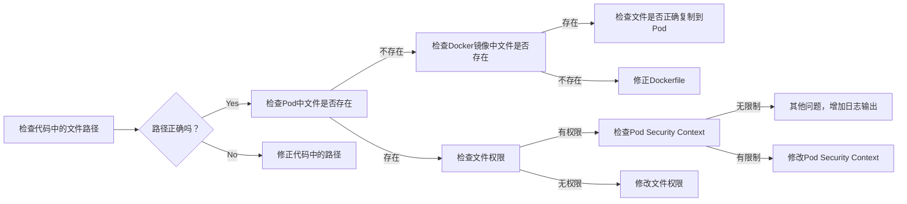

报错信息显示 Java 程序找不到文件，抛出 `java.nio.file.NoSuchFileException` 异常。  路径类似 `src/main/resources/...xlsm`。

**可能原因分析：**

1. **文件路径错误:**  `src/main/resources` 看起来像是编译时的资源路径，而不是 Pod 运行时的路径。在 Pod 中，该路径可能不存在或文件被放置在其他位置。

2. **文件未打包到镜像:**  如果 Excel 模板文件应该被打包到 Docker 镜像中，可能构建过程中出现问题，导致文件未正确包含。

3. **Pod 内存限制:**  虽然不太可能，但如果 Pod 的内存资源非常有限，可能会导致在创建临时文件时出现问题。

4. **安全上下文限制:** Pod 的 Security Context 可能限制了对文件系统的访问权限。


**如何确认功能可行：**

1. **确认文件路径:**
    * 在 Pod 中执行 `ls -l /path/to/your/expected/location`  (将 `/path/to/your/expected/location` 替换为预期的文件路径，例如 `/app/resources` 或 `/opt/app/resources`)，确认模板文件是否存在于 Pod 的文件系统中。
    * 检查代码中使用的文件路径是否与 Pod 中的实际路径一致。  打印出代码尝试访问的完整路径进行确认。

2. **检查 Docker 镜像:**  在构建 Docker 镜像后，使用 `docker run -it <image_name> bash` 进入容器内部，确认 `src/main/resources` (或其他预期路径) 下是否存在模板文件。

3. **Pod 中的测试:**
    * 创建一个简单的测试 Pod，其中包含与你的应用程序相同的基础镜像和配置。
    * 在测试 Pod 中运行一个简单的脚本，尝试复制、填充和读取一个测试文件，以验证文件系统操作是否正常。 例如：

    ```bash
    kubectl run test-pod --image=<your_image_name> --restart=Never --command -- /bin/sh -c "
    touch /tmp/test.txt;
    echo 'test content' > /tmp/test.txt;
    cat /tmp/test.txt;
    "
    kubectl logs test-pod
    ```

4. **检查 Pod 的 Security Context:**  确认 Pod 的 Security Context 没有限制对所需目录的写入权限。  尤其注意 `readOnlyRootFilesystem`、`runAsUser`、`runAsGroup` 和 `fsGroup`  这些设置。  如果没有设置 Security Context，则使用默认的设置，这通常允许写入 `/tmp` 目录。

5. **增加日志输出:**  在代码中添加更详细的日志记录，尤其是在文件操作前后，以便更精确地定位问题所在。


通过以上步骤，可以逐步排查问题，最终确认 Pod 创建临时文件的功能是否正常。




