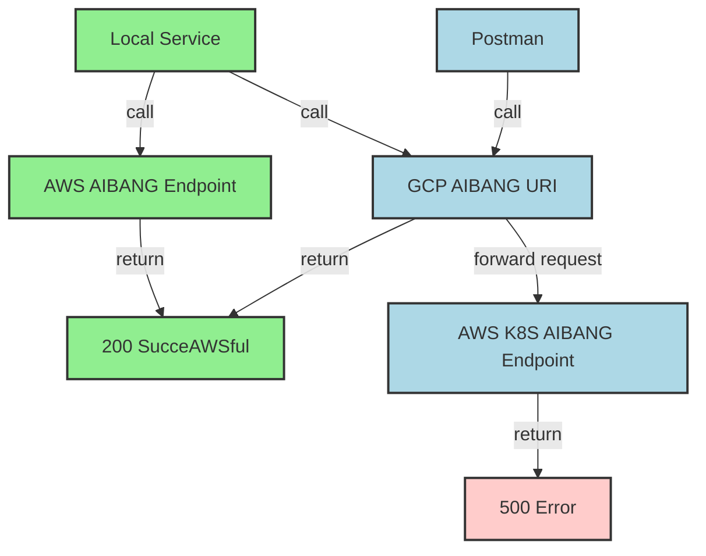
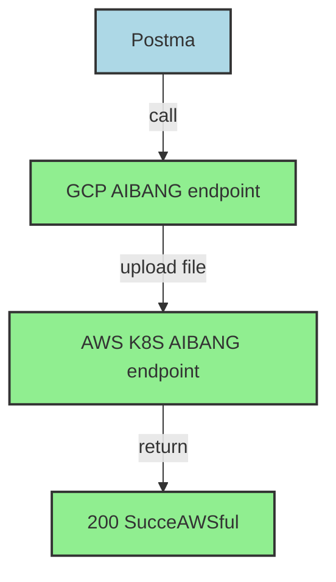

为了更好地理解你给出的两种情况及其结果，以下是对这些情境的流程图示例，展示了两个不同的请求路径及其响应。

概述

1. 成功的情况：从你的本地服务器直接调用 AWS AIBANG 接口，成功返回 200。
2. 失败的情况：通过你们的 AIBANG 接口调用目标 AWS AIBANG 接口，导致返回 500 错误。

Mermaid 流程图



描述

• 绿色流程是成功的情况，从本地服务器直接调用 AWS AIBANG Endpoint，并收到 200 的成功响应。
• 蓝色流程是失败的情况，通过 Postman 调用你们的 AIBANG URI，但由于某种原因在转发到 AWS AIBANG Endpoint 时返回 500 错误。

这种流程图可以帮助理解从本地到不同服务请求的流向及其结果，并帮助定位可能的问题来源，特别是在你们的 AIBANG 环境中。

我上面出现的这个问题,第一次Debug的时候是因为my Local service —> AIBANG endpoint 不支持Java的中文编码,所以上传文件失败.
现在这个问题已经修复. 也就是说
my local service  —>GCP( AIBANG endpoint) upload Chinese filename succeAWS 
My local Server -> AWS (AIBANG endpoint) ->200 SucceAWSful upload Chinese filename succeAWS 
我们的需求是
Local service Using postman —> GCP (AIBANG endpoint)—> AWS (AIBANG endpoint ) ?


根据你给出的情况及需求，下面是你描述的调试过程的分析和当前需求的流程图。

当前需求

• 目前你们的需求是通过 Postman 从本地服务调用 GCP 的 AIBANG endpoint，然后再通过 GCP 的 AIBANG endpoint 调用 AWS 的 AIBANG endpoint，并成功上传带有中文文件名的文件。

流程分析

1. 本地服务：通过 Postman 发送请求。
2. GCP 的 AIBANG endpoint：接收来自 Postman 的请求并上传文件。
3. AWS 的 AIBANG endpoint：GCP 的 AIBANG endpoint 再调用 AWS 的 AIBANG endpoint，完成上传并返回 200 的成功响应。

1. Local service: Send requests through Postman.
2. GCP's AIBANG endpoint: Receive requests from Postman and upload files.
3. AWS's AIBANG endpoint: The AIBANG endpoint of the GCP calls the AWS's AIBANG endpoint again, completes the upload and returns a succeAWSful response of 200.

Mermaid 流程图


描述

• 步骤 A：使用 Postman 从本地服务发送请求。
• 步骤 B：GCP 的 AIBANG endpoint 接收请求，并负责将请求传递给下一个服务。
• 步骤 C：GCP 的 AIBANG endpoint 调用 AWS 的 AIBANG endpoint 进行文件上传。
• 步骤 D：AWS 的 AIBANG endpoint 返回 200 的成功响应。


• Step A: Use Postman to send the request from the local service.
• Step B: The AIBANG endpoint of the GCP receives the request and is responsible for paAWSing the request to the next service.
• Step C: The AIBANG endpoint of the GCP calls the AIBANG endpoint of the AWS to upload the file.
. Step D: The AIBANG endpoint of AWS returns a succeAWSful response of 200.

这个流程图清晰地展示了你们的需求，让本地的 Postman 如何通过 GCP 的 AIBANG endpoint 完成文件的上传请求。确保在实现时关注编码问题，以确保中文文件名等字段能够被正确处理。


那么我们来理解下这个过程?
• 步骤 B：GCP 的 AIBANG endpoint 接收请求，并负责将请求传递给下一个服务。
• 步骤 C：GCP 的 AIBANG endpoint 调用 AWS 的 AIBANG endpoint 进行文件上传。
其实是将GCP 的 AIBANG endpoint 作为了一个客户端将数据上传到AWS 的 AIBANG endpoint ?


在这个流程中，GCP 的 AIBANG endpoint 充当了一个客户端，将数据传递到 AWS 的 AIBANG endpoint。以下是进一步的详细解释：

步骤解析

1. 步骤 B：GCP 的 AIBANG endpoint 接收来自本地服务（Postman）的请求。
	• 这一环节 GCP 的 AIBANG endpoint 处理请求的接收，包括数据验证和解析。这可能涉及文件、元数据及其他必要信息的准备。
2. 步骤 C：GCP 的 AIBANG endpoint 作为一个新客户端，向 AWS 的 AIBANG endpoint 发起请求上传数据。
	• 在这一环节，GCP 的 AIBANG endpoint 将接收到的请求数据（例如，上载的中文文件）以客户端的身份重新打包，形成另一个 HTTP 请求，发送到 AWS 的 AIBANG endpoint。
	• 这个请求可能包括文件内容、请求头、编码信息等。

概念理解

• 客户端角色：在 API 交互中，每一层都可以充当客户端和服务端的角色。例如，GCP 的 AIBANG endpoint 是一个接收请求的服务器，但同时它也作为客户端向 AWS 的 AIBANG endpoint 发起新的请求。
• 数据流转：通过将 GCP 的 AIBANG endpoint 作为客户端，利用其从本地服务接收的数据，并转发到下一个服务，保证了数据流在应用程序内部的有效传递。

总结

将 GCP 的 AIBANG endpoint 视为一种中间代理或者客户端是合理的，这使得能够更好地分离服务，允许跨服务的数据交互和处理。这样的架构通常是微服务架构的一部分，有助于实现模块化和可维护性。

那么 将 GCP 的 AIBANG endpoint 视为一种中间代理或者客户端是合理的


要确保你的客户端代码（用 Java 编写的）能够正常上传带有中文文件名的附件到下一跳的 AWS 的 AIBANG endpoint，你需要注意以下几个方面：

通过 Java 上传中文文件名的步骤

1. URL 编码：在发送请求之前，确保对文件名进行 URL 编码。Java 提供了 URLEncoder 类可以方便地进行编码。
String fileName = "中文文件名.txt";
String encodedFileName = URLEncoder.encode(fileName, StandardCharsets.UTF_8.toString());

2. 设置请求头：确保在 HTTP 请求中设置正确的内容类型（Content-Type），通常使用 multipart/form-data 来上传文件。这可以通过 Java 的 HttpURLConnection 或者更高级的库如 Apache HttpClient 来完成。
3. 构建 Multipart 请求：在构建 multipart 请求时，确保包括文件名和文件内容。同时，保持字符编码为 UTF-8 以支持中文文件名。
```java
// 示例代码基本架构
HttpClient client = HttpClientBuilder.create().build();
HttpPost post = new HttpPost("https://AWS-AIBANG-endpoint-url");

MultipartEntityBuilder builder = MultipartEntityBuilder.create();
builder.addTextBody("fileName", encodedFileName, ContentType.create("text/plain", Consts.UTF_8));
builder.addBinaryBody("file", new File("path/to/your/中文文件名.txt"), ContentType.create("text/plain"), encodedFileName);

HttpEntity entity = builder.build();
post.setEntity(entity);
post.setHeader("Accept", "application/json");

HttpResponse response = client.execute(post);
```

使用 Curl 命令来模拟上传

如果你希望直接登录到 GCP 的 AIBANG endpoint 的 Pod 中，并用 curl 命令模拟文件上传，可以按照以下步骤进行：

1. 登录 Pod：使用 kubectl 命令进入 Pod：
kubectl exec -it <pod-name> -- /bin/sh

2. 准备文件：确保在 Pod 内部有需要上传的中文文件。
3. 使用 Curl 上传文件：
```
curl -X POST "https://AWS-AIBANG-endpoint-url" \
    -H "Content-Type: multipart/form-data" \
    -F "file=@中文文件名.txt;type=text/plain"
```


注意事项

• 字符编码：无论是 Java 代码还是 Curl 请求，都要确保使用 UTF-8 字符编码，以避免中文显示成乱码。
• 测试：在生产环境前，先在测试环境中验证上传流程，确保文件名和内容正常。

通过这些步骤，你应该能够确保无论是使用 Java 代码还是 Curl 命令，都能够成功上传带有中文文件名的文件到 AWS 的 AIBANG endpoint。


Let me understand your requirements. The current status is like this.
That is to say, the right part is ensured to be all succeAWSful, but this Flow through the left part fails.
If I have any misunderstandings, please correct me.
As far as I know, we don't have special configurations for the Chinese environment.
According to this Flow on the left part, I understand that at this time, is GCP AIBANG acting as a client to initiate a request?
If so, as a client, do we have to ensure that the client code (written in Java) can normally upload attachments with Chinese file names to the next-hop AWS's AIBANG endpoint?