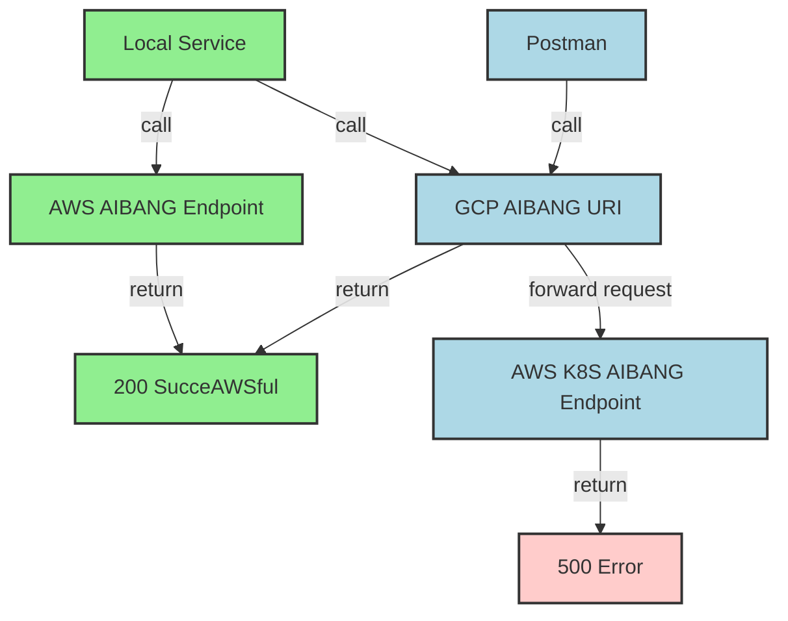
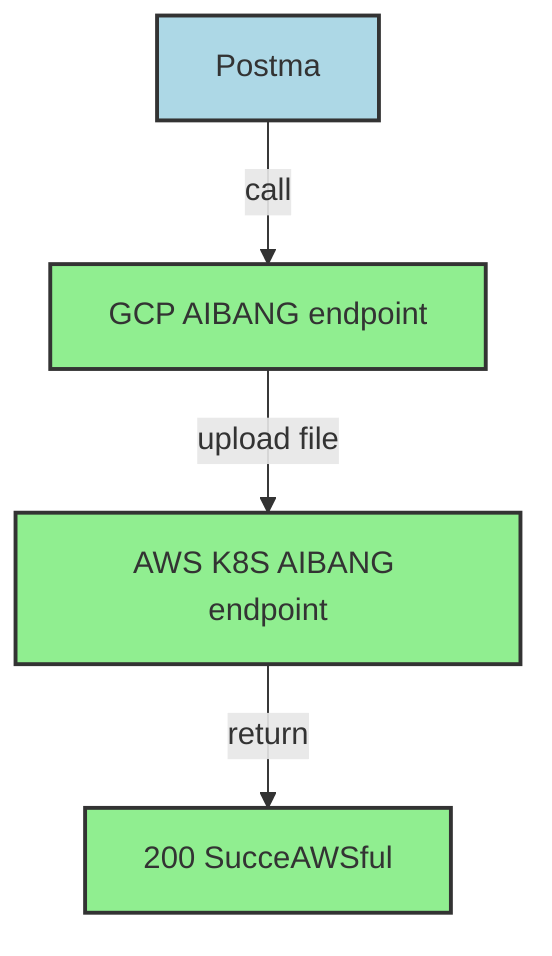

为了更好地理解你给出的两种情况及其结果，以下是对这些情境的流程图示例，展示了两个不同的请求路径及其响应。

概述

1. 成功的情况：从你的本地服务器直接调用 AWS AIBANG 接口，成功返回 200。
2. 失败的情况：通过你们的 AIBANG 接口调用目标 AWS AIBANG 接口，导致返回 500 错误。

Mermaid 流程图



描述

• 绿色流程是成功的情况，从本地服务器直接调用 AWS AIBANG Endpoint，并收到 200 的成功响应。
• 蓝色流程是失败的情况，通过 Postman 调用你们的 AIBANG URI，但由于某种原因在转发到 AWS AIBANG Endpoint 时返回 500 错误。

这种流程图可以帮助理解从本地到不同服务请求的流向及其结果，并帮助定位可能的问题来源，特别是在你们的 AIBANG 环境中。

我上面出现的这个问题,第一次Debug的时候是因为my Local service —> AIBANG endpoint 不支持Java的中文编码,所以上传文件失败.
现在这个问题已经修复. 也就是说
my local service  —>GCP( AIBANG endpoint) upload Chinese filename succeAWS 
My local Server -> AWS (AIBANG endpoint) ->200 SucceAWSful upload Chinese filename succeAWS 
我们的需求是
Local service Using postman —> GCP (AIBANG endpoint)—> AWS (AIBANG endpoint ) ?


根据你给出的情况及需求，下面是你描述的调试过程的分析和当前需求的流程图。

当前需求

• 目前你们的需求是通过 Postman 从本地服务调用 GCP 的 AIBANG endpoint，然后再通过 GCP 的 AIBANG endpoint 调用 AWS 的 AIBANG endpoint，并成功上传带有中文文件名的文件。

流程分析

1. 本地服务：通过 Postman 发送请求。
2. GCP 的 AIBANG endpoint：接收来自 Postman 的请求并上传文件。
3. AWS 的 AIBANG endpoint：GCP 的 AIBANG endpoint 再调用 AWS 的 AIBANG endpoint，完成上传并返回 200 的成功响应。

1. Local service: Send requests through Postman.
2. GCP's AIBANG endpoint: Receive requests from Postman and upload files.
3. AWS's AIBANG endpoint: The AIBANG endpoint of the GCP calls the AWS's AIBANG endpoint again, completes the upload and returns a succeAWSful response of 200.

Mermaid 流程图


描述

• 步骤 A：使用 Postman 从本地服务发送请求。
• 步骤 B：GCP 的 AIBANG endpoint 接收请求，并负责将请求传递给下一个服务。
• 步骤 C：GCP 的 AIBANG endpoint 调用 AWS 的 AIBANG endpoint 进行文件上传。
• 步骤 D：AWS 的 AIBANG endpoint 返回 200 的成功响应。


• Step A: Use Postman to send the request from the local service.
• Step B: The AIBANG endpoint of the GCP receives the request and is responsible for paAWSing the request to the next service.
• Step C: The AIBANG endpoint of the GCP calls the AIBANG endpoint of the AWS to upload the file.
. Step D: The AIBANG endpoint of AWS returns a succeAWSful response of 200.

这个流程图清晰地展示了你们的需求，让本地的 Postman 如何通过 GCP 的 AIBANG endpoint 完成文件的上传请求。确保在实现时关注编码问题，以确保中文文件名等字段能够被正确处理。


那么我们来理解下这个过程?
• 步骤 B：GCP 的 AIBANG endpoint 接收请求，并负责将请求传递给下一个服务。
• 步骤 C：GCP 的 AIBANG endpoint 调用 AWS 的 AIBANG endpoint 进行文件上传。
其实是将GCP 的 AIBANG endpoint 作为了一个客户端将数据上传到AWS 的 AIBANG endpoint ?


在这个流程中，GCP 的 AIBANG endpoint 充当了一个客户端，将数据传递到 AWS 的 AIBANG endpoint。以下是进一步的详细解释：

步骤解析

1. 步骤 B：GCP 的 AIBANG endpoint 接收来自本地服务（Postman）的请求。
	• 这一环节 GCP 的 AIBANG endpoint 处理请求的接收，包括数据验证和解析。这可能涉及文件、元数据及其他必要信息的准备。
2. 步骤 C：GCP 的 AIBANG endpoint 作为一个新客户端，向 AWS 的 AIBANG endpoint 发起请求上传数据。
	• 在这一环节，GCP 的 AIBANG endpoint 将接收到的请求数据（例如，上载的中文文件）以客户端的身份重新打包，形成另一个 HTTP 请求，发送到 AWS 的 AIBANG endpoint。
	• 这个请求可能包括文件内容、请求头、编码信息等。

概念理解

• 客户端角色：在 API 交互中，每一层都可以充当客户端和服务端的角色。例如，GCP 的 AIBANG endpoint 是一个接收请求的服务器，但同时它也作为客户端向 AWS 的 AIBANG endpoint 发起新的请求。
• 数据流转：通过将 GCP 的 AIBANG endpoint 作为客户端，利用其从本地服务接收的数据，并转发到下一个服务，保证了数据流在应用程序内部的有效传递。

总结

将 GCP 的 AIBANG endpoint 视为一种中间代理或者客户端是合理的，这使得能够更好地分离服务，允许跨服务的数据交互和处理。这样的架构通常是微服务架构的一部分，有助于实现模块化和可维护性。

那么 将 GCP 的 AIBANG endpoint 视为一种中间代理或者客户端是合理的


要确保你的客户端代码（用 Java 编写的）能够正常上传带有中文文件名的附件到下一跳的 AWS 的 AIBANG endpoint，你需要注意以下几个方面：

通过 Java 上传中文文件名的步骤

1. URL 编码：在发送请求之前，确保对文件名进行 URL 编码。Java 提供了 URLEncoder 类可以方便地进行编码。
String fileName = "中文文件名.txt";
String encodedFileName = URLEncoder.encode(fileName, StandardCharsets.UTF_8.toString());

2. 设置请求头：确保在 HTTP 请求中设置正确的内容类型（Content-Type），通常使用 multipart/form-data 来上传文件。这可以通过 Java 的 HttpURLConnection 或者更高级的库如 Apache HttpClient 来完成。
3. 构建 Multipart 请求：在构建 multipart 请求时，确保包括文件名和文件内容。同时，保持字符编码为 UTF-8 以支持中文文件名。
```java
// 示例代码基本架构
HttpClient client = HttpClientBuilder.create().build();
HttpPost post = new HttpPost("https://AWS-AIBANG-endpoint-url");

MultipartEntityBuilder builder = MultipartEntityBuilder.create();
builder.addTextBody("fileName", encodedFileName, ContentType.create("text/plain", Consts.UTF_8));
builder.addBinaryBody("file", new File("path/to/your/中文文件名.txt"), ContentType.create("text/plain"), encodedFileName);

HttpEntity entity = builder.build();
post.setEntity(entity);
post.setHeader("Accept", "application/json");

HttpResponse response = client.execute(post);
```

使用 Curl 命令来模拟上传

如果你希望直接登录到 GCP 的 AIBANG endpoint 的 Pod 中，并用 curl 命令模拟文件上传，可以按照以下步骤进行：

1. 登录 Pod：使用 kubectl 命令进入 Pod：
kubectl exec -it <pod-name> -- /bin/sh

2. 准备文件：确保在 Pod 内部有需要上传的中文文件。
3. 使用 Curl 上传文件：
```
curl -X POST "https://AWS-AIBANG-endpoint-url" \
    -H "Content-Type: multipart/form-data" \
    -F "file=@中文文件名.txt;type=text/plain"
```


注意事项

• 字符编码：无论是 Java 代码还是 Curl 请求，都要确保使用 UTF-8 字符编码，以避免中文显示成乱码。
• 测试：在生产环境前，先在测试环境中验证上传流程，确保文件名和内容正常。

通过这些步骤，你应该能够确保无论是使用 Java 代码还是 Curl 命令，都能够成功上传带有中文文件名的文件到 AWS 的 AIBANG endpoint。


Let me understand your requirements. The current status is like this.
That is to say, the right part is ensured to be all succeAWSful, but this Flow through the left part fails.
If I have any misunderstandings, please correct me.
As far as I know, we don't have special configurations for the Chinese environment.
According to this Flow on the left part, I understand that at this time, is GCP AIBANG acting as a client to initiate a request?
If so, as a client, do we have to ensure that the client code (written in Java) can normally upload attachments with Chinese file names to the next-hop AWS's AIBANG endpoint?


我有一个Java的API 是一个上传接口 我上传中文文件,比如中文.PDF 到了/tmp/目录下 我想了解下 如果上传到我们的/tmp/目录下,是一个中文,或者是一个乱码的文件名,那么对应这种问题,我如何来解决?因为我还在在我的这个API里面实现一些逻辑,比如判断这个文件已经上传完成了,我需要再将这个文件解析,拿到里面的内容等.并处理之后再次传送到另一个api

在处理上传的中文文件名或可能的乱码问题时，确保你的 API 和服务器都能正确支持 UTF-8 编码，这样就能顺利处理中文文件名和内容。下面是一些步骤和建议，可以帮助你处理这些文件上传和后续处理的逻辑。

第一步：确保正确处理中文文件名

1. 设置编码：在 Java API 的 Servlet 配置中，确保设置正确的字符编码为 UTF-8。在处理 Multipart 请求时，可以设置如下：
request.setCharacterEncoding("UTF-8");

2. 使用正确的文件处理库：确保使用支持 UTF-8 文件名的库，例如 Apache Commons FileUpload 或 Spring 的 MultipartFile。
3. 获取文件名：当上传文件时，获取上传的文件名时，使用 UTF-8 解码：
Part filePart = request.getPart("file"); // 上传文件的名字
String fileName = filePart.getSubmittedFileName();

如果文件名含有特殊字符或编码不正确，可以使用 URLDecoder 进行解码：
String decodedFileName = URLDecoder.decode(fileName, "UTF-8");


第二步：上传文件到指定目录

将文件上传到 /tmp/ 目录并处理该文件，确保将文件以原始名称存储：
```
File uploads = new File("/tmp/");
File file = new File(uploads, decodedFileName);
try (InputStream input = filePart.getInputStream()) {
    Files.copy(input, file.toPath(), StandardCopyOption.REPLACE_EXISTING);
}
```
第三步：判断文件是否上传完成

你可以简单地检查文件是否存在及其大小来判断是否上传完成：

if (file.exists() && file.length() > 0) {
    // 文件上传完成，处理逻辑
}

第四步：解析 PDF 文件内容

要解析 PDF 文件内容，可以使用 Apache PDFBox 等库，以下是一个示例：

1. 添加依赖（如果使用 Maven）：
```
<dependency>
    <groupId>org.apache.pdfbox</groupId>
    <artifactId>pdfbox</artifactId>
    <version>2.0.24</version>
</dependency>
```
2. 解析 PDF 内容：
```
try (PDDocument document = PDDocument.load(file)) {
    PDFTextStripper pdfStripper = new PDFTextStripper();
    String pdfContent = pdfStripper.getText(document);
    
    // 处理获取到的内容
}
```

第五步：将内容传送到另一个 API

使用 HttpURLConnection 或其他 HTTP 客户端库如 OkHttp 或 Apache HttpClient 将处理的内容传送到另一 API。例如：
```
URL url = new URL("http://another-api-url");
HttpURLConnection conn = (HttpURLConnection) url.openConnection();
conn.setRequestMethod("POST");
conn.setDoOutput(true);
conn.setRequestProperty("Content-Type", "application/json; charset=UTF-8");

try (OutputStream os = conn.getOutputStream()) {
    byte[] input = jsonInputString.getBytes("utf-8");
    os.write(input, 0, input.length);           
}
```
总结

通过以上步骤，确保你的 Java API 能正确接收和处理中文文件名及其内容。使用正确的编码和合适的库来处理文件将有效避免乱码问题，并能顺利提取和上传文件内容。

如果你在实现这些步骤时遇到任何问题，或者有更具体的需求，请告诉我！


```java
@RequestMapping(value = "/upload/file", method = RequestMethod.POST, produces = MediaType.APPLICATION_JSON_VALUE)
public ResponseEntity<CommonResponse> uploadFile(@RequestParam("file") MultipartFile file) {
    Data data = new Data();
    data.setStatus("fail!!");
    if (file.isEmpty()) {
        return new ResponseEntity<>(new CommonResponse("File is empty", data), HttpStatus.BAD_REQUEST);
    }
    try (BufferedReader br = new BufferedReader(new InputStreamReader(file.getInputStream(), StandardCharsets.UTF_8))) {
        String line;
        log.info("File content:");
        while ((line = br.readLine())!= null) {
            log.info(line);
        }
        String filePath = "/tmp/" + file.getOriginalFilename();
        File dest = new File(filePath);
        try (FileOutputStream fos = new FileOutputStream(dest)) {
            fos.write(file.getBytes());
            data.setStatus("ok!");
            data.setDetails("File uploaded successfully");
        } catch (Exception e) {
            log.error("", e);
            return new ResponseEntity<>(new CommonResponse("Error reading file", data), HttpStatus.INTERNAL_SERVER_ERROR);
        }
    } catch (IOException e) {
        log.error("", e);
        return new ResponseEntity<>(new CommonResponse("Error uploading file", data), HttpStatus.INTERNAL_SERVER_ERROR);
    }
    return new ResponseEntity<>(new CommonResponse("File uploaded successfully", data), HttpStatus.OK);
}
```

```

这段代码实现了文件上传的基本功能，但要确保证中文文件名正常工作，还需关注以下几个方面：

代码分析与修正建议

1. 处理中文文件名：
	• 使用 MultipartFile 的 getOriginalFilename() 方法获取文件名时，确保文件名是 UTF-8 编码的。如果通过 Web 浏览器上传的文件名中包含中文，通常情况下这个方法会正确返回中文文件名。但是某些情况下，例如文件名乱码，你可能需要手动解码。
	• 下面的修改示例会使用 URLDecoder 解码文件名：

String originalFilename = URLDecoder.decode(file.getOriginalFilename(), StandardCharsets.UTF_8.toString());
String filePath = "/tmp/" + originalFilename;
File dest = new File(filePath);

2. 文件内容读取：
	• 使用 BufferedReader 来读取输入流内容时，使用了 StandardCharsets.UTF_8 来解码输入流，这样可以处理 UTF-8 编码的文本文件内容。然而，如果上传的文件内容是 PDF 等二进制文件，读取文本内容的方法将不适用。
	• 在这种情况下，如果你只处理 PDF 文件，建议检查文件的类型，并考虑使用合适的库（例如 Apache PDFBox）处理 PDF 文件内容。
3. 文件上传逻辑：
	• 代码逻辑中，位于 fos.write(file.getBytes()); 的这行实际上是将文件的字节写入到指定路径中，若文件很大，可能会导致性能问题。此时，建议流式写入文件内容而不是把整个文件的字节加载到内存中：

try (InputStream inputStream = file.getInputStream(); FileOutputStream fos = new FileOutputStream(dest)) {
    byte[] buffer = new byte[1024];
    int bytesRead;
    while ((bytesRead = inputStream.read(buffer)) != -1) {
        fos.write(buffer, 0, bytesRead);
    }
}

4. 日志记录：
	• 当前的日志记录是正确的，可以记录文件内容，但要记住，如果上传的是二进制文件或较大的文件，这可能会产生大量日志信息。可以考虑限制输出只记录一些特定提示或大小，而不是每一行的内容。

修改后的代码示例

在综合上述建议后，代码可能修改为如下：

@RequestMapping(value = "/upload/file", method = RequestMethod.POST, produces = MediaType.APPLICATION_JSON_VALUE)
public ResponseEntity<CommonResponse> uploadFile(@RequestParam("file") MultipartFile file) {
    Data data = new Data();
    data.setStatus("fail!!");
    if (file.isEmpty()) {
        return new ResponseEntity<>(new CommonResponse("File is empty", data), HttpStatus.BAD_REQUEST);
    }
    
    String originalFilename;
    try {
        originalFilename = URLDecoder.decode(file.getOriginalFilename(), StandardCharsets.UTF_8.toString());
    } catch (UnsupportedEncodingException e) {
        log.error("Error decoding filename", e);
        return new ResponseEntity<>(new CommonResponse("Failed to decode filename", data), HttpStatus.INTERNAL_SERVER_ERROR);
    }
    
    String filePath = "/tmp/" + originalFilename;
    File dest = new File(filePath);
    
    try (InputStream inputStream = file.getInputStream(); FileOutputStream fos = new FileOutputStream(dest)) {
        byte[] buffer = new byte[1024];
        int bytesRead;
        while ((bytesRead = inputStream.read(buffer)) != -1) {
            fos.write(buffer, 0, bytesRead);
        }
        data.setStatus("ok!");
        data.setDetails("File uploaded successfully");
        log.info("Uploaded file to: {}", filePath);
    } catch (IOException e) {
        log.error("Error during file upload", e);
        return new ResponseEntity<>(new CommonResponse("Error uploading file", data), HttpStatus.INTERNAL_SERVER_ERROR);
    }
    
    return new ResponseEntity<>(new CommonResponse("File uploaded successfully", data), HttpStatus.OK);
}

总结

以上修改确保了能够正确处理中文文件名和文件上传逻辑的合理性。通过在处理中文文件名时进行 URL 解码以及使用流式方式写入文件，可以提升代码的鲁棒性和性能。如果有任何特定的错误或问题，请继续提问！


根据您提供的代码,对于中文文件名的处理有以下几点需要注意:

1. 文件名解码:
您的代码已经使用 URLDecoder.decode() 对文件名进行了 UTF-8 解码,这是正确的做法。这样可以处理大多数情况下的中文文件名。

2. 文件系统编码:
即使文件名正确解码,如果服务器文件系统不支持 UTF-8,仍可能出现乱码。确保服务器文件系统使用 UTF-8 编码。

3. 文件名安全处理:
为了进一步确保文件名不出现乱码,可以考虑以下改进:


```java
@RequestMapping(value = "/upload/file", method = RequestMethod.POST, produces = MediaType.APPLICATION_JSON_VALUE)
public ResponseEntity<CommonResponse> uploadFile(@RequestParam("file") MultipartFile file) {
    Data data = new Data();
    data.setStatus("fail!!");
    if (file.isEmpty()) {
        return new ResponseEntity<>(new CommonResponse("File is empty", data), HttpStatus.BAD_REQUEST);
    }
    
    String originalFilename;
    try {
        originalFilename = URLDecoder.decode(file.getOriginalFilename(), StandardCharsets.UTF_8.toString());
        // 移除不安全的字符
        originalFilename = originalFilename.replaceAll("[^a-zA-Z0-9\\.\\-]", "_");
        // 确保文件名不为空
        if (originalFilename.isEmpty()) {
            originalFilename = "unnamed_file";
        }
    } catch (UnsupportedEncodingException e) {
        log.error("Error decoding filename", e);
        return new ResponseEntity<>(new CommonResponse("Failed to decode filename", data), HttpStatus.INTERNAL_SERVER_ERROR);
    }
    
    String timestamp = new SimpleDateFormat("yyyyMMddHHmmss").format(new Date());
    String filePath = "/tmp/" + timestamp + "_" + originalFilename;
    File dest = new File(filePath);
    
    try (InputStream inputStream = file.getInputStream(); FileOutputStream fos = new FileOutputStream(dest)) {
        byte[] buffer = new byte[1024];
        int bytesRead;
        while ((bytesRead = inputStream.read(buffer)) != -1) {
            fos.write(buffer, 0, bytesRead);
        }
        data.setStatus("ok!");
        data.setDetails("File uploaded successfully");
        log.info("Uploaded file to: {}", filePath);
    } catch (IOException e) {
        log.error("Error during file upload", e);
        return new ResponseEntity<>(new CommonResponse("Error uploading file", data), HttpStatus.INTERNAL_SERVER_ERROR);
    }
    
    return new ResponseEntity<>(new CommonResponse("File uploaded successfully", data), HttpStatus.OK);
}

```

这个改进后的代码做了以下几点修改:

1. 文件名安全处理: 使用正则表达式移除了可能导致问题的字符,只保留字母、数字、点和横杠。

2. 空文件名处理: 如果处理后的文件名为空,设置一个默认名称。

3. 时间戳前缀: 在文件名前添加了时间戳,这样可以避免文件名冲突,并且可以按上传顺序排序。

这些改进应该能够解决大多数与中文文件名相关的问题。但是,还有一些其他建议:

1. 日志记录: 在保存文件后,记录原始文件名和保存后的文件名,这样可以方便追踪。

2. 文件类型检查: 考虑添加文件类型检查,只允许上传特定类型的文件(如PDF)。

3. 文件大小限制: 添加文件大小限制,防止超大文件占用服务器资源。

4. 安全存储路径: 确保 /tmp/ 目录具有适当的权限,并考虑使用更安全的存储位置。

5. 错误处理: 为不同类型的错误(如磁盘空间不足)提供更具体的错误信息。

通过这些改进,您应该能够成功上传中文名称的PDF文件,并且在 /tmp/ 目录下看到它们,文件名不会出现乱码。如果仍然遇到问题,可能需要检查服务器的文件系统编码和Java运行时的默认编码设置。
```
