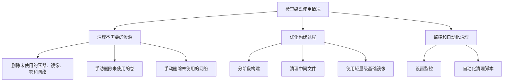

磁盘满问题在容器化环境中非常常见，特别是在运行大量容器或者频繁构建镜像的情况下。以下是处理磁盘满问题的几个步骤和优化建议：

### 步骤一：检查磁盘使用情况

首先，通过 `du -sh /var/lib/docker` 检查 Docker 的存储占用：

```sh
du -sh /var/lib/docker
```

你还可以更详细地查看各个子目录的占用情况：

```sh
du -sh /var/lib/docker/*
```

### 步骤二：清理不需要的资源

1. **删除未使用的容器、镜像、卷和网络：**

   使用 `docker system prune` 命令可以清理未使用的容器、镜像、卷和网络：

   ```sh
   docker system prune -a
   ```

   - `-a` 选项会删除所有未使用的镜像，而不仅仅是悬空镜像。

2. **手动删除未使用的卷：**

   清理未使用的卷，可以释放大量空间：

   ```sh
   docker volume prune
   ```

3. **手动删除未使用的网络：**

   清理未使用的网络：

   ```sh
   docker network prune
   ```

### 步骤三：优化构建过程

1. **分阶段构建（multi-stage builds）：**

   在 Dockerfile 中使用多阶段构建，减少最终镜像的体积。例如：

   ```dockerfile
   FROM golang:alpine AS builder
   WORKDIR /app
   COPY . .
   RUN go build -o main .

   FROM alpine
   WORKDIR /app
   COPY --from=builder /app/main .
   CMD ["./main"]
   ```

2. **清理中间文件：**

   在构建过程中，尽可能清理不必要的中间文件。例如：

   ```dockerfile
   RUN apt-get update && apt-get install -y \
       build-essential \
       && rm -rf /var/lib/apt/lists/*
   ```

3. **使用轻量级基础镜像：**

   选择体积较小的基础镜像，如 `alpine` 或 `scratch`，可以显著减少镜像大小。

### 步骤四：监控和自动化清理

1. **设置监控：**

   使用监控工具，如 Prometheus 和 Grafana，监控磁盘使用情况，提前预警磁盘空间不足。

2. **自动化清理脚本：**

   编写自动化脚本，定期清理未使用的 Docker 资源。例如，可以设置一个 cron job 每天执行：

   ```sh
   0 0 * * * /usr/bin/docker system prune -a -f
   ```

### Mermaid 流程图

以下是一个简化的流程图，描述了处理磁盘满问题的步骤：



通过以上步骤和建议，你可以有效地管理和优化 Docker 环境中的磁盘使用，避免磁盘空间不足的问题。