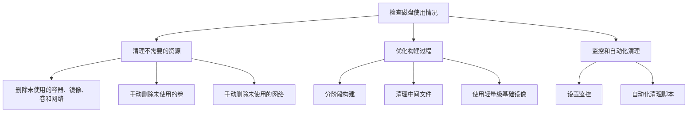
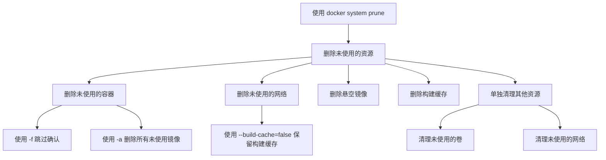
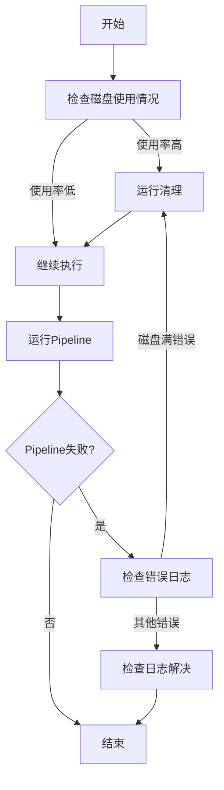
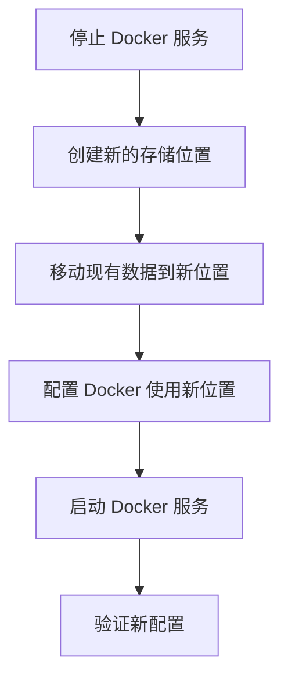
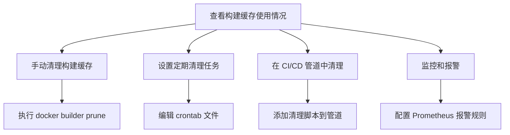
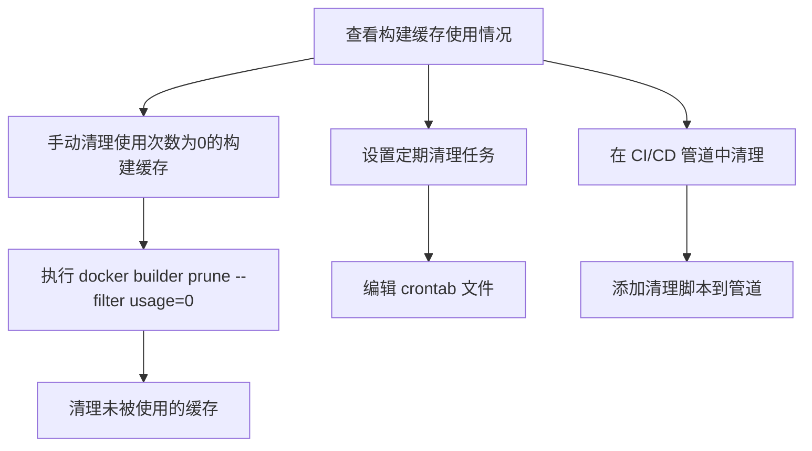

磁盘满问题在容器化环境中非常常见，特别是在运行大量容器或者频繁构建镜像的情况下。以下是处理磁盘满问题的几个步骤和优化建议：

### 步骤一：检查磁盘使用情况

首先，通过 `du -sh /var/lib/docker` 检查 Docker 的存储占用：

```sh
du -sh /var/lib/docker
```

你还可以更详细地查看各个子目录的占用情况：

```sh
du -sh /var/lib/docker/*
```

### 步骤二：清理不需要的资源

1. **删除未使用的容器、镜像、卷和网络：**

   使用 `docker system prune` 命令可以清理未使用的容器、镜像、卷和网络：

   ```sh
   docker system prune -a
   ```

   - `-a` 选项会删除所有未使用的镜像，而不仅仅是悬空镜像。

2. **手动删除未使用的卷：**

   清理未使用的卷，可以释放大量空间：

   ```sh
   docker volume prune
   ```

3. **手动删除未使用的网络：**

   清理未使用的网络：

   ```sh
   docker network prune
   ```

### 步骤三：优化构建过程

1. **分阶段构建（multi-stage builds）：**

   在 Dockerfile 中使用多阶段构建，减少最终镜像的体积。例如：

   ```dockerfile
   FROM golang:alpine AS builder
   WORKDIR /app
   COPY . .
   RUN go build -o main .

   FROM alpine
   WORKDIR /app
   COPY --from=builder /app/main .
   CMD ["./main"]
   ```

2. **清理中间文件：**

   在构建过程中，尽可能清理不必要的中间文件。例如：

   ```dockerfile
   RUN apt-get update && apt-get install -y \
       build-essential \
       && rm -rf /var/lib/apt/lists/*
   ```

3. **使用轻量级基础镜像：**

   选择体积较小的基础镜像，如 `alpine` 或 `scratch`，可以显著减少镜像大小。

### 步骤四：监控和自动化清理

1. **设置监控：**

   使用监控工具，如 Prometheus 和 Grafana，监控磁盘使用情况，提前预警磁盘空间不足。

2. **自动化清理脚本：**

   编写自动化脚本，定期清理未使用的 Docker 资源。例如，可以设置一个 cron job 每天执行：

   ```sh
   0 0 * * * /usr/bin/docker system prune -a -f
   ```

### Mermaid 流程图

以下是一个简化的流程图，描述了处理磁盘满问题的步骤：



通过以上步骤和建议，你可以有效地管理和优化 Docker 环境中的磁盘使用，避免磁盘空间不足的问题。


`docker system prune` 是一个非常有用的命令，用于清理 Docker 环境中未使用的资源。以下是详细的使用方法和选项：

### 基本用法

1. **删除未使用的容器、网络、镜像和缓存：**

   ```sh
   docker system prune
   ```

   该命令会交互式地提示你确认是否要删除未使用的容器、网络、悬空镜像和构建缓存。

### 选项说明

1. **自动确认删除（无需交互）：**

   ```sh
   docker system prune -f
   ```

   使用 `-f` 或 `--force` 选项可以跳过确认提示，直接删除未使用的资源。

2. **删除所有未使用的镜像：**

   ```sh
   docker system prune -a
   ```

   使用 `-a` 或 `--all` 选项可以删除所有未使用的镜像，而不仅仅是悬空镜像。该选项对于释放更多磁盘空间非常有用。

3. **清理构建缓存：**

   默认情况下，`docker system prune` 也会清理构建缓存。如果不想清理构建缓存，可以使用 `--build-cache` 选项：

   ```sh
   docker system prune --build-cache=false
   ```

### 组合选项

可以组合多个选项以实现更精细的控制。例如，删除所有未使用的资源，并且无需交互确认：

```sh
docker system prune -a -f
```

### 清理其他类型的资源

1. **清理未使用的卷：**

   卷不会被 `docker system prune` 自动清理，可以单独使用以下命令清理未使用的卷：

   ```sh
   docker volume prune
   ```

2. **清理未使用的网络：**

   未使用的网络可以使用以下命令清理：

   ```sh
   docker network prune
   ```

### 示例

1. **清理所有未使用的资源，包括悬空镜像，并且无需确认：**

   ```sh
   docker system prune -a -f
   ```

2. **清理未使用的容器、网络和构建缓存，但保留所有未使用的镜像：**

   ```sh
   docker system prune --build-cache=false
   ```

3. **清理未使用的卷：**

   ```sh
   docker volume prune
   ```

4. **清理未使用的网络：**

   ```sh
   docker network prune
   ```

### 总结

`docker system prune` 是一个强大的命令，可以帮助你高效地管理 Docker 环境中的资源。结合不同的选项，可以根据需要进行精细化的清理操作。定期使用这些命令，可以有效避免磁盘空间不足的问题。

### Mermaid 流程图

以下是一个简化的流程图，描述了 `docker system prune` 的基本使用和选项：



通过以上详细说明和示例，你可以更好地理解和使用 `docker system prune` 命令，有效管理 Docker 环境中的资源。


在处理Docker磁盘空间不足的问题时，有多种方法可以帮助你优化流程，避免磁盘满的问题。以下是一些具体的解决方案：

## 1. 定期清理磁盘

### 使用Docker Prune命令
你可以定期运行以下命令来清理未使用的容器、镜像和卷：

```bash
# 清理所有停止的容器
docker container prune -f

# 清理所有未使用的卷
docker volume prune -f

# 清理所有未使用的镜像
docker image prune -a -f

# 清理所有未使用的网络
docker network prune -f

# 一次性清理所有未使用的资源
docker system prune -a --volumes -f
```

这些命令可以通过cron作业定期执行，以确保磁盘空间不会被无用的Docker资源占满[1][3][4]。

## 2. 提前监控磁盘使用情况

### 使用监控工具
你可以使用Prometheus和Grafana等监控工具来实时监控磁盘使用情况，并设置告警。当磁盘使用率达到一定阈值时，触发清理脚本或通知管理员。

```yaml
# Prometheus配置示例
- job_name: 'node'
  static_configs:
  - targets: ['localhost:9100']
```

### 自定义脚本
编写一个脚本，定期检查磁盘使用情况，并在达到阈值时自动执行清理命令：

```bash
#!/bin/bash
THRESHOLD=80
USAGE=$(df /var/lib/docker | awk 'NR==2 {print $5}' | sed 's/%//')

if [ "$USAGE" -gt "$THRESHOLD" ]; then
  docker system prune -a --volumes -f
fi
```

将这个脚本添加到cron作业中，例如每小时运行一次：

```bash
0 * * * * /path/to/your/script.sh
```

## 3. 优化Docker镜像和容器

### 减少镜像大小
使用工具如Slimmer、UnionFS和Init-containers来减少Docker镜像的大小。合并多个镜像层，删除不必要的文件和依赖[1]。

### 设置资源限制
在运行容器时，设置CPU和内存限制，防止单个容器占用过多资源：

```bash
docker run --name mycontainer --memory=1g --cpus=0.5 myimage
```

在Docker Compose文件中设置资源限制：

```yaml
version: '3'
services:
  myservice:
    image: myimage
    deploy:
      resources:
        limits:
          cpus: '0.5'
          memory: 1G
        reservations:
          cpus: '0.2'
          memory: 512M
```

## 4. 自动化清理

### 使用脚本自动清理
编写脚本自动清理旧的、未使用的Docker镜像和容器。例如，清理超过30天未使用的镜像：

```bash
docker image prune --filter "until=720h" -f
```

### 清理Docker Registry
如果你使用私有Docker Registry，可以编写脚本定期清理旧的、未使用的镜像：

```bash
#!/bin/bash
# 清理超过30天未使用的镜像
docker image prune --filter "until=720h" -f
```

## 5. 处理磁盘满错误

### 遇到错误时清理
在pipeline中遇到磁盘满错误时，可以立即调用清理逻辑：

```bash
if [ "$(df /var/lib/docker | awk 'NR==2 {print $5}' | sed 's/%//')" -gt 90 ]; then
  docker system prune -a --volumes -f
fi
```

通过以上方法，你可以有效地管理Docker的磁盘空间，避免磁盘满的问题，确保系统的稳定运行。

参考文献：
[1] https://blog.devgenius.io/docker-disk-space-management-tips-for-managing-resources-ca96999a6d47?gi=d3f4c95cd0b9
[3] https://github.com/moby/moby/issues/21925
[4] https://betterprogramming.pub/automate-docker-registry-cleanup-3a1af0aa1535?gi=e211bdac759e

Citations:
[1] https://blog.devgenius.io/docker-disk-space-management-tips-for-managing-resources-ca96999a6d47?gi=d3f4c95cd0b9
[2] https://github.com/docker/roadmap/issues/13
[3] https://github.com/moby/moby/issues/21925
[4] https://betterprogramming.pub/automate-docker-registry-cleanup-3a1af0aa1535?gi=e211bdac759e
[5] https://dev.to/docker/efficient-strategies-and-best-practices-to-minimize-resource-consumption-of-containers-in-host-systems-2o59
[6] https://github.com/moby/moby/issues/18869
[7] https://www.reddit.com/r/docker/comments/125ke3b/are_there_any_best_practices_for_volume_storage/
[8] https://docs.docker.com/storage/
[9] https://edgedelta.com/company/blog/log-management-in-docker-best-practices
[10] https://www.sumologic.jp/blog/docker-containers-management/
[11] https://www.linkedin.com/pulse/optimize-docker-builds-rohit-kumar-shaw
[12] https://www.reddit.com/r/docker/comments/rg9tgz/good_way_to_stop_container_when_host_disk_space/
[13] https://www.auroria.io/optimizing-docker-images/
[14] https://tier.engineering/Tips-for-optimising-docker-build
[15] https://opvizor.com/blog/prevent-docker-host-to-run-out-of-disk-space
[16] https://marcroussy.com/2020/12/01/cleaning-up-docker-disk-space-in-wsl2/
[17] https://forums.docker.com/t/docker-no-space-left-on-device/69205
[18] https://faun.pub/how-to-prevent-out-of-disk-space-when-using-docker-b80c280e3a8a?gi=f5f665603917
[19] https://ayeshalshukri.co.uk/category/guides/docker-error-no-space-left-on-device/
[20] https://jhooq.com/docker-error-no-space-left/

在处理 Docker 环境中的磁盘满了的问题时，我们可以采取多种策略来避免和解决这一问题。以下是一些建议和解决方案，包括提前判断磁盘使用情况、定期清理、以及在报错时触发清理逻辑。

### 提前判断磁盘使用情况

在每次运行 pipeline 之前，先检查磁盘使用情况。如果磁盘空间不足，可以提前进行清理或者扩展磁盘空间。

```bash
#!/bin/bash
# Check disk usage
THRESHOLD=80
USAGE=$(df /var/lib/docker | grep / | awk '{ print $5}' | sed 's/%//g')

if [ $USAGE -gt $THRESHOLD ]; then
  echo "Disk usage is above $THRESHOLD%. Running cleanup..."
  docker system prune -a -f
else
  echo "Disk usage is below $THRESHOLD%. No need to clean up."
fi
```

### 定期清理磁盘

可以设置定时任务（cron job）来定期清理 Docker 的未使用数据，以防止磁盘空间被占满。

```bash
# Edit the crontab file
crontab -e

# Add the following lines to schedule cleanup at midnight every day
0 0 * * * /usr/bin/docker system prune -a -f
```

### 在报错时触发清理逻辑

在 pipeline 中加入错误处理逻辑，当发现磁盘满的错误时自动执行清理操作。

```bash
#!/bin/bash
# Run your pipeline command
your_pipeline_command

# Check if the pipeline failed due to disk space issue
if [ $? -ne 0 ]; then
  echo "Pipeline failed. Checking for disk space issue..."
  ERROR_LOG=$(your_pipeline_command 2>&1)

  if echo $ERROR_LOG | grep -q "no space left on device"; then
    echo "Disk full issue detected. Running cleanup..."
    docker system prune -a -f

    # Re-run the pipeline command after cleanup
    your_pipeline_command
  else
    echo "Pipeline failed due to another issue. Check logs for details."
  fi
fi
```

### 监控和报警

使用监控工具（如 Prometheus 和 Grafana）来监控 Docker 主机的磁盘使用情况，并设置报警通知，当磁盘使用率超过一定阈值时发送通知。

```yaml
# Prometheus alerting rule example
groups:
- name: docker_alerts
  rules:
  - alert: DockerDiskUsageHigh
    expr: (node_filesystem_avail_bytes{mountpoint="/var/lib/docker"} / node_filesystem_size_bytes{mountpoint="/var/lib/docker"}) < 0.2
    for: 5m
    labels:
      severity: warning
    annotations:
      summary: "High Docker disk usage on {{ $labels.instance }}"
      description: "Docker disk usage is above 80% on instance {{ $labels.instance }}."
```

### 其他优化建议

1. **使用外部存储**：将 Docker 的数据目录 `/var/lib/docker` 移动到外部存储或一个更大的磁盘分区。
2. **减少 Docker 镜像大小**：优化 Dockerfile，减少生成的镜像大小。
3. **删除未使用的数据卷**：定期清理未使用的 Docker 数据卷。

```bash
docker volume prune -f
```

4. **使用分层文件系统**：如 OverlayFS，通过分层文件系统减少磁盘占用。

### 总结

通过提前判断磁盘使用情况、定期清理、在报错时触发清理逻辑、监控和报警，以及其他优化建议，可以有效避免和解决 Docker 环境中磁盘空间不足的问题。这些方法可以结合使用，根据实际需求进行调整和优化。

### Mermaid 流程图



# migrate dir 
是的，修改和调整 `/var/lib/docker` 目录的位置以减轻根目录的压力也是一个有效的解决方案。将 Docker 数据目录移动到一个独立的分区或更大的磁盘可以有效缓解根目录的磁盘压力。下面是如何实现这一目标的步骤：

### 步骤 1: 停止 Docker 服务

首先，需要停止 Docker 服务以确保数据在移动过程中不会发生变化。

```bash
sudo systemctl stop docker
```

### 步骤 2: 创建新的存储位置

假设我们要将 Docker 数据目录移动到 `/mnt/docker-data`。首先，确保新位置存在且挂载了足够的存储空间。

```bash
sudo mkdir -p /mnt/docker-data
```

### 步骤 3: 移动现有的数据

将现有的 Docker 数据从 `/var/lib/docker` 移动到新的位置。

```bash
sudo rsync -aP /var/lib/docker/ /mnt/docker-data/
```

### 步骤 4: 配置 Docker 使用新位置

编辑 Docker 的配置文件（通常是 `/etc/docker/daemon.json`）来指定新的数据目录。如果文件不存在，可以创建一个。

```bash
sudo nano /etc/docker/daemon.json
```

添加或修改如下内容：

```json
{
  "data-root": "/mnt/docker-data"
}
```

### 步骤 5: 启动 Docker 服务

重新启动 Docker 服务，使更改生效。

```bash
sudo systemctl start docker
```

### 验证

确保 Docker 正常启动并使用新的数据目录。你可以通过以下命令验证：

```bash
docker info | grep "Docker Root Dir"
```

你应该看到输出显示新的数据目录 `/mnt/docker-data`。

### 完整的流程图

以下是描述上述步骤的 Mermaid 流程图：



### 总结

通过将 Docker 的数据目录从 `/var/lib/docker` 移动到一个独立的存储位置，可以有效减轻根目录的磁盘压力。这种方法特别适用于根分区空间有限但有其他大容量磁盘或分区的情况。执行上述步骤时请务必小心，以免数据丢失，并确保在移动数据之前备份重要数据。


在 Docker 环境中，构建缓存（build cache）可能会占用大量的磁盘空间。使用 `docker system df` 命令可以查看构建缓存的使用情况。为了有效和安全地清理这部分缓存，可以采用以下方法和建议。

### 方法 1: 使用 `docker builder prune` 命令

`docker builder prune` 命令可以清理构建缓存。这个命令会删除所有未被使用的构建缓存，从而释放磁盘空间。

```bash
# 查看当前构建缓存的占用情况
docker system df

# 清理构建缓存
docker builder prune -f
```

`-f` 标志表示强制执行清理操作，不需要用户确认。如果你想在清理前查看会删除哪些内容，可以不使用 `-f` 标志，这样 Docker 会提示你确认。

### 方法 2: 定期清理构建缓存

为了避免构建缓存占用大量磁盘空间，可以设置定时任务（cron job）定期清理未使用的构建缓存。

```bash
# 编辑 crontab 文件
crontab -e

# 添加以下行以每天午夜清理构建缓存
0 0 * * * /usr/bin/docker builder prune -f
```

### 方法 3: 在 CI/CD 管道中清理

在 CI/CD 管道中运行清理命令可以确保在每次构建之后清理未使用的缓存，从而节省磁盘空间。

```bash
#!/bin/bash

# 在构建任务完成后清理构建缓存
docker builder prune -f
```

将上述脚本添加到 CI/CD 管道中，确保每次构建完成后都会清理构建缓存。

### 方法 4: 监控和报警

使用监控工具（如 Prometheus 和 Grafana）监控 Docker 主机的磁盘使用情况，并设置报警通知，当磁盘使用率超过一定阈值时发送通知。

```yaml
# Prometheus alerting rule example
groups:
- name: docker_alerts
  rules:
  - alert: DockerBuildCacheHigh
    expr: (node_filesystem_avail_bytes{mountpoint="/var/lib/docker"} / node_filesystem_size_bytes{mountpoint="/var/lib/docker"}) < 0.2
    for: 5m
    labels:
      severity: warning
    annotations:
      summary: "High Docker build cache usage on {{ $labels.instance }}"
      description: "Docker build cache usage is above 80% on instance {{ $labels.instance }}."
```

### Mermaid 流程图

以下是描述上述步骤的 Mermaid 流程图：



### 总结

结合你的需求，可以使用 `docker builder prune` 命令手动或自动地清理构建缓存。为了确保清理操作的自动化和及时性，可以设置定期任务或在 CI/CD 管道中添加清理步骤。此外，使用监控和报警工具可以帮助你提前预警磁盘使用情况，防止磁盘空间耗尽。这样可以有效地管理 Docker 构建缓存并保持系统的健康状态。


# usage

基于构建缓存（build cache）的使用次数来清理缓存，可以通过 `docker builder prune` 命令结合使用次数（`--filter` 参数）来实现。以下是详细的建议和方案：

### 使用 `docker builder prune` 结合 `--filter` 参数

Docker 提供了 `--filter` 参数，可以根据缓存的使用次数来清理缓存。具体来说，可以使用 `until` 过滤器来删除超过指定使用次数的构建缓存。

#### 步骤 1: 查看当前构建缓存的使用情况

首先，使用 `docker system df` 命令查看当前构建缓存的使用情况：

```bash
docker system df
```

#### 步骤 2: 清理未被使用的构建缓存

使用 `docker builder prune` 命令并结合 `--filter` 参数清理构建缓存。例如，删除未被使用的构建缓存（使用次数为 0）：

```bash
docker builder prune --filter usage=0
```

你可以根据具体需求调整 `usage` 的值，以删除使用次数低于指定次数的缓存。

#### 自动化清理

可以将清理命令添加到定时任务（cron job）或 CI/CD 管道中，实现定期自动清理。

##### 使用 cron job 定期清理

编辑 crontab 文件，设置定期清理任务。例如，每天凌晨清理未被使用的构建缓存：

```bash
# 编辑 crontab 文件
crontab -e

# 添加以下行以每天午夜清理使用次数为0的构建缓存
0 0 * * * /usr/bin/docker builder prune --filter usage=0 -f
```

##### 在 CI/CD 管道中清理

在 CI/CD 管道中添加清理步骤，确保每次构建完成后清理未被使用的缓存：

```bash
#!/bin/bash

# 在构建任务完成后清理使用次数为0的构建缓存
docker builder prune --filter usage=0 -f
```

将上述脚本添加到 CI/CD 管道中，确保每次构建完成后都会清理使用次数为0的构建缓存。

### Mermaid 流程图

以下是描述上述步骤的 Mermaid 流程图：



### 总结

通过使用 `docker builder prune` 命令结合 `--filter` 参数，你可以基于构建缓存的使用次数来清理缓存。这种方法不仅有效，而且可以通过定时任务和 CI/CD 管道实现自动化清理，确保构建缓存不会占用过多磁盘空间。此外，定期查看和清理构建缓存可以帮助你保持系统的健康状态，防止磁盘空间耗尽。