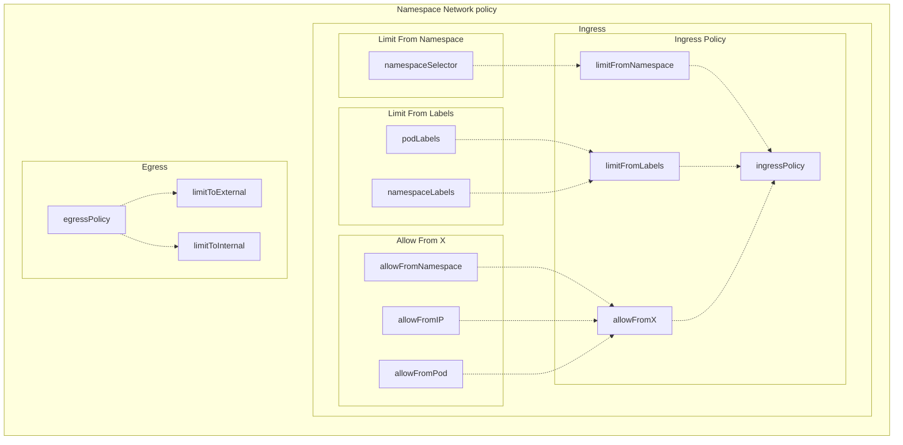
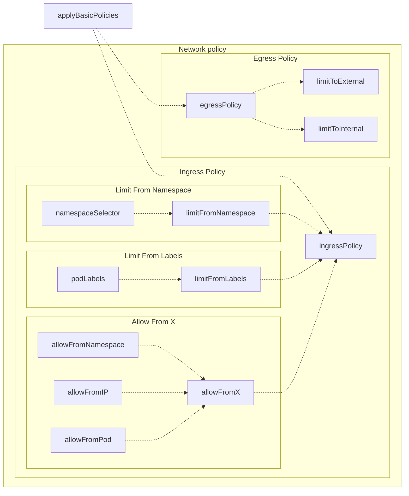
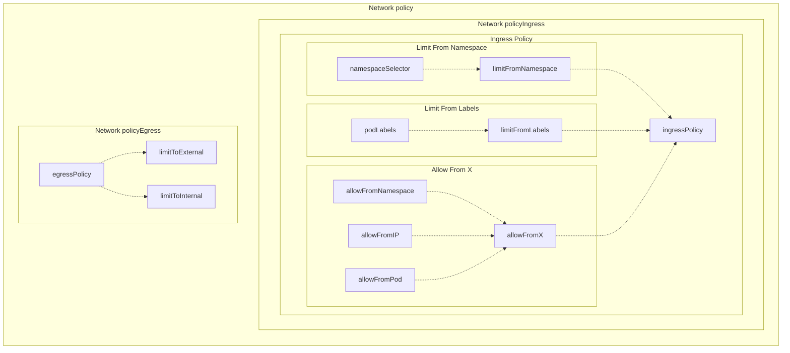
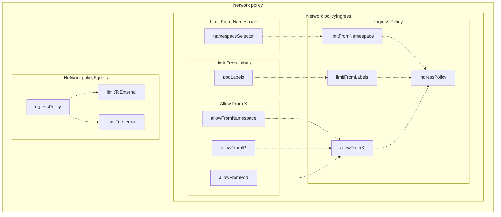
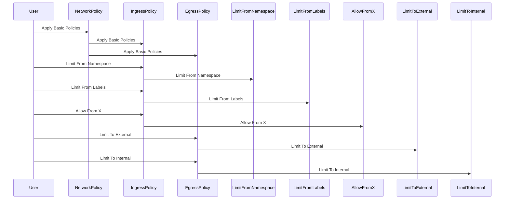

对于下面这个mermaid,我想要优化显示效果,如何操作
一个解释:

Ingress Policy子图:定义了入站流量的策略
limitFromNamespace:限制流量源的命名空间
limitFromLabels:限制流量源的标签
allowFromX:允许特定来源的流量
Egress Policy子图:定义了出站流量的策略
limitToExternal:限制到外部的流量
limitToInternal:限制到内部的流量
Basic Policies子图:应用入站和出站的基本策略
Limit From Namespace子图:使用命名空间选择器进行限制
Limit From Labels子图:使用标签选择器进行限制
Allow From X子图:允许特定的命名空间、IP、Pod作为流量源

帮我详细解释这个mermaid

我想要把下图中mermaid转换为一个sequenceDiagram格式可以么?

对于下面这个结果,我基本是满意的.如果能调整subgraph Network policyEgress的位置更好

# Last

```mermaid
graph TD
style subgraph1 fill:#DDEBF7,stroke:#6E96AF,stroke-width:2px
subgraph subgraph1[Ingress Policy]
    style ingressPolicyNode fill:#ffffff,stroke:#6E96AF,stroke-width:2px
    limitFromNamespace -->|限制入口| ingressPolicyNode
    limitFromLabels -->|限制入口| ingressPolicyNode 
    allowFromX -->|允许入口| ingressPolicyNode
end

style subgraph2 fill:#F2E3C6,stroke:#BF8F3B,stroke-width:2px
subgraph subgraph2[Egress Policy]
    style egressPolicyNode fill:#ffffff,stroke:#BF8F3B,stroke-width:2px
    egressPolicy -->|限制出口| egressPolicyNode
    egressPolicy -->|限制出口| egressPolicyNode
end

style subgraph3 fill:#EAEAEA,stroke:#787878,stroke-width:2px
subgraph subgraph3[Basic Policies]
    style basicPoliciesNode fill:#ffffff,stroke:#787878,stroke-width:2px
    BasicPolicies -->|应用基本策略| basicPoliciesNode
    BasicPolicies -->|应用基本策略| basicPoliciesNode
end

style subgraph4 fill:#DDEBF7,stroke:#6E96AF,stroke-width:2px
subgraph subgraph4[Limit From Namespace]
    style namespaceSelectorNode fill:#ffffff,stroke:#6E96AF,stroke-width:2px
    namespaceSelector -->|选择命名空间| namespaceSelectorNode
end

style subgraph5 fill:#F2E3C6,stroke:#BF8F3B,stroke-width:2px
subgraph subgraph5[Limit From Labels]
    style podLabelsNode fill:#ffffff,stroke:#BF8F3B,stroke-width:2px
    podLabels -->|选择标签| podLabelsNode
end

style subgraph6 fill:#EAEAEA,stroke:#787878,stroke-width:2px
subgraph subgraph6[Allow From X]
    style allowFromXNode fill:#ffffff,stroke:#787878,stroke-width:2px
    allowFromNamespace -->|允许来自命名空间| allowFromXNode
    allowFromIP -->|允许来自IP| allowFromXNode
    allowFromPod -->|允许来自Pod| allowFromXNode
end


```

addd

