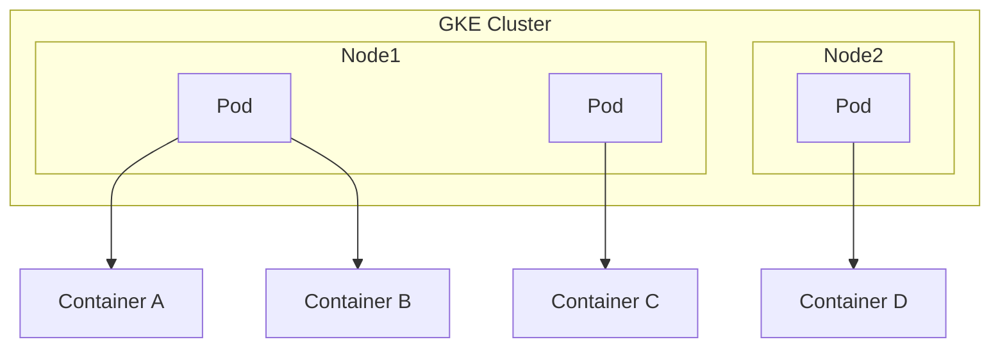
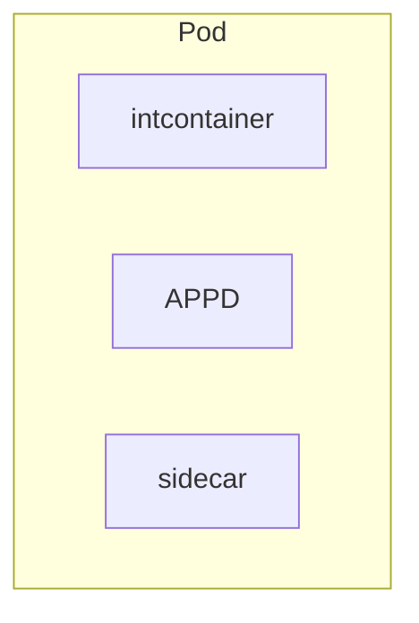
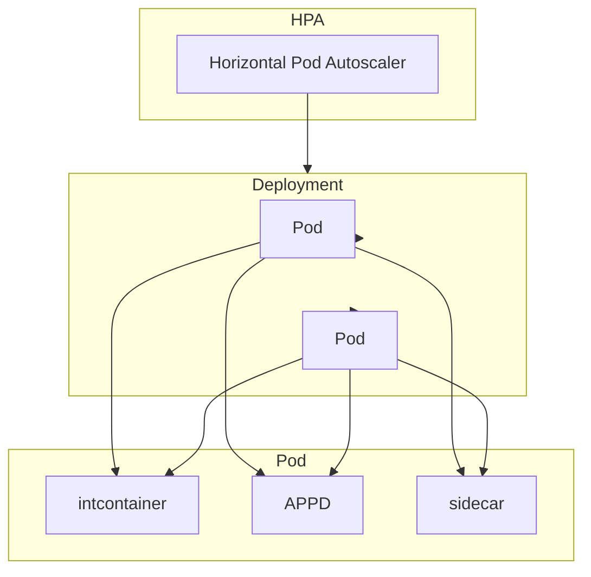

在Google Kubernetes Engine (GKE) 中，理解容器（Container）和Pod的概念对于正确计算成本和优化资源使用至关重要。

### 容器（Container）

容器是一个轻量级、可移植的运行时环境，用于打包应用程序及其依赖项。容器化技术确保应用程序可以在任何环境中一致地运行，无论是在本地、云端还是混合环境中。Docker是最常见的容器化工具。

### Pod

Pod是Kubernetes中最小的可部署单元。一个Pod可以包含一个或多个容器，这些容器共享相同的网络命名空间、存储和生命周期。Pod中的容器通常是紧密耦合的、需要共同工作和协作的应用程序组件。

#### 关键区别

- **容器**是单一的应用程序实例，独立运行并包含所有依赖。
- **Pod**是一个或多个容器的集合，提供共享的网络和存储环境，作为一个整体进行管理和调度。

### 计费考量

在GKE中，计费主要基于以下几个方面：

1. **节点（Node）**：GKE中的节点是Google Cloud VM实例，按CPU、内存和存储的使用情况收费。
2. **容器**：容器本身不直接产生费用，但它们运行在节点上，使用节点的资源，因此间接影响成本。
3. **Pod**：Pod的资源使用由其内的容器决定，最终影响节点的资源使用和费用。

要比较不同的费用，您可以考虑以下几点：

- **节点类型**：不同类型的VM实例（如n1-standard、e2-standard等）具有不同的定价。
- **自动缩放（Autoscaling）**：通过自动缩放节点池，确保只在需要时扩展或收缩节点数量，从而优化成本。
- **预留实例（Committed use contracts）**：通过预留实例，可以享受较低的长期使用费用。

### IntContainer

关于您提到的`intcontainer`，这个概念并不是标准的Kubernetes或GKE术语。假设这可能是您内部的一种特殊容器配置或命名约定，需要了解其具体定义才能提供更准确的指导。通常，容器配置会影响资源请求和限制，从而影响成本。确保优化容器的资源配置（CPU和内存请求/限制）以避免资源浪费和不必要的成本。

### 流程图示例

下面是一个示例流程图，展示Pod和容器的关系：



此流程图展示了一个GKE集群中的两个节点，每个节点包含多个Pod，每个Pod中包含一个或多个容器。

### 总结

在GKE中，容器和Pod是管理和调度应用程序的基本单元。通过理解和优化这些概念，可以更好地控制和管理资源成本。如果您有关于`intcontainer`的具体定义或更多详细信息，我可以提供更有针对性的建议和解释。


当然可以！下面是一个Kubernetes Deployment模板，其中包含一个Pod，Pod内包含多个容器，包括您提到的`intcontainer`和`APPD`容器。

### Deployment YAML 模板

```yaml
apiVersion: apps/v1
kind: Deployment
metadata:
  name: multi-container-deployment
spec:
  replicas: 3
  selector:
    matchLabels:
      app: multi-container-app
  template:
    metadata:
      labels:
        app: multi-container-app
    spec:
      containers:
      - name: intcontainer
        image: your-intcontainer-image:latest
        ports:
        - containerPort: 8080
        resources:
          requests:
            memory: "64Mi"
            cpu: "250m"
          limits:
            memory: "128Mi"
            cpu: "500m"
      - name: appd
        image: your-appd-image:latest
        ports:
        - containerPort: 9090
        resources:
          requests:
            memory: "128Mi"
            cpu: "500m"
          limits:
            memory: "256Mi"
            cpu: "1"
      - name: sidecar
        image: your-sidecar-image:latest
        ports:
        - containerPort: 7070
        resources:
          requests:
            memory: "32Mi"
            cpu: "100m"
          limits:
            memory: "64Mi"
            cpu: "200m"
```

### 解释

- **apiVersion**: 使用`apps/v1`，适用于Deployment。
- **kind**: 资源类型为`Deployment`。
- **metadata**: 定义Deployment的元数据，如名称。
- **spec**: Deployment的具体规范。
  - **replicas**: 定义Pod副本的数量，这里设置为3。
  - **selector**: 用于选择Pod的标签。
  - **template**: Pod的模板定义。
    - **metadata**: Pod的元数据标签。
    - **spec**: Pod的具体定义。
      - **containers**: 定义Pod内的多个容器。
        - **name**: 容器名称。
        - **image**: 容器镜像。
        - **ports**: 容器暴露的端口。
        - **resources**: 资源请求和限制。

### Mermaid 流程图

下面是一个示意性的Mermaid流程图，展示Pod内多个容器的结构：



这个流程图展示了一个Pod内包含的三个容器：`intcontainer`、`APPD`和`sidecar`。每个容器可以独立配置其资源请求和限制，以优化性能和成本。

### 总结

这个模板展示了如何定义一个包含多个容器的Pod，并通过合理的资源请求和限制，确保容器高效运行。如果您有更多具体需求或需要进一步优化资源配置，请提供更多详细信息。


在Kubernetes中，Horizontal Pod Autoscaler（HPA）可以根据CPU利用率或其他指标自动调整Pod的数量。HPA只管理Pod的数量，不会改变Pod内容器的数量或名称。下面是一个详细解释和一个示例模板，展示如何设置HPA和Deployment。

### Horizontal Pod Autoscaler（HPA）

HPA会根据所监控的指标（如CPU利用率）动态调整指定的Deployment、ReplicaSet或ReplicationController的副本数目。假设您希望Pod的数量在2到5之间，并基于CPU利用率进行扩展，下面是HPA的定义。

### Deployment YAML 模板

```yaml
apiVersion: apps/v1
kind: Deployment
metadata:
  name: multi-container-deployment
spec:
  replicas: 2
  selector:
    matchLabels:
      app: multi-container-app
  template:
    metadata:
      labels:
        app: multi-container-app
    spec:
      containers:
      - name: intcontainer
        image: your-intcontainer-image:latest
        ports:
        - containerPort: 8080
        resources:
          requests:
            memory: "64Mi"
            cpu: "250m"
          limits:
            memory: "128Mi"
            cpu: "500m"
      - name: appd
        image: your-appd-image:latest
        ports:
        - containerPort: 9090
        resources:
          requests:
            memory: "128Mi"
            cpu: "500m"
          limits:
            memory: "256Mi"
            cpu: "1"
      - name: sidecar
        image: your-sidecar-image:latest
        ports:
        - containerPort: 7070
        resources:
          requests:
            memory: "32Mi"
            cpu: "100m"
          limits:
            memory: "64Mi"
            cpu: "200m"
```

### HPA YAML 模板

```yaml
apiVersion: autoscaling/v2
kind: HorizontalPodAutoscaler
metadata:
  name: multi-container-hpa
spec:
  scaleTargetRef:
    apiVersion: apps/v1
    kind: Deployment
    name: multi-container-deployment
  minReplicas: 2
  maxReplicas: 5
  metrics:
  - type: Resource
    resource:
      name: cpu
      target:
        type: Utilization
        averageUtilization: 80
```

### 解释

- **Deployment**:
  - `replicas`：初始设置Pod副本数量为2。
  - `containers`：Pod中定义了多个容器，每个容器都有自己的名称、镜像和资源配置。

- **HPA**:
  - `scaleTargetRef`：指定要扩展的目标Deployment。
  - `minReplicas`：Pod的最小副本数量，设置为2。
  - `maxReplicas`：Pod的最大副本数量，设置为5。
  - `metrics`：基于CPU利用率进行扩展，目标平均CPU利用率为80%。

### Mermaid 流程图

下面是一个Mermaid流程图，展示Pod与HPA的关系：



这个流程图展示了HPA如何管理Deployment的Pod副本数，Deployment中的每个Pod包含多个容器。

### 总结

在Kubernetes中，HPA可以动态调整Pod的副本数量，但不会影响Pod内容器的配置或名称。Deployment和HPA配置文件分别管理Pod的定义和扩展策略。希望这些示例和解释对您有帮助。如果有其他具体需求或问题，请随时提出。

在Kubernetes中，Pod是资源调度的基本单元，而容器是运行在Pod内的应用程序实例。理解Pod和容器的数量关系对于管理资源和优化成本至关重要。下面是这些关系的详细解释：

### 数量关系

1. **Pod数量**：Pod的数量由Deployment中的`replicas`字段和HPA的配置共同决定。
2. **容器数量**：每个Pod中的容器数量是固定的，由Pod模板定义，不受HPA的直接影响。

### 详细解释

1. **Deployment和Pod的数量**：
    - Deployment定义了一个模板，包含多个容器。
    - Deployment的`replicas`字段指定了初始Pod副本数。
    - HPA根据监控的指标（如CPU利用率）动态调整Pod的数量。

2. **Pod和容器的数量**：
    - 每个Pod中的容器数量是固定的，在Pod模板中定义。
    - 无论Pod的数量如何变化，每个Pod中容器的数量保持不变。

### 示例场景

假设您有一个Deployment，初始`replicas`为2，并定义了包含3个容器（`intcontainer`、`APPD`、`sidecar`）的Pod。同时，您配置了HPA，允许Pod数量在2到5之间波动。

### Deployment YAML

```yaml
apiVersion: apps/v1
kind: Deployment
metadata:
  name: multi-container-deployment
spec:
  replicas: 2
  selector:
    matchLabels:
      app: multi-container-app
  template:
    metadata:
      labels:
        app: multi-container-app
    spec:
      containers:
      - name: intcontainer
        image: your-intcontainer-image:latest
      - name: appd
        image: your-appd-image:latest
      - name: sidecar
        image: your-sidecar-image:latest
```

### HPA YAML

```yaml
apiVersion: autoscaling/v2
kind: HorizontalPodAutoscaler
metadata:
  name: multi-container-hpa
spec:
  scaleTargetRef:
    apiVersion: apps/v1
    kind: Deployment
    name: multi-container-deployment
  minReplicas: 2
  maxReplicas: 5
  metrics:
  - type: Resource
    resource:
      name: cpu
      target:
        type: Utilization
        averageUtilization: 80
```

### 数量关系图示

```mermaid
graph TD
    subgraph HPA
        hpa[Horizontal Pod Autoscaler]
    end
    subgraph Deployment
        replicas[Replicas: 2-5]
        Pod1[Pod]
        Pod2[Pod]
        Pod3[Pod (if scaled up)]
        Pod4[Pod (if scaled up)]
        Pod5[Pod (if scaled up)]
    end
    subgraph Pod
        intcontainer[intcontainer]
        appd[APPD]
        sidecar[sidecar]
    end
    hpa --> Deployment
    replicas --> Pod1
    replicas --> Pod2
    replicas --> Pod3
    replicas --> Pod4
    replicas --> Pod5
    Pod1 --> intcontainer
    Pod1 --> appd
    Pod1 --> sidecar
    Pod2 --> intcontainer
    Pod2 --> appd
    Pod2 --> sidecar
    Pod3 --> intcontainer
    Pod3 --> appd
    Pod3 --> sidecar
    Pod4 --> intcontainer
    Pod4 --> appd
    Pod4 --> sidecar
    Pod5 --> intcontainer
    Pod5 --> appd
    Pod5 --> sidecar
```

### 解释

- **Deployment**：
  - 初始配置2个Pod（`replicas: 2`）。
  - 每个Pod包含3个容器：`intcontainer`、`APPD`、`sidecar`。
- **HPA**：
  - 监控CPU利用率，调整Pod数量在2到5之间。
  - 当负载增加时，HPA会增加Pod数量（最多到5个）。
  - 当负载减少时，HPA会减少Pod数量（最少到2个）。

### 总结

在这个配置中，容器数量和Pod数量的关系如下：
- 每个Pod包含固定数量的容器（在这个例子中是3个）。
- Pod数量由Deployment的`replicas`和HPA动态调整。
- 当Pod数量增加时，总体容器数量也会相应增加（每增加一个Pod，就增加3个容器）。

如果有更多具体需求或其他问题，请随时提出。


