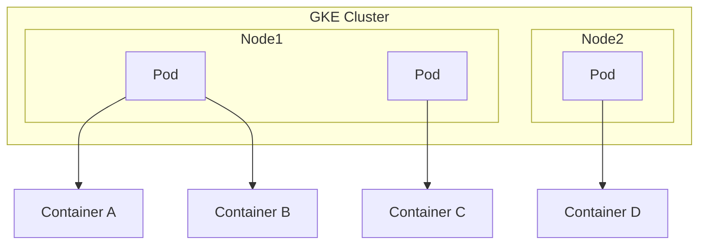

在Google Kubernetes Engine (GKE) 中，理解容器（Container）和Pod的概念对于正确计算成本和优化资源使用至关重要。

### 容器（Container）

容器是一个轻量级、可移植的运行时环境，用于打包应用程序及其依赖项。容器化技术确保应用程序可以在任何环境中一致地运行，无论是在本地、云端还是混合环境中。Docker是最常见的容器化工具。

### Pod

Pod是Kubernetes中最小的可部署单元。一个Pod可以包含一个或多个容器，这些容器共享相同的网络命名空间、存储和生命周期。Pod中的容器通常是紧密耦合的、需要共同工作和协作的应用程序组件。

#### 关键区别

- **容器**是单一的应用程序实例，独立运行并包含所有依赖。
- **Pod**是一个或多个容器的集合，提供共享的网络和存储环境，作为一个整体进行管理和调度。

### 计费考量

在GKE中，计费主要基于以下几个方面：

1. **节点（Node）**：GKE中的节点是Google Cloud VM实例，按CPU、内存和存储的使用情况收费。
2. **容器**：容器本身不直接产生费用，但它们运行在节点上，使用节点的资源，因此间接影响成本。
3. **Pod**：Pod的资源使用由其内的容器决定，最终影响节点的资源使用和费用。

要比较不同的费用，您可以考虑以下几点：

- **节点类型**：不同类型的VM实例（如n1-standard、e2-standard等）具有不同的定价。
- **自动缩放（Autoscaling）**：通过自动缩放节点池，确保只在需要时扩展或收缩节点数量，从而优化成本。
- **预留实例（Committed use contracts）**：通过预留实例，可以享受较低的长期使用费用。

### IntContainer

关于您提到的`intcontainer`，这个概念并不是标准的Kubernetes或GKE术语。假设这可能是您内部的一种特殊容器配置或命名约定，需要了解其具体定义才能提供更准确的指导。通常，容器配置会影响资源请求和限制，从而影响成本。确保优化容器的资源配置（CPU和内存请求/限制）以避免资源浪费和不必要的成本。

### 流程图示例

下面是一个示例流程图，展示Pod和容器的关系：

此流程图展示了一个GKE集群中的两个节点，每个节点包含多个Pod，每个Pod中包含一个或多个容器。

### 总结

在GKE中，容器和Pod是管理和调度应用程序的基本单元。通过理解和优化这些概念，可以更好地控制和管理资源成本。如果您有关于`intcontainer`的具体定义或更多详细信息，我可以提供更有针对性的建议和解释。