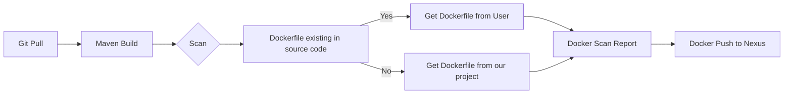
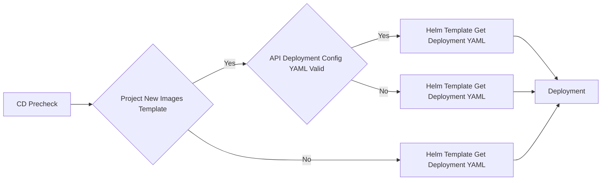
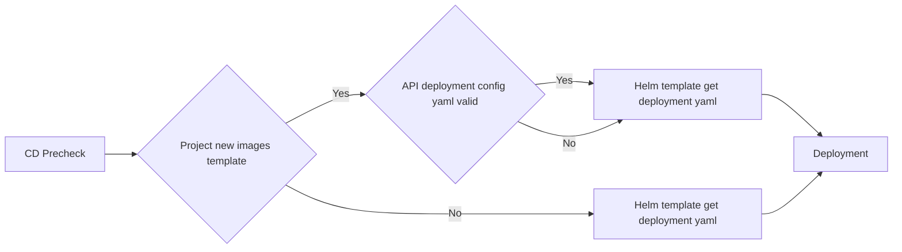
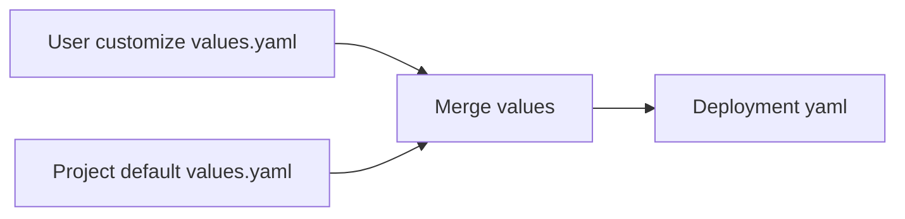

- [CI flow](#ci-flow)
  - [步骤解释](#步骤解释)
  - [流程总结](#流程总结)
- [CD flow](#cd-flow)
- [helm chart design](#helm-chart-design)
  - [about deployment](#about-deployment)
    - [详细流程说明](#详细流程说明)
    - [实现步骤](#实现步骤)
    - [项目默认 `values.yaml` 示例](#项目默认-valuesyaml-示例)
    - [用户自定义 `values.yaml` 示例](#用户自定义-valuesyaml-示例)
    - [`Deployment` 模板 (`deployment.yaml`)](#deployment-模板-deploymentyaml)
    - [合并后的 `values.yaml`](#合并后的-valuesyaml)
    - [最终生成的 `Deployment` YAML 示例](#最终生成的-deployment-yaml-示例)
    - [Helm 使用示例](#helm-使用示例)
- [pipeline 流程](#pipeline-流程)
    - [基础准备工作](#基础准备工作)
    - [CI/CD流水线步骤](#cicd流水线步骤)
      - [1. 设置CI/CD工具](#1-设置cicd工具)
      - [2. 编写CI部分](#2-编写ci部分)
      - [3. 编写CD部分](#3-编写cd部分)
    - [参考的完整GitHub Actions工作流示例](#参考的完整github-actions工作流示例)
    - [结论](#结论)

# CI flow

当然，这个Mermaid图描述了一个CI（持续集成）流程的各个步骤。以下是每个步骤的解释：


## 步骤解释

1. **Git Pull (A)**：
   - 从Git仓库拉取最新的源代码。这是CI流程的第一步，确保我们使用的是最新的代码版本。

2. **Maven Build (B)**：
   - 使用Maven构建工具编译和打包项目。此步骤将项目的源代码编译成可执行的格式，并生成相应的构建产物（如JAR文件）。

3. **Scan (C)**：
   - 进行代码扫描，这里可能包括静态代码分析、安全扫描、依赖库扫描等。这一步是为了确保代码质量和安全性。

4. **Dockerfile existing in source code (D)**：
   - 检查项目源代码中是否存在Dockerfile文件。Dockerfile定义了如何构建Docker镜像。
   - 是一个决策点，如果存在Dockerfile则走“Yes”路径，如果不存在则走“No”路径。

5. **Get Dockerfile from User (E)**：
   - 如果源代码中存在Dockerfile，从用户提供的源代码中获取Dockerfile进行镜像构建。

6. **Get Dockerfile from our project (F)**：
   - 如果源代码中不存在Dockerfile，则使用项目中预定义的Dockerfile进行镜像构建。

7. **Docker Scan Report (G)**：
   - 对构建的Docker镜像进行安全扫描，生成扫描报告。这一步是为了确保生成的镜像没有已知的安全漏洞。

8. **Docker Push to Nexus (H)**：
   - 将经过扫描和验证的Docker镜像推送到Nexus仓库。Nexus是一个仓库管理器，用于存储和分发构建产物，包括Docker镜像。

## 流程总结

- **Git拉取代码**：开始从Git仓库获取最新的源代码。
- **Maven构建**：对项目进行编译和打包。
- **代码扫描**：对构建产物和源代码进行质量和安全扫描。
- **检查Dockerfile**：决定使用哪个Dockerfile进行镜像构建，是用户提供的还是项目默认的。
- **Docker镜像构建**：根据Dockerfile构建Docker镜像。
- **Docker镜像扫描**：对镜像进行安全扫描，确保没有已知的安全漏洞。
- **推送Docker镜像**：将扫描通过的Docker镜像推送到Nexus仓库进行存储和分发。

这个流程保证了项目代码从开发到生成Docker镜像并存储的整个过程都受到严格的控制和验证，确保质量和安全性。

# CD flow 




这个Mermaid图描述了以下的CD流程：

1. **CD Precheck**：进行CD前的预检查。
2. **Project new images template**：检查项目是否有新的镜像模板。
    - 如果有（Yes），则检查**API deployment config yaml valid**。
        - 如果配置有效（Yes），则获取Helm模板的部署yaml。
        - 如果配置无效（No），则仍然获取Helm模板的部署yaml。
    - 如果没有（No），直接获取Helm模板的部署yaml。
3. 最终，获取到的部署yaml进行**Deployment**。

你可以将上述代码粘贴到支持Mermaid的Markdown编辑器或在线Mermaid渲染工具中查看效果。
# helm chart design 

1. user customize values.yaml
2. project default values.yaml

3. merged user values.yaml and project default values.yaml ==> Deployment yaml 


## about deployment 

1. Deployment yaml
2. Service yaml
3. hpa yaml


- deployment.yaml

```yaml
apiVersion: apps/v1
kind: Deployment

initContainers:
  - name: init
    image: busybox
    command: ['sh', '-c', 'echo hello']
    volumeMounts:
      - name: config
        mountPath: /etc/config
  containers:
  - name: {{ .Values.container.name }}
    image: {{ .Values.container.image }}
    ports:
    - containerPort: {{ .Values.container.port }}
    volumeMounts:
      - name: config
        mountPath: /etc/config
  volumes:
    - name: config
      configMap:
        name: {{ .Values.configMap.name }}

```

根据你的描述，以下是一个Helm Chart设计流程图，描述了如何将用户自定义的`values.yaml`与项目默认的`values.yaml`合并生成`Deployment.yaml`：



### 详细流程说明

1. **User customize values.yaml**：用户自定义的 `values.yaml` 文件，包含特定于用户的配置。
2. **Project default values.yaml**：项目默认的 `values.yaml` 文件，包含默认配置。
3. **Merge values**：将用户自定义的 `values.yaml` 与项目默认的 `values.yaml` 进行合并，生成最终的 `values.yaml` 配置。
4. **Deployment yaml**：使用合并后的 `values.yaml` 文件，生成最终的 `Deployment.yaml` 文件，用于部署。

### 实现步骤

1. **准备用户自定义的 `values.yaml` 文件**：
    - 用户提供的 `values.yaml` 文件，通常位于用户的本地或指定目录。

2. **准备项目默认的 `values.yaml` 文件**：
    - 项目自带的 `values.yaml` 文件，通常位于Helm Chart的根目录中。

3. **合并 `values.yaml` 文件**：
    - Helm 自动将用户提供的 `values.yaml` 与项目默认的 `values.yaml` 进行合并。用户的配置优先级更高，覆盖默认配置。

4. **生成 `Deployment.yaml` 文件**：
    - 使用Helm模板引擎，根据合并后的 `values.yaml` 文件生成最终的Kubernetes资源清单，包括 `Deployment.yaml`。


好的，下面是一个参考的 `Deployment` YAML 文件示例，其中包含了定义在 `values.yaml` 中的两个工程级别的 `initContainers`。假设这两个 `initContainers` 分别是 `app-dynamic-init` 和 `verification-init`。

### 项目默认 `values.yaml` 示例

首先，定义项目默认的 `values.yaml`，其中包含两个 `initContainers` 的配置：

```yaml
# values.yaml
initContainers:
  - name: app-dynamic-init
    image: busybox
    command: ['sh', '-c', 'echo Initializing app dynamic settings...']
  - name: verification-init
    image: busybox
    command: ['sh', '-c', 'echo Verifying pre-requisites...']
```

### 用户自定义 `values.yaml` 示例

用户可以提供自定义的 `values.yaml`，覆盖默认配置或者添加新的配置：

```yaml
# custom-values.yaml
replicaCount: 2
image:
  repository: my-app
  tag: latest
  pullPolicy: IfNotPresent
```

### `Deployment` 模板 (`deployment.yaml`)

这是一个 Helm `Deployment` 模板，包含了 `initContainers` 的配置：

```yaml
apiVersion: apps/v1
kind: Deployment
metadata:
  name: {{ .Release.Name }}
  labels:
    app: {{ .Chart.Name }}
spec:
  replicas: {{ .Values.replicaCount }}
  selector:
    matchLabels:
      app: {{ .Chart.Name }}
  template:
    metadata:
      labels:
        app: {{ .Chart.Name }}
    spec:
      initContainers:
        {{- range .Values.initContainers }}
        - name: {{ .name }}
          image: {{ .image }}
          command: {{ .command }}
        {{- end }}
      containers:
        - name: {{ .Chart.Name }}
          image: "{{ .Values.image.repository }}:{{ .Values.image.tag }}"
          imagePullPolicy: {{ .Values.image.pullPolicy }}
          ports:
            - containerPort: 80
```

### 合并后的 `values.yaml`

Helm 会将用户自定义的 `values.yaml` 和项目默认的 `values.yaml` 合并，生成最终的 `Deployment` 文件。

### 最终生成的 `Deployment` YAML 示例

假设用户提供了 `custom-values.yaml`，Helm 将会根据合并后的配置生成如下 `Deployment` YAML：

```yaml
apiVersion: apps/v1
kind: Deployment
metadata:
  name: my-release
  labels:
    app: my-chart
spec:
  replicas: 2
  selector:
    matchLabels:
      app: my-chart
  template:
    metadata:
      labels:
        app: my-chart
    spec:
      initContainers:
        - name: app-dynamic-init
          image: busybox
          command:
            - sh
            - -c
            - echo Initializing app dynamic settings...
        - name: verification-init
          image: busybox
          command:
            - sh
            - -c
            - echo Verifying pre-requisites...
      containers:
        - name: my-chart
          image: "my-app:latest"
          imagePullPolicy: IfNotPresent
          ports:
            - containerPort: 80
```

### Helm 使用示例

使用 Helm 部署时，将项目默认的 `values.yaml` 和用户自定义的 `values.yaml` 一起提供：

```sh
helm install my-release -f values.yaml -f custom-values.yaml ./my-chart
```

这样，Helm 会自动将默认配置和用户配置合并，生成包含两个 `initContainers` 的 `Deployment` YAML。


# pipeline 流程
要通过一个CI/CD流水线（pipeline）实现上述所有的CI和CD逻辑，需要以下几个关键步骤和基础工作：

### 基础准备工作

1. **版本控制系统 (VCS)**：
   - 确保你的代码存储在一个版本控制系统中，如GitHub、GitLab或Bitbucket。

2. **CI/CD工具**：
   - 选择并设置一个CI/CD工具，如Jenkins、GitLab CI、GitHub Actions、Travis CI等。

3. **构建工具**：
   - 确保项目使用Maven或其他构建工具，并且构建文件（如`pom.xml`）已正确配置。

4. **容器化**：
   - 编写Dockerfile并确保它们在项目中正确配置。
   - 创建并配置一个容器注册表（如Docker Hub、Nexus、Harbor等）来存储构建的镜像。

5. **Kubernetes集群**：
   - 配置并部署一个Kubernetes集群。
   - 安装并配置Helm来管理Kubernetes应用。

6. **模板准备**：
   - 准备Helm Chart模板，包含项目的Kubernetes资源定义。
   - 准备项目的默认`values.yaml`文件和用户自定义的`values.yaml`文件。

### CI/CD流水线步骤

以下是一个示例的CI/CD流水线步骤，包括CI和CD的所有逻辑：

#### 1. 设置CI/CD工具

在你的CI/CD工具中配置一个新的流水线项目或工作流。

#### 2. 编写CI部分

1. **Git Pull**：
   - 从Git仓库拉取最新代码。
   ```yaml
   - name: Checkout code
     uses: actions/checkout@v2
   ```

2. **Maven Build**：
   - 使用Maven编译和打包项目。
   ```yaml
   - name: Build with Maven
     run: mvn clean package
   ```

3. **代码扫描**：
   - 使用工具（如SonarQube、Snyk等）对代码进行扫描。
   ```yaml
   - name: Run SonarQube scan
     uses: sonarsource/sonarcloud-github-action@master
     with:
       projectKey: your_project_key
       organization: your_organization
   ```

4. **检查Dockerfile**：
   - 判断Dockerfile是否存在于源码中。
   ```yaml
   - name: Check for Dockerfile
     id: dockerfile-check
     run: |
       if [ -f ./Dockerfile ]; then
         echo "dockerfile=true" >> $GITHUB_ENV
       else
         echo "dockerfile=false" >> $GITHUB_ENV
       fi
   ```

5. **获取Dockerfile**：
   - 根据检查结果选择适当的Dockerfile。
   ```yaml
   - name: Copy Dockerfile
     if: env.dockerfile == 'false'
     run: cp ./default/Dockerfile .
   ```

6. **Docker镜像构建和扫描**：
   - 构建Docker镜像并进行安全扫描。
   ```yaml
   - name: Build Docker image
     run: docker build -t your-image-name:latest .

   - name: Scan Docker image
     uses: anchore/scan-action@v2
     with:
       image: your-image-name:latest
   ```

7. **推送Docker镜像到Nexus**：
   - 推送构建的Docker镜像到Nexus或其他容器注册表。
   ```yaml
   - name: Push Docker image to Nexus
     run: |
       echo "${{ secrets.NEXUS_PASSWORD }}" | docker login -u "${{ secrets.NEXUS_USERNAME }}" --password-stdin nexus.example.com
       docker tag your-image-name:latest nexus.example.com/your-repo/your-image-name:latest
       docker push nexus.example.com/your-repo/your-image-name:latest
   ```

#### 3. 编写CD部分

1. **CD Precheck**：
   - 进行CD前的预检查。
   ```yaml
   - name: CD Precheck
     run: echo "Performing CD precheck..."
   ```

2. **检查新镜像模板**：
   - 检查是否有新的镜像模板。
   ```yaml
   - name: Check new image template
     id: image-template-check
     run: echo "Checking for new image template..."
   ```

3. **API配置验证和获取Helm模板**：
   - 验证API部署配置，并根据结果获取Helm模板的部署yaml。
   ```yaml
   - name: Validate API deployment config
     id: api-config-validation
     run: |
       if [ -f ./api-config.yaml ]; then
         echo "api_config_valid=true" >> $GITHUB_ENV
       else
         echo "api_config_valid=false" >> $GITHUB_ENV
       fi

   - name: Get Helm template
     run: |
       if [ "${{ env.api_config_valid }}" == "true" ]; then
         helm template get deployment yaml --values ./api-config.yaml
       else
         helm template get deployment yaml --values ./default-values.yaml
       fi
   ```

4. **Deployment**：
   - 使用Helm部署到Kubernetes。
   ```yaml
   - name: Deploy to Kubernetes
     run: helm upgrade --install your-release-name ./your-chart --values ./values.yaml
   ```

### 参考的完整GitHub Actions工作流示例

以下是一个完整的GitHub Actions工作流示例：

```yaml
name: CI/CD Pipeline

on:
  push:
    branches:
      - main

jobs:
  build:
    runs-on: ubuntu-latest
    steps:
      - name: Checkout code
        uses: actions/checkout@v2

      - name: Build with Maven
        run: mvn clean package

      - name: Run SonarQube scan
        uses: sonarsource/sonarcloud-github-action@master
        with:
          projectKey: your_project_key
          organization: your_organization

      - name: Check for Dockerfile
        id: dockerfile-check
        run: |
          if [ -f ./Dockerfile ]; then
            echo "dockerfile=true" >> $GITHUB_ENV
          else
            echo "dockerfile=false" >> $GITHUB_ENV
          fi

      - name: Copy Dockerfile
        if: env.dockerfile == 'false'
        run: cp ./default/Dockerfile .

      - name: Build Docker image
        run: docker build -t your-image-name:latest .

      - name: Scan Docker image
        uses: anchore/scan-action@v2
        with:
          image: your-image-name:latest

      - name: Push Docker image to Nexus
        run: |
          echo "${{ secrets.NEXUS_PASSWORD }}" | docker login -u "${{ secrets.NEXUS_USERNAME }}" --password-stdin nexus.example.com
          docker tag your-image-name:latest nexus.example.com/your-repo/your-image-name:latest
          docker push nexus.example.com/your-repo/your-image-name:latest

      - name: CD Precheck
        run: echo "Performing CD precheck..."

      - name: Check new image template
        id: image-template-check
        run: echo "Checking for new image template..."

      - name: Validate API deployment config
        id: api-config-validation
        run: |
          if [ -f ./api-config.yaml ]; then
            echo "api_config_valid=true" >> $GITHUB_ENV
          else
            echo "api_config_valid=false" >> $GITHUB_ENV
          fi

      - name: Get Helm template
        run: |
          if [ "${{ env.api_config_valid }}" == "true" ]; then
            helm template get deployment yaml --values ./api-config.yaml
          else
            helm template get deployment yaml --values ./default-values.yaml
          fi

      - name: Deploy to Kubernetes
        run: helm upgrade --install your-release-name ./your-chart --values ./values.yaml
```

### 结论

通过以上步骤，你可以构建一个完整的CI/CD流水线，包括代码拉取、构建、扫描、Docker镜像管理以及最终的Kubernetes部署。这些步骤涵盖了从代码提交到最终部署的整个过程，确保代码的质量和安全性，同时实现自动化的持续交付。
