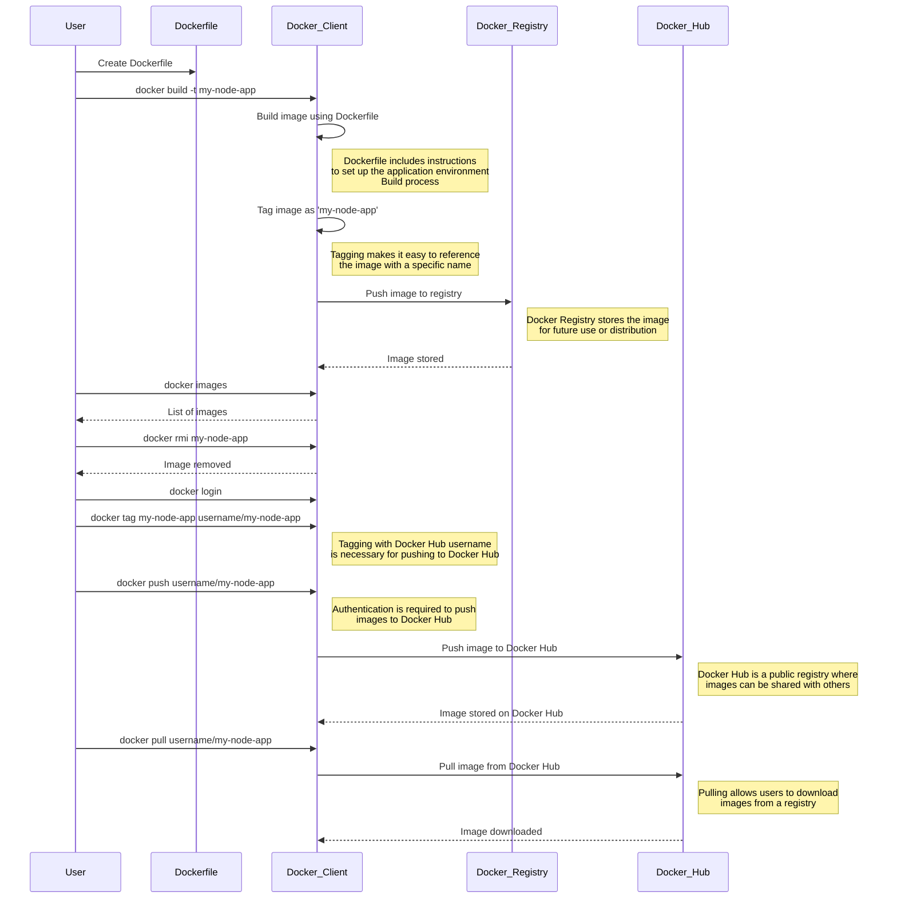

```mermaid
sequenceDiagram
    participant User
    participant Dockerfile
    participant Docker_Client
    participant Docker_Registry
    participant Docker_Hub

    User->>Dockerfile: Create Dockerfile
    User->>Docker_Client: docker build -t my-node-app
    Docker_Client->>Docker_Client: Build image using Dockerfile
    note right of Docker_Client: Dockerfile includes instructions<br/>to set up the application environment<br/>Build process
    Docker_Client->>Docker_Client: Tag image as 'my-node-app'
    note right of Docker_Client: Tagging makes it easy to reference<br/>the image with a specific name
    Docker_Client->>Docker_Registry: Push image to registry
    note right of Docker_Registry: Docker Registry stores the image<br/>for future use or distribution
    Docker_Registry-->>Docker_Client: Image stored
    User->>Docker_Client: docker images
    Docker_Client-->>User: List of images
    User->>Docker_Client: docker rmi my-node-app
    Docker_Client-->>User: Image removed
    User->>Docker_Client: docker login
    User->>Docker_Client: docker tag my-node-app username/my-node-app
    note right of Docker_Client: Tagging with Docker Hub username<br/>is necessary for pushing to Docker Hub
    User->>Docker_Client: docker push username/my-node-app
    note right of Docker_Client: Authentication is required to push<br/>images to Docker Hub
    Docker_Client->>Docker_Hub: Push image to Docker Hub
    note right of Docker_Hub: Docker Hub is a public registry where<br/>images can be shared with others
    Docker_Hub-->>Docker_Client: Image stored on Docker Hub
    User->>Docker_Client: docker pull username/my-node-app
    Docker_Client->>Docker_Hub: Pull image from Docker Hub
    note right of Docker_Hub: Pulling allows users to download<br/>images from a registry
    Docker_Hub-->>Docker_Client: Image downloaded
```
