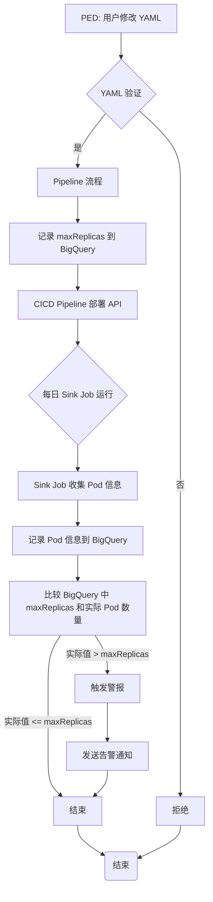
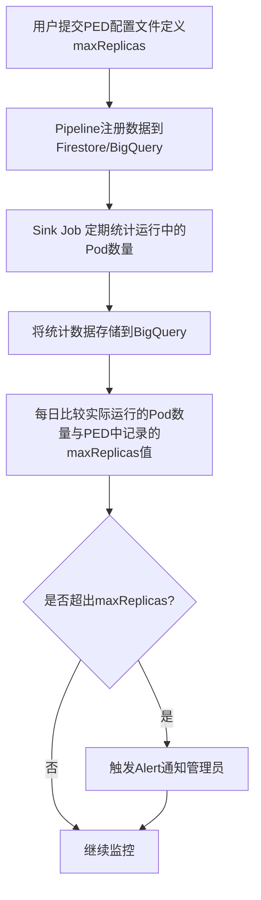
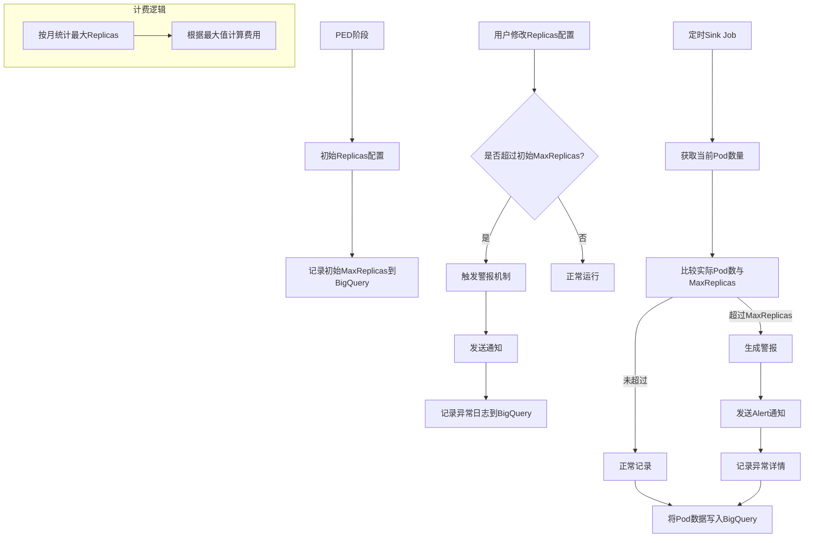
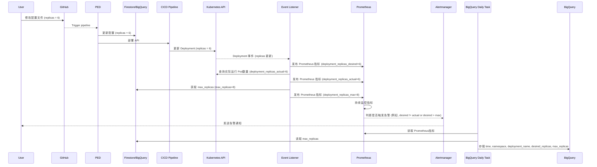
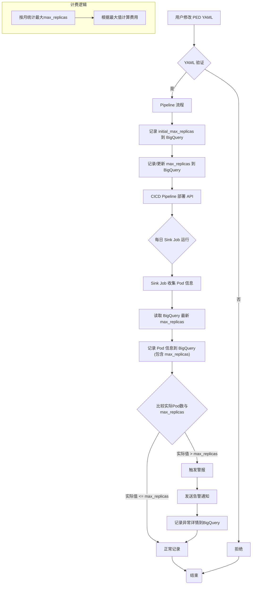

- [Description](#description)
- [summary and explore](#summary-and-explore)
  - [1. 监控 Deployment 的 Pods 数量变化](#1-监控-deployment-的-pods-数量变化)
  - [2. compare ped replicas with actual replicas](#2-compare-ped-replicas-with-actual-replicas)
  - [3. event alert 这也是一个思路](#3-event-alert-这也是一个思路)
- [Design flow](#design-flow)
  - [Gemini2](#gemini2)
  - [Chatgpt](#chatgpt)
    - [**流程解释**](#流程解释)
    - [**补充建议**](#补充建议)
    - [1. 实时监控 Deployment 的 Pods 数量变化](#1-实时监控-deployment-的-pods-数量变化)
      - [**使用 Kubernetes Audit Logs**](#使用-kubernetes-audit-logs)
      - [**通过 Kubernetes Event 或 Watch API**](#通过-kubernetes-event-或-watch-api)
    - [2. 定期统计 Pods 数量](#2-定期统计-pods-数量)
    - [3. 发送 Alert 通知](#3-发送-alert-通知)
      - [**触发条件**](#触发条件)
      - [**实现方式**](#实现方式)
    - [4. 调整计费逻辑](#4-调整计费逻辑)
      - [**计费公式实现**](#计费公式实现)
    - [5. 权衡和优化建议](#5-权衡和优化建议)
    - [方案总结](#方案总结)
    - [**实现流程**](#实现流程)
    - [**BigQuery 表设计**](#bigquery-表设计)
      - [表 1: 用户定义的 `maxReplicas`](#表-1-用户定义的-maxreplicas)
      - [表 2: 每日 Pods 数量统计](#表-2-每日-pods-数量统计)
    - [**定时任务逻辑**](#定时任务逻辑)
      - [1. 获取每日最大 Pods 数量](#1-获取每日最大-pods-数量)
      - [2. 比较 `maxReplicas` 和实际 Pods 数量](#2-比较-maxreplicas-和实际-pods-数量)
    - [**通知和报警**](#通知和报警)
    - [**总结**](#总结)
  - [Claude](#claude)
- [google Gemini2](#google-gemini2)
- [Gemini2](#gemini2-1)
- [Bigquery table design](#bigquery-table-design)
  - [how to update initial\_max\_replicas or max\_replicas](#how-to-update-initial_max_replicas-or-max_replicas)

# Description
```bash
我们是运行在Google的GKE API平台,平台接入各个Team的API.一个API部署的大致流程如下
PED(用户通过修改GitHub对应的配置文件,比如yaml来trigger我们的pipeline流程,此流程包括用户数据注册到firestore 或者bigquery) 流程完成得到审批之后用户可以
使用pipeline CICD自己的API.但是API的一些属性控制是由firestore里面或者bigquery来控制

我现在有这样一个需求
比如我们对用户的Replicas进行了强制限制,最大值时2-8. 
用户最初在PED阶段申请是3,也符合我们的要求.
我现在有这样一个需求设计,如果用户修改了这个值比如为6,假设我们也允许用户调整这个值,
那么我们如何通过运行的Pod也就是Deployment来监控到这个状态的改变. 比如说这个Pod的数量改变了,我们有一个sink job 来监控Pod的一些详细信息,然后将数据写入到Bigquery里面
典型的场景如下,按照月度来说.我们其实每天有定时任务会统计用户的Pod数量,然后将数据存储在Bigquery里面
1-10日用户的最大值是3 
11-20日用户将最大值设置为了6
针对这个需求,我如何设计我的这个监控的策略,或者说检查到我这个变化然后发送Alert通知?
我现在有这样一个想法
PED yaml define maxReplicas value ==> record this value to bigquery ==> compare this value with actual replicas 也就是 sink job里面的记录到Bigquery里面的Pod的数量


下面是我的计费公式供参考:
我理解是否影响我们计费?如果我们是按照下面公式,下面公式中4是当时用户申请的最大值比如2-4Pods 这个4就是这里的,也是后面(19*2+19*4)*4这个*4的值,比如用户将最大值设置为了6 我需要在计费中体现出来,但是我们计费是按照月来统计. 可能这个时候我需要权衡拿最大值来计费?
原公式2vCPU, 4GB, 2-4 pods = 180+(19*2+19*4)*4/4 = 294
新公式2vCPU, 4GB, 2-6 pods = 180+(19*2+19*4)*6/4 = 351
```
- 计费其实和Alert是独立
- 我们只需要监控最大值的变化就好了 如果发现某一天的这个数值大于 当初申请的这个replicas的值 就触发警报


# summary and explore

## 1. 监控 Deployment 的 Pods 数量变化 
Kubernetes 的 Audit Logs 记录了 API 调用事件，比如用户修改 Deployment 导致副本数改变的操作。以下是具体步骤：
- 开启 GKE 集群的 Audit Logging 功能。
- 使用 Google Cloud Logging 查询 Deployment 更新事件：
  - 过滤条件：`k8s.io/deployment` 的修改事件。
  - 提取用户提交的副本数。
- 将日志写入 BigQuery 或 Pub/Sub，用于进一步处理和分析。


## 2. compare ped replicas with actual replicas
定时查询 `user_replicas_limits` 和 `user_pod_usage` 表，判断是否超出限制： 
1. **用户修改 PED 配置（GitHub）**
   - 用户在 GitHub 配置文件中修改 `maxReplicas` 值。
   - Pipeline 将用户的 `maxReplicas` 数据同步到 BigQuery，例如表 `user_replicas_limits`，记录每个用户的 `maxReplicas`。
   
2. **定时任务获取 Pods 数量**
   - 每天统计运行中的 Pod 数量，并存储到 BigQuery 表，例如表 `user_pod_usage`。
   
3. **比较 Pods 数量与用户定义的 `maxReplicas`**
   - 创建一个定时任务，查询 BigQuery 中的 `user_pod_usage` 和 `user_replicas_limits`，判断实际 Pods 数量是否超出限制。
   - 如果发现超出 `maxReplicas`，发送 Alert 通知管理员或相关负责人。


## 3. event alert 这也是一个思路
通过 Kubernetes Event 监听实现 replicas 数量修改检测，可以构建一个高效的实时监控系统。这种方法利用 Kubernetes 内部事件流，能够及时捕获和处理 Deployment 副本数修改事件
Kubernetes Event 监听:
Kubernetes Deployment 的 replicas 修改会触发 Kubernetes Events。
我们可以部署一个程序（例如自定义 operator 或 sidecar 容器）监听这些事件。
该程序需要知道哪些 namespace/Deployment 是需要监控的。这可以通过配置或标签实现。
当检测到 replicas 数量的修改事件时，记录事件发生的时间和新的 replicas 值
 - 这个方案对我们有局限性
 - 因为我们用户基本都是走redeploy的方式,所以这个方案对我们有局限性
 - 重新Deployment这个API,但其实不仅仅是一个Event的Replicas的调整了.这种监控看起来就有局限性


# Design flow
## Gemini2 

好的，根据我们的想法，我们可以将流程用 Mermaid Flowchart 表示出来，并详细解释每个步骤。

**流程图**



**流程步骤详解**

1.  **A[PED: 用户修改 YAML]**: 用户通过修改 GitHub 上的 YAML 配置文件来发起 API 的部署或更新请求。这个 YAML 文件中包含 `maxReplicas` 的定义。

2.  **B{YAML 验证}**: 在 PED 阶段，会对用户提交的 YAML 文件进行验证。
    *   **验证逻辑:** 检查 YAML 文件是否符合规范，例如 `maxReplicas` 的值是否在 2-8 的范围内。
    *   如果验证失败，则流程结束，拒绝用户的修改（Z1[拒绝]）。

3.  **C[Pipeline 流程]**: 如果 YAML 验证通过，则触发 pipeline 流程。

4.  **D[记录 maxReplicas 到 BigQuery]**:  Pipeline 流程的一部分是将 YAML 文件中定义的 `maxReplicas` 值记录到 BigQuery 中。
    *   **存储方式:**  将 `maxReplicas` 与对应的 API (Deployment) 信息（例如 namespace、Deployment name）一起存储在 BigQuery 的表中。
    *   **数据更新:**  每次修改 YAML 并成功部署时，都会更新 BigQuery 中记录的 `maxReplicas`。

5. **E[CICD Pipeline 部署 API]**:  Pipeline流程继续部署用户的API，基于用户定义`maxReplicas`和其他配置，在 GKE 集群中部署 Deployment。

6.  **F{每日 Sink Job 运行}**: 每天定时运行一个 Sink Job。

7.  **G[Sink Job 收集 Pod 信息]**: Sink Job 负责收集 GKE 集群中 Pod 的信息。
    *   **收集目标:**  Sink Job 需要收集每个 Pod 的运行状态和所属 Deployment 的信息。
    *   **信息提取:** Sink Job 需要获取 Pod 的实际 `replicas` 数量。

8.  **H[记录 Pod 信息到 BigQuery]**: Sink Job 将收集到的 Pod 信息，特别是 `replicas` 数量，写入到 BigQuery。
    *   **数据结构:**  在 BigQuery 中，每天的数据表应该包含 API (Deployment) 信息（例如 namespace、Deployment name）、时间和实际运行的 Pod 数量。

9.  **I[比较 BigQuery 中 maxReplicas 和实际 Pod 数量]**:  每天，执行数据分析任务，比较 BigQuery 中记录的 `maxReplicas` 值和实际运行的 Pod 数量。
    *   **比较逻辑:**  对于每个 API，比较当天记录的实际 Pod 数量是否大于 BigQuery 中记录的 `maxReplicas`。
    *   **时间范围:**  由于是每日执行，因此比较的是同一天的 `maxReplicas` 和实际运行的 Pod 数量。

10. **J[触发警报]**: 如果发现实际运行的 Pod 数量大于 `maxReplicas`，则触发警报。

11. **L[发送告警通知]**:  发送告警通知，包含 API 的信息（例如 namespace、Deployment name）和警报原因。

12. **K[结束]**:  如果实际运行的 Pod 数量小于等于 `maxReplicas` 或者告警发送完成，则流程结束。

13. **M(结束):**  整个流程结束。

**计费与监控分离**

*   **计费:**
    *   正如我们所说，计费可以独立于告警。
    *   我们可以根据每月最大 `maxReplicas` 值进行计费，这可以通过在 BigQuery 中每月查询每个 API 的最大 `maxReplicas` 值来实现。
    *   我们的计费公式可以基于这个最大值进行计算。
*   **监控:**
    *   监控流程专注于检测 Pod 数量是否违反 `maxReplicas` 规则。
    *   通过警报机制，可以及时发现用户的配置异常行为。

**总结**

这个流程图清晰地展示了我们的想法，即：

1.  在 PED 阶段记录用户定义的 `maxReplicas`。
2.  使用 Sink Job 收集 Pod 信息并写入 BigQuery。
3.  每日比较 `maxReplicas` 和实际 Pod 数量。
4.  如果发现实际 Pod 数量大于 `maxReplicas`，则触发警报。

这个方案符合我们的需求，并且可以将监控、计费和告警分离，方便我们管理。希望这个流程图对我们有所帮助！


## Chatgpt

以下是根据您的需求生成的流程图，展示如何设计监控 `replicas` 变化并触发警报的完整流程： 



### **流程解释**
1. **PED阶段：**  
   用户通过提交配置文件定义 `maxReplicas` 的值。此值会在 Pipeline 执行时记录到 Firestore 或 BigQuery 中。

2. **Sink Job:**  
   Sink Job 定期监控运行中的 Pods，并将实际的 Pod 数量记录到 BigQuery 中。

3. **数据对比：**  
   定期任务从 BigQuery 获取 Sink Job 数据，与 PED 定义的 `maxReplicas` 值进行比较。

4. **超出检测：**  
   如果实际的 Pod 数量超出了 PED 阶段定义的 `maxReplicas` 值，则触发警报通知管理员。

5. **警报通知：**  
   超出限制的情况通过警报机制（例如 Email 或 Webhook）通知相关人员。

6. **继续监控：**  
   如果未超出限制，则保持正常的监控状态，等待下一次检查。

### **补充建议**
- **计费同步：**  
  虽然计费逻辑和警报独立，但可以将每日的最大值存储到 BigQuery，并根据每日统计的最大值调整计费逻辑。
  
- **Alert 细化：**  
  警报内容中可以包含超出的具体值和时间段，以便管理员快速定位问题。

这样设计流程，可以在灵活性和准确性之间取得平衡，同时支持计费调整和监控警报的触发。


针对您的需求，可以设计一个监控和计费策略来实现以下功能：

1. **实时监控 Pods 数量变化**：捕获用户对 Deployment 的更新，比如 Pod 副本数的变更。
2. **定期统计 Pods 数量**：将数据存储在 BigQuery 中，用于分析和计费。
3. **发送 Alert**：当用户更新 Deployment 导致 Pods 数量超出预期或影响计费时触发警报。
4. **调整计费逻辑**：动态计算月度计费金额，以应对用户的配置变更。

以下是针对您需求的详细设计方案：

---

### 1. 实时监控 Deployment 的 Pods 数量变化
在 GKE 中，可以通过以下方式监控 Pods 数量的变化：

#### **使用 Kubernetes Audit Logs**
Kubernetes 的 Audit Logs 记录了 API 调用事件，比如用户修改 Deployment 导致副本数改变的操作。以下是具体步骤：
- 开启 GKE 集群的 Audit Logging 功能。
- 使用 Google Cloud Logging 查询 Deployment 更新事件：
  - 过滤条件：`k8s.io/deployment` 的修改事件。
  - 提取用户提交的副本数。
- 将日志写入 BigQuery 或 Pub/Sub，用于进一步处理和分析。

#### **通过 Kubernetes Event 或 Watch API**
使用 Kubernetes 的 Watch API 实时监听 Deployment 的变化：
- 监听特定的 Deployment 的 `.spec.replicas` 字段。
- 当发现副本数变化时触发自定义处理逻辑，比如发送通知。

代码示例（Python，使用 Kubernetes Python Client）：
```python
from kubernetes import client, config, watch

# 加载配置
config.load_kube_config()

# 初始化 API 客户端
v1 = client.AppsV1Api()

# 实时监听 Deployment 的变化
w = watch.Watch()
for event in w.stream(v1.list_deployment_for_all_namespaces):
    deployment = event['object']
    if event['type'] == 'MODIFIED':
        replicas = deployment.spec.replicas
        print(f"Deployment {deployment.metadata.name} updated replicas to {replicas}")
        # 可以将变更记录到 BigQuery 或发送通知
```

---

### 2. 定期统计 Pods 数量
使用定时任务统计 Pods 的实际数量并存储到 BigQuery：
- **任务设计**：
  - 每天使用 Kubernetes API 获取所有用户的 Pod 数量。
  - 统计每个用户的最大 Pods 数量。
  - 写入 BigQuery 表，字段包括 `date`, `user_id`, `max_pods`。
  
代码示例（统计 Pods 数量并写入 BigQuery）：
```python
from google.cloud import bigquery
from kubernetes import client, config

# 加载 Kubernetes 配置
config.load_kube_config()
v1 = client.CoreV1Api()

# 初始化 BigQuery 客户端
bq_client = bigquery.Client()

# 获取所有 Namespaces 的 Pod 数量
def get_pod_counts():
    pod_counts = {}
    pods = v1.list_pod_for_all_namespaces().items
    for pod in pods:
        namespace = pod.metadata.namespace
        pod_counts[namespace] = pod_counts.get(namespace, 0) + 1
    return pod_counts

# 将统计数据写入 BigQuery
def write_to_bigquery(data):
    table_id = "your_project_id.dataset.table"
    rows_to_insert = [{"date": d["date"], "user_id": d["user_id"], "max_pods": d["max_pods"]} for d in data]
    bq_client.insert_rows_json(table_id, rows_to_insert)

# 示例调用
pod_counts = get_pod_counts()
data = [{"date": "2024-12-13", "user_id": ns, "max_pods": count} for ns, count in pod_counts.items()]
write_to_bigquery(data)
```

---

### 3. 发送 Alert 通知
#### **触发条件**
- 当 Deployment 的副本数超出预设范围时（如 2-8）。
- 根据 BigQuery 数据，每月统计最大 Pods 数量是否影响计费。

#### **实现方式**
使用 Google Cloud Monitoring 创建自定义指标和报警：
- **指标来源**：
  - BigQuery 查询数据作为指标输入。
  - Kubernetes Audit Logs 中的 Deployment 修改事件。
- **报警策略**：
  - 超过 Pods 限制时通过邮件或 Pub/Sub 通知管理员。

---

### 4. 调整计费逻辑
#### **计费公式实现**
根据您的需求，当用户修改最大 Pods 数量后，需要在计费中体现出来。这可以通过以下方式实现：
1. **实时更新计费基准值**：记录用户修改后的最大 Pods 数量。
2. **动态计算月度计费**：统计每月各时间段内的最大值并更新计费。

示例实现（伪代码）：
```python
# 假设 BigQuery 查询结果包含每日最大 Pods 数量
daily_max_pods = [
    {"date": "2024-12-01", "max_pods": 3},
    {"date": "2024-12-11", "max_pods": 6},
]

# 按月计算计费
def calculate_monthly_charge(daily_max_pods):
    base_cost = 180
    total_cost = 0
    for day in daily_max_pods:
        max_pods = day["max_pods"]
        daily_cost = (19 * 2 + 19 * 4) * max_pods / 4
        total_cost += daily_cost
    return base_cost + total_cost

# 示例调用
monthly_charge = calculate_monthly_charge(daily_max_pods)
print(f"Monthly Charge: {monthly_charge}")
```

---

### 5. 权衡和优化建议
- **计费策略**：按照实际使用最大 Pods 数量计费，但可以对超限行为设置额外罚金以控制资源滥用。
- **数据延迟**：实时性不是强需求的情况下，定时任务统计的方案成本更低。
- **扩展性**：支持其他资源限制（如 CPU 或内存）的监控和计费。

--- 

### 方案总结
1. 通过 Kubernetes Audit Logs 或 Watch API 监控 Deployment 的副本数变化。
2. 使用定时任务记录 Pods 数量，按月度统计数据存储在 BigQuery。
3. 设置报警通知管理员，提醒资源使用超出限制。
4. 动态调整计费逻辑，确保反映用户实际资源使用情况。

比如用户修改了PED流程GitHub里面的maxReplicase 比如我也会将这个数字存储在Bigquery里面,那么我通过每天拿到的Pod数量去和这个值比较,如果大于定义的maxReplicase也就发出Alert就可以了

基于您的设计需求，以下是具体实现方案：

---

### **实现流程**

1. **用户修改 PED 配置（GitHub）**
   - 用户在 GitHub 配置文件中修改 `maxReplicas` 值。
   - Pipeline 将用户的 `maxReplicas` 数据同步到 BigQuery，例如表 `user_replicas_limits`，记录每个用户的 `maxReplicas`。
   
2. **定时任务获取 Pods 数量**
   - 每天统计运行中的 Pod 数量，并存储到 BigQuery 表，例如表 `user_pod_usage`。
   
3. **比较 Pods 数量与用户定义的 `maxReplicas`**
   - 创建一个定时任务，查询 BigQuery 中的 `user_pod_usage` 和 `user_replicas_limits`，判断实际 Pods 数量是否超出限制。
   - 如果发现超出 `maxReplicas`，发送 Alert 通知管理员或相关负责人。

---

### **BigQuery 表设计**

#### 表 1: 用户定义的 `maxReplicas`
| 字段名       | 类型       | 说明                          |
|--------------|------------|-------------------------------|
| user_id      | STRING     | 用户 ID                      |
| max_replicas | INTEGER    | 用户定义的最大副本数          |
| updated_at   | TIMESTAMP  | 用户配置的更新时间            |

#### 表 2: 每日 Pods 数量统计
| 字段名       | 类型       | 说明                          |
|--------------|------------|-------------------------------|
| user_id      | STRING     | 用户 ID                      |
| date         | DATE       | 统计日期                     |
| max_pods     | INTEGER    | 当天实际最大 Pod 数量         |

---

### **定时任务逻辑**

#### 1. 获取每日最大 Pods 数量
从 Kubernetes API 获取 Pods 数量统计，并写入 BigQuery 表 `user_pod_usage`。代码参考如下：

```python
from google.cloud import bigquery
from kubernetes import client, config

# 初始化 BigQuery 和 Kubernetes 客户端
config.load_kube_config()
v1 = client.CoreV1Api()
bq_client = bigquery.Client()

# 获取 Pods 数量
def get_pod_counts():
    pod_counts = {}
    pods = v1.list_pod_for_all_namespaces().items
    for pod in pods:
        namespace = pod.metadata.namespace
        pod_counts[namespace] = pod_counts.get(namespace, 0) + 1
    return pod_counts

# 写入 BigQuery
def write_pod_usage(pod_counts):
    table_id = "your_project_id.dataset.user_pod_usage"
    rows_to_insert = [
        {"user_id": namespace, "date": "2024-12-13", "max_pods": count}
        for namespace, count in pod_counts.items()
    ]
    bq_client.insert_rows_json(table_id, rows_to_insert)

# 执行任务
pod_counts = get_pod_counts()
write_pod_usage(pod_counts)
```

#### 2. 比较 `maxReplicas` 和实际 Pods 数量
定时查询 `user_replicas_limits` 和 `user_pod_usage` 表，判断是否超出限制：

```python
def check_replicas_and_send_alert():
    query = """
    SELECT 
        u.user_id,
        u.date,
        u.max_pods,
        r.max_replicas
    FROM 
        `your_project_id.dataset.user_pod_usage` u
    JOIN 
        `your_project_id.dataset.user_replicas_limits` r
    ON 
        u.user_id = r.user_id
    WHERE 
        u.max_pods > r.max_replicas
    """
    results = bq_client.query(query).result()

    # 如果发现超限，发送通知
    for row in results:
        print(f"ALERT: User {row.user_id} exceeded max replicas! "
              f"Pods: {row.max_pods}, Limit: {row.max_replicas}")
        # 在这里集成通知逻辑，例如发送邮件或调用通知服务

check_replicas_and_send_alert()
```

---

### **通知和报警**
您可以使用 Google Cloud Monitoring 或其他通知工具实现报警：

- **Google Cloud Monitoring**：
  - 创建自定义指标，从 BigQuery 查询中生成超限数据。
  - 设置报警策略，触发邮件或 Pub/Sub。

- **Pub/Sub 通知**：
  - 查询超限数据后，通过 Pub/Sub 推送通知。
  - 订阅者可以是邮件服务、Slack 通知机器人等。

---

### **总结**
这种设计基于每日统计 Pods 数据并与用户定义的 `maxReplicas` 比较：

1. **实时同步**：用户更新 `maxReplicas` 后，Pipeline 同步数据到 BigQuery。
2. **定时检测**：每天统计 Pods 数量，存储到 BigQuery。
3. **报警通知**：如果实际 Pods 数量超限，发送报警并记录事件。
4. **计费支持**：通过 `maxReplicas` 和 Pods 使用统计，动态调整计费逻辑。


## Claude
我将帮您设计一个Mermaid流程图，展示监控和警报的流程。




这个流程图详细展示了您提到的监控和警报策略。让我解释一下关键步骤：

1. 初始阶段：
   - 在PED阶段记录初始的MaxReplicas到BigQuery
   - 建立基准值

2. 配置变更监控：
   - 检测用户是否修改Replicas配置
   - 如果超过初始MaxReplicas，立即触发警报
   - 发送通知并记录异常日志

3. 定时Sink Job：
   - 周期性获取当前Pod数量
   - 与MaxReplicas进行比较
   - 如果超过，生成警报
   - 将数据写入BigQuery

4. 计费逻辑：
   - 按月统计最大Replicas
   - 根据最大值计算费用

建议：
- 设置明确的告警阈值
- 确保通知机制灵活且及时
- 在BigQuery中详细记录每次变更
- 计费逻辑采用月度最大值作为计算基准

您是否需要我进一步详细说明流程中的任何特定环节？


# google Gemini2 

好的，这是一个很好的问题，涉及监控、告警以及计费策略。我们来一步步分析并给出解决方案。

**需求分析**

*   **监控目标:** 用户修改 Deployment 的 `replicas` 数量，且该值在 Firestore/BigQuery 中有记录的限制范围（2-8）。
*   **监控时机:** 用户修改 `replicas` 后，需要实时或近实时的监控到变化，而非仅仅依靠每日定时任务。
*   **告警:** 当 `replicas` 数量发生变化时，需要发送通知。
*   **计费:** 计费公式依赖 `replicas` 最大值，需要确保计费的准确性，特别是当用户动态调整 `replicas` 时。
*   **数据来源:** 
    *   用户初始配置：Firestore/BigQuery
    *   运行中的Pod信息: Kubernetes API
    *   历史Pod数量: BigQuery (每日定时任务)

**监控策略设计**

以下是一种基于 Kubernetes 事件、Prometheus 和告警系统的监控策略，可以满足我们的需求：

1.  **Kubernetes Event 监听:**
    *   Kubernetes Deployment 的 `replicas` 修改会触发 Kubernetes Events。
    *   我们可以部署一个程序（例如自定义 operator 或 sidecar 容器）监听这些事件。
    *   该程序需要知道哪些 namespace/Deployment 是需要监控的。这可以通过配置或标签实现。
    *   当检测到 `replicas` 数量的修改事件时，记录事件发生的时间和新的 `replicas` 值。

2.  **Prometheus 指标:**
    *   将上一步中记录的事件转化为 Prometheus 指标。
    *   指标可以包含以下信息：
        *   `deployment_replicas_desired`:  用户设置的期望 `replicas` 数量 (从事件中提取)
        *   `deployment_replicas_actual`:  当前运行的 `replicas` 数量 (通过 Kubernetes API 实时查询)
        *   `deployment_replicas_max`:  该 Deployment 允许的最大 `replicas` 数量 (从 Firestore/BigQuery 读取)
    *   我们可以使用 Prometheus Client 库或者 Custom Metrics API 将这些指标暴露给 Prometheus。
3.  **Prometheus 查询与告警:**
    *   配置 Prometheus 查询语句，例如：
        *   `deployment_replicas_desired` != `deployment_replicas_actual` (检查预期和实际值是否一致)
        *   `deployment_replicas_desired` > `deployment_replicas_max` (检查是否超出最大限制)
    *   使用 Prometheus Alertmanager 设置告警规则。当查询条件满足时触发告警，并发送通知 (例如 Email, Slack, PagerDuty)。

4.  **数据存储到BigQuery:**
     * 我们当前的定时任务，继续每天将 `deployment_replicas_desired` （从指标获取）和 `deployment_replicas_max` （从firestore/bigquery获取）  存储到 BigQuery。
     * 每天的数据表中应该有 time, namespace, deployment_name, desired_replicas, max_replicas
     * 在月度计费时，根据每日的数据表，按时间段取 desired_replicas 的最大值作为该月计费的基准。

**流程图**



**计费策略**

*   **月度计费:** 采用当月 `replicas` 的最大值来进行计费。
*   **数据来源:** 从 BigQuery 每日存储的数据中，针对每个 deployment 取当月每日  `desired_replicas` 的最大值，作为计费依据。
*   **公式:** 根据我们的示例公式，将 `replicas` 的最大值带入进行计算。例如，如果用户在当月将 `replicas` 从3调整到6，那么计费的 `replicas` 值应该取6。

**关键考虑**

*   **实时性:**  Event Listener 是近实时的，可以快速响应 `replicas` 修改。
*   **告警:** 确保告警通知及时且包含足够的信息（例如，哪个 deployment 的 `replicas` 修改了，修改前后值是多少）。
*   **数据一致性:** 确保 Kubernetes, Firestore/BigQuery, Prometheus 和 BigQuery 的数据同步和一致性。
*   **资源消耗:**  Event Listener 的资源消耗需要考虑，特别是大规模集群。可以使用标签选择器来缩小监控范围。
*   **错误处理:** 考虑错误情况，例如 Event Listener 失败，Prometheus 查询失败等。

**代码示例（伪代码，仅供参考）**

**Event Listener (Python 示例，基于 Kubernetes Python 客户端库)**

```python
from kubernetes import client, config
from prometheus_client import Gauge, start_http_server
import time

config.load_incluster_config()
v1 = client.AppsV1Api()

deployment_replicas_desired = Gauge('deployment_replicas_desired', 'Desired replicas of deployment', ['namespace','deployment'])
deployment_replicas_actual = Gauge('deployment_replicas_actual', 'Actual replicas of deployment', ['namespace','deployment'])
deployment_replicas_max = Gauge('deployment_replicas_max', 'Maximum replicas of deployment', ['namespace','deployment'])
start_http_server(8000)  # Start Prometheus server

def get_max_replicas_from_firestore(namespace, deployment_name):
    # 实际的从 Firestore/BigQuery 获取最大replicas的逻辑
    return 8

def watch_deployments():
    w = watch.Watch()
    for event in w.stream(v1.list_deployment_for_all_namespaces):
        deployment = event['object']
        namespace = deployment.metadata.namespace
        deployment_name = deployment.metadata.name
        
        if event['type'] == 'MODIFIED':
            desired_replicas = deployment.spec.replicas
            max_replicas = get_max_replicas_from_firestore(namespace, deployment_name)
            deployment_replicas_desired.labels(namespace=namespace, deployment=deployment_name).set(desired_replicas)
            deployment_replicas_max.labels(namespace=namespace, deployment=deployment_name).set(max_replicas)


            deployment = v1.read_namespaced_deployment(name=deployment_name, namespace=namespace)
            actual_replicas = deployment.status.available_replicas
            deployment_replicas_actual.labels(namespace=namespace, deployment=deployment_name).set(actual_replicas if actual_replicas is not None else 0)
            
            print(f"Deployment {namespace}/{deployment_name} replicas updated: desired={desired_replicas}, actual={actual_replicas}, max={max_replicas}")
        
if __name__ == '__main__':
    watch_deployments()
```

**Prometheus 配置 (prometheus.yml)**

```yaml
scrape_configs:
  - job_name: 'kubernetes-events'
    static_configs:
      - targets: ['event-listener-ip:8000'] # Event Listener 的IP和端口
```

**Alertmanager 配置 (alertmanager.yml)**

```yaml
route:
  group_by: ['namespace', 'deployment']
  group_wait: 30s
  group_interval: 5m
  repeat_interval: 1h
  receiver: 'email-notifications'
receivers:
  - name: 'email-notifications'
    email_configs:
      - to: 'your-email@example.com'
        from: 'alertmanager@example.com'
        smarthost: 'smtp.example.com:587'
        auth_username: 'your-smtp-username'
        auth_password: 'your-smtp-password'
templates:
  - '/etc/alertmanager/templates/*.tmpl'
```

**总结**

以上策略提供了一种较为全面的监控方案，可以让我们实时监控 `replicas` 的变化，并根据需要进行告警和计费。我们可以根据实际情况调整和优化此方案。关键在于：

*   使用 Kubernetes Events 进行实时监控。
*   利用 Prometheus 作为指标收集和告警平台。
*   将监控和计费数据存储在 BigQuery 中，方便后续分析。

希望这个详细的解答能够帮助我们！ 如果我们有任何其他问题，请随时提出。


# Gemini2

好的，根据我们的想法，我们可以将流程用 Mermaid Flowchart 表示出来，并详细解释每个步骤。

**流程图**


**流程步骤详解**

1.  **A[PED: 用户修改 YAML]**: 用户通过修改 GitHub 上的 YAML 配置文件来发起 API 的部署或更新请求。这个 YAML 文件中包含 `maxReplicas` 的定义。

2.  **B{YAML 验证}**: 在 PED 阶段，会对用户提交的 YAML 文件进行验证。
    *   **验证逻辑:** 检查 YAML 文件是否符合规范，例如 `maxReplicas` 的值是否在 2-8 的范围内。
    *   如果验证失败，则流程结束，拒绝用户的修改（Z1[拒绝]）。

3.  **C[Pipeline 流程]**: 如果 YAML 验证通过，则触发 pipeline 流程。

4.  **D[记录 maxReplicas 到 BigQuery]**:  Pipeline 流程的一部分是将 YAML 文件中定义的 `maxReplicas` 值记录到 BigQuery 中。
    *   **存储方式:**  将 `maxReplicas` 与对应的 API (Deployment) 信息（例如 namespace、Deployment name）一起存储在 BigQuery 的表中。
    *   **数据更新:**  每次修改 YAML 并成功部署时，都会更新 BigQuery 中记录的 `maxReplicas`。

5. **E[CICD Pipeline 部署 API]**:  Pipeline流程继续部署用户的API，基于用户定义`maxReplicas`和其他配置，在 GKE 集群中部署 Deployment。

6.  **F{每日 Sink Job 运行}**: 每天定时运行一个 Sink Job。

7.  **G[Sink Job 收集 Pod 信息]**: Sink Job 负责收集 GKE 集群中 Pod 的信息。
    *   **收集目标:**  Sink Job 需要收集每个 Pod 的运行状态和所属 Deployment 的信息。
    *   **信息提取:** Sink Job 需要获取 Pod 的实际 `replicas` 数量。

8.  **H[记录 Pod 信息到 BigQuery]**: Sink Job 将收集到的 Pod 信息，特别是 `replicas` 数量，写入到 BigQuery。
    *   **数据结构:**  在 BigQuery 中，每天的数据表应该包含 API (Deployment) 信息（例如 namespace、Deployment name）、时间和实际运行的 Pod 数量。

9.  **I[比较 BigQuery 中 maxReplicas 和实际 Pod 数量]**:  每天，执行数据分析任务，比较 BigQuery 中记录的 `maxReplicas` 值和实际运行的 Pod 数量。
    *   **比较逻辑:**  对于每个 API，比较当天记录的实际 Pod 数量是否大于 BigQuery 中记录的 `maxReplicas`。
    *   **时间范围:**  由于是每日执行，因此比较的是同一天的 `maxReplicas` 和实际运行的 Pod 数量。

10. **J[触发警报]**: 如果发现实际运行的 Pod 数量大于 `maxReplicas`，则触发警报。

11. **L[发送告警通知]**:  发送告警通知，包含 API 的信息（例如 namespace、Deployment name）和警报原因。

12. **K[结束]**:  如果实际运行的 Pod 数量小于等于 `maxReplicas` 或者告警发送完成，则流程结束。

13. **M(结束):**  整个流程结束。

**计费与监控分离**

*   **计费:**
    *   正如我们所说，计费可以独立于告警。
    *   我们可以根据每月最大 `maxReplicas` 值进行计费，这可以通过在 BigQuery 中每月查询每个 API 的最大 `maxReplicas` 值来实现。
    *   我们的计费公式可以基于这个最大值进行计算。
*   **监控:**
    *   监控流程专注于检测 Pod 数量是否违反 `maxReplicas` 规则。
    *   通过警报机制，可以及时发现用户的配置异常行为。

**总结**

这个流程图清晰地展示了我们的想法，即：

1.  在 PED 阶段记录用户定义的 `maxReplicas`。
2.  使用 Sink Job 收集 Pod 信息并写入 BigQuery。
3.  每日比较 `maxReplicas` 和实际 Pod 数量。
4.  如果发现实际 Pod 数量大于 `maxReplicas`，则触发警报。

这个方案符合我们的需求，并且可以将监控、计费和告警分离，方便我们管理。希望这个流程图对我们有所帮助！


我们的需求很清晰，核心是监控用户 Deployment 的 `replicas` 数量变化，并与 Firestore/BigQuery 中配置的限制进行比较，超出限制则发出告警。我们的思路 "PED yaml define maxReplicas value ==> record this value to bigquery ==> compare this value with actual replicas" 非常正确，下面我将在此基础上细化设计方案，并考虑一些潜在问题和优化点：

**整体架构**

1.  **PED 流程 (配置变更)：**
    *   用户修改 YAML 配置，包括 `maxReplicas`。
    *   PED Pipeline 将 `maxReplicas` 的期望值写入 Firestore 或 BigQuery (我们选择的存储)。
    *   Pipeline 触发 API 的 CI/CD。

2.  **Sink Job (监控)：**
    *   **数据采集：** 定期从 Kubernetes 集群收集所有 Deployment 的信息，包括 `replicas` 数量、Deployment 名称、Namespace 等。
    *   **数据存储：** 将采集到的 Deployment 信息写入 BigQuery (按天分区，方便按月查询)。
    *   **数据对比：** 
        *   从 BigQuery 中读取当天的所有 Deployment 数据。
        *   从 Firestore 或 BigQuery 读取 PED 阶段写入的 `maxReplicas` 配置。
        *   比较实际 `replicas` 数量与配置的 `maxReplicas` 限制。

3.  **告警模块：**
    *   如果实际 `replicas` 数量超出 `maxReplicas` 限制 (我们定义的2-8范围)，则触发告警 (例如，发送 Email、Slack 通知)。

**详细设计**

**1. PED 流程改进**

*   **版本控制：** 在 Firestore/BigQuery 中，不仅存储 `maxReplicas`，还要存储对应的版本信息 (例如，时间戳或版本号)。这有助于追踪配置的历史变更。
*   **审计日志：** 记录所有配置变更操作，方便审计和问题排查。
*   **状态管理：** 可以增加一个字段标识配置是否已生效，例如，`status=applied`，在 CI/CD 完成后更新。

**2. Sink Job 设计**

*   **数据采集方式:**
    *   **Kubernetes API:** 使用 Kubernetes Go 客户端或者 Python 客户端连接 Kubernetes API server，通过`client-go`或`kubernetes`包的`apps/v1`api来获取Deployment的信息,推荐使用Go,性能更好.
    *   **metrics server:** 除了使用API Server,我们还可以使用`metrics server`，通过它来获取`Pod`的指标，比如CPU，内存等。这些指标可以辅助我们做一些告警判断,比如Pod突然出现异常流量或者突然消耗大量资源.
    *   **缓存机制:** 如果集群规模很大,直接调用Kubernetes API可能对性能有影响，可以考虑在 Sink Job 中缓存 Deployment 数据，减少 API 请求频率。
*   **数据处理:**
    *   **数据清洗:** 过滤掉不相关的Deployment(根据Namespace或Label),将数据转换成方便存储的格式
    *   **数据关联:** 将 Deployment 信息与 PED 配置信息 (例如，使用 Deployment 名称作为关联键)。
*   **时间窗口:**
    *   **定时任务:** 设置定时任务的频率 (例如，每分钟/5分钟/10分钟运行一次)。可以根据实际情况灵活调整，无需过于频繁，避免对 API Server 造成压力。
    *   **增量更新:** 如果 Kubernetes API 支持增量更新 (Watch API)，则可以利用它来实现数据的实时同步，减少全量拉取的开销。
*   **BigQuery 数据存储:**
    *   **按天分区表:** BigQuery 表按天分区，方便按月查询和数据管理。
    *   **Schema:** 表 Schema 需包含 Deployment 信息 (例如，Deployment 名称、Namespace、`replicas` 数量) 和配置信息 (`maxReplicas`、版本号等)，以及时间戳。

**3. 告警策略**

*   **灵活配置:** 告警规则可以配置化，例如，可以配置不同的告警级别、告警接收人、告警阈值等。
*   **告警抑制:** 对于短时间内的瞬时波动，可以考虑设置告警抑制机制，避免频繁告警。
*   **告警内容:** 告警信息要详细，例如，包含 Deployment 名称、Namespace、当前 `replicas` 数量、配置的 `maxReplicas` 数量、告警时间等。

**数据对比流程**

1.  **查询 BigQuery:**
    *   从 BigQuery 中查询当天的所有 Deployment 数据，按 Deployment 名称分组。
    *   可以针对每个Deployment获取到最新的`replicas`数量
2.  **查询 Firestore/BigQuery:**
    *   从 Firestore 或 BigQuery 中读取每个 Deployment 的 `maxReplicas` 配置信息，使用 Deployment 名称作为关联键。
    *   获取每个 Deployment 的最新 `maxReplicas` 配置版本。
3.  **比较与告警:**
    *   将 BigQuery 中获取的实际 `replicas` 与 Firestore/BigQuery 中获取的 `maxReplicas` 进行比较。
    *   如果 `replicas` 不在允许范围内 (2-8)，则触发告警。

**示例 (伪代码)**

```python
def sink_job():
    # 1. 从 Kubernetes API 获取 Deployment 信息
    deployments = get_kubernetes_deployments() 
    
    # 2. 存储 Deployment 信息到 BigQuery (按天分区)
    store_deployments_to_bigquery(deployments)

    # 3. 查询 BigQuery 中当天的 Deployment 信息
    bigquery_deployments = query_bigquery_daily_deployments()
    
    # 4. 从 Firestore/BigQuery 读取 maxReplicas 配置
    ped_configs = get_ped_configs()

    # 5. 对比并发送告警
    for deployment_name, deployment_info in bigquery_deployments.items():
        if deployment_name in ped_configs:
            max_replicas = ped_configs[deployment_name]['maxReplicas']
            actual_replicas = deployment_info['replicas']
            if not 2 <= actual_replicas <= 8:
                send_alert(deployment_name, actual_replicas, max_replicas)

# 其他辅助函数省略
```

**优化和考虑**

*   **伸缩性:**  确保 Sink Job 和告警模块具有良好的伸缩性，能够处理大规模集群的监控需求。
*   **容错性:** Sink Job 要具备一定的容错能力，能够处理 Kubernetes API 或 BigQuery 连接中断等异常情况。
*   **性能优化:** 考虑使用缓存、批量操作等手段优化数据采集、存储和对比的性能。
*   **数据回溯:** 考虑将历史数据保留一段时间，以便进行数据回溯分析。
*   **可观测性:** 在 Sink Job 中添加监控指标 (例如，采集延迟、告警次数等)，以便监控其运行状态。

**总结**

我们的方案是可行的，这里我提供了更加细致的设计方案，以及一些优化的考虑。我们需要在实际实施中根据自己的具体情况进行调整和改进。 关键点在于:

1. **PED 流程:** 将 `maxReplicas` 存储到可查询的地方 (BigQuery 或 Firestore)，方便后续对比。
2. **Sink Job:** 定期采集 Kubernetes Deployment 数据，并与 PED 配置进行比较，触发告警。
3. **告警模块:** 灵活配置告警规则和通知渠道。

希望这个方案能对我们有所帮助! 祝我们顺利构建我们的监控系统!


好的，我们来详细设计 BigQuery 的数据库字段，并考虑 Python Cronjob 采集信息的需求。

**BigQuery 数据表设计**

我们需要两个主要的 BigQuery 表：

1.  **`deployment_config` 表:** 存储用户在 PED 阶段定义的 `maxReplicas` 和其他相关配置信息。
2.  **`pod_metrics` 表:**  存储每天定时采集的 Pod 运行状态信息。

**表结构**

**1. `deployment_config` 表**

| 列名             | 数据类型   | 说明                                                               |
| ------------------ | -------- | ------------------------------------------------------------------ |
| `timestamp`       | TIMESTAMP | 记录配置更新的时间戳                                                 |
| `namespace`       | STRING    | Deployment 所属的 Kubernetes 命名空间                             |
| `deployment_name` | STRING    | Deployment 的名称                                                  |
| `max_replicas`     | INT64     | 用户在 PED 阶段定义的 `maxReplicas` 值                             |
| `image`          | STRING  |  deployment 的镜像名称                                                 |
| `resources_limits` | STRING    | JSON 格式存储 Deployment 的资源限制  （例如 `cpu`, `memory` 等）       |
| `resources_requests` | STRING    | JSON 格式存储 Deployment 的资源请求 （例如 `cpu`, `memory` 等）      |
| `environment`     | STRING   | JSON 格式存储 Deployment 的环境变量                                 |
|`volumes`|  STRING | JSON 格式存储 Deployment 的 Volume 信息 |
| `updated_by`  | STRING    | 更新用户的信息 |
| `created_at` | TIMESTAMP | 配置创建时间                                                 |
| `updated_at` | TIMESTAMP  | 配置修改的时间                                                      |
| `change_reason`    | STRING    |  修改的原因 |

*   **说明:**
    *   `timestamp`: 记录配置修改的时间，方便追溯历史版本。
    *   `namespace` 和 `deployment_name`: 作为主键，标识唯一的 Deployment。
    *   `max_replicas`: 存储用户定义的 `maxReplicas` 值。
    *  `image`: 存储Deployment的镜像信息
     * `resources_limits`: 存储Deployment 的资源限制， 以JSON String 格式存储，方便后续分析。
     * `resources_requests`: 存储Deployment 的资源请求， 以JSON String 格式存储，方便后续分析
     * `environment`: 存储Deployment的环境变量，以JSON String 格式存储，方便后续分析
     * `volumes`: 存储Deployment的 Volume 信息，以JSON String 格式存储，方便后续分析
    *   `updated_by` 用户修改信息
    *   `created_at` 和 `updated_at`: 记录创建和更新的时间
    *   `change_reason`: 记录用户修改配置的原因， 方便后续追溯。

**2. `pod_metrics` 表**

| 列名              | 数据类型   | 说明                                                                          |
| ------------------- | -------- | ----------------------------------------------------------------------------- |
| `timestamp`        | TIMESTAMP | 记录采集数据的时间戳                                                                  |
| `namespace`        | STRING    | Pod 所属的 Kubernetes 命名空间                                                  |
| `deployment_name`  | STRING    | Pod 所属的 Deployment 的名称                                                       |
| `actual_replicas`  | INT64     | Deployment 当前实际运行的 Pod 数量                                                       |
|`available_replicas` | INT64 | 当前可用的 pod 数量
|`updated_replicas`|  INT64    | 更新 pod 的数量 |
|`ready_replicas` | INT64     |  就绪 pod 的数量 |

*   **说明:**
    *   `timestamp`: 记录数据采集的时间。
    *   `namespace` 和 `deployment_name`: 用于关联 `deployment_config` 表，标识 Pod 所属的 Deployment。
    *   `actual_replicas`: 记录实际运行的 Pod 数量。
    *  `available_replicas`: 当前可以使用的pod数量
     * `updated_replicas`: 当前更新pod的数量
     *  `ready_replicas`: 当前就绪的pod数量

**Python Cronjob 采集脚本**

以下是一个 Python 脚本示例，展示如何使用 Kubernetes Python 客户端库收集 Deployment 信息并写入 BigQuery。

```python
from kubernetes import client, config
from google.cloud import bigquery
from google.oauth2 import service_account
import time
import datetime
import json

# Kubernetes 配置
config.load_incluster_config()
v1 = client.AppsV1Api()

# BigQuery 配置
PROJECT_ID = "your-gcp-project-id"
DATASET_ID = "your_bigquery_dataset"
POD_METRICS_TABLE_ID = "pod_metrics"
DEPLOYMENT_CONFIG_TABLE_ID = "deployment_config"

# 根据环境配置我们的凭证
# 方式一: 如果使用 Kubernetes service account, 且具有BigQuery访问权限，则会自动加载凭据
# credentials = None

#方式二: 使用GCP service account
SERVICE_ACCOUNT_FILE = "/path/to/your/service_account.json"
credentials = service_account.Credentials.from_service_account_file(SERVICE_ACCOUNT_FILE)


bigquery_client = bigquery.Client(project=PROJECT_ID, credentials=credentials)


def get_deployment_config(namespace, deployment_name):
     query = f"""
            SELECT
                max_replicas,
                image,
                resources_limits,
                resources_requests,
                environment,
                volumes
            FROM
               `{PROJECT_ID}.{DATASET_ID}.{DEPLOYMENT_CONFIG_TABLE_ID}`
             WHERE namespace = "{namespace}" AND deployment_name = "{deployment_name}"
              ORDER BY timestamp DESC
             LIMIT 1
        """
     query_job = bigquery_client.query(query)
     result =  query_job.result()
     for row in result:
          return row
     return None


def collect_pod_metrics():
    rows_to_insert = []
    now = datetime.datetime.utcnow()

    deployments = v1.list_deployment_for_all_namespaces().items
    for deployment in deployments:
        namespace = deployment.metadata.namespace
        deployment_name = deployment.metadata.name
        actual_replicas = deployment.status.available_replicas
        ready_replicas =  deployment.status.ready_replicas
        updated_replicas = deployment.status.updated_replicas
      
        if actual_replicas is None:
              actual_replicas = 0
        if ready_replicas is None:
              ready_replicas = 0
        if updated_replicas is None:
              updated_replicas = 0


        rows_to_insert.append({
            "timestamp": now,
            "namespace": namespace,
            "deployment_name": deployment_name,
            "actual_replicas": actual_replicas,
            "available_replicas": actual_replicas,
            "updated_replicas": updated_replicas,
             "ready_replicas": ready_replicas,
        })

    table_ref = bigquery_client.dataset(DATASET_ID).table(POD_METRICS_TABLE_ID)
    errors = bigquery_client.insert_rows_json(table_ref, rows_to_insert)
    if errors:
        print(f"Errors: {errors}")
    else:
        print(f"Successfully insert {len(rows_to_insert)} row to {POD_METRICS_TABLE_ID}")

def insert_deployment_config(namespace, deployment_name,max_replicas, image, resources_limits, resources_requests, environment, volumes, updated_by,created_at,updated_at, change_reason):
    rows_to_insert = []
    now = datetime.datetime.utcnow()
    rows_to_insert.append({
          "timestamp": now,
            "namespace": namespace,
            "deployment_name": deployment_name,
            "max_replicas": max_replicas,
            "image": image,
            "resources_limits": resources_limits,
            "resources_requests": resources_requests,
            "environment": environment,
            "volumes": volumes,
             "updated_by": updated_by,
             "created_at": created_at,
            "updated_at": updated_at,
            "change_reason": change_reason
        })
    table_ref = bigquery_client.dataset(DATASET_ID).table(DEPLOYMENT_CONFIG_TABLE_ID)
    errors = bigquery_client.insert_rows_json(table_ref, rows_to_insert)
    if errors:
        print(f"Errors: {errors}")
    else:
        print(f"Successfully insert {len(rows_to_insert)} row to {DEPLOYMENT_CONFIG_TABLE_ID}")


# This logic should trigger in pipeline when Deployment deploy/update
def update_deployment_config():
     # 模拟 Deployment 配置发生变化时的逻辑
     # 我们需要根据我们实际的pipeline来获取这些值
    namespace = "your-namespace"
    deployment_name = "your-deployment"
    new_max_replicas = 6
    new_image = "your-image"
    new_resources_limits = json.dumps({"cpu": "1", "memory": "2Gi"})
    new_resources_requests = json.dumps({"cpu": "0.5", "memory": "1Gi"})
    new_environment = json.dumps({"ENV": "dev"})
    new_volumes = json.dumps({"vol1": {"path": "/tmp"}})
    updated_by = "user1"
    created_at = datetime.datetime.utcnow()
    updated_at =  datetime.datetime.utcnow()
    change_reason = "update replicas and image"
    insert_deployment_config(namespace, deployment_name,new_max_replicas, new_image, new_resources_limits,new_resources_requests, new_environment, new_volumes, updated_by,created_at,updated_at,change_reason)
    print("Successfully insert new Deployment config to BigQuery")

if __name__ == "__main__":
     # Collect pod metrics and write to BigQuery daily
     collect_pod_metrics()

     # simulate deployment configuration change and write to BigQuery
     update_deployment_config()

```

**说明：**

*   **依赖:**  我们需要安装 `google-cloud-bigquery` 和 `kubernetes` Python 客户端库。
*   **配置:**  我们需要替换 `PROJECT_ID`、`DATASET_ID` 和 `TABLE_ID` 为我们实际的值。
*   **Kubernetes 配置:** 脚本会自动加载 Kubernetes 集群内部的配置。
*   **BigQuery 配置:** 根据环境配置我们的凭证，可以使用GCP的service account 或者 使用Kubernetes Service Account。
*   **采集逻辑:**
    *   使用 `v1.list_deployment_for_all_namespaces()` 获取所有 namespace 下的 Deployment。
    *   循环处理每个 Deployment，获取实际运行的 Pod 数量，并写入 BigQuery。
*   **错误处理:**  示例代码包含简单的错误处理，可以根据我们的需要进行增强。
* **Deployment Config 逻辑**: 我们需要根据自己的pipeline 流程， 更新`update_deployment_config()` 函数，从我们的pipeline环境中获取 Deployment的配置信息，包括`max_replicas`, `image`,`resources_limits`, `resources_requests`, `environment`, `volumes`, `updated_by`等信息。

**总结**

*   `deployment_config` 表用于存储用户定义的 Deployment 配置，包括`maxReplicas`和其他配置
*   `pod_metrics` 表用于存储每天的 Pod 运行状态信息。
*   Python 脚本演示了如何从 Kubernetes 中收集数据并写入 BigQuery。

我们可以根据自己的需要调整 BigQuery 的字段，并修改 Python 脚本来实现更复杂的逻辑。 确保我们的 Cronjob 具有访问 Kubernetes API 和写入 BigQuery 的权限。


# Bigquery table design 

你提出的这个问题非常关键，确实需要考虑用户修改配置以及绕过配置的情况。仅仅记录 `initial_max_replicas` 是不够的，我们需要记录用户最新定义的 `maxReplicas`，并监控实际运行的 Pod 数量是否超过这个最新值。

**问题分析**

1.  **`initial_max_replicas` 的局限性:**
    *   它只记录了用户在 PED 阶段设定的初始值。
    *   用户后续通过 PED 修改配置后，`initial_max_replicas` 不会更新，无法反映用户的最新意图。
    *   如果用户绕过 PED 修改配置，这个值也无法反映实际情况。

2.  **用户修改场景:**
    *   用户可能通过修改 PED YAML 文件来调整 `maxReplicas`。
    *   用户也可能通过其他方式（例如直接修改 Deployment）绕过 PED 的限制。

3.  **监控目标:**
    *   我们需要监控实际运行的 Pod 数量是否超过 **用户当前设定的最大值**，而不是初始值。
    *   我们需要及时发现用户绕过 PED 或配置错误的情况。

**修改后的 BigQuery 表设计**

为了解决上述问题，我们需要修改 `deployment_config` 表，并调整 `pod_metrics` 表的字段：

**1. `deployment_config` 表 (修改后)**

| 列名                    | 数据类型    | 说明                                                                 |
| ------------------------- | --------- | -------------------------------------------------------------------- |
| `timestamp`              | TIMESTAMP  | 记录配置更新的时间戳                                                  |
| `namespace`              | STRING     | Deployment 所属的 Kubernetes 命名空间                                |
| `deployment_name`        | STRING     | Deployment 的名称                                                   |
| `initial_max_replicas`   | INT64      | 用户在 PED 阶段配置的 **初始** `maxReplicas` 值                            |
| `max_replicas`           | INT64      | 用户 **当前** 配置的 `maxReplicas` 值（每次配置修改后更新）                 |
| `image`          | STRING  |  deployment 的镜像名称                                                 |
| `resources_limits` | STRING    | JSON 格式存储 Deployment 的资源限制  （例如 `cpu`, `memory` 等）       |
| `resources_requests` | STRING    | JSON 格式存储 Deployment 的资源请求 （例如 `cpu`, `memory` 等）      |
| `environment`     | STRING   | JSON 格式存储 Deployment 的环境变量                                 |
|`volumes`|  STRING | JSON 格式存储 Deployment 的 Volume 信息 |
| `updated_by`     | STRING    |  更新用户的信息
| `created_at`  | TIMESTAMP  | 配置创建时间
| `updated_at` | TIMESTAMP |  配置修改的时间
| `change_reason`         | STRING    | 修改的原因                                                            |

*   **修改说明:**
    *   增加了 `max_replicas` 字段，用于存储 **当前** 的最大 `replicas` 值，该值会在每次配置修改后更新。
    * `updated_at`: 更新配置的时间， 用于标识是否是最新版本
    *   `initial_max_replicas` 保持不变，用于记录初始值，方便追溯历史。

**2.  `pod_metrics` 表 (无需修改)**

这个表结构保持不变

| 列名              | 数据类型   | 说明                                                     |
| ------------------- | -------- | -------------------------------------------------------- |
| `timestamp`        | TIMESTAMP | 记录采集数据的时间戳                                         |
| `namespace`        | STRING    | Pod 所属的 Kubernetes 命名空间                             |
| `deployment_name`  | STRING    | Pod 所属的 Deployment 的名称                                |
| `actual_replicas` | INT64      | Deployment 当前实际运行的 Pod 数量                           |
|`available_replicas`|  INT64      | 当前可用的 pod 数量
|`updated_replicas`| INT64    | 当前更新的pod数量
| `ready_replicas`  | INT64     | 当前就绪的pod数量
| `max_replicas`| INT64     | 当前最新的 maxReplicas |

*   **修改说明**
    * 增加了 `max_replicas` 用于记录当前的maxReplicas

**修改后的流程**

1.  **PED 阶段:**
    *   用户修改 YAML 文件，定义新的 `maxReplicas`。
    *   Pipeline 流程将新的 `maxReplicas` 值写入 `deployment_config` 表的 `max_replicas` 字段，并同时更新 `timestamp` 和 `updated_at` 字段。
    *   `initial_max_replicas` 保持不变。
2.  **监控:**
    *   Sink Job 每天获取 `deployment_config` 表中最新的 `max_replicas` 值，并将此值和实际运行的 Pod 数量写入 `pod_metrics` 表。
    *   比较时，始终使用 `deployment_config` 表中最新的 `max_replicas` 值进行比较。
3.  **告警:**
    *   当检测到实际运行的 Pod 数量大于 `max_replicas` 时，触发警报。
    *  告警信息记录在 `alert_log` 表中。

**Python 代码示例 (修改部分)**

我们需要修改 Python 代码以适应新的表结构：

```python
# BigQuery client
bigquery_client = bigquery.Client(project=PROJECT_ID, credentials=credentials)


# 获取最新的Deployment 配置信息
def get_deployment_config(namespace, deployment_name):
     query = f"""
            SELECT
                max_replicas,
                image,
                resources_limits,
                resources_requests,
                environment,
                volumes
            FROM
               `{PROJECT_ID}.{DATASET_ID}.{DEPLOYMENT_CONFIG_TABLE_ID}`
             WHERE namespace = "{namespace}" AND deployment_name = "{deployment_name}"
              ORDER BY timestamp DESC
             LIMIT 1
        """
     query_job = bigquery_client.query(query)
     result =  query_job.result()
     for row in result:
          return row
     return None


def insert_deployment_config(namespace, deployment_name, initial_max_replicas, max_replicas, image, resources_limits, resources_requests, environment, volumes, updated_by, created_at, updated_at,change_reason):
    rows_to_insert = []
    now = datetime.datetime.utcnow()
    rows_to_insert.append({
          "timestamp": now,
            "namespace": namespace,
            "deployment_name": deployment_name,
            "initial_max_replicas": initial_max_replicas,
            "max_replicas": max_replicas,
            "image": image,
            "resources_limits": resources_limits,
            "resources_requests": resources_requests,
            "environment": environment,
             "volumes": volumes,
              "updated_by": updated_by,
              "created_at": created_at,
             "updated_at": updated_at,
            "change_reason": change_reason

        })
    table_ref = bigquery_client.dataset(DATASET_ID).table(DEPLOYMENT_CONFIG_TABLE_ID)
    errors = bigquery_client.insert_rows_json(table_ref, rows_to_insert)
    if errors:
        print(f"Errors: {errors}")
    else:
        print(f"Successfully insert {len(rows_to_insert)} row to {DEPLOYMENT_CONFIG_TABLE_ID}")

def collect_pod_metrics():
    rows_to_insert = []
    now = datetime.datetime.utcnow()

    deployments = v1.list_deployment_for_all_namespaces().items
    for deployment in deployments:
        namespace = deployment.metadata.namespace
        deployment_name = deployment.metadata.name
        actual_replicas = deployment.status.available_replicas
         ready_replicas =  deployment.status.ready_replicas
        updated_replicas = deployment.status.updated_replicas

        if actual_replicas is None:
              actual_replicas = 0
        if ready_replicas is None:
              ready_replicas = 0
        if updated_replicas is None:
              updated_replicas = 0


         config = get_deployment_config(namespace, deployment_name)
         max_replicas = config["max_replicas"] if config else None


        rows_to_insert.append({
            "timestamp": now,
            "namespace": namespace,
            "deployment_name": deployment_name,
            "actual_replicas": actual_replicas,
             "available_replicas": actual_replicas,
             "updated_replicas": updated_replicas,
              "ready_replicas": ready_replicas,
             "max_replicas": max_replicas,

        })

    table_ref = bigquery_client.dataset(DATASET_ID).table(POD_METRICS_TABLE_ID)
    errors = bigquery_client.insert_rows_json(table_ref, rows_to_insert)
    if errors:
        print(f"Errors: {errors}")
    else:
        print(f"Successfully insert {len(rows_to_insert)} row to {POD_METRICS_TABLE_ID}")

```

**总结**

*   通过在 `deployment_config` 表中增加 `max_replicas` 字段，我们可以记录用户当前设定的 `maxReplicas` 值。
*   每次用户通过 PED 修改 `maxReplicas` 时，都会更新 `deployment_config` 表中的 `max_replicas` 字段。
*   监控流程始终使用最新的 `max_replicas` 值进行比较，从而可以监控用户是否绕过 PED 或配置错误。

这个修改后的设计更完善，能够应对用户修改配置和绕过配置的场景，确保监控的准确性和有效性。

好的，根据我们讨论的修改后的流程，我将生成一个 Markdown 格式的 Mermaid Flowchart，以便更好地理解整个过程。



**流程图解释**

1.  **A[用户修改 PED YAML]**: 用户修改 GitHub 上的 YAML 文件，其中包含 `maxReplicas` 的配置。
2.  **B{YAML 验证}**: 验证用户提交的 YAML 文件是否符合规范。如果不符合规范，流程结束，拒绝用户的修改(Z1[拒绝])。
3.  **C[Pipeline 流程]**: 如果验证通过，则触发 Pipeline 流程。
4.  **D[记录 initial_max_replicas 到 BigQuery]**:  在 PED 流程中，将 YAML 中定义的 `initial_max_replicas` 值写入 BigQuery 的 `deployment_config` 表。
5.  **E[记录/更新 max_replicas 到 BigQuery]**:  Pipeline 流程会记录（如果首次创建 Deployment）或更新（如果修改 Deployment） `max_replicas` 到 `deployment_config` 表，并同时更新 `timestamp` 和 `updated_at`。
6.   **F[CICD Pipeline 部署 API]**: Pipeline 流程继续部署用户的API，基于用户定义`max_replicas`和其他配置，在 GKE 集群中部署 Deployment。
7.  **G{每日 Sink Job 运行}**: 每天定时运行 Sink Job。
8.  **H[Sink Job 收集 Pod 信息]**: Sink Job 收集集群中 Deployment 的 Pod 信息，例如 `actual_replicas`，`available_replicas`等等。
9.  **I[读取 BigQuery 最新 max_replicas]**: Sink Job 读取 BigQuery `deployment_config` 表中每个 Deployment 最新的 `max_replicas` 值。
10. **J[记录 Pod 信息到 BigQuery (包含 max_replicas)]**: Sink Job 将收集到的 Pod 信息和最新的 `max_replicas` 值写入 BigQuery 的 `pod_metrics` 表。
11. **K{比较实际Pod数与max_replicas}**:  Sink Job 比较 `pod_metrics` 表中的 `actual_replicas` 是否大于当前 `max_replicas` 值。
12. **L[触发警报]**: 如果实际运行的 Pod 数量大于 `max_replicas`，则触发警报机制。
13. **N[发送告警通知]**: 发送告警通知，其中包含告警的详细信息（例如，哪个 Deployment 的 Pod 数量超过了 `max_replicas`，当前的 `actual_replicas` 和 `max_replicas` 值）。
14.  **O[记录异常详情到BigQuery]**:  将警报信息（包括 `alert_type`，`message` 和相关的 `namespace`，`deployment_name`）写入 `alert_log` 表。
15. **M[正常记录]**: 如果实际运行的 Pod 数量小于等于 `max_replicas`，则正常记录 Pod 信息到 BigQuery。
16. **P(结束)**: 流程结束.
17.  **计费逻辑子图:**
    *   **Q[按月统计最大max_replicas]**: 按月统计每个 Deployment 的最大 `max_replicas` 值。
    *   **R[根据最大值计算费用]**: 使用最大 `max_replicas` 值，根据计费公式计算费用。

**总结**

*   这个流程图清晰地展示了用户配置变更、监控和告警的全过程。
*   它突出了 `deployment_config` 表中 `initial_max_replicas` 和 `max_replicas` 的区别。
*   它强调 Sink Job 从 BigQuery 读取最新的 `max_replicas` 值，并使用它进行监控和告警。


## how to update initial_max_replicas or max_replicas 
在首次创建 Deployment 配置时，将 `initial_max_replicas` 的值直接赋给 `max_replicas`，后续更新时再比较并更新 `max_replicas`。这样可以简化逻辑，提高代码的可读性。

**修改后的方案**

1.  **首次创建:**
    *   当首次创建 Deployment 配置时，将用户定义的 `initial_max_replicas` 的值 **同时** 写入 `deployment_config` 表的 `initial_max_replicas` 和 `max_replicas` 字段。
2.  **后续更新:**
    *   当用户修改 PED YAML 文件时，读取 BigQuery 中已存在的记录。
    *   比较新的 `max_replicas` 和 BigQuery 中已有的 `max_replicas` 值。
    *   如果值不同，则更新 `deployment_config` 表中的 `max_replicas` 值，并更新 `updated_at` 和 `timestamp`。
    *    如果值相同，则跳过更新。

**修改后的 Python 代码**

以下是一个修改后的 Python 代码示例，体现上述方案：

```python
from kubernetes import client, config
from google.cloud import bigquery
from google.oauth2 import service_account
import time
import datetime
import json
import jsonpatch

# Kubernetes 配置 (保持不变)
config.load_incluster_config()
v1 = client.AppsV1Api()

# BigQuery 配置 (保持不变)
PROJECT_ID = "your-gcp-project-id"
DATASET_ID = "your_bigquery_dataset"
DEPLOYMENT_CONFIG_TABLE_ID = "deployment_config"

# 根据环境配置你的凭证
# 方式一: 如果使用 Kubernetes service account, 且具有BigQuery访问权限，则会自动加载凭据
# credentials = None

#方式二: 使用GCP service account
SERVICE_ACCOUNT_FILE = "/path/to/your/service_account.json"
credentials = service_account.Credentials.from_service_account_file(SERVICE_ACCOUNT_FILE)
bigquery_client = bigquery.Client(project=PROJECT_ID, credentials=credentials)


def get_latest_deployment_config(namespace, deployment_name):
    query = f"""
        SELECT *
        FROM
           `{PROJECT_ID}.{DATASET_ID}.{DEPLOYMENT_CONFIG_TABLE_ID}`
        WHERE namespace = "{namespace}" AND deployment_name = "{deployment_name}"
        ORDER BY timestamp DESC
        LIMIT 1
    """
    query_job = bigquery_client.query(query)
    result = query_job.result()
    for row in result:
      return dict(row)
    return None


def insert_or_update_deployment_config(namespace, deployment_name, initial_max_replicas, max_replicas, image, resources_limits, resources_requests, environment, volumes, updated_by,created_at,updated_at, change_reason):
    
    existing_config = get_latest_deployment_config(namespace, deployment_name)
    new_config = {
        "timestamp": datetime.datetime.utcnow(),
        "namespace": namespace,
        "deployment_name": deployment_name,
        "initial_max_replicas": initial_max_replicas,
        "max_replicas": max_replicas,
        "image": image,
        "resources_limits": resources_limits,
        "resources_requests": resources_requests,
        "environment": environment,
         "volumes": volumes,
          "updated_by": updated_by,
         "created_at": created_at,
         "updated_at": updated_at,
          "change_reason": change_reason
    }
    if existing_config:
        # Compare the max_replicas
        if existing_config.get("max_replicas") != max_replicas:
          print(f"Deployment {namespace}/{deployment_name} max_replicas changed, updating")
          table_ref = bigquery_client.dataset(DATASET_ID).table(DEPLOYMENT_CONFIG_TABLE_ID)
          errors = bigquery_client.insert_rows_json(table_ref, [new_config])
          if errors:
             print(f"Errors: {errors}")
          else:
              print(f"Successfully update Deployment config to BigQuery for {namespace}/{deployment_name}")
        else:
             print(f"Deployment {namespace}/{deployment_name} max_replicas not changed")

    else:
         #Insert if not exist
       
        table_ref = bigquery_client.dataset(DATASET_ID).table(DEPLOYMENT_CONFIG_TABLE_ID)
        errors = bigquery_client.insert_rows_json(table_ref, [new_config])
        if errors:
            print(f"Errors: {errors}")
        else:
              print(f"Successfully insert new Deployment config to BigQuery for {namespace}/{deployment_name}")

# This logic should trigger in pipeline when Deployment deploy/update
def update_deployment_config():
     # 模拟 Deployment 配置发生变化时的逻辑
     # 你需要根据你实际的pipeline来获取这些值
    namespace = "your-namespace"
    deployment_name = "your-deployment"
    new_initial_max_replicas = 4
    new_max_replicas = 6
    new_image = "your-image"
    new_resources_limits = json.dumps({"cpu": "1", "memory": "2Gi"})
    new_resources_requests = json.dumps({"cpu": "0.5", "memory": "1Gi"})
    new_environment = json.dumps({"ENV": "dev"})
    new_volumes = json.dumps({"vol1": {"path": "/tmp"}})
    updated_by = "user1"
    created_at = datetime.datetime.utcnow()
    updated_at =  datetime.datetime.utcnow()
    change_reason = "update replicas and image"
    insert_or_update_deployment_config(namespace, deployment_name,new_initial_max_replicas,new_max_replicas, new_image, new_resources_limits,new_resources_requests, new_environment, new_volumes, updated_by,created_at,updated_at,change_reason)


if __name__ == "__main__":
   update_deployment_config()
```

**修改说明**

1.  **首次插入时:**
    *   在 `insert_or_update_deployment_config` 函数中，如果 BigQuery 中不存在记录，则将新的 `initial_max_replicas` 的值赋给 `max_replicas`。
2. **后续更新时:**
   *    读取 BigQuery 中已存在的记录。
    *   比较新的 `max_replicas` 和 BigQuery 中已有的 `max_replicas` 值。
    *   如果值不同，则更新 `deployment_config` 表中的 `max_replicas` 值。
   * 如果值相同，则跳过更新

**总结**

*   这个修改后的方案简化了逻辑，提高了代码的可读性。
*   首次创建时，`initial_max_replicas` 的值直接赋给 `max_replicas`。
*   后续更新时，仅比较 `max_replicas` 是否变化，简化了比较逻辑。

这个方案更简洁、更高效，并且满足了你的需求。希望这个修改后的代码能帮助你！
