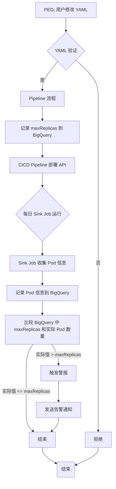
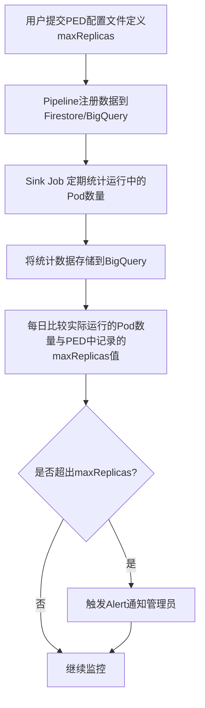
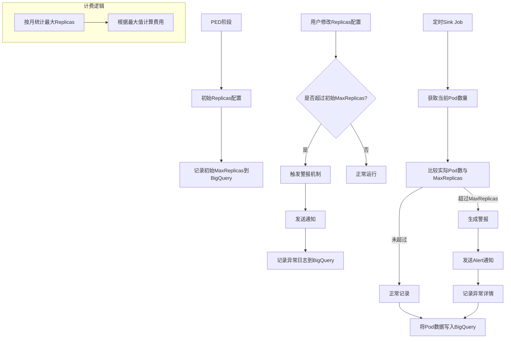
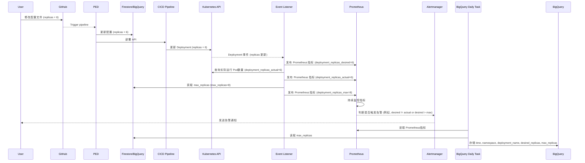

- [Description](#description)
- [summary and explore](#summary-and-explore)
  - [1. 监控 Deployment 的 Pods 数量变化](#1-监控-deployment-的-pods-数量变化)
  - [2. compare ped replicas with actual replicas](#2-compare-ped-replicas-with-actual-replicas)
  - [3. event alert 这也是一个思路](#3-event-alert-这也是一个思路)
- [Design flow](#design-flow)
  - [Gemini2](#gemini2)
  - [Chatgpt](#chatgpt)
    - [**流程解释**](#流程解释)
    - [**补充建议**](#补充建议)
    - [1. 实时监控 Deployment 的 Pods 数量变化](#1-实时监控-deployment-的-pods-数量变化)
      - [**使用 Kubernetes Audit Logs**](#使用-kubernetes-audit-logs)
      - [**通过 Kubernetes Event 或 Watch API**](#通过-kubernetes-event-或-watch-api)
    - [2. 定期统计 Pods 数量](#2-定期统计-pods-数量)
    - [3. 发送 Alert 通知](#3-发送-alert-通知)
      - [**触发条件**](#触发条件)
      - [**实现方式**](#实现方式)
    - [4. 调整计费逻辑](#4-调整计费逻辑)
      - [**计费公式实现**](#计费公式实现)
    - [5. 权衡和优化建议](#5-权衡和优化建议)
    - [方案总结](#方案总结)
    - [**实现流程**](#实现流程)
    - [**BigQuery 表设计**](#bigquery-表设计)
      - [表 1: 用户定义的 `maxReplicas`](#表-1-用户定义的-maxreplicas)
      - [表 2: 每日 Pods 数量统计](#表-2-每日-pods-数量统计)
    - [**定时任务逻辑**](#定时任务逻辑)
      - [1. 获取每日最大 Pods 数量](#1-获取每日最大-pods-数量)
      - [2. 比较 `maxReplicas` 和实际 Pods 数量](#2-比较-maxreplicas-和实际-pods-数量)
    - [**通知和报警**](#通知和报警)
    - [**总结**](#总结)
  - [Claude](#claude)
- [google](#google)

# Description
```bash
我们是运行在Google的GKE API平台,平台接入各个Team的API.一个API部署的大致流程如下
PED(用户通过修改GitHub对应的配置文件,比如yaml来trigger我们的pipeline流程,此流程包括用户数据注册到firestore 或者bigquery) 流程完成得到审批之后用户可以
使用pipeline CICD自己的API.但是API的一些属性控制是由firestore里面或者bigquery来控制

我现在有这样一个需求
比如我们对用户的Replicas进行了强制限制,最大值时2-8. 
用户最初在PED阶段申请是3,也符合我们的要求.
我现在有这样一个需求设计,如果用户修改了这个值比如为6,假设我们也允许用户调整这个值,
那么我们如何通过运行的Pod也就是Deployment来监控到这个状态的改变. 比如说这个Pod的数量改变了,我们有一个sink job 来监控Pod的一些详细信息,然后将数据写入到Bigquery里面
典型的场景如下,按照月度来说.我们其实每天有定时任务会统计用户的Pod数量,然后将数据存储在Bigquery里面
1-10日用户的最大值是3 
11-20日用户将最大值设置为了6
针对这个需求,我如何设计我的这个监控的策略,或者说检查到我这个变化然后发送Alert通知?
我现在有这样一个想法
PED yaml define maxReplicas value ==> record this value to bigquery ==> compare this value with actual replicas 也就是 sink job里面的记录到Bigquery里面的Pod的数量


下面是我的计费公式供参考:
我理解是否影响我们计费?如果我们是按照下面公式,下面公式中4是当时用户申请的最大值比如2-4Pods 这个4就是这里的,也是后面(19*2+19*4)*4这个*4的值,比如用户将最大值设置为了6 我需要在计费中体现出来,但是我们计费是按照月来统计. 可能这个时候我需要权衡拿最大值来计费?
原公式2vCPU, 4GB, 2-4 pods = 180+(19*2+19*4)*4/4 = 294
新公式2vCPU, 4GB, 2-6 pods = 180+(19*2+19*4)*6/4 = 351
```
- 计费其实和Alert是独立
- 我们只需要监控最大值的变化就好了 如果发现某一天的这个数值大于 当初申请的这个replicas的值 就触发警报


# summary and explore

## 1. 监控 Deployment 的 Pods 数量变化 
Kubernetes 的 Audit Logs 记录了 API 调用事件，比如用户修改 Deployment 导致副本数改变的操作。以下是具体步骤：
- 开启 GKE 集群的 Audit Logging 功能。
- 使用 Google Cloud Logging 查询 Deployment 更新事件：
  - 过滤条件：`k8s.io/deployment` 的修改事件。
  - 提取用户提交的副本数。
- 将日志写入 BigQuery 或 Pub/Sub，用于进一步处理和分析。


## 2. compare ped replicas with actual replicas
定时查询 `user_replicas_limits` 和 `user_pod_usage` 表，判断是否超出限制： 
1. **用户修改 PED 配置（GitHub）**
   - 用户在 GitHub 配置文件中修改 `maxReplicas` 值。
   - Pipeline 将用户的 `maxReplicas` 数据同步到 BigQuery，例如表 `user_replicas_limits`，记录每个用户的 `maxReplicas`。
   
2. **定时任务获取 Pods 数量**
   - 每天统计运行中的 Pod 数量，并存储到 BigQuery 表，例如表 `user_pod_usage`。
   
3. **比较 Pods 数量与用户定义的 `maxReplicas`**
   - 创建一个定时任务，查询 BigQuery 中的 `user_pod_usage` 和 `user_replicas_limits`，判断实际 Pods 数量是否超出限制。
   - 如果发现超出 `maxReplicas`，发送 Alert 通知管理员或相关负责人。


## 3. event alert 这也是一个思路
通过 Kubernetes Event 监听实现 replicas 数量修改检测，可以构建一个高效的实时监控系统。这种方法利用 Kubernetes 内部事件流，能够及时捕获和处理 Deployment 副本数修改事件
Kubernetes Event 监听:
Kubernetes Deployment 的 replicas 修改会触发 Kubernetes Events。
你可以部署一个程序（例如自定义 operator 或 sidecar 容器）监听这些事件。
该程序需要知道哪些 namespace/Deployment 是需要监控的。这可以通过配置或标签实现。
当检测到 replicas 数量的修改事件时，记录事件发生的时间和新的 replicas 值
 - 这个方案对我们有局限性
 - 因为我们用户基本都是走redeploy的方式,所以这个方案对我们有局限性
 - 重新Deployment这个API,但其实不仅仅是一个Event的Replicas的调整了.这种监控看起来就有局限性


# Design flow
## Gemini2 

好的，根据你的想法，我们可以将流程用 Mermaid Flowchart 表示出来，并详细解释每个步骤。

**流程图**



**流程步骤详解**

1.  **A[PED: 用户修改 YAML]**: 用户通过修改 GitHub 上的 YAML 配置文件来发起 API 的部署或更新请求。这个 YAML 文件中包含 `maxReplicas` 的定义。

2.  **B{YAML 验证}**: 在 PED 阶段，会对用户提交的 YAML 文件进行验证。
    *   **验证逻辑:** 检查 YAML 文件是否符合规范，例如 `maxReplicas` 的值是否在 2-8 的范围内。
    *   如果验证失败，则流程结束，拒绝用户的修改（Z1[拒绝]）。

3.  **C[Pipeline 流程]**: 如果 YAML 验证通过，则触发 pipeline 流程。

4.  **D[记录 maxReplicas 到 BigQuery]**:  Pipeline 流程的一部分是将 YAML 文件中定义的 `maxReplicas` 值记录到 BigQuery 中。
    *   **存储方式:**  将 `maxReplicas` 与对应的 API (Deployment) 信息（例如 namespace、Deployment name）一起存储在 BigQuery 的表中。
    *   **数据更新:**  每次修改 YAML 并成功部署时，都会更新 BigQuery 中记录的 `maxReplicas`。

5. **E[CICD Pipeline 部署 API]**:  Pipeline流程继续部署用户的API，基于用户定义`maxReplicas`和其他配置，在 GKE 集群中部署 Deployment。

6.  **F{每日 Sink Job 运行}**: 每天定时运行一个 Sink Job。

7.  **G[Sink Job 收集 Pod 信息]**: Sink Job 负责收集 GKE 集群中 Pod 的信息。
    *   **收集目标:**  Sink Job 需要收集每个 Pod 的运行状态和所属 Deployment 的信息。
    *   **信息提取:** Sink Job 需要获取 Pod 的实际 `replicas` 数量。

8.  **H[记录 Pod 信息到 BigQuery]**: Sink Job 将收集到的 Pod 信息，特别是 `replicas` 数量，写入到 BigQuery。
    *   **数据结构:**  在 BigQuery 中，每天的数据表应该包含 API (Deployment) 信息（例如 namespace、Deployment name）、时间和实际运行的 Pod 数量。

9.  **I[比较 BigQuery 中 maxReplicas 和实际 Pod 数量]**:  每天，执行数据分析任务，比较 BigQuery 中记录的 `maxReplicas` 值和实际运行的 Pod 数量。
    *   **比较逻辑:**  对于每个 API，比较当天记录的实际 Pod 数量是否大于 BigQuery 中记录的 `maxReplicas`。
    *   **时间范围:**  由于是每日执行，因此比较的是同一天的 `maxReplicas` 和实际运行的 Pod 数量。

10. **J[触发警报]**: 如果发现实际运行的 Pod 数量大于 `maxReplicas`，则触发警报。

11. **L[发送告警通知]**:  发送告警通知，包含 API 的信息（例如 namespace、Deployment name）和警报原因。

12. **K[结束]**:  如果实际运行的 Pod 数量小于等于 `maxReplicas` 或者告警发送完成，则流程结束。

13. **M(结束):**  整个流程结束。

**计费与监控分离**

*   **计费:**
    *   正如你所说，计费可以独立于告警。
    *   你可以根据每月最大 `maxReplicas` 值进行计费，这可以通过在 BigQuery 中每月查询每个 API 的最大 `maxReplicas` 值来实现。
    *   你的计费公式可以基于这个最大值进行计算。
*   **监控:**
    *   监控流程专注于检测 Pod 数量是否违反 `maxReplicas` 规则。
    *   通过警报机制，可以及时发现用户的配置异常行为。

**总结**

这个流程图清晰地展示了你的想法，即：

1.  在 PED 阶段记录用户定义的 `maxReplicas`。
2.  使用 Sink Job 收集 Pod 信息并写入 BigQuery。
3.  每日比较 `maxReplicas` 和实际 Pod 数量。
4.  如果发现实际 Pod 数量大于 `maxReplicas`，则触发警报。

这个方案符合你的需求，并且可以将监控、计费和告警分离，方便你管理。希望这个流程图对你有所帮助！


## Chatgpt

以下是根据您的需求生成的流程图，展示如何设计监控 `replicas` 变化并触发警报的完整流程： 



### **流程解释**
1. **PED阶段：**  
   用户通过提交配置文件定义 `maxReplicas` 的值。此值会在 Pipeline 执行时记录到 Firestore 或 BigQuery 中。

2. **Sink Job:**  
   Sink Job 定期监控运行中的 Pods，并将实际的 Pod 数量记录到 BigQuery 中。

3. **数据对比：**  
   定期任务从 BigQuery 获取 Sink Job 数据，与 PED 定义的 `maxReplicas` 值进行比较。

4. **超出检测：**  
   如果实际的 Pod 数量超出了 PED 阶段定义的 `maxReplicas` 值，则触发警报通知管理员。

5. **警报通知：**  
   超出限制的情况通过警报机制（例如 Email 或 Webhook）通知相关人员。

6. **继续监控：**  
   如果未超出限制，则保持正常的监控状态，等待下一次检查。

### **补充建议**
- **计费同步：**  
  虽然计费逻辑和警报独立，但可以将每日的最大值存储到 BigQuery，并根据每日统计的最大值调整计费逻辑。
  
- **Alert 细化：**  
  警报内容中可以包含超出的具体值和时间段，以便管理员快速定位问题。

这样设计流程，可以在灵活性和准确性之间取得平衡，同时支持计费调整和监控警报的触发。


针对您的需求，可以设计一个监控和计费策略来实现以下功能：

1. **实时监控 Pods 数量变化**：捕获用户对 Deployment 的更新，比如 Pod 副本数的变更。
2. **定期统计 Pods 数量**：将数据存储在 BigQuery 中，用于分析和计费。
3. **发送 Alert**：当用户更新 Deployment 导致 Pods 数量超出预期或影响计费时触发警报。
4. **调整计费逻辑**：动态计算月度计费金额，以应对用户的配置变更。

以下是针对您需求的详细设计方案：

---

### 1. 实时监控 Deployment 的 Pods 数量变化
在 GKE 中，可以通过以下方式监控 Pods 数量的变化：

#### **使用 Kubernetes Audit Logs**
Kubernetes 的 Audit Logs 记录了 API 调用事件，比如用户修改 Deployment 导致副本数改变的操作。以下是具体步骤：
- 开启 GKE 集群的 Audit Logging 功能。
- 使用 Google Cloud Logging 查询 Deployment 更新事件：
  - 过滤条件：`k8s.io/deployment` 的修改事件。
  - 提取用户提交的副本数。
- 将日志写入 BigQuery 或 Pub/Sub，用于进一步处理和分析。

#### **通过 Kubernetes Event 或 Watch API**
使用 Kubernetes 的 Watch API 实时监听 Deployment 的变化：
- 监听特定的 Deployment 的 `.spec.replicas` 字段。
- 当发现副本数变化时触发自定义处理逻辑，比如发送通知。

代码示例（Python，使用 Kubernetes Python Client）：
```python
from kubernetes import client, config, watch

# 加载配置
config.load_kube_config()

# 初始化 API 客户端
v1 = client.AppsV1Api()

# 实时监听 Deployment 的变化
w = watch.Watch()
for event in w.stream(v1.list_deployment_for_all_namespaces):
    deployment = event['object']
    if event['type'] == 'MODIFIED':
        replicas = deployment.spec.replicas
        print(f"Deployment {deployment.metadata.name} updated replicas to {replicas}")
        # 可以将变更记录到 BigQuery 或发送通知
```

---

### 2. 定期统计 Pods 数量
使用定时任务统计 Pods 的实际数量并存储到 BigQuery：
- **任务设计**：
  - 每天使用 Kubernetes API 获取所有用户的 Pod 数量。
  - 统计每个用户的最大 Pods 数量。
  - 写入 BigQuery 表，字段包括 `date`, `user_id`, `max_pods`。
  
代码示例（统计 Pods 数量并写入 BigQuery）：
```python
from google.cloud import bigquery
from kubernetes import client, config

# 加载 Kubernetes 配置
config.load_kube_config()
v1 = client.CoreV1Api()

# 初始化 BigQuery 客户端
bq_client = bigquery.Client()

# 获取所有 Namespaces 的 Pod 数量
def get_pod_counts():
    pod_counts = {}
    pods = v1.list_pod_for_all_namespaces().items
    for pod in pods:
        namespace = pod.metadata.namespace
        pod_counts[namespace] = pod_counts.get(namespace, 0) + 1
    return pod_counts

# 将统计数据写入 BigQuery
def write_to_bigquery(data):
    table_id = "your_project_id.dataset.table"
    rows_to_insert = [{"date": d["date"], "user_id": d["user_id"], "max_pods": d["max_pods"]} for d in data]
    bq_client.insert_rows_json(table_id, rows_to_insert)

# 示例调用
pod_counts = get_pod_counts()
data = [{"date": "2024-12-13", "user_id": ns, "max_pods": count} for ns, count in pod_counts.items()]
write_to_bigquery(data)
```

---

### 3. 发送 Alert 通知
#### **触发条件**
- 当 Deployment 的副本数超出预设范围时（如 2-8）。
- 根据 BigQuery 数据，每月统计最大 Pods 数量是否影响计费。

#### **实现方式**
使用 Google Cloud Monitoring 创建自定义指标和报警：
- **指标来源**：
  - BigQuery 查询数据作为指标输入。
  - Kubernetes Audit Logs 中的 Deployment 修改事件。
- **报警策略**：
  - 超过 Pods 限制时通过邮件或 Pub/Sub 通知管理员。

---

### 4. 调整计费逻辑
#### **计费公式实现**
根据您的需求，当用户修改最大 Pods 数量后，需要在计费中体现出来。这可以通过以下方式实现：
1. **实时更新计费基准值**：记录用户修改后的最大 Pods 数量。
2. **动态计算月度计费**：统计每月各时间段内的最大值并更新计费。

示例实现（伪代码）：
```python
# 假设 BigQuery 查询结果包含每日最大 Pods 数量
daily_max_pods = [
    {"date": "2024-12-01", "max_pods": 3},
    {"date": "2024-12-11", "max_pods": 6},
]

# 按月计算计费
def calculate_monthly_charge(daily_max_pods):
    base_cost = 180
    total_cost = 0
    for day in daily_max_pods:
        max_pods = day["max_pods"]
        daily_cost = (19 * 2 + 19 * 4) * max_pods / 4
        total_cost += daily_cost
    return base_cost + total_cost

# 示例调用
monthly_charge = calculate_monthly_charge(daily_max_pods)
print(f"Monthly Charge: {monthly_charge}")
```

---

### 5. 权衡和优化建议
- **计费策略**：按照实际使用最大 Pods 数量计费，但可以对超限行为设置额外罚金以控制资源滥用。
- **数据延迟**：实时性不是强需求的情况下，定时任务统计的方案成本更低。
- **扩展性**：支持其他资源限制（如 CPU 或内存）的监控和计费。

--- 

### 方案总结
1. 通过 Kubernetes Audit Logs 或 Watch API 监控 Deployment 的副本数变化。
2. 使用定时任务记录 Pods 数量，按月度统计数据存储在 BigQuery。
3. 设置报警通知管理员，提醒资源使用超出限制。
4. 动态调整计费逻辑，确保反映用户实际资源使用情况。

比如用户修改了PED流程GitHub里面的maxReplicase 比如我也会将这个数字存储在Bigquery里面,那么我通过每天拿到的Pod数量去和这个值比较,如果大于定义的maxReplicase也就发出Alert就可以了

基于您的设计需求，以下是具体实现方案：

---

### **实现流程**

1. **用户修改 PED 配置（GitHub）**
   - 用户在 GitHub 配置文件中修改 `maxReplicas` 值。
   - Pipeline 将用户的 `maxReplicas` 数据同步到 BigQuery，例如表 `user_replicas_limits`，记录每个用户的 `maxReplicas`。
   
2. **定时任务获取 Pods 数量**
   - 每天统计运行中的 Pod 数量，并存储到 BigQuery 表，例如表 `user_pod_usage`。
   
3. **比较 Pods 数量与用户定义的 `maxReplicas`**
   - 创建一个定时任务，查询 BigQuery 中的 `user_pod_usage` 和 `user_replicas_limits`，判断实际 Pods 数量是否超出限制。
   - 如果发现超出 `maxReplicas`，发送 Alert 通知管理员或相关负责人。

---

### **BigQuery 表设计**

#### 表 1: 用户定义的 `maxReplicas`
| 字段名       | 类型       | 说明                          |
|--------------|------------|-------------------------------|
| user_id      | STRING     | 用户 ID                      |
| max_replicas | INTEGER    | 用户定义的最大副本数          |
| updated_at   | TIMESTAMP  | 用户配置的更新时间            |

#### 表 2: 每日 Pods 数量统计
| 字段名       | 类型       | 说明                          |
|--------------|------------|-------------------------------|
| user_id      | STRING     | 用户 ID                      |
| date         | DATE       | 统计日期                     |
| max_pods     | INTEGER    | 当天实际最大 Pod 数量         |

---

### **定时任务逻辑**

#### 1. 获取每日最大 Pods 数量
从 Kubernetes API 获取 Pods 数量统计，并写入 BigQuery 表 `user_pod_usage`。代码参考如下：

```python
from google.cloud import bigquery
from kubernetes import client, config

# 初始化 BigQuery 和 Kubernetes 客户端
config.load_kube_config()
v1 = client.CoreV1Api()
bq_client = bigquery.Client()

# 获取 Pods 数量
def get_pod_counts():
    pod_counts = {}
    pods = v1.list_pod_for_all_namespaces().items
    for pod in pods:
        namespace = pod.metadata.namespace
        pod_counts[namespace] = pod_counts.get(namespace, 0) + 1
    return pod_counts

# 写入 BigQuery
def write_pod_usage(pod_counts):
    table_id = "your_project_id.dataset.user_pod_usage"
    rows_to_insert = [
        {"user_id": namespace, "date": "2024-12-13", "max_pods": count}
        for namespace, count in pod_counts.items()
    ]
    bq_client.insert_rows_json(table_id, rows_to_insert)

# 执行任务
pod_counts = get_pod_counts()
write_pod_usage(pod_counts)
```

#### 2. 比较 `maxReplicas` 和实际 Pods 数量
定时查询 `user_replicas_limits` 和 `user_pod_usage` 表，判断是否超出限制：

```python
def check_replicas_and_send_alert():
    query = """
    SELECT 
        u.user_id,
        u.date,
        u.max_pods,
        r.max_replicas
    FROM 
        `your_project_id.dataset.user_pod_usage` u
    JOIN 
        `your_project_id.dataset.user_replicas_limits` r
    ON 
        u.user_id = r.user_id
    WHERE 
        u.max_pods > r.max_replicas
    """
    results = bq_client.query(query).result()

    # 如果发现超限，发送通知
    for row in results:
        print(f"ALERT: User {row.user_id} exceeded max replicas! "
              f"Pods: {row.max_pods}, Limit: {row.max_replicas}")
        # 在这里集成通知逻辑，例如发送邮件或调用通知服务

check_replicas_and_send_alert()
```

---

### **通知和报警**
您可以使用 Google Cloud Monitoring 或其他通知工具实现报警：

- **Google Cloud Monitoring**：
  - 创建自定义指标，从 BigQuery 查询中生成超限数据。
  - 设置报警策略，触发邮件或 Pub/Sub。

- **Pub/Sub 通知**：
  - 查询超限数据后，通过 Pub/Sub 推送通知。
  - 订阅者可以是邮件服务、Slack 通知机器人等。

---

### **总结**
这种设计基于每日统计 Pods 数据并与用户定义的 `maxReplicas` 比较：

1. **实时同步**：用户更新 `maxReplicas` 后，Pipeline 同步数据到 BigQuery。
2. **定时检测**：每天统计 Pods 数量，存储到 BigQuery。
3. **报警通知**：如果实际 Pods 数量超限，发送报警并记录事件。
4. **计费支持**：通过 `maxReplicas` 和 Pods 使用统计，动态调整计费逻辑。


## Claude
我将帮您设计一个Mermaid流程图，展示监控和警报的流程。




这个流程图详细展示了您提到的监控和警报策略。让我解释一下关键步骤：

1. 初始阶段：
   - 在PED阶段记录初始的MaxReplicas到BigQuery
   - 建立基准值

2. 配置变更监控：
   - 检测用户是否修改Replicas配置
   - 如果超过初始MaxReplicas，立即触发警报
   - 发送通知并记录异常日志

3. 定时Sink Job：
   - 周期性获取当前Pod数量
   - 与MaxReplicas进行比较
   - 如果超过，生成警报
   - 将数据写入BigQuery

4. 计费逻辑：
   - 按月统计最大Replicas
   - 根据最大值计算费用

建议：
- 设置明确的告警阈值
- 确保通知机制灵活且及时
- 在BigQuery中详细记录每次变更
- 计费逻辑采用月度最大值作为计算基准

您是否需要我进一步详细说明流程中的任何特定环节？


# google 

好的，这是一个很好的问题，涉及监控、告警以及计费策略。我们来一步步分析并给出解决方案。

**需求分析**

*   **监控目标:** 用户修改 Deployment 的 `replicas` 数量，且该值在 Firestore/BigQuery 中有记录的限制范围（2-8）。
*   **监控时机:** 用户修改 `replicas` 后，需要实时或近实时的监控到变化，而非仅仅依靠每日定时任务。
*   **告警:** 当 `replicas` 数量发生变化时，需要发送通知。
*   **计费:** 计费公式依赖 `replicas` 最大值，需要确保计费的准确性，特别是当用户动态调整 `replicas` 时。
*   **数据来源:** 
    *   用户初始配置：Firestore/BigQuery
    *   运行中的Pod信息: Kubernetes API
    *   历史Pod数量: BigQuery (每日定时任务)

**监控策略设计**

以下是一种基于 Kubernetes 事件、Prometheus 和告警系统的监控策略，可以满足你的需求：

1.  **Kubernetes Event 监听:**
    *   Kubernetes Deployment 的 `replicas` 修改会触发 Kubernetes Events。
    *   你可以部署一个程序（例如自定义 operator 或 sidecar 容器）监听这些事件。
    *   该程序需要知道哪些 namespace/Deployment 是需要监控的。这可以通过配置或标签实现。
    *   当检测到 `replicas` 数量的修改事件时，记录事件发生的时间和新的 `replicas` 值。

2.  **Prometheus 指标:**
    *   将上一步中记录的事件转化为 Prometheus 指标。
    *   指标可以包含以下信息：
        *   `deployment_replicas_desired`:  用户设置的期望 `replicas` 数量 (从事件中提取)
        *   `deployment_replicas_actual`:  当前运行的 `replicas` 数量 (通过 Kubernetes API 实时查询)
        *   `deployment_replicas_max`:  该 Deployment 允许的最大 `replicas` 数量 (从 Firestore/BigQuery 读取)
    *   你可以使用 Prometheus Client 库或者 Custom Metrics API 将这些指标暴露给 Prometheus。
3.  **Prometheus 查询与告警:**
    *   配置 Prometheus 查询语句，例如：
        *   `deployment_replicas_desired` != `deployment_replicas_actual` (检查预期和实际值是否一致)
        *   `deployment_replicas_desired` > `deployment_replicas_max` (检查是否超出最大限制)
    *   使用 Prometheus Alertmanager 设置告警规则。当查询条件满足时触发告警，并发送通知 (例如 Email, Slack, PagerDuty)。

4.  **数据存储到BigQuery:**
     * 你当前的定时任务，继续每天将 `deployment_replicas_desired` （从指标获取）和 `deployment_replicas_max` （从firestore/bigquery获取）  存储到 BigQuery。
     * 每天的数据表中应该有 time, namespace, deployment_name, desired_replicas, max_replicas
     * 在月度计费时，根据每日的数据表，按时间段取 desired_replicas 的最大值作为该月计费的基准。

**流程图**



**计费策略**

*   **月度计费:** 采用当月 `replicas` 的最大值来进行计费。
*   **数据来源:** 从 BigQuery 每日存储的数据中，针对每个 deployment 取当月每日  `desired_replicas` 的最大值，作为计费依据。
*   **公式:** 根据你的示例公式，将 `replicas` 的最大值带入进行计算。例如，如果用户在当月将 `replicas` 从3调整到6，那么计费的 `replicas` 值应该取6。

**关键考虑**

*   **实时性:**  Event Listener 是近实时的，可以快速响应 `replicas` 修改。
*   **告警:** 确保告警通知及时且包含足够的信息（例如，哪个 deployment 的 `replicas` 修改了，修改前后值是多少）。
*   **数据一致性:** 确保 Kubernetes, Firestore/BigQuery, Prometheus 和 BigQuery 的数据同步和一致性。
*   **资源消耗:**  Event Listener 的资源消耗需要考虑，特别是大规模集群。可以使用标签选择器来缩小监控范围。
*   **错误处理:** 考虑错误情况，例如 Event Listener 失败，Prometheus 查询失败等。

**代码示例（伪代码，仅供参考）**

**Event Listener (Python 示例，基于 Kubernetes Python 客户端库)**

```python
from kubernetes import client, config
from prometheus_client import Gauge, start_http_server
import time

config.load_incluster_config()
v1 = client.AppsV1Api()

deployment_replicas_desired = Gauge('deployment_replicas_desired', 'Desired replicas of deployment', ['namespace','deployment'])
deployment_replicas_actual = Gauge('deployment_replicas_actual', 'Actual replicas of deployment', ['namespace','deployment'])
deployment_replicas_max = Gauge('deployment_replicas_max', 'Maximum replicas of deployment', ['namespace','deployment'])
start_http_server(8000)  # Start Prometheus server

def get_max_replicas_from_firestore(namespace, deployment_name):
    # 实际的从 Firestore/BigQuery 获取最大replicas的逻辑
    return 8

def watch_deployments():
    w = watch.Watch()
    for event in w.stream(v1.list_deployment_for_all_namespaces):
        deployment = event['object']
        namespace = deployment.metadata.namespace
        deployment_name = deployment.metadata.name
        
        if event['type'] == 'MODIFIED':
            desired_replicas = deployment.spec.replicas
            max_replicas = get_max_replicas_from_firestore(namespace, deployment_name)
            deployment_replicas_desired.labels(namespace=namespace, deployment=deployment_name).set(desired_replicas)
            deployment_replicas_max.labels(namespace=namespace, deployment=deployment_name).set(max_replicas)


            deployment = v1.read_namespaced_deployment(name=deployment_name, namespace=namespace)
            actual_replicas = deployment.status.available_replicas
            deployment_replicas_actual.labels(namespace=namespace, deployment=deployment_name).set(actual_replicas if actual_replicas is not None else 0)
            
            print(f"Deployment {namespace}/{deployment_name} replicas updated: desired={desired_replicas}, actual={actual_replicas}, max={max_replicas}")
        
if __name__ == '__main__':
    watch_deployments()
```

**Prometheus 配置 (prometheus.yml)**

```yaml
scrape_configs:
  - job_name: 'kubernetes-events'
    static_configs:
      - targets: ['event-listener-ip:8000'] # Event Listener 的IP和端口
```

**Alertmanager 配置 (alertmanager.yml)**

```yaml
route:
  group_by: ['namespace', 'deployment']
  group_wait: 30s
  group_interval: 5m
  repeat_interval: 1h
  receiver: 'email-notifications'
receivers:
  - name: 'email-notifications'
    email_configs:
      - to: 'your-email@example.com'
        from: 'alertmanager@example.com'
        smarthost: 'smtp.example.com:587'
        auth_username: 'your-smtp-username'
        auth_password: 'your-smtp-password'
templates:
  - '/etc/alertmanager/templates/*.tmpl'
```

**总结**

以上策略提供了一种较为全面的监控方案，可以让你实时监控 `replicas` 的变化，并根据需要进行告警和计费。你可以根据实际情况调整和优化此方案。关键在于：

*   使用 Kubernetes Events 进行实时监控。
*   利用 Prometheus 作为指标收集和告警平台。
*   将监控和计费数据存储在 BigQuery 中，方便后续分析。

希望这个详细的解答能够帮助你！ 如果你有任何其他问题，请随时提出。


i
