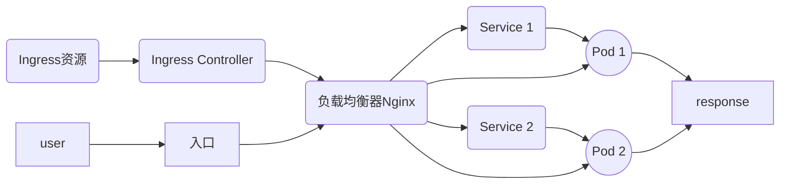
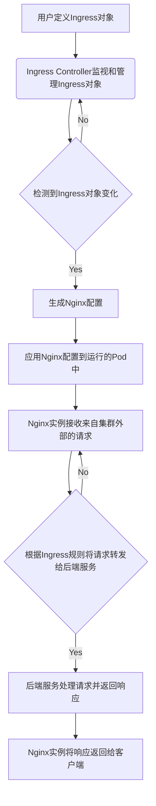
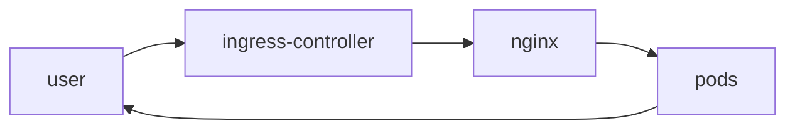

K8S中使用Ingress进行流量管理的架构流程如下:

1. 开发人员编写Ingress资源清单,定义路由规则,并将其部署到K8S集群中。

2. K8S集群中的Ingress Controller部署会监听Ingress资源的变化。一旦发现新增的Ingress资源,Ingress Controller就会根据其定义的规则配置负载均衡器(如Nginx)。

3. 用户访问K8S集群的入口(如NodePort、LoadBalancer),请求会被转发到Ingress Controller部署的负载均衡器上。

4. 负载均衡器根据Ingress规则对请求进行转发,并最终转发到指定的服务上。

5. 服务根据请求中指定的路径和规则,将请求转发到后端的Pod。

6. Pod接收到请求后,访问本地容器并返回结果。

7. 响应会依次返回给负载均衡器、入口和最终用户。

流程图如下:


综上,Ingress Controller通过监听Ingress资源的变化,然后动态配置负载均衡器,实现外部请求到达K8S内部服务的流量管理。Ingress和Ingress Controller之间通过K8S API进行协调。


当在Kubernetes中使用Nginx Ingress Controller或Ingress对象时，以下是整个流程和各个组件之间的工作关系：

1. 用户通过定义Ingress对象来配置路由规则、主机名和路径映射等信息。
2. Ingress Controller是一个独立的Kubernetes控制器，负责监视和管理Ingress对象。
3. Ingress Controller与Kubernetes API服务器保持连接，以获取Ingress对象的变化和更新。
4. 当新的或更新的Ingress对象被创建或修改时，Ingress Controller将检测到变化并采取相应的行动。
5. Ingress Controller会根据Ingress对象中定义的规则和配置信息生成相应的Nginx配置。
6. Ingress Controller将更新的Nginx配置应用到运行Nginx实例的Pod中。
7. Nginx实例作为负载均衡器和反向代理，接收来自集群外部的请求，并根据Ingress规则将请求转发给适当的后端服务。
8. 后端服务接收到请求并进行处理，然后将响应返回给Nginx实例。
9. Nginx实例将响应返回给请求的客户端。

这是一个简单的流程，展示了Nginx Ingress Controller和Ingress之间的协作关系。下面是一个用Markdown格式表示的流程图：

```
用户定义Ingress对象 -> Ingress Controller监视和管理Ingress对象 ->
    检测到Ingress对象变化 -> 生成Nginx配置 ->
    应用Nginx配置到运行的Pod中 -> Nginx实例接收来自集群外部的请求 ->
    根据Ingress规则将请求转发给后端服务 -> 后端服务处理请求并返回响应 ->
    Nginx实例将响应返回给客户端
```

请注意，这只是一个简化的流程，实际情况可能会因配置和环境的不同而有所变化。

以下是使用Mermaid格式输出的流程图，描述了Kubernetes中Nginx Ingress Controller和Ingress之间的工作流程：



这个Mermaid流程图展示了用户定义Ingress对象后，Ingress Controller如何监视并管理这些对象，然后根据变化生成Nginx配置并将其应用到运行的Pod中。最终，Nginx实例将根据Ingress规则将请求转发给后端服务，并将响应返回给请求的客户端。


Sure, here is a Markdown explanation of the working process of an Ingress controller and Ingress in Kubernetes:

```markdown
When a user sends a request to an Ingress controller, the Ingress controller will first consult the Ingress object to determine how to route the request. The Ingress object specifies a set of rules that map incoming requests to specific services. For example, the Ingress object might specify that all requests for the `www.example.com` domain should be routed to the `my-web-service` service.

The Ingress controller will then use the NGINX web server to proxy the request to the appropriate service. The NGINX web server will then forward the request to the pods that are running the `my-web-service` service.

The pods that are running the `my-web-service` service will then handle the request and return a response to the user. The Ingress controller will then return the response to the user.

Here is a flowchart that illustrates the working process of an Ingress controller and Ingress:

```


The coordination between the Ingress controller and Ingress is achieved through the use of annotations. Annotations are metadata that can be added to Kubernetes resources. The Ingress controller will consult the annotations on the Ingress object to determine how to route requests. For example, the Ingress controller might use an annotation to specify the load balancing algorithm that should be used.

Here is an example of an annotation that can be used to configure the load balancing algorithm:

```
nginx.ingress.kubernetes.io/load-balancer-algorithm: round_robin
```

This annotation tells the Ingress controller to use the round robin load balancing algorithm.

I hope this explanation is helpful! Let me know if you have any other questions.
