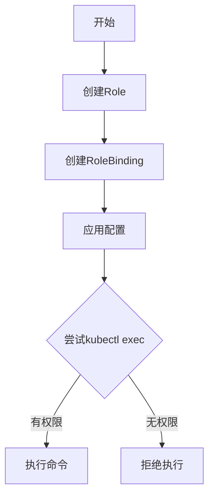

- [bard](#bard)
- [创建 PodSecurityPolicy 对象](#创建-podsecuritypolicy-对象)
- [绑定 PodSecurityPolicy 对象到 default 命名空间](#绑定-podsecuritypolicy-对象到-default-命名空间)
- [创建一个普通用户](#创建一个普通用户)
- [授予普通用户对 deny-exec ClusterRole 的权限](#授予普通用户对-deny-exec-clusterrole-的权限)
- [使用 kubectl exec 命令尝试连接到 default 命名空间中的 Pod](#使用-kubectl-exec-命令尝试连接到-default-命名空间中的-pod)
- [将会看到以下错误信息](#将会看到以下错误信息)

在Kubernetes中，限制特定命名空间中的 `kubectl exec` 命令通常通过配置RBAC（基于角色的访问控制）策略实现。
下面是一个实现这一目标的流程，其中包括创建一个角色（Role）和一个角色绑定（RoleBinding），这个角色不包括`exec`的权限。

```markdown
### 限制特定命名空间的 `kubectl exec` 权限步骤

1. **创建Role**: 定义一个Role YAML文件，该文件指定在该命名空间中可以和不可以执行的操作。

```yaml
# role-no-exec.yaml
apiVersion: rbac.authorization.k8s.io/v1
kind: Role
metadata:
  namespace: <your-namespace>  # 替换为你的命名空间
  name: role-no-exec
rules:
- apiGroups: [""]
  resources: ["pods/exec"]
  verbs: ["get", "list", "watch"]  # 不包含 'create'
```

2. **创建RoleBinding**: 定义一个RoleBinding YAML文件，以将上面创建的Role绑定到特定的用户或用户组。

```yaml
# rolebinding-no-exec.yaml
apiVersion: rbac.authorization.k8s.io/v1
kind: RoleBinding
metadata:
  name: no-exec-binding
  namespace: <your-namespace>  # 替换为你的命名空间
subjects:
- kind: User
  name: <user-name>  # 替换为特定的用户名或用户组
  apiGroup: rbac.authorization.k8s.io
roleRef:
  kind: Role
  name: role-no-exec
  apiGroup: rbac.authorization.k8s.io
```

3. **应用配置**: 使用`kubectl apply`命令应用上面创建的Role和RoleBinding。

```bash
kubectl apply -f role-no-exec.yaml
kubectl apply -f rolebinding-no-exec.yaml
```

这样配置后，指定的用户在尝试执行 `kubectl exec` 命令时将会收到权限不足的提示。

### 可视化流程图 - Mermaid格式


```

请替换 `<your-namespace>` 和 `<user-name>` 为你的具体命名空间和用户名称。

这个过程没有提供绝对的“禁止”，因为已经存在的角色或角色绑定可能已经授予了用户足够的权限。
你可能需要审查并修改现有的RBAC策略，以确保不存在覆盖你上述设置的权限。如果需要实现更精细的访问控制，可能需要使用Kubernetes的Admission 
Controllers，例如使用一个Webhook来拒绝所有的exec请求。


# calude 2
对于限制kubectl exec的访问,有几种方法可以考虑:

1. 使用RBAC规则限制命名空间访问

可以创建一个Role或ClusterRole,只允许特定命名空间的pods执行exec。例如:

```yaml
apiVersion: rbac.authorization.k8s.io/v1
kind: Role
metadata:
  name: exec-role
  namespace: dev
rules:
- apiGroups: [""]
  resources: ["pods/exec"]
  verbs: ["create"] 
```

然后绑定到适当的ServiceAccount上即可限制命名空间dev中的pod exec访问。

2. 使用PodSecurityPolicy限制privilege escalation

可以创建一个denyPrivilegeEscalation=true的PodSecurityPolicy,绑定到特定命名空间的ServiceAccount上,从而禁止该命名空间中的容器获取更高权限。

3. 使用准入控制 webhook拦截exec操作

可以实现一个校验admission webhook,如果是特定命名空间的exec请求,则拒绝该请求。

4. 在网络层通过firewall规则阻止exec端口访问

可以配置firewall规则,阻止访问kubelet的10250端口,从而禁止exec的TCP连接。需要注意的是,这会整体禁止命名空间的exec使用。

5. 通过修改kubelet配置限制访问

可以设置kubelet的--allowed-users选项,只允许特定用户执行exec操作。或者通过--read-only-port关闭10250端口也可以禁止exec。

以上都是可行的限制kubectl exec访问的方法,可以根据实际需要选择最合适的方案来操作。

# bard
方法一：使用 PodSecurityPolicy 来限制

PodSecurityPolicy 是 Kubernetes 提供的一项功能，用于限制 Pod 的安全配置。可以通过 PodSecurityPolicy 来限制 Pod 的 exec 权限，从而禁止 kubectl exec。

要使用 PodSecurityPolicy 来限制 kubectl exec，需要创建一个 PodSecurityPolicy 对象，并将其设置为对应的命名空间。PodSecurityPolicy 对象的 spec 部分需要包含一个 privileged 字段，并将其设置为 false。

以下是一个示例 PodSecurityPolicy 对象：

创建 PodSecurityPolicy 对象后，需要将其绑定到对应的命名空间。可以使用 kubectl apply 命令来绑定 PodSecurityPolicy 对象：

```yaml
apiVersion: policy/v1beta1
kind: PodSecurityPolicy
metadata:
  name: deny-exec
spec:
  privileged: false
  allowPrivilegeEscalation: false
  allowedCapabilities: []
  volumes:
    - '*'
  hostNetwork: false
  hostPorts:
    - min: 0
      max: 65535
  hostIPC: false
  hostPID: false
  runAsUser:
    rule: MustRunAsNonRoot
  seLinux:
    rule: RunAsAny
  supplementalGroups:
    rule: RunAsAny
  fsGroup:
    rule: RunAsAny

apiVersion: policy/v1beta1
kind: PodSecurityPolicy
metadata:
  name: deny-exec
spec:
  privileged: false
  # 限制 Pod 访问容器的 PID 空间
  hostPID: false
  # 限制 Pod 访问容器的 IPC 空间
  hostIPC: false
  # 限制 Pod 的 exec 权限
  allowPrivilegeEscalation: false
  volumes:
  - '*'
  hostNetwork: false
  hostPorts:
  - min: 0
    max: 65535
  runAsUser:
    rule: MustRunAsNonRoot
  seLinux:
    rule: RunAsAny
  supplementalGroups:
    rule: RunAsAny
  fsGroup:
    rule: RunAsAny
```

这个 PodSecurityPolicy 对象将禁止所有 Pod 的 exec 权限，包括访问容器的 PID 和 IPC 空间。

以下是 PodSecurityPolicy yaml 文件的各个部分的说明：

- apiVersion 和 kind 字段必须设置为正确的值。
- metadata 部分必须包含一个 name 字段，用于指定 PodSecurityPolicy 对象的名称。
- spec 部分包含了 PodSecurityPolicy 对象的实际配置。
在 spec 部分中，有以下几个重要的字段：

- privileged 字段用于限制 Pod 是否具有特权权限。如果 privileged 设置为 false，则 Pod 将无法访问容器的宿主机。
- hostPID 字段用于限制 Pod 是否可以访问容器的 PID 空间。如果 hostPID 设置为 false，则 Pod 将无法通过 kubectl exec 命令访问容器的 PID 空间。
- hostIPC 字段用于限制 Pod 是否可以访问容器的 IPC 空间。如果 hostIPC 设置为 false，则 Pod 将无法通过 kubectl exec 命令访问容器的 IPC 空间。
- allowPrivilegeEscalation 字段用于限制 Pod 是否可以进行特权提升。如果 allowPrivilegeEscalation 设置为 false，则 Pod 将无法提升其权限。
- volumes 字段用于限制 Pod 可以使用哪些类型的卷。
- hostNetwork 字段用于限制 Pod 是否可以使用宿主机的网络。
- hostPorts 字段用于限制 Pod 可以使用的宿主机端口。
- runAsUser 字段用于限制 Pod 运行的用户。
- seLinux 字段用于限制 Pod 的 SELinux 上下文。
- supplementalGroups 字段用于限制 Pod 可以使用的附加组。
- fsGroup 字段用于限制 Pod 可以使用的文件系统组。

创建 PodSecurityPolicy 对象后，可以通过以下命令将其绑定到命名空间：

kubectl apply -f deny-exec.yaml

绑定 PodSecurityPolicy 对象后，在该命名空间中创建 Pod 时，将会受到 PodSecurityPolicy 对象的限制。如果 Pod 的 spec 部分包含了 exec 字段，则该 Pod 将会被拒绝创建。

方法二：使用 RBAC 来限制

RBAC 是 Kubernetes 提供的一项功能，用于控制对 Kubernetes 资源的访问权限。可以通过 RBAC 来限制对 kubectl exec 的访问权限，从而禁止 kubectl exec。

要使用 RBAC 来限制 kubectl exec，需要创建一个 Role 或 ClusterRole 对象，并将其授予对应的用户或用户组。Role 或 ClusterRole 对象的权限范围是命名空间级别的。

以下是一个示例 Role 对象：

```YAML
apiVersion: rbac.authorization.k8s.io/v1
kind: Role
metadata:
  name: deny-exec
rules:
- apiGroups:
  - ""
  resources:
  - pods
  verbs:
  - exec
```
Use code with caution. Learn more
创建 Role 对象后，需要将其授予对应的用户或用户组。可以使用 kubectl create rolebinding 命令来授予 Role 对象的权限：

Shell
kubectl create rolebinding deny-exec-binding --role=deny-exec --user=johndoe
Use code with caution. Learn more
授予 Role 对象的权限后，在该命名空间中，只有具有对应权限的用户或用户组才能使用 kubectl exec 命令。

操作过程

基于特定的命名空间来限制禁止 kubectl exec 的操作过程如下：

选择一种方法来限制 kubectl exec。
创建 PodSecurityPolicy 对象或 Role 对象。
将 PodSecurityPolicy 对象或 Role 对象绑定到对应的命名空间。
授予 Role 对象的权限。
以下是一个示例操作过程：

Shell
# 创建 PodSecurityPolicy 对象
kubectl apply -f deny-exec.yaml

# 绑定 PodSecurityPolicy 对象到 default 命名空间
kubectl apply -f deny-exec-binding.yaml

# 创建一个普通用户
kubectl create user johndoe

# 授予普通用户对 deny-exec ClusterRole 的权限
kubectl create rolebinding deny-exec-binding --role=deny-exec --user=johndoe

# 使用 kubectl exec 命令尝试连接到 default 命名空间中的 Pod
kubectl exec -it my-pod -- sh

# 将会看到以下错误信息
Error from server (Forbidden): pods "my-pod" is forbidden: exec is not allowed
Use code with caution. Learn more
在这种情况下，普通用户 johndoe 将无法使用 kubectl exec 命令连接到 default 命名空间中的 Pod。

Sources
github.com/Ladicle/kubectl-rolesum subject to license (MIT)
github.com/GoogleCloudPlatform/sap-deployment-automation subject to license (Apache - 2.0)
