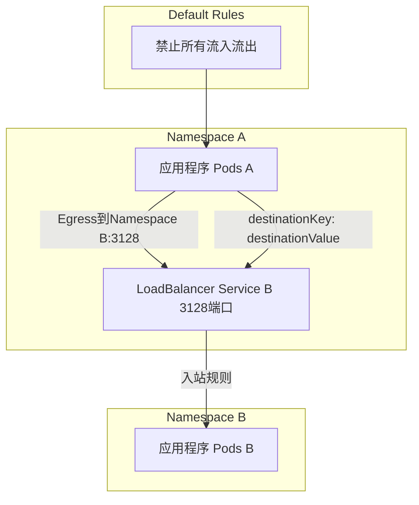

- [summary](#summary)
- [flow](#flow)
- [Detail networkpolicy](#detail-networkpolicy)
  - [The service](#the-service)
  - [2 ingress for namespaceB](#2-ingress-for-namespaceb)
  - [3 namespaceA egress](#3-namespacea-egress)
    - [summary](#summary-1)
# summary
namespaceA == rt namespace

namespaceB == proxy namespace
# flow

为了表示你的GKE网络策略，允许Namespace A的Egress流量连接到Namespace B的LoadBalancer Service的3128端口，并要求Namespace A内的源Pod必须具有"destinationKey: destinationValue"标签，以下是对应的Mermaid图表：




在这个Mermaid图表中，Namespace A的Egress流量被允许，但只有具有"destinationKey: destinationValue"标签的Pod才能连接到Namespace B的Service B的3128端口。默认规则禁止所有其他Ingress和Egress流量。

你可以根据这个示例进行修改，以适应你实际的网络策略配置。这个图表可帮助你更好地理解你的网络策略。

namespaceA ==> namespace B
# Detail networkpolicy
GKE network policy 我配置允许一个namespaceA egress 到另一个namespacesB 的load balance 3128端口
要求namespaceA 内的源Pod必须有destinationKey: destinationValue 这个标签,它才能连接我的namespaceB 的kind: Service
我的默认规则已经是禁止了所有的Ingress和Egress
## 1 The service
Squid Service
这个部分定义了一个名为 "proxy_name-service" 的 Service，在 namespaceB 中。

它使用了一个内部负载均衡器，并将端口 3128 的流量转发到匹配标签为 "app: proxy_name" 的 Pod。

这个规则用于在 namespaceB 中创建一个可从其他命名空间访问的 Squid 代理服务。

The service
```yaml
echo "kubectl apply squid service"
kubectl apply -f - <<EOF
apiVersion: v1
kind: Service
metadata:
  annotations:
    cloud.google.com/load-balancer-type: "Internal"
  labels:
    type: squid-services
    destinationKey: destinationValue
  name: proxy_name-service
  namespace: namespaceB
spec:
  ports:
    - port: 3128
      protocol: TCP
      targetPort: 3128
  selector:
    app: proxy_name
  type: LoadBalancer
EOF
```


## 2 ingress for namespaceB  
NamespaceB Ingress Network Policy

这个规则定义了一个名为 "allow-node-ingress-squid" 的网络策略，限制了进入 namespaceB 的流量。

它允许来自 CIDR 为 192.168.192.0/22 的 IP 地址块的流量访问端口 3128 和 443（TCP 协议）。

该策略只适用于具有标签 "destinationKey: destinationValue" 的 Pod。这个规则确保了只有满足条件的流量可以进入 namespaceB。

在我这个场景中主要是满足许Node之间的IP跳转访问 3128

```yaml
  kubectl apply -f - <<EOF
apiVersion: networking.k8s.io/v1
kind: NetworkPolicy
metadata:
  name: allow-node-ingress-squid
  namespace: namespaceB 
spec:
  ingress:
  - from:
    - ipBlock:
        cidr: 192.168.192.0/22 # node ip range 允许Node之间的IP跳转访问 3128
    ports:
    - port: 3128
      protocol: TCP
    - port: 443
      protocol: TCP
  podSelector:
    matchLabels:
      destinationKey: destinationValue
  policyTypes:
  - Ingress
EOF
```

## 3 namespaceA egress 
namespaceA Egress Network Policy

这个规则定义了一个名为 "allow-rt-egress-proxy-microsoft" 的网络策略，用于限制 namespaceA 中的出口流量。

它允许具有标签 "destinationKey: destinationValue" 的 Pod 访问匹配标签为 "type: namespaceB" 的 namespaceB 中的任何 Pod，目标端口为 3128。

该策略将限制流量仅从具有特定标签的 Pod 流出，并且只允许访问特定的命名空间。
```yaml
echo "creating Pod->squid egress for DRN"
  kubectl apply -f - <<EOF
apiVersion: networking.k8s.io/v1
kind: NetworkPolicy
metadata:
  name: allow-rt-egress-proxy-microsoft
  namespace: namespaceA
spec:
  egress:
  - to:
    - namespaceSelector: # 这个字段用于选择特定的命名空间作为目标
        matchLabels:
          type: namespaceB # 这个字段用于指定一个标签选择器，选择具有特定标签的命名空间。在这种情况下，选择具有标签 "type: namespaceB" 的命名空间作为目标。
      podSelector:
        matchLabels: # 这个字段用于指定一个标签选择器，选择具有特定标签的 Pod。在这种情况下，选择具有标签 "destinationKey: destinationValue" 的 Pod 作为目标。
          destinationKey: destinationValue # 访问namespaceB中标签为"destinationKey: destinationValue"的服务的3128端口
    ports:
      - port: 3128
  podSelector: # 这个字段用于选择应用该策略的源 Pod 
    matchLabels: # 这个字段用于指定一个标签选择器，选择具有特定标签的 Pod。在这种情况下，选择具有标签 "destinationKey: destinationValue" 的 Pod
      destinationKey: destinationValue # namespaceA中pod 具有 destinationKey: destinationValue 标签的 Pod 
  policyTypes:
    - Egress # 这个字段表示这是一个出口策略，即控制 Pod 发送流量的规则


上述 NetworkPolicy 中，namespaceSelector 和 podSelector 字段用于选择目标 Pod。
在您的配置中，namespaceSelector 选择了运行在 namespaceB 中的 Pod，

而 podSelector 选择了具有 destinationKey: destinationValue 标签的 Pod。
这意味着您的 Pod 必须同时满足这两个选择器才能被允许进行出站连接 这个是针对A namespace 而已的

```
### summary 

1. 您在namespaceB中创建了一个Squid代理的Service,类型是Internal Load Balancer,端口是3128。
2. 在namespaceB中创建了一个NetworkPolicy,允许来自192.168.192.0/22段的流量访问Squid服务的3128和443端口。这里是允许外部/我这里立即为内部Node跳转 访问Squid服务。
3. 在namespaceA中创建了一个NetworkPolicy,允许namespaceA中pod访问namespaceB中标签为"destinationKey: destinationValue"的服务的3128端口。这里是允许namespaceA访问namespaceB中的Squid服务。
总体来说,namespaceA可以通过3128端口访问namespaceB中的Squid服务,其他的访问默认都是被禁止的


``` 


# other reference

# ingress limitation 
# ingress enhance
## demand
在一个K8S的NamespaceB里面，我运行了一个服务，我想要默认情况下禁止任何Pod或者其他Namespace连接我这个服务，然后再去类似开放白名单的情况下来连接我这个NamespaceB的Service，要求namespaceA 内的源Pod必须有destinationKey: destinationValue 这个标签,它才能连接我的namespaceB 的kind: Service、 那么有什么好的推荐，或者类似的networkpolicy如何定义？
## method
在 Kubernetes 中可以使用 NetworkPolicy 对象来定义网络策略。下面是一个示例，展示如何定义一个允许具有特定标签的 Pod 访问 NamespaceB 中的服务的网络策略：

```yaml
apiVersion: networking.k8s.io/v1
kind: NetworkPolicy
metadata:
  name: whitelist-policy
  namespace: namespaceB
spec:
  podSelector:
    matchLabels:
      type: squid-service
  ingress:
  - from:
    - namespaceSelector:
        matchLabels:
          name: namespaceA
    - podSelector:
        matchLabels:
          destinationKey: destinationValue
  egress: [] # 禁止向外部发送流量，如需开放外部访问请调整此部分
```

在上面的示例中，你需要替换以下内容：
- `namespaceB`：你的服务所在的命名空间。
- `squid-service`：你的服务的标签。
- `namespaceA`：允许访问你的服务的命名空间。
- `destinationKey: destinationValue`：允许访问你的服务的 Pod 必须具有的标签。

这个网络策略将允许具有 `destinationKey: destinationValue` 标签的 Pod 从 `namespaceA` 访问 `namespaceB` 中的服务，同时禁止其他来源的流量。注意，上述示例中的出站流量（`egress`）部分为空，这将阻止服务发送到外部的流量，如果你需要允许服务发送到外部，你可以根据需要进行调整。

在 Kubernetes 网络策略中，`egress` 规则定义了允许从目标 Pod 发送到外部的流量。下面是 `[]` 和 `{}` 在 `egress` 规则中的区别：

- `[]`（空数组）：表示没有指定任何 egress 规则，即禁止目标 Pod 发送到外部的流量。这意味着目标 Pod 只能接收来自 ingress 规则所允许的流量，无法主动发起连接到外部服务。

- `{}`（空对象）：表示允许目标 Pod 发送到外部的流量，没有限制。目标 Pod 可以与外部服务进行通信。

因此，`[]` 表示禁止目标 Pod 发送到外部的流量，而 `{}` 表示允许目标 Pod 发送到外部的流量，没有限制。

你可以根据你的实际需求选择适合的 egress 规则来限制或允许目标 Pod 与外部服务的通信。

## case 2

允许 NamespaceB 中的服务发送到外部：

```yaml
apiVersion: networking.k8s.io/v1
kind: NetworkPolicy
metadata:
  name: whitelist-policy
  namespace: namespaceB
spec:
  podSelector:
    matchLabels:
      type: squid-service
  ingress:
  - from:
    - namespaceSelector:
        matchLabels:
          name: namespaceA
    - podSelector:
        matchLabels:
          destinationKey: destinationValue
  egress:
  - {}
```

这个修改后的网络策略允许具有 `destinationKey: destinationValue` 标签的 Pod 从 `namespaceA` 访问 `namespaceB` 中的服务，并且允许 NamespaceB 中的服务发送到外部。请确保你的 Kubernetes 集群的网络插件（如 Calico、Cilium 或 Weave）已正确配置，并支持 NetworkPolicy。

根据你的需求，这个网络策略只允许来自 `namespaceA` 并具有特定标签的 Pod 访问你的服务，并且允许你的服务发送到外部。其他 Pod 或者其他命名空间将无法访问你的服务。请根据你的实际需求进行相应的调整。

## bard
你好。要实现你所描述的网络策略，你可以创建一个NetworkPolicy，该策略将默认情况下拒绝所有流量，然后添加一条规则，允许来自具有destinationKey: destinationValue标签的namespace A的Pod的流量。以下是NetworkPolicy的示例yaml：

如果要按照上面的标准走的话 可以更加详细的限制egress to 参考

bard 的 配置 ☕️ 下面仅仅是参考 
```
apiVersion: networking.k8s.io/v1
kind: NetworkPolicy
metadata:
  name: my-network-policy
spec:
  podSelector:
    matchLabels:
      app: my-app
  ingress:
  - from:
    - podSelector:
        matchLabels:
          name: namespaceA
          destinationKey: destinationValue
  egress:
  - to:
    - podSelector:
        matchLabels:
          app: my-app
```

要创建NetworkPolicy，你可以使用kubectl创建命令：

```
kubectl create -f my-network-policy.yaml
```

创建NetworkPolicy后，它将阻止来自任何Pod的流量，除非该Pod来自具有destinationKey: destinationValue标签的namespace A。

## claude2
对于限制namespace B中服务只被namespace A中的带有特定标签的Pod访问,可以这样定义networkpolicy:

```yaml
apiVersion: networking.k8s.io/v1
kind: NetworkPolicy 
metadata:
  name: access-nginx
  namespace: namespaceB
spec:
  podSelector:
    matchLabels:
      app: nginx
  policyTypes:
  - Ingress
  ingress:
  - from:
    - namespaceSelector:
        matchLabels:
          name: namespaceA
      podSelector:
        matchLabels:
          destinationKey: destinationValue
```

该networkpolicy的关键点:

- metadata.namespace定义namespaceB,表示该policy只作用于namespaceB
- podSelector选择namespaceB中标签为app=nginx的Pod
- ingress规则允许从namespaceA中带有标签destinationKey=destinationValue的Pod访问namespaceB中的服务Pod

这样就实现了namespaceB服务只能被namespaceA中特定标签Pod访问的限制。你可以根据实际需要调整标签等
对 GKE 网络策略的配置有几点建议:
1. Load Balancer 的 IP 在 GKE 中是动态分配的,所以如果要允许访问 Load Balancer,需要使用其 Service 名称,而不是 IP。
2. 不同 Namespace 之间默认是禁止访问的,所以需要显式配置规则允许跨 Namespace 访问。
3. 从一个 Namespace 访问另一个 Namespace 时,需要在目标 Namespace 配置 ingress 规则,在源 Namespace 配置 egress 规则。


根据您的要求，您希望在 namespaceA 中配置一个出口规则，允许通过 `namespaceSelector` 指定到 `namespaceB`。下面是一个符合您要求的 namespaceA 的出口规则的示例：

```yaml
apiVersion: networking.k8s.io/v1
kind: NetworkPolicy
metadata:
  name: allow-egress-namespaceB
  namespace: namespaceA
spec:
  egress:
  - to:
    - namespaceSelector:
        matchLabels:
          name: namespaceB
    ports:
    - port: 3128
      protocol: TCP
  podSelector:
    matchLabels:
      destinationKey: destinationValue
  policyTypes:
  - Egress
```

解释如下：

- `metadata`：指定网络策略的名称为 "allow-egress-namespaceB"，所属命名空间为 `namespaceA`。

- `spec`：定义了网络策略的规范和规则。

  - `egress`：定义了出口规则。

    - `to`：指定出口流量的目标规则。

      - `namespaceSelector`：通过标签选择器来选择目标命名空间。

        - `matchLabels`：选择具有标签 "name: namespaceB" 的命名空间作为目标。

    - `ports`：定义允许的目标端口。

      - `port`：指定目标端口号为 3128。
      - `protocol`：指定协议为 TCP。

  - `podSelector`：通过标签选择器来选择应用该策略的源 Pod。

    - `matchLabels`：选择具有标签 "destinationKey: destinationValue" 的 Pod。

  - `policyTypes`：指定策略类型为 Egress，即出口规则。

这个规则将允许在 namespaceA 中具有标签 "destinationKey: destinationValue" 的源 Pod 连接到具有标签 "name: namespaceB" 的目标命名空间中的端口 3128。 


``` yaml 
apiVersion: networking.k8s.io/v1   #指定NetworkPolicy的API版本

kind: NetworkPolicy  # 指定类型是NetworkPolicy

metadata:   

  name: allow-rt-egress-proxy-microsoft    #定义网络策略的名字

  namespace: namespaceA   # 定义网络策略所在的namespace

spec:   

  egress:   # 定义此网络策略只应用于出口流量

  - to:    

    - namespaceSelector:  # 目标namespace,使用namespaceSelector和matchLabels指定

        matchLabels:   

          type: namespaceB     

    podSelector: # 目标pod,使用podSelector和matchLabels指定

        matchLabels:  

          destinationKey: destinationValue 

    ports:  # 允许的端口 

      - port: 3128   

  podSelector:  # 使用podSelector确定网络策略所应用的源pod     

    matchLabels:  

      destinationKey: destinationValue  

  policyTypes:   #指定此网络策略只涉及到出口流量  

    - Egress
``` 


帮我详细解释下面这个 network policy 逐行解释并加# 解释在行后面

  
``` yaml 
apiVersion: networking.k8s.io/v1 

kind: NetworkPolicy

metadata:

  name: allow-rt-egress-proxy-microsoft

  namespace: namespaceA

spec:

  egress:

  - to:

    - namespaceSelector:

        matchLabels:

          type: namespaceB 

      podSelector:

        matchLabels:

          destinationKey: destinationValue 

    ports:

      - port: 3128

  podSelector:

    matchLabels:

      destinationKey: destinationValue 

  policyTypes:

    - Egress
``` 

GKE network policy 我配置允许一个namespaceA egress 到另一个namespacesB 的load balance 3128端口

要求namespaceA 内的源Pod必须有destinationKey: destinationValue 这个标签,它才能连接我的namespaceB 的kind: Service

  

下面是我的namespaceB中的load-balancer.
```yaml
kubectl apply -f - <<EOF

apiVersion: v1

kind: Service

metadata:

  annotations:

    cloud.google.com/load-balancer-type: "Internal"

  labels:

    type: squid-services

    destinationKey: destinationValue

  name: proxy_name-service

  namespace: namespaceB

spec:

  ports:

    - port: 3128

      protocol: TCP

      targetPort: 3128

  selector:

    app: proxy_name

  type: LoadBalancer

EOF
```
请根据上面的规则,帮我推里出来一个

namespaceA 的egress规则它要namespaceSelector: 
指定到namespaceB


``` yaml
apiVersion: networking.k8s.io/v1
kind: NetworkPolicy
metadata:
  name: allow-egress-to-namespaceB
  namespace: namespaceA
spec:
  egress:
  - to:
    - namespaceSelector:
        matchLabels:
          type: namespaceB
    ports:
    - port: 3128
      protocol: TCP
  podSelector:
    matchLabels:
      destinationKey: destinationValue
  policyTypes:
  - Egress
``` 
以 Markdown 格式输出上面的 NetworkPolicy 如下:

```markdown
# NamespaceA Egress 规则   

允许 NamespaceA 中带有 `destinationKey: destinationValue` 标签的 Pod 通过 3128 端口访问 NamespaceB 中的服务。

```yaml
apiVersion: networking.k8s.io/v1  
kind: NetworkPolicy  
metadata:  
  name: allow-egress-to-namespaceB  
  namespace: namespaceA  
spec:  
  egress:  
  - to:  
    - namespaceSelector: 
        matchLabels:    
          type: namespaceB  
    ports:  
    - port: 3128  
      protocol: TCP  
  podSelector:  
    matchLabels:  
      destinationKey: destinationValue  
  policyTypes:  
  - Egress
```

## 策略解释

- `apiVersion` 和 `kind` 定义这是一个 NetworkPolicy  
- `metadata` 中定义该策略的名字为 `allow-egress-to-namespaceB`,`namespace` 为 `namespaceA` 
- `spec` 中定义这是一个 `egress` 策略
- `to` 部分使用 `namespaceSelector` 选择目标 `namespaceB` 
- `ports` 部分打开 `3128` 端口(squid 服务的端口)
- `podSelector` 部分选择 source pod,要求它有 `destinationKey: destinationValue` 标签  
- `policyTypes` 确认这是一个 `egress` 策略

``` 

所以,这个 NetworkPolicy 允许 namespaceA 中带有 destinationKey: destinationValue 标签的 pod 通过 3128 端口访问 namespaceB 中的服务。
```
``` 
