network-policy
# Last
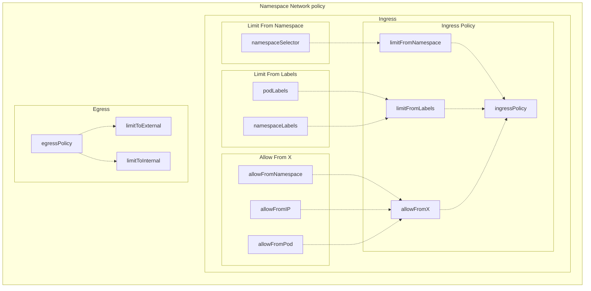

Kubernetes命名空间范围内的网络策略基础配置,默认情况下,我的namespace禁止任何ingress and egress 让我来详细解释一下:

Namespace Network Policy子图:定义了命名空间级别的网络策略
- Ingress子图:定义了入站规则
- Ingress Policy子图:入站策略规则
- Limit From Namespace子图:基于命名空间选择器的限制源
- Limit From Labels子图:基于标签选择器的限制源
- Allow From X子图:明确允许的源
- Egress子图:定义了出站规则
- Egress Policy子图:出站策略规则
- Limit To External子图:限制到外部的出站流量
- Limit To Internal子图:限制到内部的出站流量


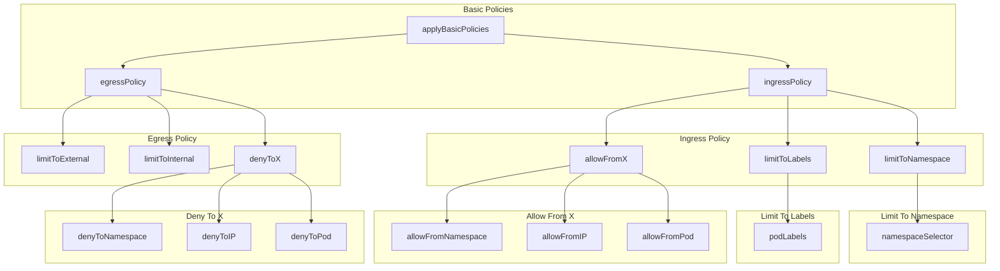

入站规则:限制源和允许源
出站规则:限制流向

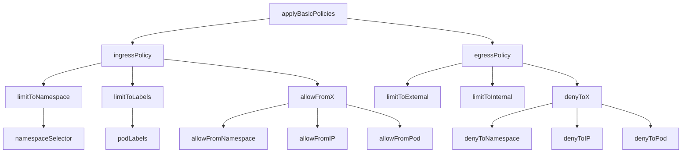


### dadada
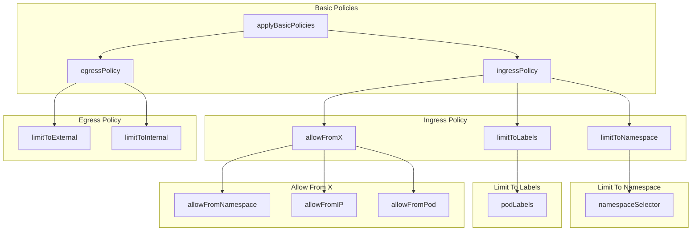
## this is base rule
我仅仅想要改变下箭头的方向关于 limitFromLabels 到ingressPolicy可以么 
 limitFromNamespace到ingressPolicy


我期待的结果是下面这样的,能否帮我优化显示效果?
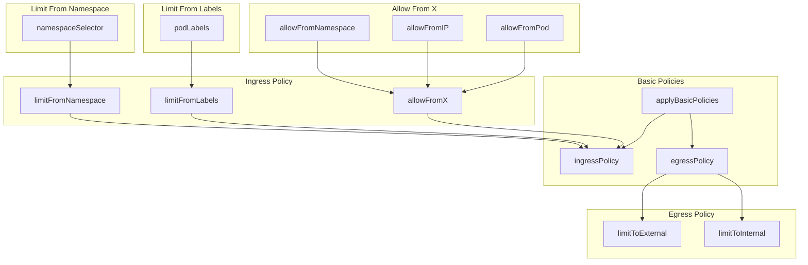
- 3.5
是否能重新排版下面这个结果.让其在同
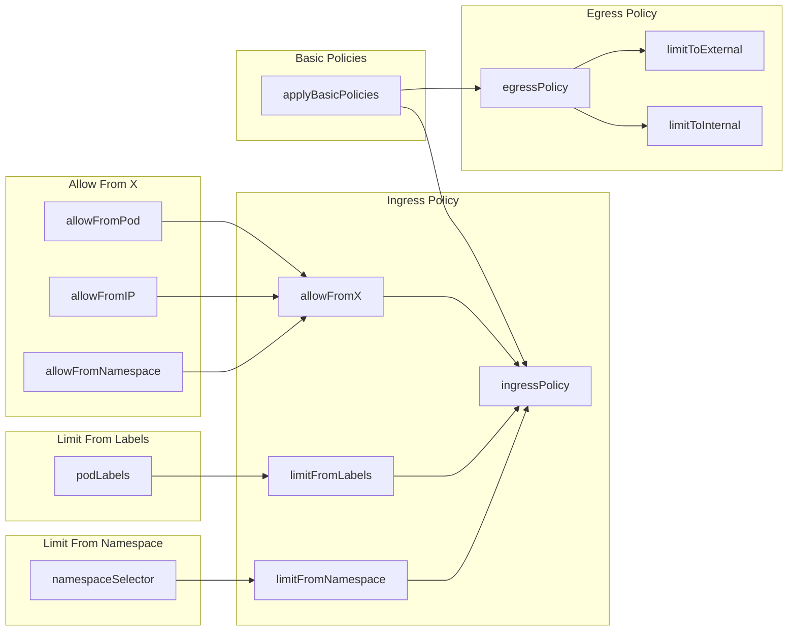


```mermaid
graph TB
    k8sPolicy[K8s Network Policy] --> policyBasics[Policy Basics]
    policyBasics --> understandTypes
    policyBasics --> labelingSelecting
    policyBasics --> defaultDenyModel

    k8sPolicy --> applyBasicPolicies
    applyBasicPolicies --> ingressEgressRules
    applyBasicPolicies --> portLimit
    applyBasicPolicies --> interPodTraffic 

    k8sPolicy --> advancedFeatures 
    advancedFeatures --> precedencePriority
    advancedFeatures --> namespaceSelectors
    advancedFeatures --> interNamespace

    k8sPolicy --> integratePlugins
    integratePlugins --> cniImplementations
    integratePlugins --> kubeProxyInteraction

    k8sPolicy --> bestPractices
    bestPractices --> policyOverPermissive
    bestPractices --> saneDefaults
    bestPractices --> policyAudit
    bestPractices --> validateContinuously

```


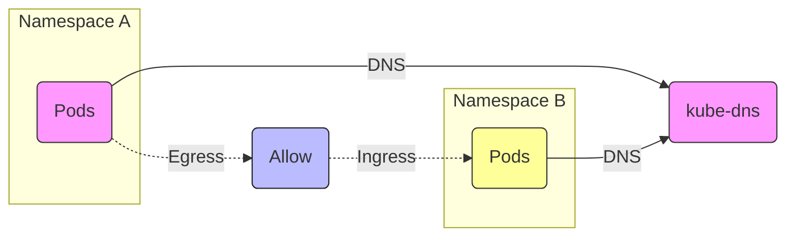


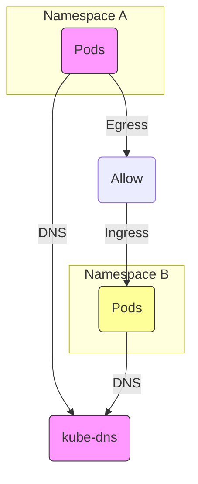

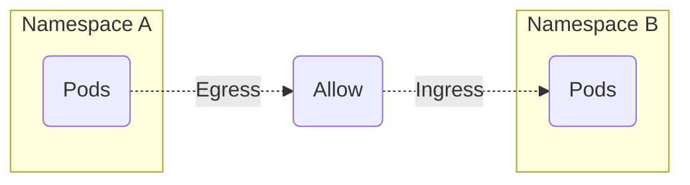


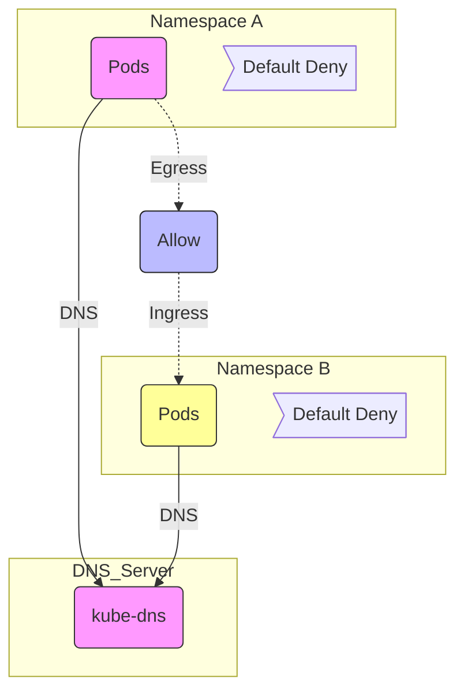

- dd
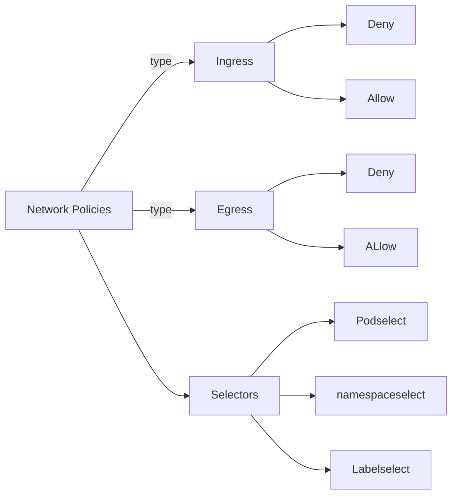

# other 
```
mindmap
  root((network Policy))
    Policy Type
      ingress
      ::icon(fa fa-book)
      egress
      ::icon(fa fa-thumbs-o-up) 
    Action
      Deny
      Allow
    Labels
      namespace </br> Select
      Pod Select
    Traffic
      From
        source
        destination
      to
        source
        destination
```


