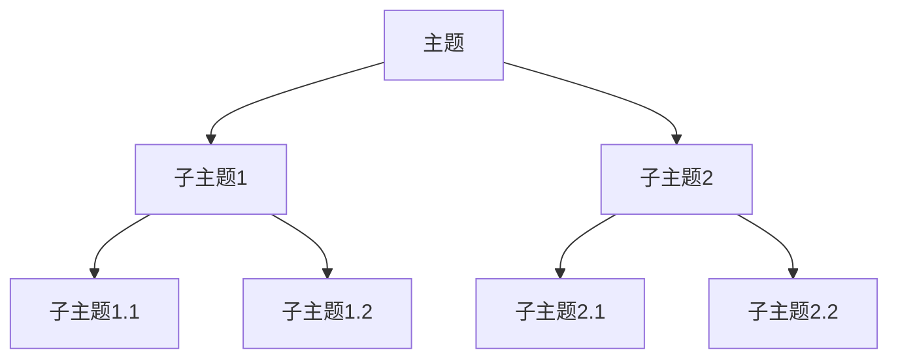
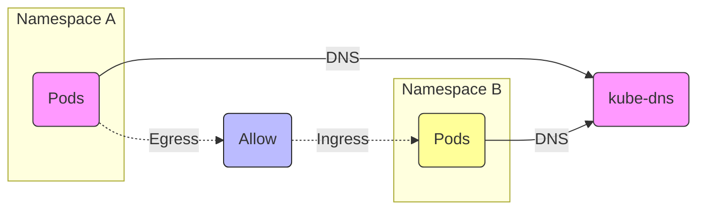
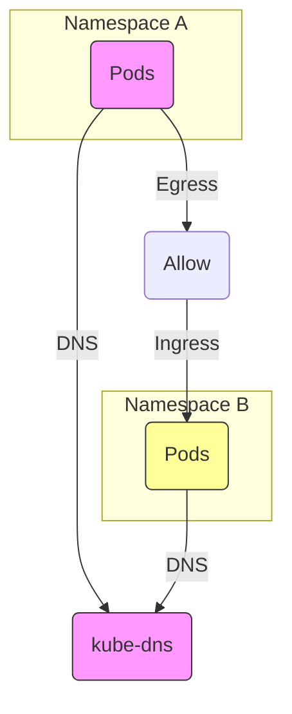
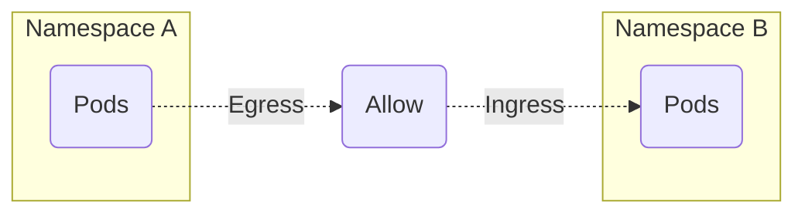
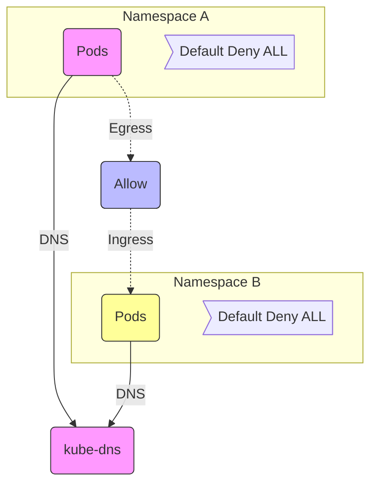
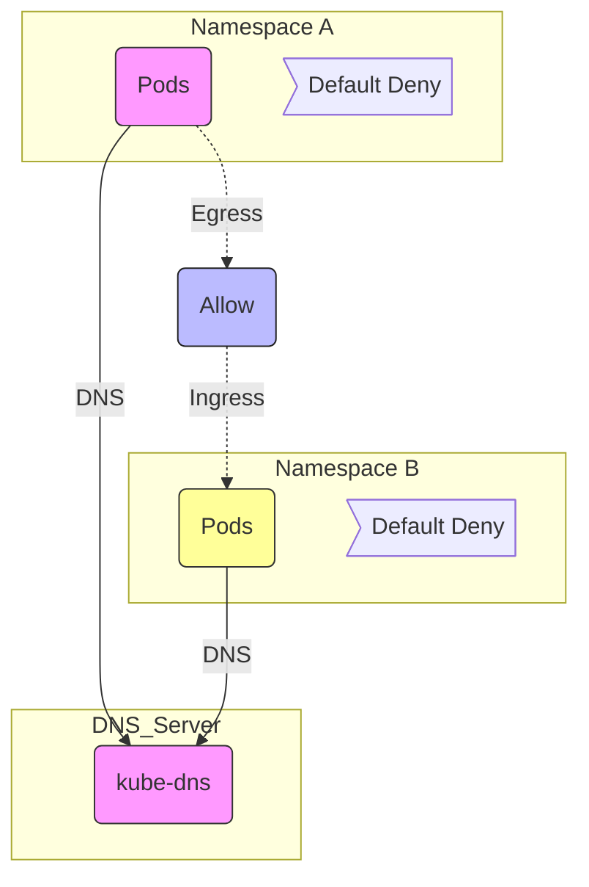
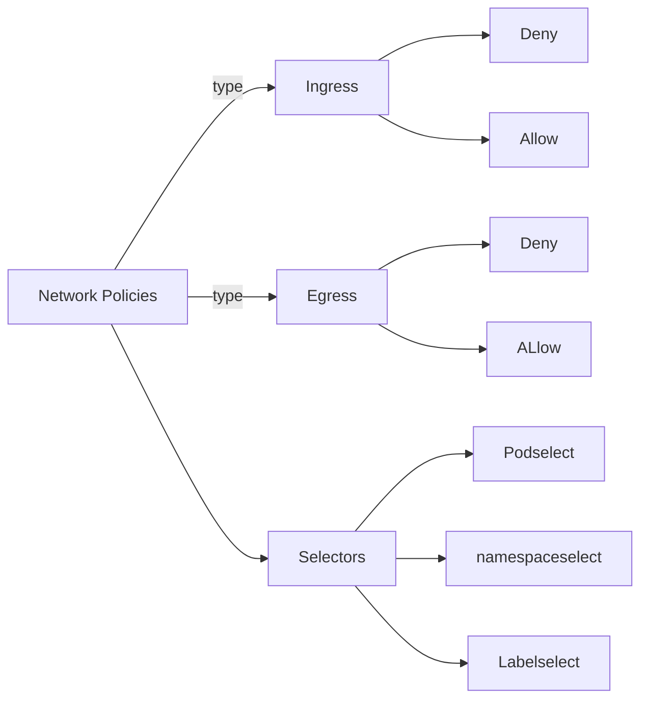
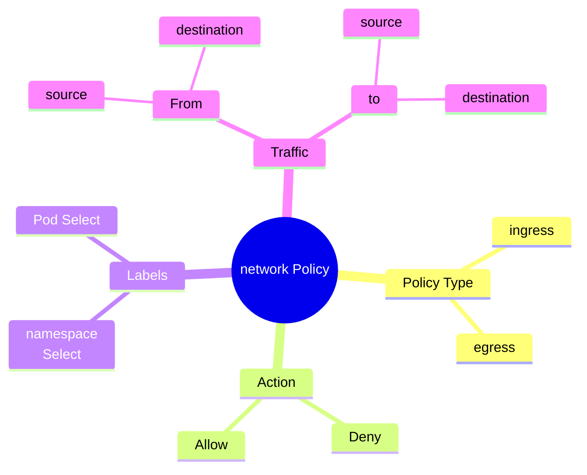

network-policy

```mermaid
graph TD;
  A[主题] --> B[子主题1];
  A --> C[子主题2];
  B --> D[子主题1.1];
  B --> E[子主题1.2];
  C --> F[子主题2.1];
  C --> G[子主题2.2];
```

```mermaid
graph LR
subgraph Namespace A
    id1(Pods)
end

subgraph Namespace B
    id2(Pods)
end

id1 -- DNS --> id3(kube-dns)
id2 -- DNS --> id3

id1-.->|Egress|o1(Allow)
o1-.->|Ingress|id2

style id1 fill:#f9f,stroke:#333
style id2 fill:#ff9,stroke:#333  
style id3 fill:#f9f,stroke:#333
style o1 fill:#bbf,stroke:#222
```

```mermaid
graph TB
subgraph Namespace A
    id1(Pods)
end

subgraph Namespace B
    id2(Pods)
end 

id1 -- DNS --> id3(kube-dns)
id2 -- DNS --> id3

id1-->|Egress|o1(Allow)-->|Ingress|id2

style id1 fill:#f9f,stroke:#333
style id2 fill:#ff9,stroke:#333
style id3 fill:#f9f,stroke:#333

```

```mermaid
graph LR
subgraph Namespace A
    id1(Pods)
end

subgraph Namespace B
    id2(Pods)
end

id1-.->|Egress|o1(Allow)
o1-.->|Ingress|id2

```

```mermaid
graph TB
subgraph Namespace A
    id1(Pods)
    id1a>Default Deny ALL ]
end

subgraph Namespace B  
    id2(Pods)
    id2b>Default Deny ALL ]
end

id1 -- DNS --> id3(kube-dns)  
id2 -- DNS --> id3

id1-.->|Egress|o1(Allow)
o1-.->|Ingress|id2

style id1 fill:#f9f,stroke:#333  
style id2 fill:#ff9,stroke:#333
style id3 fill:#f9f,stroke:#333
style o1 fill:#bbf,stroke:#222

```

```mermaid
graph TB

subgraph Namespace A
    style id1 fill:#f9f,stroke:#333;
    id1(Pods)
    id1a>Default Deny]
end

subgraph Namespace B  
    style id2 fill:#ff9,stroke:#333;
    id2(Pods)
    id2b>Default Deny]
end

subgraph DNS_Server
    style id3 fill:#f9f,stroke:#333;
    id3(kube-dns)
end

id1 -- DNS --> id3
id2 -- DNS --> id3

id1-.->|Egress|o1(Allow)
o1-.->|Ingress|id2

style o1 fill:#bbf,stroke:#222;
```

- dd

```mermaid
graph LR
  A[Network Policies]
  A --> |type|B[Ingress]
  A --> |type|C[Egress]
  B --> D[Deny]
  B --> E[Allow]
  C --> F[Deny]
  C --> G[ALlow]
  A --> Selectors
  Selectors --> Podselect
  Selectors --> namespaceselect
  Selectors --> Labelselect

```
# other 

```mermaid
mindmap
  root((network Policy))
    Policy Type
      ingress
      ::icon(fa fa-book)
      egress
      ::icon(fa fa-thumbs-o-up) 
    Action
      Deny
      Allow
    Labels
      namespace </br> Select
      Pod Select
    Traffic
      From
        source
        destination
      to
        source
        destination
```

