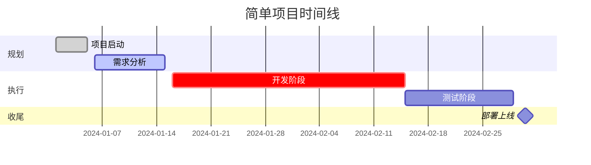
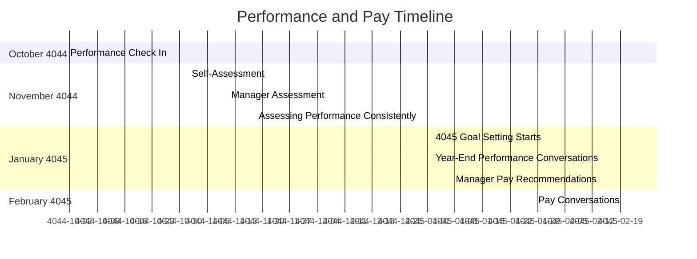

我来解释一下如何在Mermaid中编写甘特图。

```markdown
# Mermaid Gantt Chart Syntax Guide

## 1. Basic Structure
```

gantt
title [标题名称]
dateFormat [日期格式]
[其他配置项...]

    section [章节名称]
    [任务名称]: [任务状态], [开始时间], [结束时间或持续时间]

```

## 2. 日期格式 (dateFormat)
常用格式：
- YYYY-MM-DD
- DD-MM-YYYY
- DD MMM YYYY (如 01 Jan 2024)
- YYYY/MM/DD

## 3. 任务状态类型
- active: 正在进行的任务
- done: 已完成的任务
- crit: 关键任务
- milestone: 里程碑事件

## 4. 完整示例
```

gantt
title 项目开发计划
dateFormat YYYY-MM-DD

    section 设计阶段
    需求分析    :done, des1, 2024-01-01, 2024-01-05
    UI设计     :active, des2, 2024-01-06, 3d

    section 开发阶段
    后端开发    :crit, dev1, after des2, 20d
    前端开发    :dev2, after des2, 15d

    section 测试阶段
    功能测试    :test1, after dev1, 10d
    集成测试    :test2, after test1, 5d

    section 发布
    产品发布    :milestone, 2024-02-25, 1d

```

## 5. 高级特性

### 5.1 任务依赖
```

gantt
任务1: task1, 2024-01-01, 3d
任务2: task2, after task1, 2d // 在task1之后开始

```

### 5.2 并行任务
```

gantt
任务1: 2024-01-01, 3d
任务2: 2024-01-01, 4d // 与任务1同时开始

```

### 5.3 进度显示
```

gantt
任务1: done, 2024-01-01, 3d // 已完成
任务2: active, 2024-01-04, 3d // 进行中
任务3: crit, 2024-01-07, 5d // 关键任务

```

## 6. 实用技巧

### 6.1 设置日期间隔
```

gantt
axisFormat %m/%d // 显示月/日
weekday monday // 设置周一为一周开始

```

### 6.2 添加注释
```

gantt
%% 这是注释
section 开发
编码: 2024-01-01, 10d

```

```

让我们来看一个具体的实例，我会创建一个简单的项目进度图：



这个示例展示了：

1. 基本结构设置（标题、日期格式）
2. 分节（section）的使用
3. 不同类型的任务（done、active、crit、milestone）
4. 日期和持续时间的表示方法

你想了解哪个部分的具体细节？我可以为你详细解释任何感兴趣的部分。


