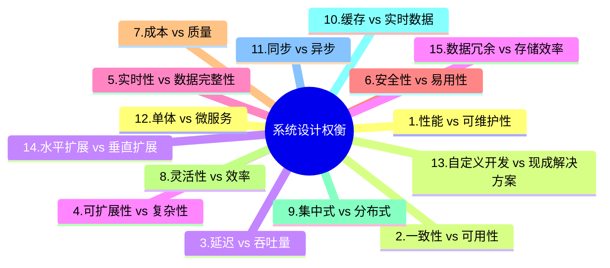

当然,我很乐意为您创建一个关于"15个每位高级开发者必须了解的系统设计权衡"的中文图表。我们将使用思维导图的形式来展示这些权衡,这样可以更直观地呈现信息。

这个思维导图展示了15个关键的系统设计权衡。让我为您详细解释每一个:

1. 性能 vs 可维护性: 高性能系统可能会牺牲代码的可读性和可维护性。

2. 一致性 vs 可用性: 在分布式系统中,强一致性可能会影响系统的可用性。

3. 延迟 vs 吞吐量: 降低延迟可能会减少系统的总体吞吐量。

4. 可扩展性 vs 复杂性: 设计高度可扩展的系统可能会增加系统的复杂性。

5. 实时性 vs 数据完整性: 追求实时数据处理可能会影响数据的完整性和准确性。

6. 安全性 vs 易用性: 增加安全措施可能会降低系统的易用性。

7. 成本 vs 质量: 提高系统质量通常意味着更高的开发和维护成本。

8. 灵活性 vs 效率: 设计灵活的系统可能会牺牲某些特定场景下的效率。

9. 集中式 vs 分布式: 集中式系统易于管理,但分布式系统更具可扩展性。

10. 缓存 vs 实时数据: 使用缓存可以提高性能,但可能导致数据不是最新的。

11. 同步 vs 异步: 同步操作简单直接,而异步操作可以提高系统的响应性。

12. 单体 vs 微服务: 单体架构开发简单,微服务架构更灵活但复杂。

13. 自定义开发 vs 现成解决方案: 自定义开发可以精确满足需求,但可能耗时更长。

14. 水平扩展 vs 垂直扩展: 水平扩展通过添加更多机器来提高capacity,垂直扩展则是升级现有机器。

15. 数据冗余 vs 存储效率: 数据冗余可以提高可用性和性能,但会增加存储成本。

这些权衡在系统设计中经常出现,高级开发者需要根据具体情况做出明智的选择。每个权衡都没有绝对的对错,关键是要理解它们的影响,并根据项目的具体需求和约束来做决策。

您对其中的某个特定权衡感兴趣吗?我可以为您提供更详细的解释。
