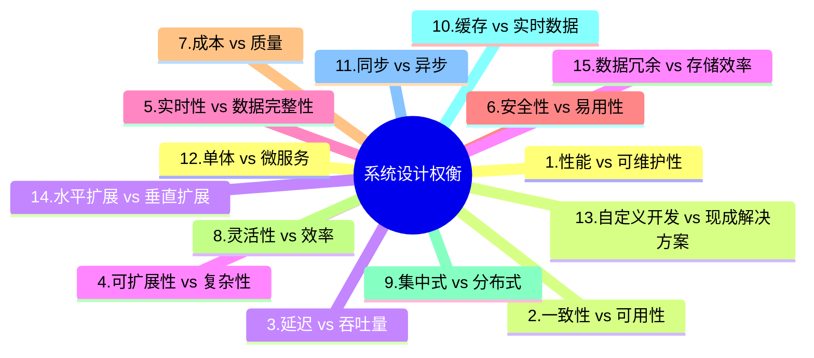

System design
Want to get started with System design interview preparation, start with these:

1. Learn to understand requirements
2. Learn the difference between horizontal and vertical scaling.
3. Study latency and throughput trade-offs and optimization techniques.
4. Understand the CAP Theorem (Consistency, Availability, Partition Tolerance).
5. Learn HTTP/HTTPS protocols, request-response lifecycle, and headers.
6. Understand DNS and how domain resolution works.
7. Study load balancers, their types (Layer 4 and Layer 7), and algorithms.
8. Learn about CDNs, their use cases, and caching strategies.
9. Understand SQL databases (ACID properties, normalization) and NoSQL types (key-value, document, graph).
10. Study caching tools (Redis, Memcached) and strategies (write-through, write-back, eviction policies).
11. Learn about blob storage systems like S3 or Google Cloud Storage.
12. Study sharding and horizontal partitioning of databases.
13. Understand replication (leader-follower, multi-leader) and consistency models.
14. Learn failover mechanisms like active-passive and active-active setups.
15. Study message queues like RabbitMQ, Kafka, and SQS.
16. Understand consensus algorithms such as Paxos and Raft.
17. Learn event-driven architectures, Pub/Sub models, and event sourcing.
18. Study distributed transactions (two-phase commit, sagas).
19. Learn rate-limiting techniques (token bucket, leaky bucket algorithms).
20. Study API design principles for REST, GraphQL, and gRPC.
21. Understand microservices architecture, communication, and trade-offs with monoliths.
22. Learn authentication and authorization methods (OAuth, JWT, SSO).
23. Study metrics collection tools like Prometheus or Datadog.
24. Understand logging systems (e.g., ELK stack) and tracing tools (OpenTelemetry, Jaeger).
25. Learn about encryption (data at rest and in transit) and rate-limiting for security.
26. And then practice the most commonly asked questions like URL shorteners, chat systems, ride-sharing apps, search engines, video streaming, and e-commerce websites.

想要开始准备系统设计面试吗？从这些开始：

1. 学习理解需求
2. 学习横向和纵向扩展的区别。
3. 研究延迟和吞吐量的权衡和优化技术。
4. 理解 CAP 定理（一致性、可用性、分区容错性）。
5. 学习 HTTP/HTTPS 协议、请求-响应生命周期和标头。
6. 理解 DNS 以及域名解析的工作原理。
7. 研究负载均衡器、它们的类型（第 4 层和第 7 层）以及算法。
8. 了解 CDN、它们的用例和缓存策略。
9. 理解 SQL 数据库（ACID 属性、规范化）和 NoSQL 类型（键值、文档、图）。
10. 研究缓存工具（Redis、Memcached）和策略（直写、回写、淘汰策略）。
11. 了解 blob 存储系统，如 S3 或 Google Cloud Storage。
12. 研究数据库的分片和水平分区。
13. 理解复制（领导者-追随者、多领导者）和一致性模型。
14. 学习故障转移机制，如双活和主备设置。
15. 研究消息队列，如 RabbitMQ、Kafka 和 SQS。
16. 理解共识算法，如 Paxos 和 Raft。
17. 学习事件驱动架构、发布/订阅模型和事件溯源。
18. 研究分布式事务（两阶段提交、sagas）。
19. 学习限速技术（令牌桶、漏桶算法）。
20. 研究 REST、GraphQL 和 gRPC 的 API 设计原则。
21. 理解微服务架构、通信以及与单体架构的权衡。
22. 学习身份验证和授权方法（OAuth、JWT、SSO）。
23. 研究指标收集工具，如 Prometheus 或 Datadog。
24. 理解日志系统（例如 ELK 堆栈）和跟踪工具（OpenTelemetry、Jaeger）。
25. 了解加密（静态数据和传输中数据）以及安全限速。
26. 然后练习最常见的题目，例如 URL 缩短器、聊天系统、拼车应用、搜索引擎、视频流和电子商务网站。

当然,我很乐意为您创建一个关于"15个每位高级开发者必须了解的系统设计权衡"的中文图表。我们将使用思维导图的形式来展示这些权衡,这样可以更直观地呈现信息。

这个思维导图展示了15个关键的系统设计权衡。让我为您详细解释每一个:

1. 性能 vs 可维护性: 高性能系统可能会牺牲代码的可读性和可维护性。

2. 一致性 vs 可用性: 在分布式系统中,强一致性可能会影响系统的可用性。

3. 延迟 vs 吞吐量: 降低延迟可能会减少系统的总体吞吐量。

4. 可扩展性 vs 复杂性: 设计高度可扩展的系统可能会增加系统的复杂性。

5. 实时性 vs 数据完整性: 追求实时数据处理可能会影响数据的完整性和准确性。

6. 安全性 vs 易用性: 增加安全措施可能会降低系统的易用性。

7. 成本 vs 质量: 提高系统质量通常意味着更高的开发和维护成本。

8. 灵活性 vs 效率: 设计灵活的系统可能会牺牲某些特定场景下的效率。

9. 集中式 vs 分布式: 集中式系统易于管理,但分布式系统更具可扩展性。

10. 缓存 vs 实时数据: 使用缓存可以提高性能,但可能导致数据不是最新的。

11. 同步 vs 异步: 同步操作简单直接,而异步操作可以提高系统的响应性。

12. 单体 vs 微服务: 单体架构开发简单,微服务架构更灵活但复杂。

13. 自定义开发 vs 现成解决方案: 自定义开发可以精确满足需求,但可能耗时更长。

14. 水平扩展 vs 垂直扩展: 水平扩展通过添加更多机器来提高capacity,垂直扩展则是升级现有机器。

15. 数据冗余 vs 存储效率: 数据冗余可以提高可用性和性能,但会增加存储成本。

这些权衡在系统设计中经常出现,高级开发者需要根据具体情况做出明智的选择。每个权衡都没有绝对的对错,关键是要理解它们的影响,并根据项目的具体需求和约束来做决策。

您对其中的某个特定权衡感兴趣吗?我可以为您提供更详细的解释。
