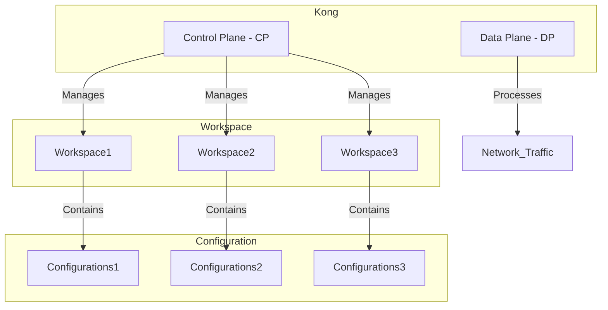
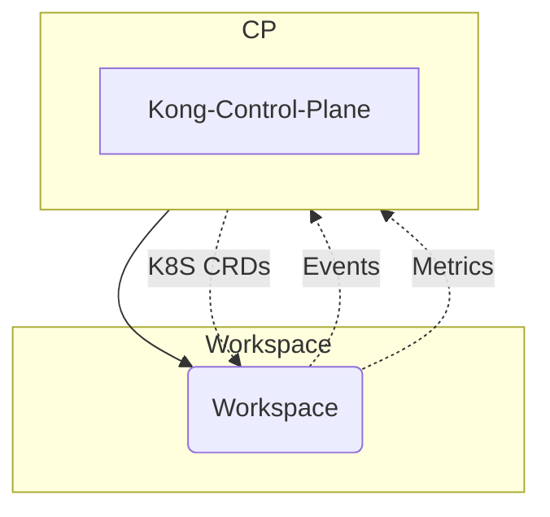
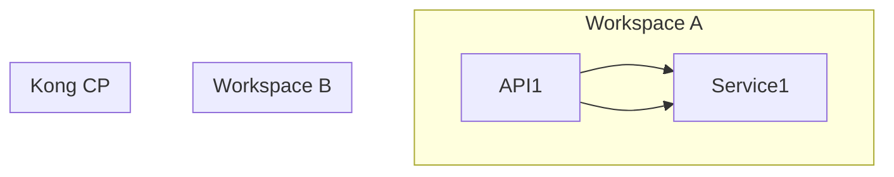

在Kong的配置中，CP和DP分别代表Control Plane和Data Plane，它们是Kong的架构组件。CP负责管理和配置Kong节点，而DP则处理实际的API流量。CP和DP之间通过WSS（WebSocket Secure）协议进行通信，确保配置的同步和实时性。

CP（Control Plane）负责以下工作：
1. 管理API和插件的配置信息。
2. 接收来自管理员的配置更改请求，如添加、更新或删除API、插件等。
3. 将配置变更传播给DP，以便应用到实际的API流量处理。
4. 提供管理界面（例如Kong的Admin API）供管理员操作。

DP（Data Plane）负责以下工作：
1. 处理实际的API流量，包括请求的转发、鉴权、限流等。
2. 从CP接收配置信息，并根据配置进行流量处理。
3. 向CP报告节点的健康状况和统计数据，以帮助监控和决策。

当谈到Kong的CP（Control Plane）和DP（Data Plane）时，
CP是负责管理和配置的控制平面，
而DP是处理网络流量的数据平面。

Workspace是Kong的一个重要概念，

它允许您在同一个Kong实例内部管理多个独立的环境。

Workspace与CP之间的关系是这样的：每个Workspace是一个隔离的配置环境，可以有自己的插件、服务、路由等配置。CP是管理这些Workspace的控制平面，您可以在CP中创建、编辑和删除Workspace，以及在Workspace中配置各种Kong对象。每个Workspace中的配置是相互隔离的，这使得您可以在同一个Kong实例上管理多个环境，比如开发、测试和生产。

通过Workspaces，您可以在同一个Kong实例上管理多个环境的配置，而不会相互干扰。这有助于简化多环境部署和管理，同时提高了配置的可维护性和灵活性。

当涉及Kong的CP（Control Plane，控制平面）和Workspace之间的关系时，可以将其理解为以下几个关键点：

1. **Control Plane（控制平面）**：CP是Kong的管理和配置部分，负责处理API、插件、路由、服务等的配置和管理。它提供了API和界面，供管理员和开发人员使用，以便创建、修改和删除Kong的各种配置元素。CP与实际处理网络流量的Data Plane（数据平面）是分离的。

2. **Workspace（工作空间）**：Workspace是Kong中的一个重要概念，它允许您在同一个Kong实例内部创建多个独立的配置环境。每个Workspace都可以拥有自己的API、插件、路由等配置，这些配置是相互隔离的，不会相互干扰。这意味着您可以在同一个Kong实例上管理多个环境，如开发、测试和生产，而不会发生冲突。

3. **关系**：CP是管理和控制Workspace的入口。您可以在CP中创建、编辑和删除Workspace，还可以在CP中选择要操作的特定Workspace，然后在该Workspace中配置Kong的各种对象。CP允许您在不同的Workspace之间切换，以便有效地管理和维护各个环境的配置。

综上所述，Workspace是一种机制，允许您在同一个Kong实例上管理多个隔离的环境，而CP是您与这些Workspace交互的接口。通过Workspace，您可以在不同的环境中配置Kong，同时保持这些配置的隔离性，从而提高了部署和管理的灵活性和
非常抱歉，我理解您的意思了。以下是经过修正的Mermaid格式的Markdown流程图，更清楚地展示了CP、DP和Workspace之间的关系：

复制上述Markdown代码并在支持Mermaid图的环境中查看，您将会看到一个图表，清楚地显示了Control Plane（CP）与Data Plane（DP）之间的关系，以及它们与Workspace和数据流之间的交互。

关于WebSocket支持，Kong高级版本中确实支持WebSocket的API。您可以通过Kong的插件来启用WebSocket支持，例如"websocket-termination"插件。这使得Kong能够处理WebSocket连接，以及在WebSocket连接上执行插件功能，如认证、鉴权、限流等。

总之，CP和DP在Kong中扮演着不同的角色，CP负责配置和管理，DP负责实际的API流量处理，它们通过WSS协议进行通信以保持同步。高级版本的Kong支持WebSocket的API，并且您可以通过插件来启用和配置WebSocket支持功能。

这里是使用mermaid绘制Kong的CP和Workspace之间关系的markdown代码:

这个mermaid图展示了:

- Kong的CP和Workspace之间的关系
- CP通过K8S CRDs来配置Workspace
- Workspace通过Events和Metrics来与CP进行交互

CP作为控制平面,负责配置和管理Workspace。Workspace作为数据平面,执行真正的服务流量处理。两者通过CRDs, Events和Metrics相互协作。

Kong CP（Kong Control Plane）的工作区（Workspace）主要用于多租户环境和版本控制。在Kong CP中，不同的工作区是相互隔离的，这意味着不同工作区内的配置是分离的，包括API定义。因此，你可以在不同的工作区中部署完全相同的API，而它们之间不会互相干扰。

这种隔离性使得在多个环境中或为不同的客户提供服务时能够更轻松地管理和控制API配置的版本和访问权限。但请注意，Kong CP中的工作区管理需要额外的配置和权限控制，以确保不同工作区之间的隔离性。

以下是一个简单的Mermaid流程图，说明了Kong CP工作区的隔离性：

上面的图示示例了两个工作区A和B，它们都使用相同的API1，但它们是相互隔离的，与Kong CP中的Service1关联。这意味着你可以在不同的工作区中定义和配置API，而它们不会相互冲突。

对于Kong网关来说,如果Control Plane (CP,控制平面)支持了某个新插件,那么相应的Data Plane (DP,数据平面)也需要更新才能支持该插件。

Kong的架构分为控制平面(CP)和数据平面(DP)两部分:

- 控制平面负责管理Kong的配置,包括添加/删除服务、路由、插件等。当在CP中启用某个新插件时,它只是将该插件的配置持久化到Kong的存储层(如PostgreSQL)中。

- 数据平面负责实际处理客户端请求,包括执行插件逻辑。因此,只有当DP也支持该新插件时,插件的处理逻辑才能在请求时真正生效。

所以CP和DP需要保持版本一致,确保CP配置的所有插件都能被DP正确执行。如果CP支持的插件在DP中不存在或版本不匹配,该插件将无法正常工作。因此,当CP中添加新插件支持时,对应的DP版本也需要更新以支持该插件。
