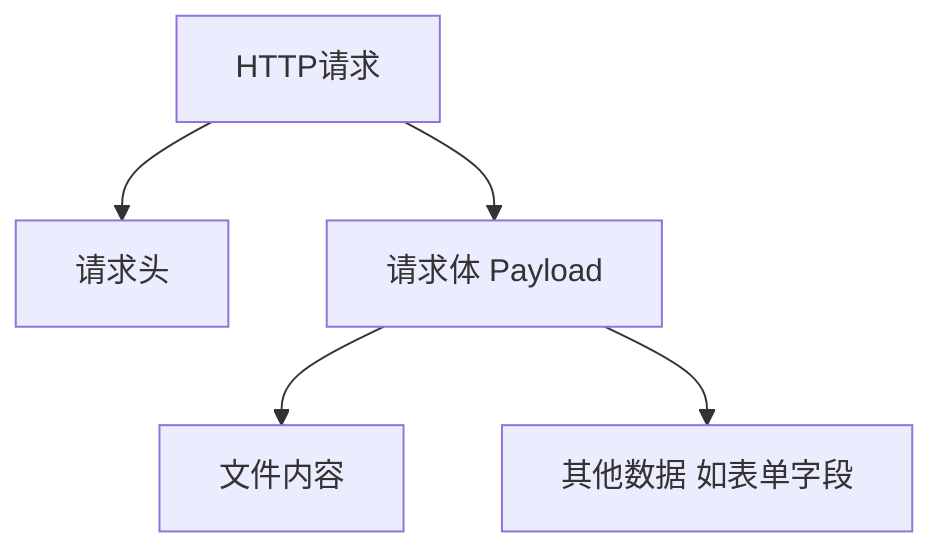
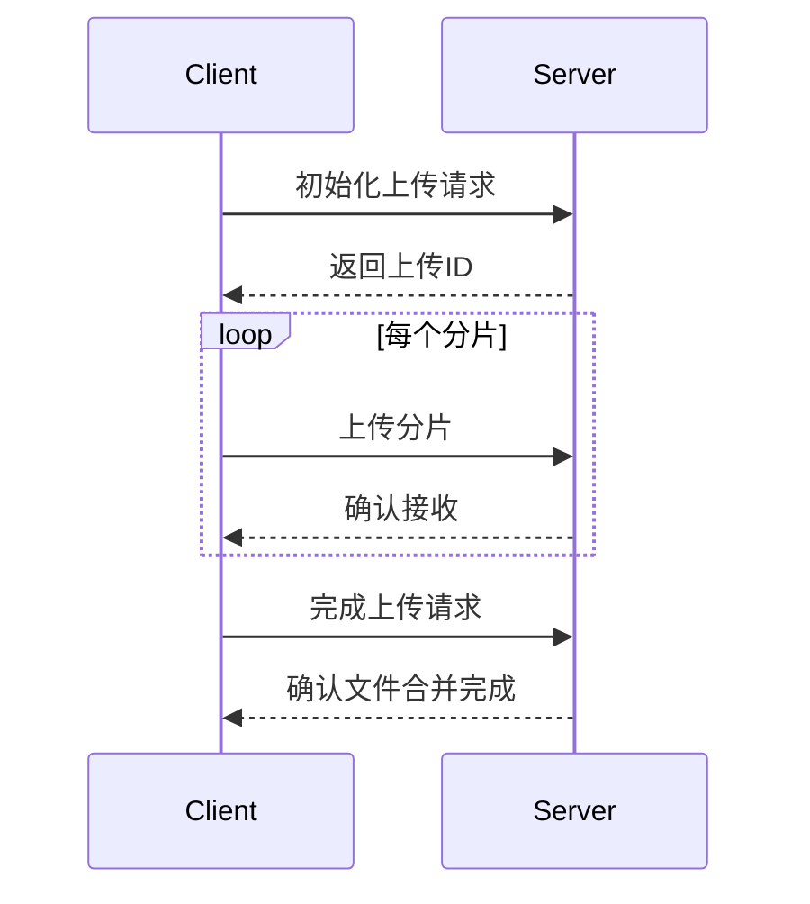

### 概念解释

#### 1. Payload Size

- **定义**：Payload Size通常指的是HTTP请求体的大小。在RESTful API中，请求的有效载荷（即数据）通常是以JSON、XML或表单数据的形式存在的。
- **用途**：Payload Size的重要性在于，服务器需要能处理的请求体大小，以避免因为非法的请求体导致内存溢出或服务器变慢。

#### 2. `client_max_body_size` （Nginx）

- **定义**：`client_max_body_size`是Nginx中的一个配置选项，用于限制HTTP请求体的大小。默认值是1MB。
- **用途**：这个设置可以防止过大的请求体对Nginx及其后端服务造成压力，保护服务器资源。
- **配置示例**：
  ```nginx
  server {
      client_max_body_size 10M;  # 最大请求体为10MB
  }
  ```

### 区别

- **范围**：Payload Size是一个更一般的概念，适用于任何HTTP请求，而`client_max_body_size`是Nginx特定的配置项。
- **功能**：Payload Size描述的是请求的数据大小，而`client_max_body_size`则是Nginx为了防止过大请求体而引入的限制。若请求体大于设置的值，Nginx将返回413错误。
  
### Kong Gateway中的Payload Size概念

在Kong Gateway中，有类似的概念，但表现形式略有不同：

- **Kong的配置**：Kong允许用户设置一个请求体的最大大小，但是这个设置可以通过不同的插件来管理。例如，使用[Kong Request Size Limiting Plugin](https://docs.konghq.com/hub/kong-inc/request-size-limiting/)来限制请求体的大小。
  
- **配置示例**：
  ```yaml
  plugins:
    - name: request-size-limiting
      config:
        allowed_payload_size: 10485760  # 最大请求体为10MB
  ```

### 总结

- **Payload Size**是HTTP请求体大小的通用概念，而`client_max_body_size`是Nginx的具体配置项，用来限制请求体的最大尺寸。
- 在Kong Gateway中，虽然没有直接叫做“Payload Size”的配置，但你可以通过插件来实现类似的功能，限制请求体的大小以避免资源消耗。

这种理解能够帮助设置和优化你的API网关和服务器配置。

是的，您说得对。`client_max_body_size` 确实包含了文件上传的大小。在 Nginx 中，这个设置用于限制所有类型的请求体大小，包括但不限于文件上传。

### 详细分析

#### 1. `client_max_body_size` 的作用

- **限制请求体大小**：该配置项限制了Nginx可以接受的整个请求体的最大大小。这意味着，无论请求体中的内容是什么（文本数据，JSON数据，还是文件上传），如果超出该限制，Nginx都会拒绝该请求。

#### 2. 文件上传的情境

- **文件上传**：在文件上传的场景中，上传的文件内容正是请求体的一部分。因此，如果文件的大小与其他数据（如元数据）一起超过 `client_max_body_size` 指定的限制，则 Nginx 会返回 413 (Request Entity Too Large) 错误。

#### 3. 示例

假设你有以下 Nginx 配置：

```nginx
server {
    client_max_body_size 5M;  # 最大请求体为5MB
}
```

在这个配置下：

- 如果用户尝试上传一个大于 5MB 的文件，Nginx 会拒绝该请求并返回 413 错误。
- 如果请求中包含多个文件，所有文件及其他数据的总大小必须小于 5MB。

### 总结

- `client_max_body_size` 直接影响文件上传的能力，因为它涵盖了请求体的所有数据。
- 这一限制在设计时应考虑到用户的上传需求，以确保不会因资源限制而影响用户体验。


对于 Nginx 而言，当用户请求设置 `payload size` 为 2048G（即 2TB）时，这通常意味着他们打算处理或发送非常大的数据量。下面是一些可能的用途和场景。

### 1. 大数据传输
- **数据备份**：用户可能在进行大数据备份或恢复操作，需要在一次请求中传输大量的数据。
- **数据迁移**：在系统迁移或数据转移过程中，可能需要一个请求上传或下载非常大的数据集。

### 2. 流媒体应用
- **视频流或音频流**：媒体服务可以需要发送或接收大文件，例如高清视频流或高质量音频流。
- **实时数据处理**：在某些应用中，可能需要实时处理流式数据，这会涉及到大规模的数据传输。

### 3. 科学计算或分析
- **机器学习和科学计算**：某些科学计算应用或机器学习模型训练可能需要加载或处理大量的输入数据。

### 4. 大文件的合成
- **生成大文件**：用户可能期望通过Nginx生成或处理特别大的合成文件，例如数据汇总文件或压缩文件。

### Nginx 配置建议

对于如此大的 `payload size`，需要考虑以下几点：

1. **`client_max_body_size`**：
   - 设置 Nginx 的 `client_max_body_size` 来允许接收此类请求。例如：
     ```nginx
     server {
         client_max_body_size 2048G;  # 允许的最大请求体
     }
     ```

2. **性能优化**：
   - 为了确保 Nginx 能够有效处理大请求，可能需要调整其他相关配置，如 `proxy_buffer_size` 和 `proxy_buffers` 等，以防止因请求过大导致性能下降。

3. **网络带宽**：
   - 大文件传输时，确保网络带宽足够，避免因带宽瓶颈导致的传输速率慢或失败。

4. **超时配置**：
   - 适当配置请求超时报错的设置，确保大文件传输过程中的网络波动不会立即导致连接关闭。例如调整 `client_body_timeout` 和 `send_timeout`。

### 总结

用户请求的 `payload size = 2048G` 可以是多种场景下所需的高数据量传输，确保 Nginx 的配置适应这种需求是非常重要的。同时，注意到这样的配置可能会带来性能和资源的挑战，建议与用户沟通具体需求和期望，确保部署环境的稳定性与安全性。


当用户在 Nginx 中请求将 `payload size` 设置为 2048G（即 2TB）时，这通常意味着他们希望处理或发送非常大的数据量。以下是一些可能的用途和场景：

## 可能的用途和场景

1. **大文件上传**：
   - 用户可能希望上传大型文件，如视频、数据库备份或其他类型的媒体文件。这通常涉及到文件上传的大小限制，而不是单纯的请求负载大小。

2. **数据传输**：
   - 在某些情况下，用户可能需要通过 API 发送大量数据，例如批量数据处理或大规模数据迁移。

3. **流媒体服务**：
   - 对于流媒体应用，可能需要处理大量数据以支持高质量的视频或音频流。

4. **科学计算或大数据处理**：
   - 一些应用可能涉及到科学计算或大数据分析，这些应用需要处理大量的输入数据。

## API 平台的必要性

在 API 平台中，设置 `payload size` 的需求通常与文件上传大小有关。Nginx 默认的最大请求体大小为 1MB，但可以通过 `client_max_body_size` 指令进行调整，以满足更大的文件上传需求[2][3]。因此，用户请求的 2TB 大小更可能是针对文件上传限制的需求，而不仅仅是请求负载的大小。

在实际应用中，API 开发者需要确保配置适当的上传大小限制，以避免因请求过大而导致的错误（如 413 请求实体过大错误）。对于需要处理大文件的应用，合理配置 Nginx 的 `client_max_body_size` 是必要的[4][6][7]。

Citations:
[1] https://github.com/nginx-proxy/nginx-proxy/issues/981
[2] https://www.linkedin.com/pulse/increase-limit-user-file-upload-size-nginx-ankit-kumar-rajpoot
[3] https://docs.nginx.com/nginx-management-suite/acm/how-to/policies/request-body-size-limit/
[4] https://github.com/cpriego/valet-linux/issues/222
[5] https://forum.yunohost.org/t/maximum-size-video-upload/16748
[6] https://stackoverflow.com/questions/26717013/how-to-edit-nginx-conf-to-increase-file-size-upload
[7] https://docs.rackspace.com/docs/limit-file-upload-size-in-nginx


你提出了一个很好的问题。让我们深入探讨一下这个问题的几个方面：

1. Payload Size vs 文件上传大小




实际上，payload size 和文件上传大小是有区别的：

- Payload size 指的是整个 HTTP 请求体的大小，包括文件内容和其他可能的数据（如表单字段）。
- 文件上传大小特指上传的文件本身的大小。

对于 API 平台来说，通常更关心的是文件上传大小限制，而不是整个 payload 的大小。然而，设置 payload size 限制可以作为一个额外的安全层。

2. 2048G（2TB）payload size 的必要性

对于大多数 API 平台来说，2TB 的 payload size 限制可能是过大的：

- 大多数 API 操作不需要如此大的数据传输。
- 如此大的限制可能会带来安全风险，如 DDoS 攻击。
- 处理如此大的请求可能会对服务器资源造成巨大压力。

3. 大文件上传的替代方案

对于需要处理大文件的 API 平台，通常有更好的替代方案：

a. 分片上传




分片上传允许客户端将大文件分成小块逐个上传，服务器端再将这些分片组合成完整文件。这种方法更可控，也更易于管理。

b. 使用专门的文件传输协议

对于非常大的文件，可以考虑使用专门的文件传输协议，如 FTP 或 SFTP，而不是通过 HTTP API。

c. 云存储集成

将文件直接上传到云存储服务（如 Amazon S3、Google Cloud Storage），然后将文件的引用传给 API。

4. API 平台的最佳实践

对于 API 平台，建议：

- 设置合理的文件上传大小限制，通常在几百 MB 到几 GB 之间。
- 实现分片上传机制来处理大文件。
- 提供明确的文档，说明文件大小限制和推荐的上传方法。
- 考虑不同类型请求的特性，可能对不同端点设置不同的大小限制。

5. Nginx 配置

即使决定允许大文件上传，也应该在 Nginx 配置中设置合理的限制：

```nginx
http {
    client_max_body_size 100M;  # 设置一个合理的默认值

    server {
        location /upload {
            client_max_body_size 1G;  # 对特定的上传路径设置更大的限制
        }
    }
}
```

这样可以为大多数请求保持较小的限制，只在必要的地方允许更大的上传。

总结来说，对于 API 平台，通常不需要也不建议设置如 2TB 这样巨大的 payload size。相反，应该实现更智能和安全的大文件处理机制，如分片上传，并设置合理的大小限制。这样可以在支持大文件上传和维护系统安全性、性能之间取得平衡。
