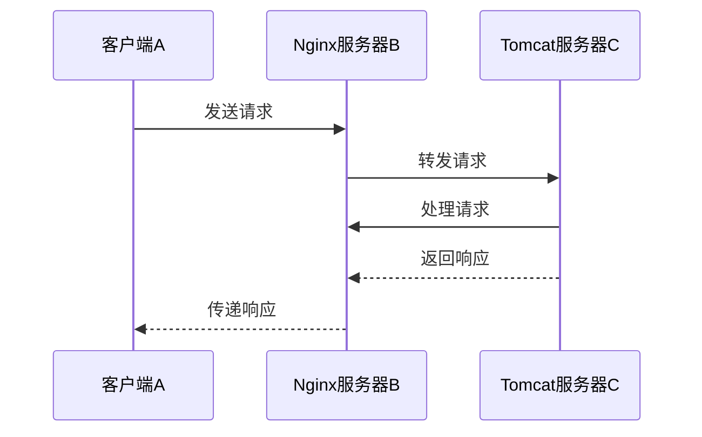
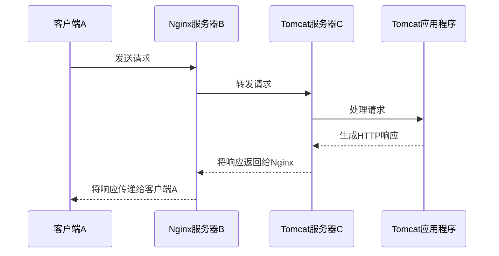

理解你的需求，你想了解一个包括客户端A、Nginx服务器B、Tomcat服务器C的请求流程，并关注Tomcat服务器C如何将数据返回给客户端A，以及是否与C的上网或流出模式有关。如果C有自己独立的网关，也需要考虑。

以下是一个简要的请求流程示意图，使用Mermaid标记的流程图：

这个流程解释如下：

1. 客户端A向Nginx服务器B发送请求。
2. Nginx服务器B接收到请求后，根据配置将请求转发给Tomcat服务器C。
3. Tomcat服务器C接收到请求后，处理请求（执行Java程序等）。
4. Tomcat服务器C将处理结果作为响应返回给Nginx服务器B。
5. Nginx服务器B将Tomcat服务器C返回的响应传递给客户端A。

至于Tomcat服务器C的数据如何返回给客户端A以及是否与C的上网或流出模式有关，这取决于以下因素：

- Tomcat服务器C上部署的应用程序：应用程序可能通过HTTP响应将数据发送回Nginx服务器B，然后再传递给客户端A。

- 网络配置：如果Tomcat服务器C有自己独立的网关，那么网络配置和路由规则会影响响应返回路径。如果有出站代理或NAT规则，这也可能会影响数据的返回路径。

- 防火墙规则：防火墙规则可能会阻止或允许特定流量的通过，因此需要确保防火墙规则不会阻止响应流量。

需要根据具体的环境和配置来详细分析响应返回的路径和流程。如果有更具体的信息或配置，我可以提供更详细的解释。

当Tomcat服务器C上部署的应用程序通过HTTP响应将数据发送回Nginx服务器B，然后再传递给客户端A时，这个过程可以更详细地细化如下：

这个细化流程包括以下步骤：

1. 客户端A向Nginx服务器B发送请求。
2. Nginx服务器B接收到请求后，根据配置将请求转发给Tomcat服务器C。
3. Tomcat服务器C接收到请求后，将请求交给部署在其上的应用程序进行处理。
4. 应用程序（App）处理请求并生成HTTP响应。
5. Tomcat服务器C将应用程序生成的HTTP响应返回给Nginx服务器B。
6. Nginx服务器B将Tomcat服务器C返回的响应传递给客户端A。

这样的细化流程突出了应用程序在Tomcat服务器C中的角色，说明了它是如何处理请求并生成响应的，然后响应是如何从Tomcat服务器传递回Nginx服务器并最终传递给客户端A的。

当Tomcat服务器C拥有自己独立的网关时，网络配置和路由规则可能会对响应的返回路径产生影响。在这个上下文中，"返回路径"指的是响应从Tomcat服务器C返回给客户端A的传输路径。

这包括响应从Tomcat服务器C出发，经过不同的网络设备和路由，最终到达客户端A的过程。

以下是可能带来影响的因素：

1. **网络配置和路由规则**：Tomcat服务器C以及其独立的网关可能会有特定的网络配置和路由规则。这些规则决定了响应数据流经哪些网络设备和路径，以及如何返回到客户端A。如果这些规则配置不正确或不合理，可能会导致响应无法正确返回或延迟。

2. **出站代理**：如果Tomcat服务器C上有出站代理配置，这会影响响应的返回路径。出站代理充当中间层，可能会修改响应头或将响应重定向到不同的地址。这可能导致响应的最终路径与预期不符。

3. **NAT规则**：Network Address Translation (NAT) 规则可以将内部IP地址映射到外部IP地址。如果存在NAT规则，响应数据的源IP地址和目标IP地址可能会被修改，这也会影响响应的返回路径。

4. **路由路径**："返回路径"不仅指的是物理路径，还包括路由路径。路由路径指的是数据包从源到目的地经过的路由器路径。不正确的路由配置可能导致响应丢失或传递到错误的目的地。

总之，响应的返回路径涵盖了物理网络路径、路由路径以及可能的中间代理和网络设备。如果其中任何一个配置不正确或出现问题，响应的传递可能会受到干扰，导致延迟、丢失或无法正常完成请求-响应循环。因此，确保网络配置和路由规则正确设置是保障请求和响应正常传递的关键。

如果Tomcat服务器C到客户端A的网络根本不通，那么整个链路的维持将依赖于Tomcat服务器C将应用程序生成的HTTP响应返回给Nginx服务器B，然后由Nginx服务器B将响应传递给客户端A。这是一种常见的代理模式，通常称为反向代理。

在这种情况下，Tomcat服务器C充当了应用程序的执行环境，但无法直接将响应发送回客户端A，因为网络不通。相反，Tomcat服务器C将响应发送给Nginx服务器B，然后Nginx服务器B负责将响应传递给客户端A。这样的架构可以有一些好处，例如负载均衡、安全性和缓存控制。

维护这种响应模式的关键在于确保Nginx服务器B和Tomcat服务器C之间的通信是可靠的，并且Nginx服务器B正确处理来自Tomcat服务器C的响应。这可能涉及到Nginx配置的调整，以确保它能够正确地接收和传递响应。

总结来说，如果C到A的网络不通，你可以依赖Tomcat服务器C将应用程序生成的HTTP响应返回给Nginx服务器B，然后由Nginx服务器B将响应传递给客户端A，这是一种反向代理的模式，通常用于分布式应用程序架构中。

我想了解这样一个工作流 假设我的客户端是A 发送请求给了一个nginx 服务器B 这个B 又将请求转发给了服务器C 而且C是一个tomcat 的Java程序。那么我想了解详细的请求流程，我比较关心的是tomcat 的数据是如何发挥给客户端A的、这个是否跟C的上网或者说流出模式有关？假设C有自己独立的网关？如果可以给我信息的流程

想了解一个包括客户端A、Nginx服务器B、Tomcat服务器C的请求流程，A-B- C 并关注Tomcat服务器C如何将数据返回给客户端A，以及是否与C的上网或流出模式有关。如果C有自己独立的网关，也需要考虑 Tomcat服务器C的数据如何返回给客户端A以及是否与C的上网或流出模式有关，取决哪些因素？
如果Tomcat服务器C到客户端A的网络根本不通，那么整个链路的维持将依赖于什么？

这是一个复杂的网络请求和响应过程，可以分为以下几个步骤：

1. **客户端A向Nginx服务器B发起请求**：客户端A可能是一个浏览器，它将HTTP请求发送给Nginx服务器B。

2. **Nginx服务器B向Tomcat服务器C转发请求**：Nginx服务器B接收到请求后，根据配置的路由规则，将请求转发给Tomcat服务器C。

3. **Tomcat服务器C处理请求并返回响应**：Tomcat服务器C接收到请求后，处理请求并生成一个HTTP响应。

4. **Nginx服务器B向客户端A转发响应**：Nginx服务器B接收到Tomcat服务器C的响应后，将响应转发给客户端A。

5. **客户端A接收响应**：客户端A接收到来自Nginx服务器B的响应。

这个流程可以根据实际的网络环境和配置有所不同。例如，如果Tomcat服务器C有自己独立的网关，那么Tomcat服务器C的响应可能需要通过这个网关才能到达Nginx服务器B。如果这个网关的配置不正确，或者网关与Nginx服务器B之间的网络连接有问题，那么Nginx服务器B可能无法接收到Tomcat服务器C的响应。

如果Tomcat服务器C到客户端A的网络根本不通，那么整个链路的维持将依赖于Nginx服务器B和其他可能的反向代理服务器。这些服务器必须能够接收Tomcat服务器C的响应，并将这些响应正确地转发给客户端A。如果这些服务器的配置不正确，或者服务器之间的网络连接有问题，那么客户端A可能无法接收到响应。

这个过程还可能受到其他因素的影响，例如网络的带宽和延迟，服务器的性能，以及HTTP请求和响应的大小等。如果网络的带宽不足，或者服务器的性能不足，那么这个过程可能会变得非常慢。如果HTTP请求和响应的大小非常大，那么这个过程也可能会变得非常慢。

总的来说，这是一个复杂的过程，需要考虑许多因素。但是，如果你对这个过程有深入的理解，那么你应该能够根据实际的网络环境和配置，进行有效的问题诊断和解决。

在这个请求流程中，客户端A通过网络发送请求到Nginx服务器B，然后Nginx服务器B会将请求转发给Tomcat服务器C进行处理。下面是整个流程的详细说明：

1. 客户端A发送请求：客户端A通过网络发送HTTP请求到Nginx服务器B。请求可以包括URL、请求方法（如GET、POST等）以及其他相关的请求头信息。

2. Nginx服务器B接收请求：Nginx服务器B作为前端服务器接收到客户端A的请求。Nginx是一个高性能的Web服务器，它可以处理大量并发请求，并且可以配置各种功能，如负载均衡、缓存、反向代理等。

3. Nginx服务器B转发请求给Tomcat服务器C：根据配置，Nginx服务器B将接收到的请求转发给Tomcat服务器C。转发可以通过代理模块（如HTTP代理模块）或者反向代理模块（如HTTP反向代理模块）来实现。

4. Tomcat服务器C处理请求：Tomcat服务器C接收到由Nginx服务器B转发过来的请求。Tomcat是一个Java Servlet容器，它可以解析HTTP请求并根据配置的Servlet来处理请求。Tomcat服务器可以执行与请求相关的业务逻辑，生成动态内容，访问数据库等。

5. Tomcat服务器C将数据返回给客户端A：Tomcat服务器C处理完请求后，会生成HTTP响应，包括响应状态码、响应头和响应体。响应体中包含了服务器处理请求后生成的数据。Tomcat服务器将这个HTTP响应发送回Nginx服务器B。

6. Nginx服务器B将数据返回给客户端A：Nginx服务器B接收到来自Tomcat服务器C的HTTP响应后，将响应转发给客户端A。Nginx服务器B可以对响应进行一些处理，如压缩、缓存、SSL加密等，然后将响应发送给客户端A。

关于Tomcat服务器C的上网或流出模式以及是否有独立的网关，它可能会影响数据返回给客户端A的方式和相关因素。如果Tomcat服务器C有独立的网关，那么数据返回给客户端A的流程可能会经过网关进行处理。网关可以是一个独立的设备或者是Tomcat服务器C上运行的软件。

具体取决于C的上网或流出模式以及网络架构的配置，以下因素可能会影响Tomcat服务器C的数据返回给客户端A的方式：

1. 网关配置：如果Tomcat服务器C有独立的网关，网关的配置将决定数据返回的路径和方式。网关可能需要进行端口转发、协议转换、负载均衡等操作。

2. 安全策略：如果C的上网或流出模式受到安全策略的限制，可能需要进行防火墙、访问控制列表（ACL）或其他安全措施的配置。这可能会影响数据返回的可用性和访问权限。

3. 网络拓扑：整个网络架构的拓扑结构可能会影响数据返回的路径和可用性。如果Tomcat服务器C与客户端A之间存在网络隔离或防火墙限制，可能需要配置网络设备以确保数据能够正确返回。

如果Tomcat服务器C到客户端A的网络根本不通，整个链路的维持将依赖于网络设备、防火墙和其他中间设备的功能。在这种情况下，可能需要进行网络配置更改、防火墙规则调整或其他网络设备的配置来确保链路的连通性。

Sure! I'd be happy to help you with that.

In a request flow involving a client A, Nginx server B, and Tomcat server C, the communication process would be as follows:

1. Client A sends a request to Nginx server B.
2. Nginx server B acts as a reverse proxy and forwards the request to Tomcat server C.
3. Tomcat server C processes the request and generates a response.
4. Tomcat server C sends the response back to Nginx server B.
5. Nginx server B forwards the response back to client A.

Regarding the data return process, Tomcat server C will send the response data back to Nginx server B through the same connection that was used to forward the request. Nginx server B will then forward the response data back to client A.

If Tomcat server C has its own gateway, the data return process would still go through Nginx server B. The gateway on Tomcat server C would need to be configured to allow the response data to be sent back to Nginx server B, which would then forward it back to client A.

The factors that would affect the data return process in this scenario are:

* The network connectivity between Tomcat server C and Nginx server B: If the network connection between the two servers is unstable or slow, it may affect the speed and reliability of the data return process.
* The configuration of the gateway on Tomcat server C: The gateway configuration would need to allow the response data to be sent back to Nginx server B.
* The load balancing configuration of Nginx server B: If Nginx server B is configured to use load balancing, it may affect the path that the response data takes back to client A.

If Tomcat server C's network connection to client A is blocked, the entire chain's stability would depend on the following factors:

* The network connectivity between Nginx server B and client A: If the network connection between Nginx server B and client A is stable, the request and response data can still be transmitted normally.
* The configuration of Nginx server B: Nginx server B would need to be configured to act as a reverse proxy and forward the request and response data between Tomcat server C and client A.
* The load balancing configuration of Nginx server B: If Nginx server B is configured to use load balancing, it may affect the path that the request and response data take.

In summary, the request flow involving a client A, Nginx server B, and Tomcat server C would work as follows:

1. Client A sends a request to Nginx server B.
2. Nginx server B forwards the request to Tomcat server C.
3. Tomcat server C processes the request and generates a response.
4. Tomcat server C sends the response back to Nginx server B.
5. Nginx server B forwards the response back to client A.

The data return process would go through Nginx server B, and the factors that would affect it are the network connectivity between Tomcat server C and Nginx server B, the configuration of the gateway on Tomcat server C, and the load balancing configuration of Nginx server B.

If Tomcat server C's network connection to client A is blocked, the stability of the entire chain would depend on the network connectivity between Nginx server B and client A, the configuration of Nginx server B, and the load balancing configuration of Nginx server B.

