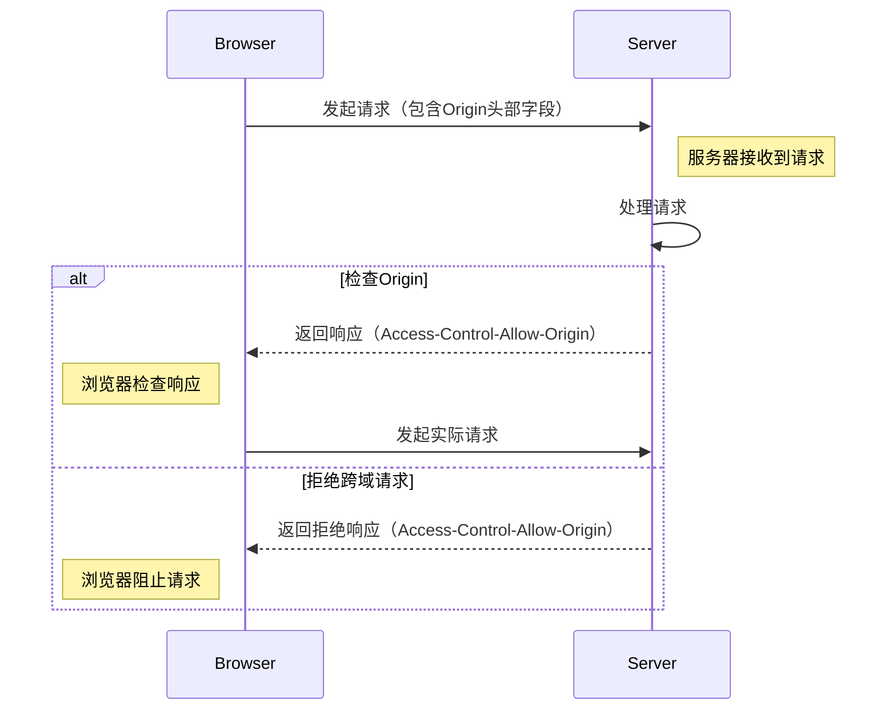

# summary 
HTTP Origin是HTTP请求头中的一个字段，用于指示请求的来源。它通常用于跨域资源共享（CORS）和安全策略（如Content Security Policy）中，以确保请求来自预期的源。

HTTP Origin主要用于跨域资源共享(CORS)。
Origin表示请求来源的域。当浏览器发起一个跨域请求时,会在请求头中加上Origin字段表示请求来自哪个源。
服务器可以根据这个字段来判断是否允许该跨域请求

在Nginx中，你可以使用以下配置来处理HTTP Origin相关的设置：

0. flow



- explain
```
在这个流程图中，"Browser"代表浏览器，"Server"代表服务器。流程如下：

1 浏览器发起请求，并在请求头部包含Origin字段。
2 服务器接收到请求并开始处理。
3 服务器检查Origin字段，根据设置决定是否允许跨域请求。
4 如果服务器允许跨域请求，它将在响应中包含Access-Control-Allow-Origin头部字段，告诉浏览器允许来自特定源的跨域请求。
5 浏览器检查响应，如果Access-Control-Allow-Origin头部字段允许当前请求的源，它将继续发送实际请求。
6 如果服务器拒绝跨域请求，它将在响应中包含Access-Control-Allow-Origin头部字段，并告知浏览器不允许当前请求的源。
7 浏览器阻止请求，不发送实际请求
```


Nginx中可以通过设置add_header指令来处理Origin。常见的配置示例如下:
1. 允许任何源的跨域请求:
add_header Access-Control-Allow-Origin *;

location / {
    add_header 'Access-Control-Allow-Origin' '*' always;
}

2. 只允许指定的源:
add_header Access-Control-Allow-Origin example.com;
add_header Access-Control-Allow-Origin http://foo.example; 
add_header Access-Control-Allow-Origin http://bar.example;
3. 检查来源并设置:
if ($http_origin ~* (www.example.com|blog.example.com)) {
  add_header Access-Control-Allow-Origin $http_origin;
}
4. 支持跨域 OPTIONS预检请求:
add_header Access-Control-Allow-Methods 'GET, POST, OPTIONS';
add_header Access-Control-Allow-Headers 'DNT,User-Agent,X-Requested-With,If-Modified-Since,Cache-Control,Content-Type,Range';
add_header Access-Control-Expose-Headers 'Content-Length,Content-Range';

5. 允许带有身份验证凭证的跨域请求：

```
location / {
    add_header 'Access-Control-Allow-Origin' "$http_origin" always;
    add_header 'Access-Control-Allow-Credentials' 'true' always;
}

```


6. 启用CORS：
   ```nginx
   location / {
       if ($request_method = 'OPTIONS') {
           add_header 'Access-Control-Allow-Origin' '*';
           add_header 'Access-Control-Allow-Methods' 'GET, POST, OPTIONS';
           add_header 'Access-Control-Allow-Headers' 'DNT,User-Agent,X-Requested-With,If-Modified-Since,Cache-Control,Content-Type,Range';
           add_header 'Access-Control-Max-Age' 1728000;
           add_header 'Content-Type' 'text/plain; charset=utf-8';
           add_header 'Content-Length' 0;
           return 204;
       }
       add_header 'Access-Control-Allow-Origin' '*';
       add_header 'Access-Control-Allow-Methods' 'GET, POST, OPTIONS';
       add_header 'Access-Control-Allow-Headers' 'DNT,User-Agent,X-Requested-With,If-Modified-Since,Cache-Control,Content-Type,Range';
       add_header 'Access-Control-Expose-Headers' 'Content-Length,Content-Range';
   }
   ```

   这个配置将允许所有来源的请求访问该Nginx服务器，并允许的请求方法包括GET、POST和OPTIONS。

7. 限制允许的来源：
   ```nginx
   location / {
       if ($http_origin ~* (https?://(www\.)?example\.com(:[0-9]+)?$)) {
           add_header 'Access-Control-Allow-Origin' $http_origin;
           add_header 'Access-Control-Allow-Methods' 'GET, POST, OPTIONS';
           add_header 'Access-Control-Allow-Headers' 'DNT,User-Agent,X-Requested-With,If-Modified-Since,Cache-Control,Content-Type,Range';
           add_header 'Access-Control-Expose-Headers' 'Content-Length,Content-Range';
       }
   }
   ```

   这个配置将只允许来自`example.com`及其子域名的请求访问该Nginx服务器。

这些是一些可能的Nginx配置示例，用于处理HTTP Origin相关的设置。你可以根据你的需求进行调整和扩展。请确保在使用这些配置之前，仔细了解CORS和安全策略的要求，并根据你的应用程序的需求进行适当的配置。


详细解释下http origin
Nginx配置示例，用于处理HTTP Origin相关的设置

配置将只允许来自`example.com`及其子域名的请求访问该Nginx服务器