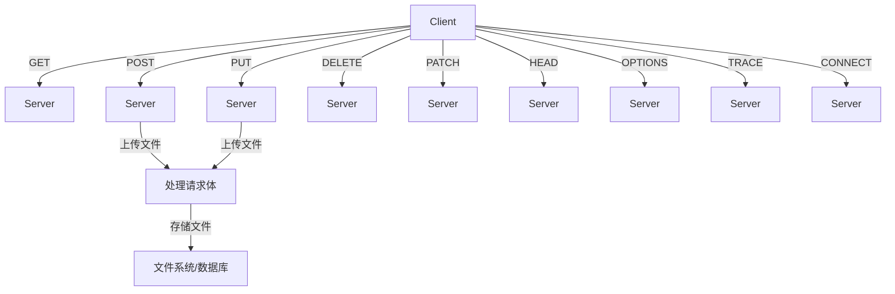

从 HTTP 协议的角度来看，文件上传与具体的 HTTP 方法有直接的关系，主要涉及到如何使用这些方法来传输文件数据。以下是 HTTP 方法和文件上传的详细关系及其背后的原理。

### HTTP 方法的作用

#### 1. GET 方法
- **作用**：从服务器获取资源。
- **文件上传关系**：GET 方法不用于上传文件，因为它不包含请求体，仅用于获取数据。

#### 2. POST 方法
- **作用**：向服务器提交数据，通常用于创建资源。
- **文件上传关系**：POST 是最常用的文件上传方法。客户端通过请求体将文件数据传输到服务器，通常使用 `multipart/form-data` 格式来上传文件。

#### 3. PUT 方法
- **作用**：向服务器上传一个资源的完整表示，通常用于更新资源。如果资源不存在，服务器可以创建该资源。
- **文件上传关系**：PUT 方法可以用于上传文件，主要用于更新现有文件。请求体包含文件的完整内容，服务器用新内容替换旧文件。

#### 4. DELETE 方法
- **作用**：请求服务器删除指定的资源。
- **文件上传关系**：DELETE 方法不用于上传文件，但可以用于删除已上传的文件。

#### 5. PATCH 方法
- **作用**：对资源应用部分修改，而不是完全替换资源。
- **文件上传关系**：PATCH 方法可以用于部分更新文件内容，但实际使用较少，通常需要客户端和服务器协商如何应用部分更新。

### 文件上传的底层原理

#### 1. HTTP 请求体
当使用 POST 或 PUT 方法上传文件时，文件数据包含在 HTTP 请求体中。请求体可以包含原始文件数据或多部分表单数据（`multipart/form-data`），用于上传多个文件或包含其他表单字段。

#### 2. Content-Type 请求头
`Content-Type` 请求头指定了请求体的媒体类型：
- **`application/octet-stream`**：用于上传原始二进制数据。
- **`multipart/form-data`**：用于上传文件和其他表单字段，通常通过浏览器表单上传。

#### 3. 传输编码
HTTP 支持多种传输编码（如分块传输编码）来处理大文件上传。分块传输编码允许文件分块上传，而不是一次性上传整个文件。

### HTTP 文件上传的示例

#### POST 请求上传文件示例

```http
POST /upload HTTP/1.1
Host: example.com
Content-Type: multipart/form-data; boundary=---------------------------974767299852498929531610575
Content-Length: 138

-----------------------------974767299852498929531610575
Content-Disposition: form-data; name="file"; filename="example.txt"
Content-Type: text/plain

...文件内容...
-----------------------------974767299852498929531610575--
```

#### PUT 请求上传文件示例

```http
PUT /files/example.txt HTTP/1.1
Host: example.com
Content-Type: application/octet-stream
Content-Length: 11

...文件内容...
```

### 原理解释

1. **HTTP 请求体**：在 POST 或 PUT 请求中，文件数据包含在请求体中。POST 通常用于创建新资源，而 PUT 通常用于更新现有资源。
2. **Content-Type**：`multipart/form-data` 用于上传文件和表单字段的组合，`application/octet-stream` 用于上传原始文件数据。
3. **请求头**：请求头中的 `Content-Length` 指示请求体的大小，而 `Content-Type` 指示请求体的数据类型。
4. **服务器处理**：服务器根据请求头信息解析请求体，处理文件数据并存储在指定位置。

### 示例图示



### 总结

HTTP 协议提供了多种方法（如 GET、POST、PUT 等）来实现客户端和服务器之间的交互。文件上传通常使用 POST 方法来创建资源，也可以使用 PUT 方法来更新资源。请求体、`Content-Type` 请求头和传输编码在文件上传中起着关键作用。了解这些原理有助于更好地设计和实现文件上传的服务。