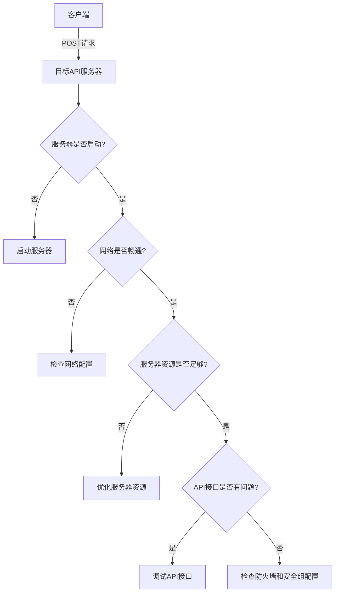

- [status](#status)
  - [1xx - Informational (信息性状态码)](#1xx---informational-信息性状态码)
  - [2xx - Successful (成功状态码)](#2xx---successful-成功状态码)
  - [3xx - Redirection (重定向状态码)](#3xx---redirection-重定向状态码)
  - [4xx - Client Errors (客户端错误状态码)](#4xx---client-errors-客户端错误状态码)
  - [5xx - Server Errors (服务器错误状态码)](#5xx---server-errors-服务器错误状态码)
- [如何解决错误状态码和可能的问题分析：](#如何解决错误状态码和可能的问题分析)
- [Detail about 400 and collect](#detail-about-400-and-collect)
  - [如果返回 The particular request is not valid 可能的原因都有哪些？](#如果返回-the-particular-request-is-not-valid-可能的原因都有哪些)
  - [header](#header)
  - [常见的400 Bad Request错误提示](#常见的400-bad-request错误提示)
- [常见的400错误提示信息及含义:](#常见的400错误提示信息及含义)

# status 

HTTP状态码是HTTP协议用于表示请求结果的数字代码。这些状态码分为不同的类别，每个类别都有特定的含义。以下是一些常见的HTTP状态码，特别是与错误相关的状态码以及它们的含义和可能的解决方法：

## 1xx - Informational (信息性状态码)

 **100 Continue**: 表示客户端可以继续发送请求体，通常在客户端发送带有大型请求体的请求时使用。

## 2xx - Successful (成功状态码)

 **200 OK**: 表示请求成功，服务器已成功处理请求并返回响应。这是最常见的成功状态码。

## 3xx - Redirection (重定向状态码)

**301 Moved Permanently**: 请求的资源已永久移动到新位置。客户端应更新其链接。

**302 Found (或临时重定向)**: 请求的资源暂时位于不同的URL。客户端应使用新的URL重新发起请求。

## 4xx - Client Errors (客户端错误状态码)
让我来解释一下4xx错误的概念,以及为什么它被归类为客户端错误。


4xx错误确实是由服务器返回的,但它们被归类为客户端错误,是因为这些错误通常是由客户端的请求引起的。让我们以404错误为例来说明:

404 (Not Found) 错误发生在客户端请求了一个在服务器上不存在的资源。虽然是服务器返回了这个错误,但错误的根源是客户端发送了一个指向不存在资源的请求。可能是因为URL拼写错误,或者请求了一个已被删除或移动的页面。

现在,让我们详细了解一下常见的4xx错误:

1. 400 Bad Request
   - 服务器无法理解客户端的请求。可能是因为请求语法错误。

2. 401 Unauthorized
   - 请求需要用户认证。客户端需要提供有效的认证信息。

3. 403 Forbidden
   - 服务器理解请求,但拒绝执行。通常是因为客户端没有访问权限。

4. 404 Not Found
   - 我们刚才讨论过的,请求的资源在服务器上不存在。

5. 405 Method Not Allowed
   - 请求方法（如GET、POST）不被允许用于请求的资源。

6. 406 Not Acceptable
   - 服务器无法根据客户端请求的内容特性完成请求。

7. 407 Proxy Authentication Required
   - 类似401,但表示客户端必须先通过代理服务器的认证。

8. 408 Request Timeout
   - 服务器等待客户端发送请求时超时。

9. 409 Conflict
   - 请求与服务器当前状态冲突。

10. 410 Gone
    - 请求的资源永久不可用。

11. 411 Length Required
    - 服务器拒绝接受不带Content-Length头的请求。

12. 412 Precondition Failed
    - 服务器不满足请求中的一个或多个先决条件。

13. 413 Payload Too Large
    - 请求实体过大,服务器拒绝处理。

14. 414 URI Too Long
    - 请求的URI过长,服务器拒绝处理。

15. 415 Unsupported Media Type
    - 服务器不支持请求中提交的媒体类型。

16. 416 Range Not Satisfiable
    - 请求的范围无法满足。

17. 417 Expectation Failed
    - 服务器无法满足Expect请求头字段的要求。

18. 429 Too Many Requests
    - 客户端在给定的时间内发送了太多请求。

这些错误都被归类为客户端错误,因为它们通常是由客户端的行为或请求引起的,尽管错误消息是由服务器返回的。服务器通过这些状态码告诉客户端需要采取什么行动来解决问题。​​​​​​​​​​​​​​​​


**400 Bad Request**: 客户端发送的请求有语法错误或无法被服务器理解。

**401 Unauthorized**: 请求要求身份验证，客户端未提供有效的身份验证信息。

**403 Forbidden**: 服务器拒绝了请求，通常因为客户端没有权限访问资源。

**404 Not Found**: 请求的资源未找到。

## 5xx - Server Errors (服务器错误状态码)

**500 Internal Server Error**: 服务器遇到了未能处理的异常情况，通常是服务器端代码错误。

**502 Bad Gateway**: 充当网关或代理服务器的服务器收到无效响应。

**503 Service Unavailable**: 服务器当前无法处理请求，通常是由于过载或维护。

**504 Gateway Timeout**: 充当网关或代理服务器的服务器未及时从上游服务器接收响应。

# 如何解决错误状态码和可能的问题分析：

**400 Bad Request**: 检查请求的语法，确保请求的参数和格式正确。查看请求的头部和主体，以确保它们符合服务器的要求。

**401 Unauthorized**: 提供有效的身份验证信息，例如用户名和密码。确保您有权访问所请求的资源。

**403 Forbidden**: 检查您是否有适当的权限来访问所请求的资源。联系管理员以获取访问权限。

**404 Not Found**: 确保请求的URL正确，资源确实存在。检查拼写错误或者可能的URL更改。

**500 Internal Server Error**: 这通常是服务器端的问题，您无法直接解决。联系网站或服务的管理员以报告问题。

**502 Bad Gateway** 和 **504 Gateway Timeout**: 这些错误通常与代理服务器或负载均衡器有关，可能需要管理员的介入来解决。

在处理HTTP状态码时，重要的是理解它们的含义以及如何根据特定的状态码采取适当的行动。根据错误的类型，您可能需要检查请求的内容、服务器配置或与服务器管理员联系以获取进一步的帮助。


# Detail about 400 and collect 

```
当服务器返回HTTP状态码400 Bad Request 时，这通常表示客户端发送的请求存在语法错误或无法被服务器理解。这个状态码是一个通用的客户端错误，它可以有多种可能的原因。以下是一些常见的导致400 Bad Request错误的情况以及可能的解决方法：

1. **语法错误的请求**：客户端发送的请求可能包含语法错误，例如不正确的HTTP方法、无效的请求头或无效的请求主体。解决方法是仔细检查请求，确保它符合HTTP协议的规范。您可以使用HTTP调试工具来验证请求的格式和语法。

2. **缺少必要的请求头或参数**：某些请求需要特定的请求头或参数，如果缺少这些必要的信息，服务器无法正确理解请求。解决方法是确保请求包含了必要的头部和参数，并且它们的值是有效的。

3. **请求内容太大**：如果请求主体的大小超过了服务器的限制，服务器可能会返回400错误。这通常是为了防止恶意或过大的请求。您可以尝试减小请求主体的大小或与服务器管理员联系以增加限制。

4. **URL编码问题**：URL中的特殊字符需要进行正确的URL编码。如果URL包含无效的字符或没有正确编码，服务器可能无法解析请求。确保URL中的特殊字符已正确编码。

5. **无效的请求方法**：每个HTTP请求都需要使用有效的请求方法，如GET、POST、PUT等。如果使用了不支持的方法或拼写错误，服务器将无法理解请求。检查请求的HTTP方法是否正确。

6. **身份验证问题**：某些资源要求身份验证才能访问，如果客户端未提供有效的身份验证凭据，服务器可能会返回400错误。确保您提供了适当的身份验证信息。

7. **缺少必要的Cookie或Session信息**：如果服务器依赖于Cookie或Session信息来处理请求，客户端必须正确发送这些信息。确保您的请求包含了所需的Cookie或Session信息。

8. **非法字符或不安全输入**：请求中包含可能被认为是恶意的字符或输入，服务器为安全起见拒绝处理。确保请求中不包含不安全的内容。

解决400 Bad Request错误通常需要仔细检查请求，确保其符合HTTP协议的规范，并根据具体情况进行相应的修复。如果问题仍然存在，查看服务器的错误日志或与服务器管理员联系以获取更多的帮助和指导。
```

get 一个url 是200但是post 的时候返回400 可能的原因都有哪些
当使用不同的 HTTP 方法（GET 和 POST）请求同一个 URL 时，返回不同的 HTTP 状态码（200 和 400）可能有多种原因。以下是一些可能的原因：

1. **服务器端逻辑不同**：服务器端代码可能对 GET 和 POST 请求有不同的处理逻辑。GET 请求通常用于获取资源，而 POST 请求通常用于提交数据。如果服务器端逻辑在处理 POST 请求时检测到数据问题或验证失败，就会返回 400 Bad Request 状态码。

2. **请求数据不符合预期**：当进行 POST 请求时，服务器可能期望接收特定格式或数据类型的内容，如果请求数据不符合要求，就会返回 400。例如，缺少必需的字段、字段格式错误或者数据太大都可能导致此问题。

3. **权限问题**：服务器可能要求用户在进行某些敏感操作时进行身份验证或授权。GET 请求通常用于无需身份验证的读取操作，而 POST 请求可能需要更高级别的权限。如果未经授权的用户尝试进行 POST 请求，服务器可能返回 400。

4. **请求头问题**：服务器可能会根据请求头中的信息来判断请求是否有效。GET 和 POST 请求的请求头可能有所不同，如果请求头不正确，服务器可能拒绝请求并返回 400。

5. **数据重复或冲突**：有时 POST 请求可能要求数据在服务器上是唯一的，如果尝试提交重复的数据或者与已存在数据冲突，服务器可能会返回 400。

6. **服务器配置问题**：服务器配置不正确也可能导致这种情况。例如，未正确配置 POST 请求的处理器或验证规则。

7. **网络问题**：虽然较少见，但网络中的问题，如连接中断或代理配置不当，也可能导致 POST 请求失败。

当涉及到请求头问题可能导致服务器返回 400 错误时，这通常取决于服务器端的期望以及请求头的配置。以下是一些具体的例子和讨论：

1. **Content-Type 头不匹配**：

   - 问题：服务器期望 POST 请求包含特定类型的数据，例如 JSON 或表单数据。如果请求的 Content-Type 头与服务器期望的不匹配，服务器可能拒绝请求。
   - 示例：服务器期望 JSON 数据，但请求的 Content-Type 头设置为 `Content-Type: application/x-www-form-urlencoded`。

2. **缺少必需的头信息**：

   - 问题：某些服务器要求特定的头信息才能接受 POST 请求。如果缺少这些头信息，服务器可能不处理请求。
   - 示例：服务器要求每个 POST 请求都包含 `Authorization` 头，以便进行身份验证。

3. **请求方法不匹配**：

   - 问题：服务器可能要求特定类型的请求使用 POST 方法，而不是 GET 方法。如果使用了不正确的请求方法，服务器可能返回 400。
   - 示例：服务器要求提交表单数据时使用 POST，但请求使用了 GET 方法。

4. **自定义头信息不符合要求**：

   - 问题：某些服务器可能要求客户端传递特定的自定义头信息，以便进行请求验证或识别。如果这些头信息不正确或不符合要求，服务器可能拒绝请求。
   - 示例：服务器要求在每个请求中包含自定义头信息 `X-Client-Version: 2.0` 以确保客户端使用最新的版本。

5. **编码问题**：

   - 问题：服务器可能要求请求体使用特定的编码，如 UTF-8。如果请求体的编码与服务器期望的不匹配，服务器可能返回 400。
   - 示例：服务器期望请求体使用 UTF-8 编码，但请求体使用了 ISO-8859-1 编码。

要解决这些问题，您需要详细查看服务器的文档或错误消息以了解服务器期望的请求头配置。然后，确保您的请求中的请求头与服务器的要求匹配。使用工具如 Curl 或 Postman 可以方便地测试和调试请求头配置。

## 如果返回 The particular request is not valid 可能的原因都有哪些？

当服务器返回 "The particular request is not valid" 错误消息时，这表明服务器认为收到的请求不符合其要求或规范，但没有提供具体的详细信息。这是一个比较通用的错误消息，可能的原因包括：

1. **请求数据格式错误**：请求的数据格式可能与服务器期望的不一致。这可能包括 JSON、XML、表单数据等格式错误。

2. **请求数据不完整**：请求缺少了服务器期望的某些必需字段或信息，导致请求不完整或不可理解。

3. **权限问题**：请求的用户或客户端可能没有足够的权限执行请求的操作，这可能导致请求被拒绝。

4. **请求参数错误**：服务器期望请求中的参数满足特定的要求，但请求中的参数不满足这些要求。

5. **请求方式不正确**：某些服务器可能对请求的 HTTP 方法有特定要求，如果使用了不正确的方法，服务器可能返回此错误。

6. **请求中包含了无效的字符或数据**：如果请求中包含了服务器不接受的特殊字符或无效的数据，服务器可能拒绝请求。

7. **服务器端配置问题**：服务器可能存在配置问题，导致它无法正确解析或处理请求。

8. **请求时间戳或签名错误**：如果请求需要包含时间戳或数字签名以进行验证，错误的时间戳或签名可能导致请求无效。

9. **请求过于频繁**：有时服务器会实施请求速率限制，如果请求过于频繁，服务器可能拒绝进一步的请求。

10. **其他服务器端规则**：服务器可能有特定的请求规则或逻辑，如果请求不符合这些规则，服务器可能返回无效请求错误。

HTTP状态码400表示客户端发送了一个无效的请求，而不是服务器的响应。这种情况通常是由客户端发送的请求中包含了无效的数据或格式引起的。服务器无法理解或处理这个请求。

要解决这个问题，您可以采取以下步骤：

检查请求的语法：确保您发送的HTTP请求的语法是正确的。这包括检查HTTP方法（GET、POST、PUT等）、请求头部、请求体等。

验证请求参数：如果您的请求包含参数，确保这些参数的值是有效的，并且符合服务器的要求。检查参数的数据类型、格式等是否正确。

查看服务器响应：服务器通常会返回有关400错误的更详细信息，以帮助您诊断问题。查看服务器响应中的错误消息或说明，以获取更多线索。

使用HTTP调试工具：您可以使用HTTP调试工具（例如cURL或Postman）来发送请求并查看响应。这有助于更详细地分析请求和响应，以确定问题的根本原因。

查看服务器日志：如果您有访问服务器日志的权限，可以查看服务器日志文件，以获取有关发生400错误的更多信息。日志通常包含有关请求的详细信息。


## header 
服务器可以根据请求头中的信息来判断请求是否有效。GET 和 POST 请求的请求头可能有所不同,如果请求头不正确,服务器可能会拒绝请求并返回 400。

这里有几个关于GET和POST请求头的关键点:

Host头 - 这标识请求目标域名。它是HTTP 1.1所有请求必需的。
User-Agent - 这标识发出请求的客户端软件。服务器可以通过它进行分析或根据客户端自定义响应。
Accept - 这表示客户端可以接受的响应内容类型。服务器用它来决定如何格式化响应。
Content-Type - 对于POST请求,这表示请求体的格式(例如application/json, multipart/form-data)。服务器需要它来正确解析请求体。
Content-Length - 对于POST请求,这表示请求体的字节长度。如果请求有请求体则是必需的。
Cookie - 包含服务器先前设置的cookie值。用于标识客户端会话。
所以总结一下,如果必要的头像Host、Accept、Content-Type等缺失或不正确,服务器可能会以400 Bad Request错误拒绝请求。具体需要的头取决于它是GET请求还是POST请求。

## 常见的400 Bad Request错误提示
"The particular request is not valid"
"The request could not be understood."
"The request is missing a required parameter."
"The request parameter is not valid."
"The request body is not valid."
"The request is too large."
"The request is not allowed."

# 常见的400错误提示信息及含义:
"The request could not be understood" - 请求存在语法错误或参数错误,服务器无法解析
"The request is missing a required parameter" - 请求缺少必需的参数
"The request parameter is not valid" - 请求的参数值无效
"The request body is not valid" - 请求body存在语法错误或与Content-Type不匹配
"The request is too large" - 请求体超过大小限制
"The request is not allowed" - 请求的方法或目标资源不被允许
一些常见的400错误案例:

GET请求中包含请求体,这是不合法的
请求URL路径不存在,导致路由失败
Content-Length头指定的内容长度与实际请求体长度不符
application/json的请求体中包含错误的JSON格式
重复提供了相同的参数,导致参数冲突
文件上传类型请求缺少必需的Content-Type头
学习400状态码的一些好资料:

HTTP规范：

您可以查阅HTTP协议的官方规范，即RFC 2616（对HTTP/1.1的早期版本）或RFC 7231（对HTTP/1.1的更新版本）。这些规范提供了HTTP状态码的详细描述，包括400 Bad Request以及其他常见状态码的解释。您可以在RFC文档中找到有关语法、请求和响应的详细信息。

Mozilla Developer Network (MDN) HTTP状态码文档：
MDN提供了关于HTTP状态码的详细解释和示例，包括400 Bad Request以及其他状态码的描述。这是一个非常有用的资源，特别是对于Web开发者来说。
链接：https://developer.mozilla.org/en-US/docs/Web/HTTP/Status/400
MDN Web Docs对400状态码的详细解释: https://developer.mozilla.org/zh-CN/docs/Web/HTTP/Status/400


RFC 7231对400的定义: https://tools.ietf.org/html/rfc7231#section-6.5.1
RFC 2616中对HTTP语法的定义: https://www.ietf.org/rfc/rfc2616.txt
WebConcepts的HTTP状态码目录:https://webconcepts.info/concepts/http-status-codes

W3Schools HTTP状态码教程：
W3Schools网站提供了一个简单易懂的HTTP状态码教程，包括了常见状态码的解释和示例。这对初学者来说是一个很好的入门资源。
链接：https://www.w3schools.com/tags/ref_httpmessages.asp
w3schools的HTTP消息学习指南: https://www.w3schools.com/tags/ref_httpmessages.asp


Microsoft Docs - HTTP状态码：
Microsoft的文档提供了关于HTTP状态码的详细信息，包括各种状态码的解释和用例。虽然它主要面向.NET开发者，但仍然包含有用的信息。
链接：https://docs.microsoft.com/en-us/dotnet/api/system.net.httpstatuscode

# Q 5007
我的接口再发送一个POS的请求的时候发生了，如下报错 。请帮我分析可能的出错原因， 以及可能的解决办法 ERROR 5007 api.file.FileController update Process status error. I/O error on POST request for "https://www.abc.com“ failed to respond. Nested exception is org.apache.http.NoHttpResponseException: www.abc.com failed to respond​​​​​​​​​​​​​​​​


## calude 
根据您提供的错误信息,这个错误很可能是由于发送POST请求时,目标网站没有及时响应导致的连接超时异常。可能的原因有以下几个方面:

1. 网络连接问题
   - 检查您的网络连接是否正常,互联网是否能正常访问
   - 检查目标网站www.abc.com是否能被正常访问

2. 目标服务器压力过大或临时故障
   - 如果目标服务器正在处理大量请求,可能会导致响应延迟或无响应
   - 服务器临时出现故障也会导致此错误

3. 防火墙或代理设置
   - 检查您的防火墙和代理设置是否允许应用程序访问www.abc.com

4. 请求参数或格式问题
   - 检查您的POST请求参数或格式是否正确,是否符合目标网站的API要求

解决办法建议:

1. 重试请求,查看是否是临时性问题
2. 检查网络连接,确保可以正常访问目标网站
3. 查看目标网站是否有服务状态说明,是否正常
4. 检查防火墙和代理设置
5. 检查请求参数和格式是否正确
6. 如果问题一直存在,可以联系目标网站的技术支持人员

总的来说,这种连接超时错误很可能是由于网络、服务器负载或配置原因引起的,需要进行全面排查和尝试。​​​​​​​​​​​​​​​​

## chatgpt
根据你提供的错误日志，问题似乎出现在客户POST请求到某个API接口时，出现了I/O错误，并返回了5007错误代码。错误日志的具体信息如下：

```
ERROR 5007 api.file.FileController update Process status error. I/O error on POST request for "https://“ failed to respond. Nested exception is org.apache.http.NoHttpResponseException: Domain failed to respond
```

### 错误分析

1. **5007错误代码**：通常，5xx系列错误代码表示服务器端错误，具体的5007错误代码可能是你们系统自定义的错误代码，表明在`FileController`的`update`方法处理状态更新时发生了错误。

2. **I/O错误**：I/O错误表明在进行输入输出操作时出现了问题，具体是POST请求未能成功到达目的API接口。

3. **NoHttpResponseException**：这个异常由Apache HTTP客户端库抛出，表明服务器端未能发送任何响应。这通常意味着服务器可能宕机或网络问题导致客户端无法与服务器建立连接。

### 可能的原因

1. **服务器未启动或宕机**：
   - 检查目标服务器是否正在运行并监听正确的端口。

2. **网络问题**：
   - 可能是网络连接问题导致客户端无法连接到服务器。
   - 检查网络配置，确保客户端和服务器之间的网络连接畅通。

3. **服务器过载或配置问题**：
   - 服务器可能负载过高，导致无法处理新的请求。
   - 检查服务器的资源使用情况，确保有足够的资源处理请求。

4. **防火墙或安全组配置问题**：
   - 检查防火墙或安全组设置，确保允许客户端的请求通过。

5. **API接口本身的问题**：
   - 检查API接口的实现，确保在处理请求时没有抛出异常或进入死循环。

### 解决方案

1. **检查服务器状态**：
   - 确认目标API服务器正在运行且可访问。
   - 使用`ping`或`telnet`命令测试服务器的连通性。

2. **检查日志文件**：
   - 检查服务器端的日志文件，找出更详细的错误信息，了解服务器端的错误原因。

3. **监控服务器资源**：
   - 使用监控工具（如`top`, `htop`, `vmstat`等）检查服务器的CPU、内存、磁盘等资源的使用情况。

4. **网络排查**：
   - 使用`traceroute`或`mtr`工具检查客户端到服务器的网络路径，确定是否存在网络瓶颈或中断。

5. **配置检查**：
   - 确认防火墙、路由器和安全组的配置，确保允许所需的网络流量通过。

6. **API接口调试**：
   - 通过Postman或cURL等工具直接调用API接口，检查是否能够成功响应。
   - 如果API接口有问题，可以进一步调试接口的实现。

### 示例流程图



通过上述步骤，基本可以定位并解决客户POST请求到API接口出现I/O错误的原因。如果问题依然存在，可以考虑进一步深入排查服务器端和客户端的配置及实现。
