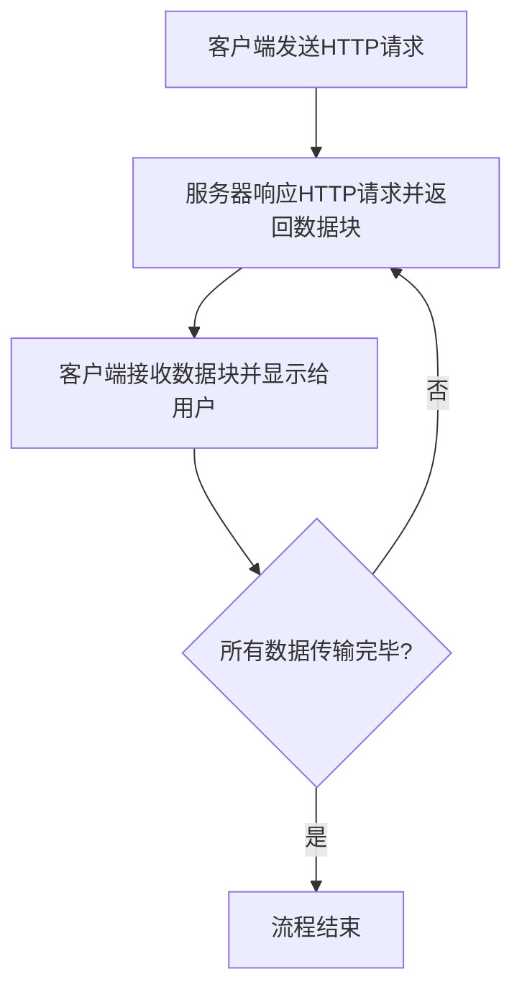

好的，以下是文章的分析和总结：

**什么是HTTP流？**

HTTP流是一种通过HTTP协议传输数据的技术。它允许客户端和服务器以流式方式传输数据，这意味着数据可以以小块的形式传输，而不需要等待整个数据传输完毕。这对于需要实时传输数据的应用程序（如视频流和聊天应用程序）很有用。

HTTP流的工作原理是：

1. 客户端发送一个HTTP请求到服务器。
2. 服务器响应HTTP请求，并返回一小块数据。
3. 客户端接收到数据后，并显示给用户。
4. 步骤2和3重复，直到所有数据传输完毕。

HTTP流具有以下优点：

- 实时传输：HTTP流可以以实时方式传输数据，这对于需要实时交互的应用程序（如视频流和聊天应用程序）很有用。
- 可靠性：HTTP流是可靠的，因为它使用TCP协议传输数据。TCP协议是一种可靠的协议，它会确保数据在传输过程中不会丢失或损坏。
- 安全性：HTTP流可以安全地传输数据，因为它可以使用SSL/TLS协议进行加密。SSL/TLS协议是一种安全的协议，它可以防止数据在传输过程中被窃取或篡改。

**HTTP流的应用场景**

HTTP流可以应用于各种场景，包括：

- 视频流：HTTP流可以用于实时传输视频。这对于直播视频和视频会议等应用程序很有用。
- 聊天应用程序：HTTP流可以用于实时传输聊天消息。这对于即时通讯和聊天应用程序很有用。
- 游戏：HTTP流可以用于实时传输游戏数据。这对于多人游戏和在线游戏等应用程序很有用。
- 物联网：HTTP流可以用于实时传输物联网数据。这对于监控和控制物联网设备等应用程序很有用。

HTTP Streaming是一种通过HTTP协议实现的数据传输方式，它允许数据以流式传输的方式被逐步发送到客户端，而无需等待整个资源下载完毕。HTTP Streaming使用TCP协议进行数据传输。

不同之处在于，TCP是传输层协议，负责数据的可靠传输和流控制，而HTTP Streaming是在应用层使用HTTP协议来实现流式传输，通常使用分块编码（Chunked Encoding）或者长连接（Keep-Alive）来实现数据逐步传输。

HTTP Streaming的工作原理是，服务器将数据分成较小的块，并通过HTTP响应逐个发送到客户端。客户端在接收到每个块时，可以立即开始处理数据，而不需要等待整个资源下载完毕。这对于实时视频、音频流或大型文件的传输特别有用。

HTTP Streaming的局限性包括：

1. **延迟问题：** 由于数据是逐步传输的，可能会导致一定的延迟，尤其在低带宽或网络拥塞的情况下。
2. **难以实现精确的随机访问：** HTTP Streaming适用于顺序访问数据，但如果需要随机访问或快速跳转到资源的某一部分，可能会有一定的困难。
3. **缓冲管理：** 客户端需要进行缓冲管理，以便在数据传输过程中避免播放中断或卡顿的情况。
4. **兼容性：** 不同的浏览器、设备和网络环境对HTTP Streaming的支持程度可能会有所不同，可能需要针对不同平台进行优化。

总体而言，HTTP Streaming是一种强大的数据传输方式，但在选择使用时需要考虑其适用场景和局限性。

