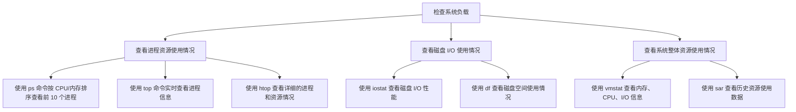

当然可以！除了 `ps` 命令，你还可以使用其他工具，如 `top`、`htop`、`iostat` 和 `vmstat` 等。下面是一个涵盖这些命令的 Mermaid 流程图，展示了如何通过不同方式获取 Linux 系统资源的详细信息。

### 各命令的使用说明

1. **进程资源使用情况**

   - `ps aux --sort=-%cpu | head -n 11`：列出前 10 个 CPU 使用率最高的进程。
   - `top`：实时查看 CPU、内存和各进程的动态数据。
   - `htop`：功能更全面的实时进程查看器（需安装），可以查看每个进程的 CPU、内存等详细信息，支持交互操作。

2. **磁盘 I/O 使用情况**

   - `iostat -x 1 10`：每秒显示磁盘 I/O 使用情况，连续 10 次，可通过观察 `%util` 指标分析磁盘负载。
   - `df -h`：查看文件系统的磁盘使用情况，以人类可读的格式显示各挂载点的剩余空间。

3. **系统整体资源使用情况**
   - `vmstat 1 10`：每秒显示系统的 CPU、内存、I/O 和其他指标，连续 10 次。
   - `sar -u 1 10`：每秒显示 CPU 使用率，连续 10 次。`sar` 还可以提供其他参数，用于查看内存、磁盘等的历史数据（需安装 `sysstat` 包）。

### 以上命令的输出示例

这些命令的组合使用能够提供从系统整体到具体进程资源使用的多层次监控，有助于分析和解决主机负载过高的问题。
