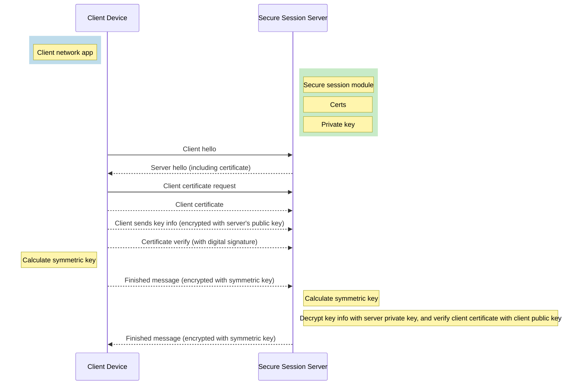

- flow

```mermaid
sequenceDiagram
    participant Client Device
    participant Secure Session Server
    rect rgb(190, 220, 235)
    Note left of Client Device: Client network app
    end
    rect rgb(200, 235, 200)
    Note right of Secure Session Server: Secure session module
    Note right of Secure Session Server: Certs
    Note right of Secure Session Server: Private key
    end

    Client Device->>Secure Session Server: Client hello
    Secure Session Server-->>Client Device: Server hello (including certificate)
    Client Device->>Secure Session Server: Client certificate request
    Client Device-->>Secure Session Server: Client certificate
    Client Device-->>Secure Session Server: Client sends key info (encrypted with server's public key)
    Client Device-->>Secure Session Server: Certificate verify (with digital signature)
    Note left of Client Device: Calculate symmetric key
    Client Device-->>Secure Session Server: Finished message (encrypted with symmetric key)
    Note right of Secure Session Server: Calculate symmetric key
    Note right of Secure Session Server: Decrypt key info with server private key, and verify client certificate with client public key
    Secure Session Server-->>Client Device: Finished message (encrypted with symmetric key)
```
