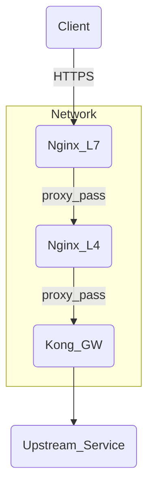
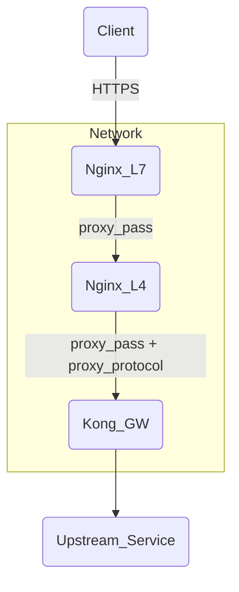
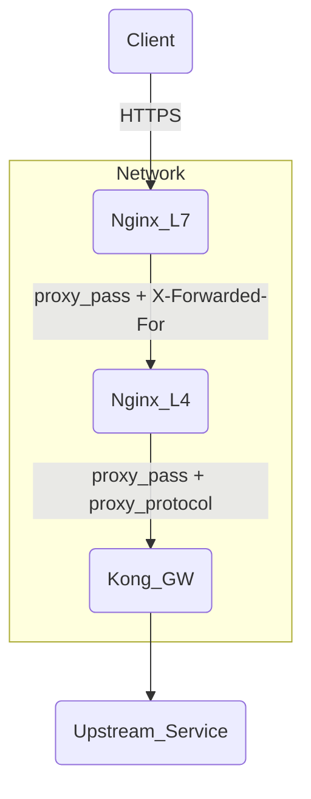

为了使你的Kong Gateway获取客户端的出口IP地址，你需要确保在流经的每一层都正确传递原始客户端IP。这个问题通常出现在Layer 4 (L4) 的Nginx配置上，因为它在传递请求时默认不会包含原始的客户端IP信息。

你可以通过以下方式解决这个问题：

1. **在L7层的Nginx配置中添加`proxy_set_header`指令：**
   确保你的L7层Nginx配置传递`X-Forwarded-For`头：

   ```nginx
   location /apiname/v1 {
       if ($host !~* aibangjuxin$ ) {
           return 444;
       }

       if ($content_type ~ (multipart/form-data|text/plain)) {
           return 405;
       }

       rewrite ^(.*)$ https://dev-api.cn.aibang$1 break;
       proxy_pass https://10.10.15.1:8081/;
       proxy_set_header Host dev-api.cn.aibang;
       proxy_set_header X-Real-IP $remote_addr;
       proxy_set_header X-Forwarded-For $proxy_add_x_forwarded_for;
   }
   ```

2. **在L4层的Nginx配置中添加`proxy_protocol`指令：**
   修改你的L4层Nginx配置，启用`proxy_protocol`，并在上游服务器配置中接受该协议。

   在L4层Nginx的`listen`指令中启用`proxy_protocol`：

   ```nginx
   stream {
       server {
           listen 8081 proxy_protocol;

           proxy_pass 192.168.0.5:8443;  # 假设Kong GW运行在192.168.0.5:8443
       }
   }
   ```

   然后在Kong Gateway的配置中允许`proxy_protocol`，以便它能够正确解析`X-Forwarded-For`头并获取客户端的真实IP地址。

3. **在Kong Gateway中配置正确的设置：**
   确保Kong Gateway正确解析`X-Forwarded-For`头来获取客户端的真实IP地址。这通常是默认行为，但你可以检查配置文件以确保没有被覆盖。

   在Kong的配置文件中，你可以通过`real_ip_header`和`trusted_ips`指令来指定从哪个头文件获取真实IP：

   ```yaml
   nginx_http_real_ip_header: "X-Forwarded-For"
   nginx_http_real_ip_recursive: "on"
   trusted_ips:
     - 0.0.0.0/0
   ```

综上所述，配置后的整体流如下：



通过在每一层正确配置`X-Forwarded-For`头和`proxy_protocol`，Kong Gateway将能够获取客户端的真实IP地址。


出现502错误和`connection reset by peer while SSL handshaking to upstream`的错误可能是由于`proxy_protocol`没有在上游服务器正确配置或者上游服务器不支持`proxy_protocol`导致的。让我们一步步排查和解决这个问题。

### 确认上游服务器支持 `proxy_protocol`

在L4层Nginx中启用了`proxy_protocol`之后，上游服务器也需要相应地支持并解析`proxy_protocol`。如果你的上游服务器是另一个Nginx实例，确保该Nginx也配置了接受`proxy_protocol`。

### Nginx L4 配置

首先，确认L4层Nginx的配置是正确的：

```nginx
stream {
    server {
        listen 8081 proxy_protocol;

        proxy_pass 192.168.0.5:8443;  # 假设Kong GW运行在192.168.0.5:8443
        proxy_protocol on;
    }
}
```

### 上游服务器（Kong Gateway）的配置

接下来，确保你的Kong Gateway配置允许`proxy_protocol`。假设Kong Gateway运行在Nginx上：

```nginx
server {
    listen 8443 ssl proxy_protocol;

    ssl_certificate /path/to/certificate.crt;
    ssl_certificate_key /path/to/private.key;

    location / {
        proxy_pass http://upstream_backend;
        proxy_set_header Host $host;
        proxy_set_header X-Real-IP $remote_addr;
        proxy_set_header X-Forwarded-For $proxy_add_x_forwarded_for;
        proxy_set_header X-Forwarded-Proto $scheme;
    }
}
```

注意：确保`listen`指令中包含`proxy_protocol`。

### Kong Gateway 的配置文件

在Kong Gateway的配置文件中，确保它接受并解析来自`proxy_protocol`的头文件：

```yaml
nginx_http_real_ip_header: "proxy_protocol"
nginx_http_real_ip_recursive: "on"
trusted_ips:
  - 0.0.0.0/0
```

### 检查Nginx L7配置

同时，确认你的L7 Nginx配置没有引入多余的URL片段，这可能导致了URL拼接错误：

```nginx
location /apiname/v1 {
    if ($host !~* aibangjuxin$ ) {
        return 444;
    }

    if ($content_type ~ (multipart/form-data|text/plain)) {
        return 405;
    }

    rewrite ^/apiname/v1(.*)$ $1 break;
    proxy_pass https://10.10.15.1:8081;
    proxy_set_header Host dev-api.cn.aibang;
    proxy_set_header X-Real-IP $remote_addr;
    proxy_set_header X-Forwarded-For $proxy_add_x_forwarded_for;
}
```

### 流程图

以下是更新后的流程图：



通过上述配置，可以确保在各层之间传递`proxy_protocol`，让Kong Gateway能够正确解析并获取客户端的真实IP地址。如果问题依然存在，请检查日志文件以获得更多错误细节，确保所有层的配置文件都已正确更新。


在Nginx中启用`proxy_protocol`用于传递客户端的原始IP地址，这通常适用于反向代理场景，尤其是当多个Nginx实例或负载均衡器（例如，L4 Nginx）之间传递请求时。下面是一个详细解释如何在Nginx中配置并启用`proxy_protocol`的步骤。

### 启用 `proxy_protocol` 的原因

`proxy_protocol`允许你在多层代理之间传递客户端的原始IP地址和端口，而不是仅仅传递代理服务器的IP地址。这对于日志记录、访问控制以及其他基于客户端IP的功能非常有用。

### 详细配置步骤

假设有以下基础架构：
- **L7 Nginx**：处理7层的HTTP请求，并将请求传递给L4 Nginx。
- **L4 Nginx**：处理4层的TCP/SSL请求，并将请求传递给Kong Gateway。
- **Kong Gateway**：最终处理请求并将其路由到上游服务。

#### 1. L7 Nginx 配置

L7 Nginx 负责处理HTTP请求，并将原始客户端IP通过HTTP头传递给L4 Nginx。

```nginx
http {
    server {
        listen 80;

        location /apiname/v1 {
            if ($host !~* aibangjuxin$ ) {
                return 444;
            }

            if ($content_type ~ (multipart/form-data|text/plain)) {
                return 405;
            }

            rewrite ^/apiname/v1(.*)$ $1 break;
            proxy_pass https://10.10.15.1:8081;
            proxy_set_header Host dev-api.cn.aibang;
            proxy_set_header X-Real-IP $remote_addr;
            proxy_set_header X-Forwarded-For $proxy_add_x_forwarded_for;
        }
    }
}
```

这里`proxy_set_header X-Forwarded-For $proxy_add_x_forwarded_for;`将客户端的原始IP地址添加到`X-Forwarded-For`头中。

#### 2. L4 Nginx 配置

L4 Nginx 负责处理TCP连接，并将请求传递给Kong Gateway，同时传递原始客户端IP地址。为了实现这一点，需要启用`proxy_protocol`。

```nginx
stream {
    server {
        listen 8081 proxy_protocol;  # 启用 proxy_protocol

        proxy_pass 192.168.0.5:8443;  # 假设 Kong Gateway 运行在 192.168.0.5:8443
        proxy_protocol on;  # 启用 proxy_protocol 支持
    }
}
```

#### 3. Kong Gateway 配置

Kong Gateway 需要配置以接受并解析来自`proxy_protocol`的客户端IP地址。假设Kong Gateway使用Nginx作为其前端：

```nginx
server {
    listen 8443 ssl proxy_protocol;  # 启用 proxy_protocol

    ssl_certificate /path/to/certificate.crt;
    ssl_certificate_key /path/to/private.key;

    location / {
        proxy_pass http://upstream_backend;
        proxy_set_header Host $host;
        proxy_set_header X-Real-IP $proxy_protocol_addr;  # 使用 proxy_protocol_addr 获取真实的客户端IP
        proxy_set_header X-Forwarded-For $proxy_add_x_forwarded_for;
        proxy_set_header X-Forwarded-Proto $scheme;
    }
}
```

在Kong Gateway的配置文件中，确保它解析来自`proxy_protocol`的头文件：

```yaml
nginx_http_real_ip_header: "proxy_protocol"
nginx_http_real_ip_recursive: "on"
trusted_ips:
  - 0.0.0.0/0
```

### 解释配置

- **L7 Nginx**：通过`proxy_set_header`将客户端的原始IP地址附加到`X-Forwarded-For`头中，并将请求转发给L4 Nginx。
- **L4 Nginx**：在`listen`指令中启用`proxy_protocol`，并通过`proxy_pass`将请求转发给Kong Gateway，同时启用`proxy_protocol`支持。
- **Kong Gateway**：配置为接受并解析来自`proxy_protocol`的头文件，以便获取并使用原始客户端IP地址。

### 流程图

以下是更新后的流程图：



### 故障排除

如果启用`proxy_protocol`后仍然遇到问题，请检查以下方面：

1. **日志文件**：查看Nginx和Kong Gateway的错误日志，以获取更详细的错误信息。
2. **端口和协议**：确保所有层之间的端口和协议（HTTP/HTTPS）匹配。
3. **配置同步**：确保所有配置文件已正确更新并重新加载。

通过正确配置`proxy_protocol`，可以在多层代理之间传递客户端的原始IP地址，从而提高系统的透明度和安全性。


