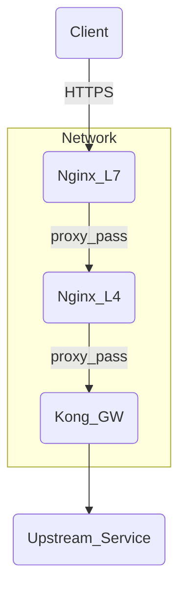

为了使你的Kong Gateway获取客户端的出口IP地址，你需要确保在流经的每一层都正确传递原始客户端IP。这个问题通常出现在Layer 4 (L4) 的Nginx配置上，因为它在传递请求时默认不会包含原始的客户端IP信息。

你可以通过以下方式解决这个问题：

1. **在L7层的Nginx配置中添加`proxy_set_header`指令：**
   确保你的L7层Nginx配置传递`X-Forwarded-For`头：

   ```nginx
   location /apiname/v1 {
       if ($host !~* aibangjuxin$ ) {
           return 444;
       }

       if ($content_type ~ (multipart/form-data|text/plain)) {
           return 405;
       }

       rewrite ^(.*)$ https://dev-api.cn.aibang$1 break;
       proxy_pass https://10.10.15.1:8081/;
       proxy_set_header Host dev-api.cn.aibang;
       proxy_set_header X-Real-IP $remote_addr;
       proxy_set_header X-Forwarded-For $proxy_add_x_forwarded_for;
   }
   ```

2. **在L4层的Nginx配置中添加`proxy_protocol`指令：**
   修改你的L4层Nginx配置，启用`proxy_protocol`，并在上游服务器配置中接受该协议。

   在L4层Nginx的`listen`指令中启用`proxy_protocol`：

   ```nginx
   stream {
       server {
           listen 8081 proxy_protocol;

           proxy_pass 192.168.0.5:8443;  # 假设Kong GW运行在192.168.0.5:8443
       }
   }
   ```

   然后在Kong Gateway的配置中允许`proxy_protocol`，以便它能够正确解析`X-Forwarded-For`头并获取客户端的真实IP地址。

3. **在Kong Gateway中配置正确的设置：**
   确保Kong Gateway正确解析`X-Forwarded-For`头来获取客户端的真实IP地址。这通常是默认行为，但你可以检查配置文件以确保没有被覆盖。

   在Kong的配置文件中，你可以通过`real_ip_header`和`trusted_ips`指令来指定从哪个头文件获取真实IP：

   ```yaml
   nginx_http_real_ip_header: "X-Forwarded-For"
   nginx_http_real_ip_recursive: "on"
   trusted_ips:
     - 0.0.0.0/0
   ```

综上所述，配置后的整体流如下：



通过在每一层正确配置`X-Forwarded-For`头和`proxy_protocol`，Kong Gateway将能够获取客户端的真实IP地址。