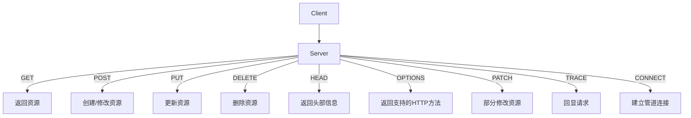

为了实现更精细的控制和管理上传文件和请求体的大小限制，可以采用以下几种方案：

### 方案一：Nginx 配置多个 `location` 块

通过在不同的 `location` 块中设置不同的 `client_max_body_size`，来针对不同的URL路径实现不同的限制。

```nginx
http {
    server {
        listen 80;

        # 全局默认的 client_max_body_size
        client_max_body_size 10M;

        location /upload {
            # 对于 /upload 路径，限制为 50M
            client_max_body_size 50M;
        }

        location /api {
            # 对于 /api 路径，限制为 20M
            client_max_body_size 20M;
        }

        location / {
            # 默认的 client_max_body_size 10M
        }
    }
}
```

### 方案二：使用 Lua 或者 Nginx 的第三方模块

使用 Lua 或者 Nginx 的第三方模块（如 `ngx_http_lua_module`）来进行更精细的控制。

#### 使用 Lua 进行请求体大小限制

需要安装 `ngx_http_lua_module` 模块。假设已经安装了 Lua 模块，可以在 `nginx.conf` 中配置如下：

```nginx
http {
    lua_shared_dict limits 10m;

    init_by_lua_block {
        local limit_req = require "resty.limit.req"
        local limit = limit_req.new("limits", 200, 100)
    }

    server {
        listen 80;

        location /upload {
            client_max_body_size 50M;

            access_by_lua_block {
                local limit_req = require "resty.limit.req"
                local lim, err = limit_req.new("limits", 200, 100)
                if not lim then
                    ngx.log(ngx.ERR, "failed to instantiate a resty.limit.req object: ", err)
                    return ngx.exit(500)
                end

                local key = ngx.var.binary_remote_addr
                local delay, err = lim:incoming(key, true)
                if not delay then
                    if err == "rejected" then
                        return ngx.exit(429)
                    end
                    ngx.log(ngx.ERR, "failed to limit req: ", err)
                    return ngx.exit(500)
                end

                if delay >= 0.001 then
                    ngx.sleep(delay)
                end
            }
        }

        location /api {
            client_max_body_size 20M;

            access_by_lua_block {
                local limit_req = require "resty.limit.req"
                local lim, err = limit_req.new("limits", 200, 100)
                if not lim then
                    ngx.log(ngx.ERR, "failed to instantiate a resty.limit.req object: ", err)
                    return ngx.exit(500)
                end

                local key = ngx.var.binary_remote_addr
                local delay, err = lim:incoming(key, true)
                if not delay then
                    if err == "rejected" then
                        return ngx.exit(429)
                    end
                    ngx.log(ngx.ERR, "failed to limit req: ", err)
                    return ngx.exit(500)
                end

                if delay >= 0.001 then
                    ngx.sleep(delay)
                end
            }
        }
    }
}
```

### 方案三：使用 Nginx 的 `limit_except` 指令

如果只需限制特定请求方法（如 POST 和 PUT），可以使用 `limit_except` 指令。

```nginx
http {
    server {
        listen 80;

        location / {
            client_max_body_size 10M;

            limit_except GET {
                client_max_body_size 50M;
            }
        }

        location /upload {
            limit_except GET {
                client_max_body_size 50M;
            }
        }

        location /api {
            limit_except GET {
                client_max_body_size 20M;
            }
        }
    }
}
```

### 方案四：使用 API 网关（如 Kong）

通过使用 API 网关（如 Kong）来实现更精细的控制。Kong 提供了丰富的插件，可以用于请求体和文件上传的大小限制。

#### 安装并配置 Kong

假设已经安装并运行了 Kong，可以通过 Kong 管理接口配置请求大小限制。

```bash
# 为指定服务或路由添加 request-size-limiting 插件
curl -i -X POST http://localhost:8001/services/{service}/plugins \
    --data "name=request-size-limiting" \
    --data "config.allowed_payload_size=50"  # 单位：MB
```

### 方案五：后端应用层面控制

在后端应用程序中进行控制，确保接收到的请求体和文件大小在合理范围内。

#### 示例（以 Python Flask 为例）

```python
from flask import Flask, request, abort

app = Flask(__name__)

@app.route('/upload', methods=['POST'])
def upload():
    if request.content_length > 50 * 1024 * 1024:
        abort(413, 'File too large')
    # 文件处理逻辑
    return 'File uploaded successfully'

@app.route('/api', methods=['POST'])
def api():
    if request.content_length > 20 * 1024 * 1024:
        abort(413, 'Request body too large')
    # 请求处理逻辑
    return 'Request processed successfully'

if __name__ == '__main__':
    app.run(debug=True)
```

### 方案对比

- **Nginx 配置多个 `location` 块**：适合简单的路径基于限制，不需要额外模块。
- **Lua 模块**：适合需要更细粒度控制的场景，但需要安装和配置 Lua 模块。
- **`limit_except` 指令**：适合基于HTTP方法的限制，但控制粒度较粗。
- **API 网关（Kong）**：提供丰富的功能和插件，适合大型应用和多服务场景。
- **后端应用层面控制**：灵活但需要开发和维护代码。

根据你的需求和环境，选择合适的方案来实现对上传文件和请求体大小的精细控制。

### 方案三：使用 Nginx 的 `limit_except` 指令

`limit_except` 指令允许你针对特定的 HTTP 请求方法（如 POST 和 PUT）应用不同的配置，包括限制请求体的大小。这种方法适用于需要对不同的请求方法施加不同限制的场景。

#### 详细解释

- **`client_max_body_size`**：此指令设置客户端请求体的最大允许大小。超过此限制的请求将返回 413 Request Entity Too Large 错误。
- **`limit_except`**：此指令允许你为除了指定方法以外的所有方法设置特定的配置。在 `limit_except` 块内，你可以设置 `client_max_body_size` 等指令来控制请求体大小。

#### 示例配置

以下示例展示了如何使用 `limit_except` 指令在不同路径和请求方法下应用不同的请求体大小限制。

```nginx
http {
    server {
        listen 80;

        # 对所有路径的默认配置，限制请求体大小为 10M
        location / {
            client_max_body_size 10M;
        }

        # 对 /upload 路径，限制POST 和 PUT 请求体大小为 50M
        location /upload {
            limit_except GET {
                client_max_body_size 50M;
            }
        }

        # 对 /api 路径，限制POST 和 PUT 请求体大小为 20M
        location /api {
            limit_except GET {
                client_max_body_size 20M;
            }
        }

        # 对其他路径的默认处理
        location / {
            client_max_body_size 10M;
        }
    }
}
```

### 详细示例

为了更详细地解释和展示这一方案，这里将给出一个更完整的配置文件，并详细解释各个部分的作用。

```nginx
http {
    server {
        listen 80;
        server_name example.com;

        # 对所有路径的默认配置，限制请求体大小为 10M
        location / {
            client_max_body_size 10M;
        }

        # 对 /upload 路径，限制POST 和 PUT 请求体大小为 50M
        location /upload {
            limit_except GET {
                client_max_body_size 50M;
            }
        }

        # 对 /api 路径，限制POST 和 PUT 请求体大小为 20M
        location /api {
            limit_except GET {
                client_max_body_size 20M;
            }
        }

        # 默认处理其他路径
        location / {
            client_max_body_size 10M;
        }
    }
}
```

#### 解释

1. **全局默认配置**：
   ```nginx
   location / {
       client_max_body_size 10M;
   }
   ```
   这个配置应用于所有路径，将默认的请求体大小限制设置为 10M。任何请求体大小超过 10M 的请求将返回 413 错误。

2. **`/upload` 路径配置**：
   ```nginx
   location /upload {
       limit_except GET {
           client_max_body_size 50M;
       }
   }
   ```
   这个配置应用于 `/upload` 路径。在 `limit_except GET` 块中，限制了除了 GET 方法以外的所有请求（例如 POST 和 PUT）的请求体大小为 50M。GET 请求不受这个限制。

3. **`/api` 路径配置**：
   ```nginx
   location /api {
       limit_except GET {
           client_max_body_size 20M;
       }
   }
   ```
   这个配置应用于 `/api` 路径。在 `limit_except GET` 块中，限制了除了 GET 方法以外的所有请求的请求体大小为 20M。GET 请求不受这个限制。

4. **默认处理其他路径**：
   ```nginx
   location / {
       client_max_body_size 10M;
   }
   ```
   这个部分与全局默认配置一致，确保其他未明确配置的路径也遵循请求体大小限制为 10M。

### 测试配置

为了确保配置正确，可以使用以下方法测试不同路径和请求方法的请求体大小限制。

#### 使用 `curl` 测试

1. **测试全局默认限制**：
   ```bash
   curl -X POST -F "file=@large_file" http://example.com/
   ```
   该请求应该返回 413 错误，如果 `large_file` 大于 10M。

2. **测试 `/upload` 路径限制**：
   ```bash
   curl -X POST -F "file=@large_file" http://example.com/upload
   ```
   该请求应该返回 413 错误，如果 `large_file` 大于 50M。

3. **测试 `/api` 路径限制**：
   ```bash
   curl -X POST -d "data=$(head -c 25M </dev/urandom | base64)" http://example.com/api
   ```
   该请求应该返回 413 错误，因为请求体大小超过了 20M。

通过这种配置方式，可以实现对不同路径和请求方法的精细控制，满足你对上传文件和请求体大小限制的需求。如果需要更复杂的逻辑，可以结合其他方案，如 Lua 模块或 API 网关。

以下是所有常见的 HTTP 请求方法的表格，使用 Markdown 格式展示：

### HTTP 请求方法表格

| HTTP 方法 | 描述                                                           |
|-----------|----------------------------------------------------------------|
| GET       | 请求获取指定资源的信息，不应修改服务器上的资源。               |
| POST      | 提交数据给服务器，通常导致服务器上的资源状态或副作用的变化。   |
| PUT       | 用于更新服务器上的资源，将请求中的数据发送到指定资源。         |
| DELETE    | 删除服务器上的指定资源。                                       |
| HEAD      | 类似于 GET 请求，但只返回头部，不返回请求体。                   |
| OPTIONS   | 请求获取服务器支持的 HTTP 方法。                               |
| PATCH     | 对服务器上的资源进行部分修改。                                 |
| TRACE     | 回显服务器收到的请求，用于测试或诊断。                         |
| CONNECT   | 将连接改为管道方式的代理服务器请求。                           |

### Mermaid 流程图展示

使用 Mermaid 流程图展示 HTTP 请求方法的基本操作流程：



### 解释

- **GET**: 获取资源，例如获取网页内容。
- **POST**: 发送数据以创建或修改资源，例如提交表单。
- **PUT**: 更新指定资源，例如上传文件。
- **DELETE**: 删除指定资源，例如删除文件或数据记录。
- **HEAD**: 类似 GET 请求，但不返回请求体，仅返回头部信息。
- **OPTIONS**: 获取服务器支持的所有 HTTP 方法，通常用于 CORS 预检请求。
- **PATCH**: 部分修改资源，例如更新部分字段。
- **TRACE**: 回显收到的请求，主要用于诊断。
- **CONNECT**: 用于代理服务器创建管道连接，通常用于 HTTPS 连接。
