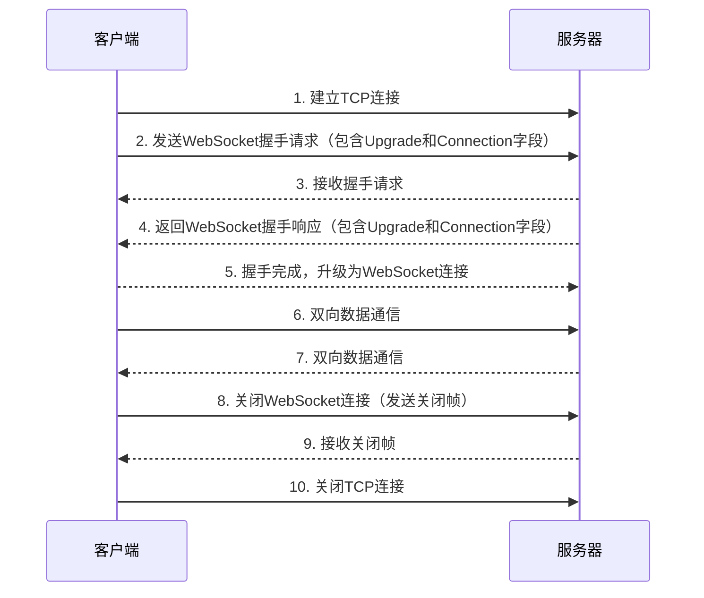

# 配置 Nginx 支持 websockets 

nginx
# 启用 websockets 支持
``` 
location / {
    ...
    proxy_http_version 1.1;
    proxy_set_header Upgrade $http_upgrade; 
    proxy_set_header Connection "upgrade";
}
``` 
# TCP 连接超时  
proxy_read_timeout 420s;  # TCP 读取超时,默认60s  
proxy_send_timeout 420s; # TCP 写超时,默认60s 

`proxy_read_timeout`参数用于设置Nginx与后端服务器建立连接后，读取响应数据的超时时间。如果在指定的时间内没有从后端服务器接收到完整的响应数据，Nginx将中断连接。

你可以在Nginx的`location`块或`server`块中设置`proxy_read_timeout`参数，具体取决于你的配置需求。以下是示例配置中设置`proxy_read_timeout`的位置示例：

```nginx
location / {
    proxy_pass http://backend;
    proxy_read_timeout 420s;
}
```

在上述示例中，`proxy_read_timeout`被设置为420秒。你可以根据需要调整这个值来满足你的应用程序的要求。确保将其放置在适当的上下文中，以便仅对特定的代理位置或服务器生效。

请注意，这只是一个示例，实际的配置可能因你的Nginx版本、具体的代理设置和上下文而有所不同。在修改Nginx配置文件之前，请确保熟悉Nginx的文档和正确的配置语法。


# TCP 链接复用
``` 
proxy_set_header Connection "";
proxy_buffering off; # 关闭代理缓存
``` 

建议:

- 合理设置 proxy_read_timeout 和 proxy_send_timeout 以防止长时间不活跃的链接,比如420s  
- 关闭代理缓存 proxy_buffering off,对 websockets 来说缓存是无效的
- 不设置 Connection 头,让 Nginx 和后端自行处理链接复用
- 选择长连接 keepalive 来提高性能


当使用Nginx配置WebSocket支持时，以下是一些建议，涉及TCP超时和连接复用：

1. 增加TCP超时时间：WebSocket连接通常需要更长的超时时间，以允许客户端和服务器之间的持久连接。你可以通过在Nginx配置中设置`proxy_connect_timeout`和`proxy_read_timeout`的值来增加超时时间。例如：
   ```
   proxy_connect_timeout 7d;
   proxy_read_timeout 7d;
   ```

2. 启用连接复用：为了提高性能，可以启用Nginx的连接复用功能。这可以通过设置`keepalive`参数来实现。你可以在Nginx配置的`http`块中添加以下指令来启用连接复用：
   ```
   upstream backend {
       server backend.example.com;
       keepalive 64;
   }
   ```

   这将启用64个保持活动连接。你还可以根据需要调整`keepalive_timeout`的值。

请注意，这些配置是针对代理WebSocket连接的情况。如果你希望Nginx作为WebSocket服务器，你需要使用`proxy_pass`指令并将WebSocket连接代理到适当的后端服务器。

`keepalive` 是一个网络协议中的概念，用于保持客户端和服务器之间的长连接以减少资源的消耗和提高性能。

在上下文中，`keepalive` 是用于配置Nginx的连接复用功能的参数。当启用连接复用时，Nginx会保持与后端服务器的一定数量的持久连接，这些连接可以被重复使用，而不需要每次请求都重新建立连接。这种重用连接的机制可以显著减少连接的建立和断开的开销，从而提高性能。

`keepalive` 参数用于指定要保持的活动连接的数量。例如，如果将`keepalive` 设置为64，Nginx将保持最多64个与后端服务器的活动连接。这意味着在一段时间内，如果有更多的请求到达，Nginx会重复使用这些连接，而不是为每个请求创建新的连接。这减少了连接的建立和断开所带来的开销。

同时，还可以通过设置`keepalive_timeout`参数来定义连接的超时时间。如果一段时间内没有新的请求到达，连接将被关闭以释放资源。通过适当配置`keepalive_timeout`，可以平衡连接的持久性和资源的释放。

总之，`keepalive` 参数允许Nginx保持与后端服务器的一定数量的持久连接，以提高性能和减少连接的建立和断开开销。

当配置WebSocket支持时，以下是一些优化建议，以提高Nginx的性能和WebSocket的稳定性：

1. 启用TCP_NOPUSH：通过启用`tcp_nopush`参数，可以减少发送网络数据的延迟，提高性能。将以下指令添加到Nginx配置的`http`块中：
   ```
   tcp_nopush on;
   ```

2. 调整工作进程数：根据服务器的硬件配置和负载情况，适当调整Nginx的工作进程数。可以通过在Nginx配置的`events`块中设置`worker_processes`参数来完成。例如：
   ```
   worker_processes auto;
   ```

   使用`auto`值将根据可用的CPU核心数自动设置进程数。

3. 配置文件描述符限制：WebSocket连接可能需要大量的文件描述符。确保操作系统的文件描述符限制足够高，以支持预期的并发连接数。你可以通过增加操作系统的`nofile`限制或修改`nginx.conf`文件中的`worker_rlimit_nofile`参数来实现。

4. 使用更高的端口范围：默认情况下，Nginx使用1024以下的端口需要特权访问。如果WebSocket服务需要在低于1024的端口上运行，可以考虑将Nginx配置为以特权用户身份运行。然后，使用`setcap`命令将可执行文件设置为具有网络绑定能力。

5. 启用Gzip压缩：启用Gzip压缩可以减小数据传输的大小，提高网络传输效率。使用以下指令在Nginx配置中启用Gzip压缩：
   ```
   gzip on;
   gzip_comp_level 5;
   gzip_min_length 256;
   gzip_proxied any;
   gzip_types application/javascript application/json application/octet-stream;
   ```

   这些指令将压缩JavaScript、JSON和二进制文件，并设置压缩级别和最小长度。

这些优化建议可以提高Nginx在配置WebSocket支持时的性能和稳定性。根据你的具体需求和服务器环境，你可以选择适用的优化配置。

# Nginx 配置 WebSocket 优化建议

markdown
- 使用最新的 Nginx 版本,它支持最新的 WebSocket 特性

- 适当提高 worker_connections 的数量,WebSocket 连接较多时会需要

- 合理配置 send/read 超时时间,比如设置为多个小时

- 关闭 gzip 压缩, WebSocket 数据通常已经被压缩

- 关闭限速,WebSocket 传输需要即时性

- 使用长连接 keepalive 

- 增加 upstream 后端服务器数,提高并发处理能力

- 监控 WebSocket 连接数,根据负载动态调整 Nginx  worker_connections 和 upstream 服务器数


总的来说,要满足 WebSocket 的实时性和高并发特点,关键是:

- 足够的连接数
- 合理的超时配置
- 关闭压缩和限速
- 扩展后端服务器
- 动态调整参数

监控指标可以包括:连接数、CPU 利用率、内存利用率等,按需调整 Nginx 和后端规模。

# other 
WebSocket是一种基于TCP的协议，它允许客户端和服务器之间进行全双工通信。与传统的HTTP请求-响应模型不同，WebSocket提供了持久化的连接，可以在客户端和服务器之间实时地发送数据。

以下是WebSocket协议的一些关键特点和解释：

1. 握手过程：WebSocket在初始连接时进行握手过程，使用HTTP协议进行握手请求和响应。客户端通过发送特定的HTTP请求头（包含Upgrade和Connection字段）来表明希望升级到WebSocket协议。服务器在接收到握手请求后，返回带有特定响应头（包含Upgrade和Connection字段）的HTTP响应，表示协议已成功升级。完成握手后，连接升级为WebSocket连接。

2. 持久连接：WebSocket连接是持久的，不同于传统的HTTP连接，在连接建立后，双方可以随时发送数据，而无需每次都进行握手和连接关闭操作。

3. 二进制和文本数据传输：WebSocket可以传输二进制数据和文本数据。客户端和服务器可以使用WebSocket API发送和接收数据帧，这些帧可以包含任意类型的数据。

4. 事件驱动：WebSocket是事件驱动的协议，当有新消息到达或连接状态发生变化时，相关的事件会被触发，从而允许应用程序进行适当的处理。

5. 跨域支持：与AJAX请求不同，WebSocket允许跨域通信，即在不同域之间建立WebSocket连接进行数据传输。

6. 心跳机制：由于WebSocket连接是持久的，为了保持连接活跃，可以使用心跳机制发送周期性的消息或保持活动状态。

总的来说，WebSocket提供了一种更高效、实时和双向的通信方式，适用于需要实时数据更新或双向通信的应用程序，如实时聊天、多人协作、实时游戏等场景。它具有较低的延迟、更小的网络开销，并且更好地支持实时数据传输。



```mermaid
sequenceDiagram
participant 浏览器 as 浏览器
participant 服务器 as 服务器
浏览器->>服务器: 发起HTTP Upgrade请求
 Note right of 浏览器: 包含Upgrade:websocket头
服务器-->>浏览器: 响应101状态码
 Note right of 服务器: 表示换协议
浏览器-->>服务器: 发送握手请求
 Note right of 浏览器: 使用Sec-WebSocket-Key随机数
服务器-->>浏览器: 响应握手
 Note right of 服务器: 使用浏览器随机数加密的Sec-WebSocket-Accept响应头
loops 通信循环
   浏览器->>服务器: 发送websocket消息
   服务器-->>浏览器:响应websocket消息
end
浏览器->>服务器: 关闭websocket连接
服务器-->>浏览器: 响应关闭连接
``` 

大致来说,流程为:

1. 浏览器发起HTTP升级请求,包含Upgrade: websocket头
2. 服务器响应101状态码,表示支持协议升级 
3. 浏览器发送Sec-WebSocket-Key随机数,进行WebSocket握手   
4. 服务器使用加密的Sec-WebSocket-Accept响应头,完成握手
5. 浏览器和服务器开始循环发送和接收WebSocket消息
6. 浏览器或者服务器主动关闭连接后,另一方响应关闭连接,完成通信。

以上就是详细的Websocket通信序列图示,使用Mermaid图表进行呈现


