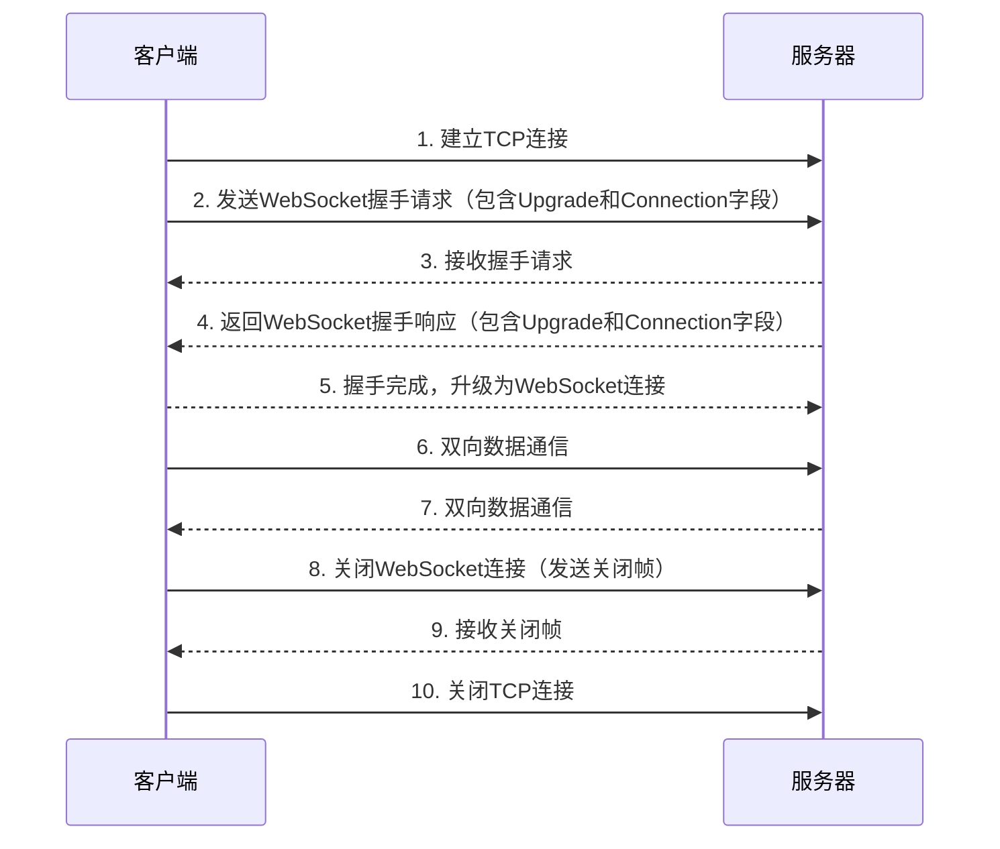
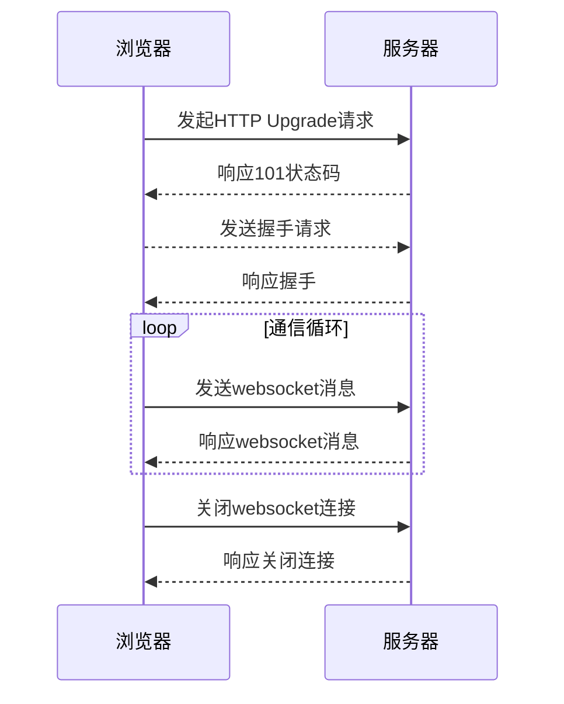

# 配置 Nginx 支持 websockets 

nginx
# 启用 websockets 支持
``` 
location / {
    ...
    proxy_http_version 1.1;
    proxy_set_header Upgrade $http_upgrade; 
    proxy_set_header Connection "upgrade";
}
``` 
# TCP 连接超时  
proxy_read_timeout 420s;  # TCP 读取超时,默认60s  
proxy_send_timeout 420s; # TCP 写超时,默认60s 

`proxy_read_timeout`参数用于设置Nginx与后端服务器建立连接后，读取响应数据的超时时间。如果在指定的时间内没有从后端服务器接收到完整的响应数据，Nginx将中断连接。

你可以在Nginx的`location`块或`server`块中设置`proxy_read_timeout`参数，具体取决于你的配置需求。以下是示例配置中设置`proxy_read_timeout`的位置示例：

```nginx
location / {
    proxy_pass http://backend;
    proxy_read_timeout 420s;
}
```

在上述示例中，`proxy_read_timeout`被设置为420秒。你可以根据需要调整这个值来满足你的应用程序的要求。确保将其放置在适当的上下文中，以便仅对特定的代理位置或服务器生效。

请注意，这只是一个示例，实际的配置可能因你的Nginx版本、具体的代理设置和上下文而有所不同。在修改Nginx配置文件之前，请确保熟悉Nginx的文档和正确的配置语法。


# TCP 链接复用
``` 
proxy_set_header Connection "";
proxy_buffering off; # 关闭代理缓存
``` 

建议:

- 合理设置 proxy_read_timeout 和 proxy_send_timeout 以防止长时间不活跃的链接,比如420s  
- 关闭代理缓存 proxy_buffering off,对 websockets 来说缓存是无效的
- 不设置 Connection 头,让 Nginx 和后端自行处理链接复用
- 选择长连接 keepalive 来提高性能


当使用Nginx配置WebSocket支持时，以下是一些建议，涉及TCP超时和连接复用：

1. 增加TCP超时时间：WebSocket连接通常需要更长的超时时间，以允许客户端和服务器之间的持久连接。你可以通过在Nginx配置中设置`proxy_connect_timeout`和`proxy_read_timeout`的值来增加超时时间。例如：
   ```
   proxy_connect_timeout 7d;
   proxy_read_timeout 7d;
   ```

2. 启用连接复用：为了提高性能，可以启用Nginx的连接复用功能。这可以通过设置`keepalive`参数来实现。你可以在Nginx配置的`http`块中添加以下指令来启用连接复用：
   ```
   upstream backend {
       server backend.example.com;
       keepalive 64;
   }
   ```

   这将启用64个保持活动连接。你还可以根据需要调整`keepalive_timeout`的值。

请注意，这些配置是针对代理WebSocket连接的情况。如果你希望Nginx作为WebSocket服务器，你需要使用`proxy_pass`指令并将WebSocket连接代理到适当的后端服务器。

`keepalive` 是一个网络协议中的概念，用于保持客户端和服务器之间的长连接以减少资源的消耗和提高性能。

在上下文中，`keepalive` 是用于配置Nginx的连接复用功能的参数。当启用连接复用时，Nginx会保持与后端服务器的一定数量的持久连接，这些连接可以被重复使用，而不需要每次请求都重新建立连接。这种重用连接的机制可以显著减少连接的建立和断开的开销，从而提高性能。

`keepalive` 参数用于指定要保持的活动连接的数量。例如，如果将`keepalive` 设置为64，Nginx将保持最多64个与后端服务器的活动连接。这意味着在一段时间内，如果有更多的请求到达，Nginx会重复使用这些连接，而不是为每个请求创建新的连接。这减少了连接的建立和断开所带来的开销。

同时，还可以通过设置`keepalive_timeout`参数来定义连接的超时时间。如果一段时间内没有新的请求到达，连接将被关闭以释放资源。通过适当配置`keepalive_timeout`，可以平衡连接的持久性和资源的释放。

总之，`keepalive` 参数允许Nginx保持与后端服务器的一定数量的持久连接，以提高性能和减少连接的建立和断开开销。

当配置WebSocket支持时，以下是一些优化建议，以提高Nginx的性能和WebSocket的稳定性：

1. 启用TCP_NOPUSH：通过启用`tcp_nopush`参数，可以减少发送网络数据的延迟，提高性能。将以下指令添加到Nginx配置的`http`块中：
   ```
   tcp_nopush on;
   ```

2. 调整工作进程数：根据服务器的硬件配置和负载情况，适当调整Nginx的工作进程数。可以通过在Nginx配置的`events`块中设置`worker_processes`参数来完成。例如：
   ```
   worker_processes auto;
   ```

   使用`auto`值将根据可用的CPU核心数自动设置进程数。

3. 配置文件描述符限制：WebSocket连接可能需要大量的文件描述符。确保操作系统的文件描述符限制足够高，以支持预期的并发连接数。你可以通过增加操作系统的`nofile`限制或修改`nginx.conf`文件中的`worker_rlimit_nofile`参数来实现。

4. 使用更高的端口范围：默认情况下，Nginx使用1024以下的端口需要特权访问。如果WebSocket服务需要在低于1024的端口上运行，可以考虑将Nginx配置为以特权用户身份运行。然后，使用`setcap`命令将可执行文件设置为具有网络绑定能力。

5. 启用Gzip压缩：启用Gzip压缩可以减小数据传输的大小，提高网络传输效率。使用以下指令在Nginx配置中启用Gzip压缩：
   ```
   gzip on;
   gzip_comp_level 5;
   gzip_min_length 256;
   gzip_proxied any;
   gzip_types application/javascript application/json application/octet-stream;
   ```

   这些指令将压缩JavaScript、JSON和二进制文件，并设置压缩级别和最小长度。

这些优化建议可以提高Nginx在配置WebSocket支持时的性能和稳定性。根据你的具体需求和服务器环境，你可以选择适用的优化配置。

# Nginx 配置 WebSocket 优化建议

markdown
- 使用最新的 Nginx 版本,它支持最新的 WebSocket 特性

- 适当提高 worker_connections 的数量,WebSocket 连接较多时会需要

- 合理配置 send/read 超时时间,比如设置为多个小时

- 关闭 gzip 压缩, WebSocket 数据通常已经被压缩

- 关闭限速,WebSocket 传输需要即时性

- 使用长连接 keepalive 

- 增加 upstream 后端服务器数,提高并发处理能力

- 监控 WebSocket 连接数,根据负载动态调整 Nginx  worker_connections 和 upstream 服务器数


总的来说,要满足 WebSocket 的实时性和高并发特点,关键是:

- 足够的连接数
- 合理的超时配置
- 关闭压缩和限速
- 扩展后端服务器
- 动态调整参数

监控指标可以包括:连接数、CPU 利用率、内存利用率等,按需调整 Nginx 和后端规模。

# other 
WebSocket是一种基于TCP的协议，它允许客户端和服务器之间进行全双工通信。与传统的HTTP请求-响应模型不同，WebSocket提供了持久化的连接，可以在客户端和服务器之间实时地发送数据。

以下是WebSocket协议的一些关键特点和解释：

1. 握手过程：WebSocket在初始连接时进行握手过程，使用HTTP协议进行握手请求和响应。客户端通过发送特定的HTTP请求头（包含Upgrade和Connection字段）来表明希望升级到WebSocket协议。服务器在接收到握手请求后，返回带有特定响应头（包含Upgrade和Connection字段）的HTTP响应，表示协议已成功升级。完成握手后，连接升级为WebSocket连接。
- detail it
- 协议切换过程

是的，在WebSocket的初始连接握手过程中，确实会有协议从HTTP升级到WebSocket协议。在建立WebSocket连接时，需要进行跨域资源共享（CORS）的处理。

WebSocket协议不受同源策略的限制，但在实际应用中，仍然需要考虑跨域问题。在WebSocket握手过程中，虽然发送的是HTTP请求，但请求头中的`Upgrade`和`Connection`字段表示希望建立一个WebSocket连接。服务器在处理这些请求时，应该检查请求中的`Origin`字段，以确定请求来自于允许的域名列表。如果请求的来源在允许的列表中，服务器会返回带有相关响应头的HTTP响应，完成握手。否则，服务器应该拒绝这个请求。

在实际开发中，可以使用以下几种方法解决跨域问题：

	1. 在WebSocket服务器端设置允许连接的域名列表。例如，如果您使用Node.js的`ws`库，可以在创建WebSocket服务器时设置`verifyClient`回调函数，用于检查请求的来源是否在允许的域名列表中。

   ```javascript
   const WebSocket = require('ws');

   const server = new WebSocket.Server({
     port: 8080,
     verifyClient: (info) => {
       const allowedOrigins = ['http://example1.com', 'http://example2.com'];
       return allowedOrigins.includes(info.origin);
     },
   });
   ```

	2. 如果您使用WebSocket代理服务器（例如Nginx），可以在代理服务器配置中设置允许的来源域名。

	3. 如果您对跨域限制没有特殊要求，可以在服务器端设置允许所有来源的连接。但请注意，这样做可能导致安全风险。

	4. 总之，虽然WebSocket本身不受同源策略限制，但在实际应用中仍然需要考虑跨域问题。通过在服务器端设置允许的来源域名列表，可以有效解决这个问题。


2. 持久连接：WebSocket连接是持久的，不同于传统的HTTP连接，在连接建立后，双方可以随时发送数据，而无需每次都进行握手和连接关闭操作。

3. 二进制和文本数据传输：WebSocket可以传输二进制数据和文本数据。客户端和服务器可以使用WebSocket API发送和接收数据帧，这些帧可以包含任意类型的数据。

4. 事件驱动：WebSocket是事件驱动的协议，当有新消息到达或连接状态发生变化时，相关的事件会被触发，从而允许应用程序进行适当的处理。

5. 跨域支持：与AJAX请求不同，WebSocket允许跨域通信，即在不同域之间建立WebSocket连接进行数据传输。

6. 心跳机制：由于WebSocket连接是持久的，为了保持连接活跃，可以使用心跳机制发送周期性的消息或保持活动状态。

总的来说，WebSocket提供了一种更高效、实时和双向的通信方式，适用于需要实时数据更新或双向通信的应用程序，如实时聊天、多人协作、实时游戏等场景。它具有较低的延迟、更小的网络开销，并且更好地支持实时数据传输。
- flow




## new 

大致来说,流程为:

1. 浏览器发起HTTP升级请求,包含Upgrade: websocket头
2. 服务器响应101状态码,表示支持协议升级 
3. 浏览器发送Sec-WebSocket-Key随机数,进行WebSocket握手   
4. 服务器使用加密的Sec-WebSocket-Accept响应头,完成握手
5. 浏览器和服务器开始循环发送和接收WebSocket消息
6. 浏览器或者服务器主动关闭连接后,另一方响应关闭连接,完成通信。

以上就是详细的Websocket通信序列图示,使用Mermaid图表进行呈现


RFC 6455 文档描述了 WebSocket 协议，这是一种在单个持久连接上实现全双工通信的网络协议。WebSocket 旨在解决 HTTP 长轮询和短轮询技术的不足，提供实时、低延迟的客户端-服务器通信。

以下是该文档的主要内容概述：

1. **介绍**

   WebSocket 协议的设计目标是在 Web 浏览器和服务器之间提供简单、低开销的双向通信。它通过允许服务器主动向客户端发送数据，消除了 HTTP 长轮询和短轮询的不足。

2. **术语和约定**

   文章中使用了一些专业术语，例如客户端、服务器、数据帧、掩码等，以便更好地描述协议的工作原理。

3. **WebSocket URI**

   WebSocket 使用 URI（统一资源标识符）来标识目标服务器。WebSocket URI 的格式遵循 `ws://`（非加密）或 `wss://`（加密）方案。

4. **握手**

   握手过程是客户端与服务器建立 WebSocket 连接的初始阶段。客户端发送一个 HTTP GET 请求，包含 "Upgrade: websocket" 和 "Connection: Upgrade" 头部，请求将 HTTP 连接升级为 WebSocket 连接。服务器在响应中包含相应的头部以确认升级。

5. **数据帧**

   数据在 WebSocket 连接上以数据帧的形式发送。每个数据帧包含一个操作码（例如文本、二进制数据、关闭连接等），数据负载和一个结束位。客户端发送的数据帧需要进行掩码处理，以防止缓存污染攻击。

6. **关闭连接**

   WebSocket 连接可以通过发送一个包含特殊操作码的数据帧来关闭。客户端和服务器都可以发起关闭连接的请求。当收到关闭请求时，另一方应发送一个关闭帧以确认。

7. **错误处理**

   如果在数据帧的解析过程中出现错误，客户端或服务器应该发送一个关闭帧，并使用适当的状态码来表示原因。之后，连接将被关闭。

8. **示例**

   文档提供了使用 WebSocket 协议的示例，包括握手过程和数据帧的发送与接收。

9. **安全性**

   WebSocket 协议的设计考虑了各种安全问题，例如跨站请求伪造（CSRF）和跨站脚本（XSS）攻击。特别是，客户端到服务器的数据帧需要进行掩码处理，以防止潜在的攻击。

总之，RFC 6455 文档详细描述了 WebSocket 协议，这是一种在客户端和服务器之间实现实时、低延迟通信的技术。文档包括了协议的工作原理、握手过程、数据帧格式、错误处理等方面的内容，并提供了示例来帮助理解。

# enhance
## Q
如果nginx 启用支持WebSocket 那么关于 Nginx支持的 worker_processes和 worker_connections  还有 Nginx有三种事件模型,对于WebSocket可考虑采用那个事件模型 或者 调整buffers和连接数 有什么建议？
这个建议的前提是我运行nginx的主机仅有单核CPU 另外内存是8G
给我生成一个nginx.conf 
 将文档以Markdown的格式帮我输出
## A

gpt 3.5

以下是适用于单核CPU和8GB内存的 Nginx 配置文件，包括关于支持 WebSocket 的 `worker_processes` 和 `worker_connections` 建议，以及针对 WebSocket 的事件模型和缓冲区大小的建议。

```
user  nginx;
worker_processes  1;

error_log  /var/log/nginx/error.log warn;
pid        /var/run/nginx.pid;

events {
    worker_connections  1024;
    use               epoll;
    multi_accept      on;
}

http {
    include       /etc/nginx/mime.types;
    default_type  application/octet-stream;

    log_format  main  '$remote_addr - $remote_user [$time_local] "$request" '
                      '$status $body_bytes_sent "$http_referer" '
                      '"$http_user_agent" "$http_x_forwarded_for"';

    access_log  /var/log/nginx/access.log  main;

    sendfile        on;
    tcp_nopush      on;
    tcp_nodelay     on;

    keepalive_timeout  60s;

    gzip  on;
    gzip_types text/plain text/css application/json application/javascript text/xml application/xml application/xml+rss text/javascript;

    server {
        listen       80;
        server_name  localhost;

        location / {
            proxy_pass http://backend;
            proxy_http_version 1.1;
            proxy_set_header Upgrade $http_upgrade;
            proxy_set_header Connection "upgrade";
        }
    }

    upstream backend {
        server backend-server:8080;
    }
}
```

在以上配置文件中：

- `worker_processes` 被设置为 1，以避免不必要的进程切换和资源浪费。
- `worker_connections` 被设置为 1024，以支持更多的长连接。
- `events` 块中使用了 `epoll` 事件模型，并启用了 `multi_accept`，以提高并发性能。
- `keepalive_timeout` 被设置为 60s，以确保连接不会因为空闲时间过长而断开。
- `proxy_pass` 指向了您的 WebSocket 后端服务器，其中 `proxy_http_version` 和 `proxy_set_header` 用于启用 WebSocket 协议。

针对缓冲区大小和连接数的建议如下：

- 调整 `proxy_buffers` 和 `proxy_buffer_size` 参数，以适当地增加缓冲区大小。例如，将 `proxy_buffers` 设置为 8 个，`proxy_buffer_size` 设置为 4k。
```
proxy_buffers 8 4k;
proxy_buffer_size 4k;
```

- 调整 `worker_rlimit_nofile` 参数，以支持更多的文件句柄。例如，将其设置为 65535 或更高。
```
worker_rlimit_nofile 65535;
```

建议使用 `epoll` 事件模型，因为它在处理大量连接时表现最佳，并且在支持 WebSocket 协议方面也非常强大。

注意：以上建议仅供参考，具体参数设置取决于您的实际情况和需求。建议在调整参数之前备份您的 Nginx 配置文件，并进行适当的测试和性能评估，以确保调整后的参数能够满足您的需求并保持稳定性。

GPT 4

在配置 Nginx 支持 WebSocket 时，您需要考虑 worker_processes、worker_connections 以及事件模型。此外，根据您提供的信息，您的服务器只有单核 CPU 且拥有 8GB 内存。

首先，关于 `worker_processes`，我们建议设置为与 CPU 核心数相同。因为您的服务器是单核，所以可以将其设置为 1。

其次，关于 `worker_connections`，您可以根据服务器的内存和预期负载进行调整。通常，1000 是一个合理的起始值。您可以根据实际需求进行调整。

关于事件模型，Nginx 支持三种：select、poll 和 epoll。对于 WebSocket 而言，`epoll` 是最佳选择，因为它在高并发场景下性能更好。不过，如果您的操作系统不支持 epoll，您可以使用其他事件模型。

针对 WebSocket，您还可以优化 `buffers` 和连接数。对于 `client_body_buffer_size` 和 `client_header_buffer_size`，默认值通常已足够。对于 `large_client_header_buffers`，建议将其设置为更大的值，例如 `4 16k`，以处理潜在的大型 HTTP 头部。

基于这些参数，以下是一份简化的 `nginx.conf` 示例：

```nginx
worker_processes 1;
events {
    worker_connections 1000;
    use epoll;
}

http {
    include mime.types;
    default_type application/octet-stream;

    sendfile on;
    keepalive_timeout 65;

    server {
        listen 80;
        server_name example.com;

        location /websocket {
            proxy_pass http://websocket_backend;
            proxy_http_version 1.1;
            proxy_set_header Upgrade $http_upgrade;
            proxy_set_header Connection "Upgrade";
            proxy_set_header Host $host;
            proxy_set_header X-Real-IP $remote_addr;

            client_body_buffer_size 8k;
            client_header_buffer_size 1k;
            large_client_header_buffers 4 16k;
        }
    }
}
```

请注意，以上配置仅为示例，您需要根据实际情况进行调整。例如，您需要将 `server_name` 设置为您的域名，以及设置正确的 WebSocket 后端地址。


tcp_nodelay tcp_nopush 的设置？

## ngx_stream_lua_module

如果您已经配置了Nginx以支持WebSocket，那么使用ngx_stream_lua_module模块可以带来以下好处：

1. 灵活性：ngx_stream_lua_module模块允许您使用Lua脚本扩展和自定义Nginx的功能。您可以通过编写Lua脚本来处理和操作WebSocket连接，以满足特定需求。

2. 高性能：Lua脚本在Nginx内部执行，因此具有较高的性能。它允许您通过在请求级别处理WebSocket连接来提高性能，并减轻上游服务器的负载。

3. 功能丰富：ngx_stream_lua_module提供了许多有用的函数和指令，可用于管理和操作WebSocket连接。您可以使用这些功能来处理连接的生命周期、发送和接收消息、执行认证和授权等操作。

如果您想要维护所有WebSocket连接的集合，以下是一些建议：

1. 使用Lua全局变量：您可以在Lua脚本中使用Lua全局变量来存储WebSocket连接的集合。每当有新的WebSocket连接建立或关闭时，您可以更新这个集合。

2. 使用Lua表（table）：Lua表是一种数据结构，可用于组织和存储WebSocket连接的集合。您可以使用Lua表的键值对来表示每个连接，并在需要时添加、删除或查询连接。

3. 使用共享内存：如果您的Nginx配置使用了共享内存模块（例如ngx.shared.DICT），您可以使用它来存储和共享WebSocket连接的集合。这样可以在多个Nginx worker进程之间共享连接信息。

这些是维护WebSocket连接集合的一些常见做法。具体选择取决于您的应用需求和Nginx配置。


使用 ngx_stream_lua_module 可以在 Nginx 配置中支持 WebSocket，并且提供了一些有用的功能和好处，包括：

动态处理请求：ngx_stream_lua_module 允许您使用 Lua 脚本来动态处理 WebSocket 请求。您可以使用 Lua 脚本编写自定义的处理逻辑，根据不同的请求参数或头信息来执行不同的操作。

丰富的功能扩展：ngx_stream_lua_module 提供了一系列的功能扩展，例如日志记录、会话管理、路由和中间件等。这些功能可以帮助您更轻松地管理和扩展 WebSocket 连接。

高效的性能：ngx_stream_lua_module 具有高效的性能，可以处理大量的并发连接，并且可以有效地处理请求和响应。此外，它还提供了可配置的缓冲区大小和连接数，以确保在高峰期仍能保持高性能。

可扩展性和灵活性：ngx_stream_lua_module 的可扩展性和灵活性非常高，您可以根据需要编写自定义的 Lua 脚本，以实现特定的业务逻辑和功能。这使得您可以根据实际需求进行定制和扩展。

关于维持所有 WebSocket 连接的集合，以下是一些推荐：

使用 ngx_stream_lua_module 的功能来管理连接：ngx_stream_lua_module 提供了一些有用的功能来管理 WebSocket 连接，例如会话管理、路由和中间件等。您可以使用这些功能来维护和管理所有 WebSocket 连接的集合。

使用 Lua 脚本来跟踪连接：您可以使用 Lua 脚本编写自定义的逻辑

# cross 
``` 
location /websocket-endpoint {
    proxy_pass http://backend-server;
    proxy_http_version 1.1;
    proxy_set_header Upgrade $http_upgrade;
    proxy_set_header Connection "upgrade";
    proxy_set_header Host $host;
    proxy_set_header Origin $http_origin;
    add_header 'Access-Control-Allow-Origin' "$http_origin" always;
    add_header 'Access-Control-Allow-Credentials' 'true' always;
}
``` 


# curl wss
要使用cURL模拟WebSocket Secure (WSS) 连接，您可以使用`--include`选项添加WebSocket协议头，并通过`--no-buffer`选项禁用缓冲。

以下是一个示例命令：

```shell
curl --include --no-buffer --header "Connection: Upgrade" --header "Upgrade: websocket" --header "Sec-WebSocket-Version: 13" --header "Sec-WebSocket-Key: <your-key>" "wss://your-wss-url"
```

请确保将`<your-key>`替换为实际的WebSocket密钥，将`wss://your-wss-url`替换为您要连接的WebSocket服务器的URL。

这将使用cURL建立与WSS服务器的连接，并将服务器的响应输出到控制台。请注意，这只是一个简单的示例命令，您可能需要根据实际情况进行适当的调整和配置。