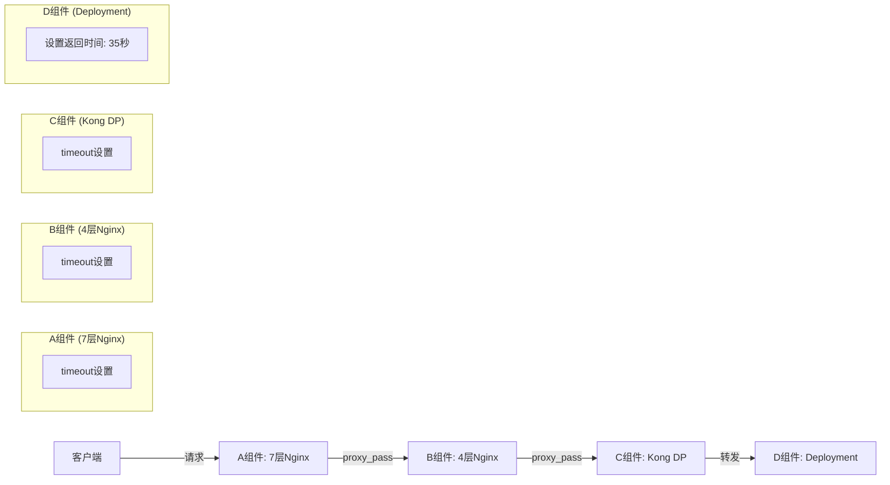

在HTTP请求处理中，状态码499通常表示客户端在服务器完成响应之前关闭了连接。这种情况常见于当客户端（比如浏览器或其他HTTP客户端）等待时间超过其自身的超时设置时，主动断开连接。

在您的场景中，问题似乎出现在从客户端到C组件（Kong DP）再到D组件（Deployment）的请求流程中。可能是由于D组件需要较长时间处理请求，而客户端的超时设置比这个处理时间短，因此出现了499错误。

以下是一些可能的原因和解决方案：

### 1. **客户端超时设置**
客户端可能设置了一个相对较短的超时时间。例如，浏览器或HTTP客户端通常默认的超时时间可能在30秒左右。解决方案包括：

- 增加客户端的超时时间，以确保在请求需要较长时间时，客户端不会提前断开连接。

### 2. **代理层的超时设置**
如果在C组件（Kong DP）或其他代理层设置了超时，这也可能导致客户端在超过该时间后断开连接。解决方案包括：

- 检查并调整Kong DP的相关超时设置，例如 `nginx_proxy_read_timeout`、`nginx_proxy_connect_timeout` 和 `nginx_proxy_send_timeout`。确保这些设置足够大，以涵盖最坏情况下的请求时间。

### 3. **后端服务（D组件）的响应时间**
如果后端服务需要很长时间来生成响应，那么即使中间层（如Kong DP）有较长的超时设置，客户端也可能因为等待太久而断开连接。解决方案包括：

- 优化D组件的性能，减少处理时间。
- 考虑将复杂的长时间任务异步化处理，返回早期响应给客户端，并通过回调或轮询机制通知任务完成。

### 4. **负载均衡器的超时设置**
如果在D组件之前还有负载均衡器，负载均衡器的超时设置也可能影响请求流的完整性。解决方案包括：

- 检查负载均衡器的超时设置，确保与其他组件一致。

### 解决步骤总结

1. **检查和增加客户端的超时时间**，如果可以控制客户端配置。
2. **检查并调整Kong DP或其他代理服务器的超时设置**。
3. **优化后端服务（D组件）的性能**，如果处理时间确实较长。
4. **检查负载均衡器的超时设置**，如果存在此类配置。

确保所有组件的超时设置合理且一致，并在可能的情况下，尽量缩短后端服务的响应时间，是解决499错误和提高系统稳定性的重要手段。

您提出了一个非常具体且常见的问题。让我们深入分析这个情况，并提供一些可能的解决方案。


首先，让我们用一个图表来可视化整个请求流程，包括新添加的D组件：



现在，让我们分析这个问题：

1. 问题描述：
   - D组件设置为35秒后返回
   - 实际上在30秒时就返回了stream timeout
   - 日志中显示499错误

2. 原因分析：
   a. 499错误码：
      - 499是Nginx特有的状态码，表示"客户端主动关闭了连接"
      - 这通常发生在上游服务器(如D组件)还在处理请求，但客户端已经断开连接的情况下

   b. 超时设置不一致：
      - 很可能是链路中某个组件(A, B, 或C)的超时设置小于35秒，导致请求在到达D组件之前就被终止了

3. 可能的解决方案：

   a. 检查并调整每个组件的超时设置：
      - A组件 (7层Nginx)：确保 `proxy_read_timeout`, `proxy_send_timeout`, 和 `proxy_connect_timeout` 至少设置为40秒
      - B组件 (4层Nginx)：虽然4层不直接处理HTTP，但确保其 load balancer 的超时设置足够长
      - C组件 (Kong DP)：调整 `upstream_read_timeout` 和 `upstream_send_timeout` 至少为40000毫秒(40秒)
      - 确保Google Cloud负载均衡器的 `timeoutSec` 设置足够长（如果使用）

   b. 实施递增超时策略：
      - D组件：35秒
      - C组件：40秒
      - B组件：45秒
      - A组件：50秒

   c. 优化D组件的处理逻辑：
      - 如果可能，尝试减少D组件的处理时间
      - 考虑实现异步处理机制，快速返回一个处理ID，然后允许客户端轮询结果

   d. 实现请求追踪：
      - 使用分布式追踪工具（如Jaeger或Zipkin）来精确定位请求在哪个环节超时

   e. 调整客户端超时设置：
      - 如果可能，增加客户端的超时设置，使其大于服务器端的最长处理时间

   f. 错误处理和重试机制：
      - 在A组件实现智能的重试机制，对于499错误可以考虑重试请求
      - 在D组件实现部分处理结果的保存，以便重试时可以快速恢复

   g. 健康检查和熔断：
      - 实施更细粒度的健康检查，快速识别并隔离有问题的实例
      - 实现熔断机制，防止单个慢请求影响整个系统的性能

4. 具体配置示例：

   对于A组件（Nginx），您可以添加或修改以下配置：

   ```nginx
   http {
     proxy_read_timeout 50s;
     proxy_send_timeout 50s;
     proxy_connect_timeout 50s;
     
     # 对于499错误的重试
     proxy_next_upstream error timeout http_499;
     proxy_next_upstream_tries 2;
   }
   ```

   对于C组件（Kong），修改以下配置：

   ```yaml
   upstream_read_timeout: 40000
   upstream_send_timeout: 40000
   upstream_connect_timeout: 60000
   ```

   对于D组件，如果是使用Kubernetes Deployment，可以在容器规格中添加就绪探针和存活探针：

   ```yaml
   readinessProbe:
     httpGet:
       path: /healthz
       port: 8080
     periodSeconds: 5
     failureThreshold: 3
   livenessProbe:
     httpGet:
       path: /healthz
       port: 8080
     periodSeconds: 10
     failureThreshold: 3
   ```

5. 监控和日志：
   - 在每个组件中添加详细的日志，记录请求的处理时间和状态
   - 使用监控工具（如Prometheus和Grafana）来实时监控各个组件的性能和超时情况

通过实施这些措施，您应该能够解决当前遇到的超时问题，并提高整个系统的稳定性和可靠性。记住，解决复杂的


在处理请求超时问题时，区分超时发生在哪个节点对于故障排查和优化很重要。你提到的两种错误信息：

1. **stream timeout**: 这通常表明在流数据时发生了超时，可能是由于服务器或代理没有在预期时间内返回数据。
2. **upstream timeout**: 这通常指的是在代理服务器（如Nginx或Kong DP）尝试与上游服务器建立连接或接收响应时发生了超时。

要确定哪个节点导致这些超时，可以采取以下步骤：

### 1. **检查日志文件**
每个节点（如Nginx、Kong、后端服务器）通常都会有日志记录，可以提供有关请求处理的信息。这些日志包括：

- **访问日志（Access Logs）**: 记录所有请求和响应的信息。
- **错误日志（Error Logs）**: 记录发生的任何错误，包括超时和其他异常。

在日志中查找相关的超时错误，通常可以发现超时发生在哪个组件，以及可能的原因。例如，在Nginx中，`499`状态码通常表示客户端在等待响应时断开连接，而`504`状态码则表示网关超时。

### 2. **启用调试日志**
如果普通日志无法提供足够的信息，可以启用调试日志记录更详细的信息。例如，在Nginx中，可以使用`error_log`指令设置日志级别为`debug`。Kong和其他代理服务器也有类似的调试选项。

### 3. **使用`curl`和其他工具**
你可以使用`curl`命令配合`-v`（verbose）或`--trace`选项来调试请求过程。这些选项会详细输出请求和响应的每一个步骤，包括头部信息和响应时间。

```bash
curl -v https://example.com
```

或

```bash
curl --trace-ascii /tmp/trace.txt https://example.com
```

通过这些详细的输出，可以了解请求是在哪一步延迟或超时的。

### 4. **监控和可视化工具**
使用监控工具（如Prometheus、Grafana）或可视化分析工具（如Elasticsearch, Logstash, Kibana，简称ELK）可以帮助你从宏观上了解系统的性能和瓶颈。这些工具可以收集并展示不同节点的响应时间、错误率和其他关键指标。

### 5. **逐步排查**
为了更清晰地确定问题来源，可以通过逐步排查的方式排除其他因素。例如：

- **单独测试每个组件**：从客户端直接请求B组件、C组件，甚至D组件，逐步检查各个组件的响应时间。
- **检查网络连接**：确保各节点之间的网络连接稳定，排除网络延迟或丢包的可能。

通过这些方法，应该可以确定导致stream timeout和upstream timeout的具体节点，并进一步排查和解决问题。
