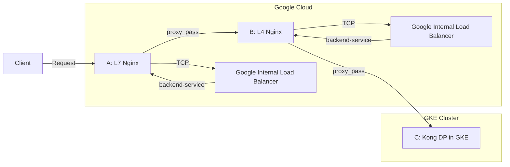

# A
假设在我的Google环境中我使用了下面这些组建或者对应的服务，我想理解整个Flow过程中关于Timeout的一些影响
A组件是一个运行7层Nginx的Instance。这里其实涉及到一个问题在Google环境中，对于内部直通式网络负载均衡器和外部直通网络负载均衡器，可以设置后端服务超时的值，但系统会忽略该值，
后端服务超时对于这些直通负载均衡器没有任何意义,这里我理解其实就是对于TCP的也就是4层的后端服务设置没有意义
我会通过对应的forwarding-rules转发到我对应的backend-services上面
-->需要注意forward rules是TCP的
backend-services可以是TCP的也可以是https的
对于backend-services我们可以看到有对应的两个超时设置,比如我的设置是
timeoutSec: 30 
drainingTimeoutSec: 300
## A组件
再比如我可能会在对应的nginx配置中有如下一些超时设置
```bash
location /abc/v1/ {
rewrite ^(.*)$ “://www..aibang.com$1”
rewirte ^(.*)$ “https$1” break;
proxy_pass https://192.168.0.188:8080/;
proxy_set_header Host www.aibang.com;
proxy_set_header X-Real-Ip $remote_addr;
}
```
## B组件
B 组件是一个4层的nginx的instance，也就是A 组件proxy_pass的这个主机 设置和A类似的地方也是通过对应的forwarding-rules转发到我对应的backend-services上面
对于backend-services我们可以看到有对应的两个超时设置,比如我的设置是
timeoutSec: 30 
drainingTimeoutSec: 300
B组件大概配置如下
侦听上面过来的端口8080,这个其实是一个4层的nginx而且转发的backend-service也是4层的，也就是说后端服务超时需要忽略的
```bash
service {
listen 8080;
ssl_preread on;
proxy_pass 10.0.0.5:443;
access_log /opt/access-in.log basic;
}
```
## C 组件
C组件其实我环境里面的一个Kong DP的地址。这个Kong DP安装在我的GKE里面 暴露服务的
地址是10.0.0.5:443
我现在比较关心的，比如我一个正常的请求走上面这个Flow 
A==> B==>C 其中在Google工程里面A组件如果走的TCP协议的backendservice也就是直通式网络负载均衡器可以忽略其本身的的超时设置，其超时设置依赖于这个7层nginx本身的配置了
如果我的一个请求假设整个请求需要大概3分钟才能返回数据？那么需要调整那些地方的配置？
再各个跳跃的Flow上面如何做一个最好的优化？或者最佳实践？
我尝试在A的nginx中增加如下配置，好像可以解决部分问题
proxy_read_timeout 300;
proxy_connect_timeout 300;
proxy_send_timeout 300;
另外我比较关心比如Kong DP是不是也要做一些调整和设置才可以？
## 在我的实际场景中
可以在A组件里面做下面这种配置来解决一部分需要特殊超时才能处理的问题
```bash
location /abc/v1/ {
rewrite ^(.*)$ “://www..aibang.com$1”
rewirte ^(.*)$ “https$1” break;
proxy_pass https://192.168.0.188:8080/;
proxy_set_header Host www.aibang.com;
proxy_set_header X-Real-Ip $remote_addr;
    proxy_read_timeout 300s;
    proxy_connect_timeout 300s;
    proxy_send_timeout 300s;
}
```

首先，让我们用一个流程图来可视化您描述的架构：



现在，让我们分析每个组件的超时设置，并提供一些建议来处理3分钟的请求时间：

1. A组件（L7 Nginx）:
   - Google负载均衡器的超时设置（TCP 直通式）可以忽略。
   - Nginx的配置是关键。您已经添加了正确的设置：
     ```nginx
     proxy_read_timeout 300s;
     proxy_connect_timeout 300s;
     proxy_send_timeout 300s;
     ```
   这些设置允许最多5分钟的超时，足以处理3分钟的请求。

2. B组件（L4 Nginx）:
   - 同样，Google负载均衡器的超时设置（TCP 直通式）可以忽略。
   - 由于这是一个4层的Nginx，它主要处理TCP连接，不处理HTTP层面的超时。
   - 然而，可以考虑在Nginx配置中添加TCP代理超时设置：
     ```nginx
     proxy_timeout 300s;
     ```

3. C组件（Kong DP in GKE）:
   - Kong也需要调整以处理长时间运行的请求。
   - 在Kong的配置中，可以添加或修改以下设置：
     ```yaml
     nginx_http_upstream_keepalive_timeout: 300s
     nginx_http_client_body_timeout: 300s
     nginx_http_proxy_send_timeout: 300s
     nginx_http_proxy_read_timeout: 300s
     ```

最佳实践和优化建议：

1. 一致性：确保所有组件的超时设置一致，都设置为至少300秒（5分钟）。

2. 监控：实施详细的监控，以便您可以识别哪里可能发生超时。

3. 重试机制：在客户端实现智能重试机制，以处理可能的间歇性超时。

4. 分段处理：如果可能，考虑将长时间运行的请求分解为多个较小的请求。

5. 异步处理：对于特别长时间运行的任务，考虑实现异步处理机制。

6. 健康检查：确保所有组件都有适当的健康检查配置，以便及时发现并替换不健康的实例。

7. 负载测试：进行全面的负载测试，模拟长时间运行的请求，以确保整个系统在压力下表现良好。

8. 日志和跟踪：实施详细的日志记录和分布式跟踪，以便更容易诊断问题。

9. 优雅降级：实现优雅降级策略，以便在某些组件超时的情况下，系统仍然可以提供有限的功能。

10. 定期审查：定期审查和更新超时设置，以确保它们仍然满足您的需求。

通过实施这些建议和最佳实践，您应该能够有效地处理长时间运行的请求，同时保持系统的稳定性和可靠性。如果您需要关于任何特定组件的更多详细信息或有任何其他问题，请随时询问。​​​​​​​​​​​​​​​​
