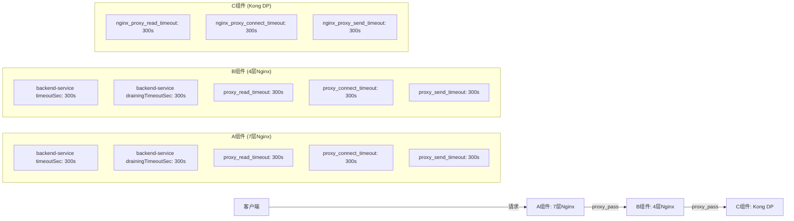
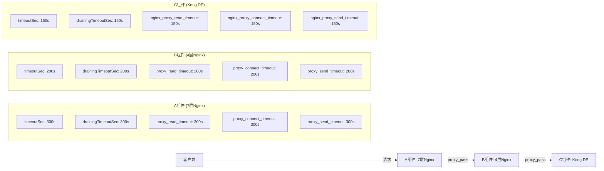
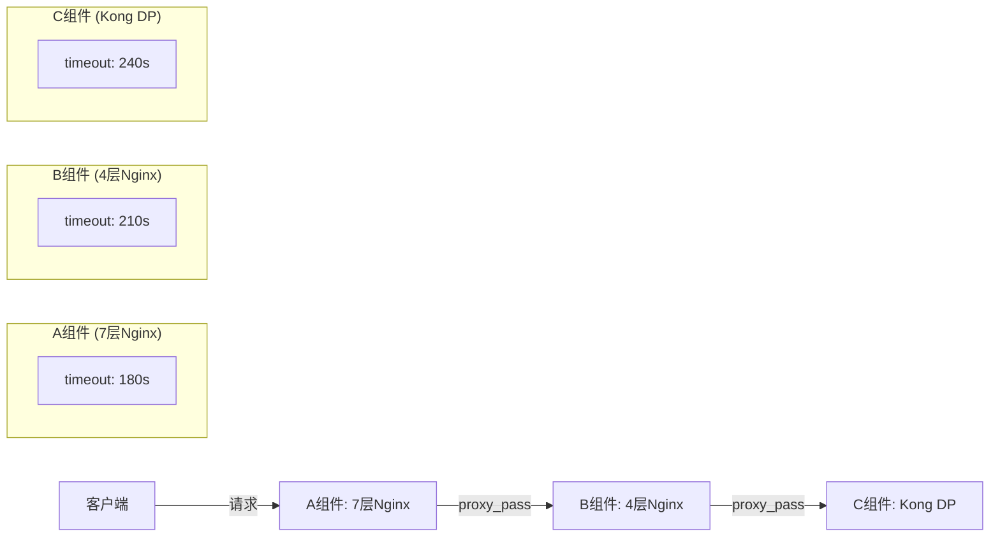

# Timeout 

假设在我的Google环境中我使用了下面这些组建或者对应的服务，我想理解整个Flow过程中关于Timeout的一些影响
A组件是一个运行7层Nginx的Instance。这里其实涉及到一个问题在Google环境中，对于内部直通式网络负载均衡器和外部直通网络负载均衡器，可以设置后端服务超时的值，但系统会忽略该值，
后端服务超时对于这些直通负载均衡器没有任何意义,这里我理解其实就是对于TCP的也就是4层的后端服务设置没有意义
我会通过对应的forwarding-rules转发到我对应的backend-services上面
-->需要注意forward rules是TCP的
backend-services可以是TCP的也可以是https的
对于backend-services我们可以看到有对应的两个超时设置,比如我的设置是
timeoutSec: 30 
drainingTimeoutSec: 300
## A组件
再比如我可能会在对应的nginx配置中有如下一些超时设置
```bash
location /abc/v1/ {
rewrite ^(.*)$ “://www..aibang.com$1”
rewirte ^(.*)$ “https$1” break;
proxy_pass https://192.168.0.188:8080/;
proxy_set_header Host www.aibang.com;
proxy_set_header X-Real-Ip $remote_addr;
}
```
## B组件
B 组件是一个4层的nginx的instance，也就是A 组件proxy_pass的这个主机 设置和A类似的地方也是通过对应的forwarding-rules转发到我对应的backend-services上面
对于backend-services我们可以看到有对应的两个超时设置,比如我的设置是
timeoutSec: 30 
drainingTimeoutSec: 300
B组件大概配置如下
侦听上面过来的端口8080,这个其实是一个4层的nginx而且转发的backend-service也是4层的，也就是说后端服务超时需要忽略的
```bash
service {
listen 8080;
ssl_preread on;
proxy_pass 10.0.0.5:443;
access_log /opt/access-in.log basic;
}
```
## C 组件
C组件其实我环境里面的一个Kong DP的地址。这个Kong DP安装在我的GKE里面 暴露服务的
地址是10.0.0.5:443
我现在比较关心的，比如我一个正常的请求走上面这个Flow 
A==> B==>C 其中在Google工程里面A组件如果走的TCP协议的backendservice也就是直通式网络负载均衡器可以忽略其本身的的超时设置，其超时设置依赖于这个7层nginx本身的配置了
如果我的一个请求假设整个请求需要大概3分钟才能返回数据？那么需要调整那些地方的配置？
再各个跳跃的Flow上面如何做一个最好的优化？或者最佳实践？
我尝试在A的nginx中增加如下配置，好像可以解决部分问题
proxy_read_timeout 300;
proxy_connect_timeout 300;
proxy_send_timeout 300;
另外我比较关心比如Kong DP是不是也要做一些调整和设置才可以？
## 在我的实际场景中
可以在A组件里面做下面这种配置来解决一部分需要特殊超时才能处理的问题
```bash
location /abc/v1/ {
rewrite ^(.*)$ “://www..aibang.com$1”
rewirte ^(.*)$ “https$1” break;
proxy_pass https://192.168.0.188:8080/;
proxy_set_header Host www.aibang.com;
proxy_set_header X-Real-Ip $remote_addr;
    proxy_read_timeout 300s;
    proxy_connect_timeout 300s;
    proxy_send_timeout 300s;
}
```
# ChatGPT
要处理请求流程中的超时问题，并确保整个请求链条从A到B再到C能够顺利完成，需要考虑各个组件的超时设置。以下是对各个组件和服务的超时配置建议：

### 1. **Nginx Instance (A Component)**
Nginx作为A组件的前端服务器，负责将请求转发到B组件的Nginx实例。在这个位置，可以配置以下超时参数来处理请求的延迟：

```nginx
location /abc/v1/ {
    proxy_pass https://192.168.0.188:8080/;
    proxy_set_header Host www.aibang.com;
    proxy_set_header X-Real-Ip $remote_addr;

    proxy_read_timeout 300s;
    proxy_connect_timeout 300s;
    proxy_send_timeout 300s;
}
```

这些参数定义了：
- **`proxy_read_timeout`**: Nginx等待上游服务器（B组件）发送响应的时间。
- **`proxy_connect_timeout`**: Nginx与上游服务器（B组件）建立连接的时间。
- **`proxy_send_timeout`**: Nginx发送请求到上游服务器（B组件）的时间。

### 2. **Nginx Instance (B Component)**
B组件也是一个Nginx实例，它接收A组件的请求并将其转发到C组件（Kong DP）。配置B组件的超时参数同样重要，以确保能够处理长时间的请求。

```nginx
service {
    listen 8080;
    ssl_preread on;
    proxy_pass 10.0.0.5:443;

    proxy_read_timeout 300s;
    proxy_connect_timeout 300s;
    proxy_send_timeout 300s;

    access_log /opt/access-in.log basic;
}
```

这些设置与A组件类似，确保B组件在与Kong DP（C组件）的通信过程中能够处理较长时间的请求。

### 3. **Kong DP (C Component)**
Kong DP作为API网关，可能需要处理高延迟请求。根据Kong的官方文档，可以配置以下超时设置：

```yaml
# in kong.conf or custom Nginx configuration
nginx_proxy_read_timeout = 300s
nginx_proxy_connect_timeout = 300s
nginx_proxy_send_timeout = 300s
```

这些参数配置Kong在处理代理请求时的超时时间。确保这些设置与前面提到的Nginx实例的设置一致，以避免不必要的连接中断。

### 4. **Google Cloud Backend Services**
对于使用Google Cloud Backend Services的场景，超时设置也至关重要。你的配置为：

- `timeoutSec: 30`
- `drainingTimeoutSec: 300`

需要将`timeoutSec`的值增加到300秒，以与其他组件的超时设置保持一致。这可以通过在Google Cloud Console中编辑Backend Service的超时设置来实现。

### **最佳实践和优化建议**

1. **一致的超时设置**: 确保所有组件的超时设置一致，这样可以避免不必要的超时错误。
2. **监控和日志记录**: 使用监控工具和日志记录功能，追踪请求在每个组件的处理时间，以便识别和优化潜在的瓶颈。
3. **资源优化**: 确保每个组件的资源（如CPU和内存）足够应对长时间请求。特别是在Kong DP或GKE中，要考虑资源的伸缩性。

通过上述配置和最佳实践，可以有效处理长时间请求并优化整个流量路径。


是的，为了确保整个请求链条能够处理长时间的请求，Google Cloud Backend Service 的 `timeoutSec` 配置应该与其他组件的超时设置一致。因此，建议将 `timeoutSec` 设置为 300 秒。这样可以避免由于超时不一致导致的请求失败或中断。确保所有组件，包括Nginx实例和Kong DP，具有一致的超时配置，是处理长时间请求的最佳实践。

# Claude
您提出了一个非常好的问题,关于复杂系统中的超时设置确实需要仔细考虑。让我们逐步分析这个问题,并提供一些建议:


首先,让我们用一个图表来可视化整个请求流程和各个组件的超时设置:


现在,让我们分析这个流程,并回答您的问题:

1. 调整位置:
   对于一个需要3分钟(180秒)才能返回数据的请求,您需要调整以下位置:

   a. A组件(7层Nginx):
      - 您已经正确地增加了以下设置,这些设置应该能覆盖3分钟的请求:
        ```
        proxy_read_timeout 300;
        proxy_connect_timeout 300;
        proxy_send_timeout 300;
        ```
      - 确保 backend-service 的 timeoutSec 也设置为至少 180 秒(最好是 300 秒)

   b. B组件(4层Nginx):
      - 由于B组件是4层负载均衡,它不处理应用层协议,所以通常不需要特别的超时设置
      - 但是,确保 backend-service 的 timeoutSec 设置为至少 180 秒(最好是 300 秒)

   c. C组件(Kong DP):
      - Kong也需要调整超时设置。在Kong的配置中,您可能需要调整以下参数:
        ```
        upstream_read_timeout: 180000  # 毫秒
        upstream_send_timeout: 180000  # 毫秒
        upstream_connect_timeout: 60000  # 毫秒
        ```

2. 优化和最佳实践:

   a. 级联超时:
      - 为了避免级联超时,建议在每一层都设置稍微长一点的超时时间
      - 例如: C组件设置180秒, B组件设置210秒, A组件设置240秒

   b. 健康检查:
      - 在每一层实现健康检查,以便快速发现并移除不健康的实例

   c. 断路器模式:
      - 实现断路器模式,在某个服务持续超时时快速失败,而不是让请求堆积

   d. 监控和告警:
      - 实施详细的监控,对超时和长时间运行的请求设置告警

   e. 异步处理:
      - 对于需要长时间处理的请求,考虑使用异步处理方式,快速返回一个任务ID,让客户端后续查询结果

   f. 请求优先级:
      - 实现请求优先级机制,确保重要的短请求不会被长时间运行的请求阻塞

   g. 超时设置的动态调整:
      - 考虑实现一个动态调整超时设置的机制,根据实时负载情况自动调整超时值

3. Kong DP的调整:
   除了上面提到的超时设置,Kong还有一些其他可以优化的地方:

   a. 连接池设置:
      ```
      upstream_keepalive_pool_size: 1000
      upstream_keepalive_max_requests: 10000
      upstream_keepalive_idle_timeout: 60
      ```

   b. 重试机制:
      ```
      retries: 5
      retry_on_status: 502,503,504
      ```

   c. 负载均衡:
      选择适合您场景的负载均衡算法,如round-robin, least-connections等

   d. 插件:
      考虑使用Kong的限流插件、缓存插件等来进一步优化性能

总结:
处理长时间运行的请求需要在整个系统中进行全面的超时设置和优化。关键是要确保每一层的超时设置都能够容纳预期的最长请求时间,同时实施一些最佳实践来提高系统的整体性能和可靠性。定期监控和调整这些设置也很重要,以适应不断变化的负载和需求。



# about time setting 
在处理请求流的超时设置时，保持各个组件的超时设置一致通常是最简单和直观的方法，因为这有助于避免由于超时设置不同步导致的请求中断。然而，根据特定的架构需求和性能考虑，有时可以调整每个组件的超时设置，使之递增或递减。以下是两种调整策略的思考：

### 1. **递增策略**
这种策略在每一步都增加超时时间，以确保在前端组件的请求处理过程中有足够的时间处理可能的延迟。

**优点**：
- 前端组件更早地处理和判断是否超时，这样可以减少资源的浪费。
- 后端组件有更多的时间来处理复杂的请求，特别是在数据库查询或长时间的处理任务中。

**配置示例**：


### 2. **递减策略**
这种策略在前端组件给出的时间最长，逐渐减少到后端组件。这可能适用于前端处理较多逻辑而后端相对简单的场景。

**优点**：
- 前端有更多时间来完成处理和转发，减少后端压力。
- 避免后端长时间持有连接，有助于提高后端服务的吞吐量。

**配置示例**：


### 选择策略的考虑
- **请求的复杂性**：如果后端请求非常复杂并且可能需要更多时间处理，则递增策略可能更合适。
- **资源优化**：如果需要优化资源利用率和吞吐量，递减策略可能更有利。
- **请求特性**：了解请求的特性和每个组件的处理能力，有助于选择合适的策略。

最终的选择应基于具体的应用场景、性能要求以及基础设施的限制。

# setting timout using claude
您提出了一个非常好的观点。确实，从最佳实践来看，让超时时间在整个请求流程中递增或递减是一个更优化的方案。这种方法可以帮助我们更好地控制请求在系统中的生命周期，并且可以更精确地定位超时发生的位置。让我们探讨一下这两种方案：


1. 递增超时策略：


2. 递减超时策略：



让我们分析这两种策略的优缺点：

1. 递增超时策略（从内到外递增）：

   优点：
   - 可以更早地在下游服务中检测到问题，避免资源在上游服务中被长时间占用。
   - 有助于快速失败，让系统能够更快地释放资源。
   - 可以更精确地定位哪一层服务导致了超时。

   缺点：
   - 如果下游服务的处理时间接近但未超过设定的超时时间，可能会在上游服务中触发不必要的超时。

   配置示例：
   - C组件 (Kong DP)：180秒
   - B组件 (4层Nginx)：210秒
   - A组件 (7层Nginx)：240秒

2. 递减超时策略（从外到内递减）：

   优点：
   - 给予下游服务更多的处理时间，适合处理复杂的后端逻辑。
   - 可以在最接近用户的地方设置最短的超时，提供更好的用户体验。

   缺点：
   - 可能会在下游服务中占用更多资源，即使请求最终会在上游超时。
   - 难以精确定位哪一层服务导致了超时。

   配置示例：
   - A组件 (7层Nginx)：180秒
   - B组件 (4层Nginx)：210秒
   - C组件 (Kong DP)：240秒

建议和最佳实践：

1. 选择策略：
   - 如果您的系统更注重快速失败和资源释放，选择递增超时策略。
   - 如果您的系统后端逻辑复杂，需要更多处理时间，选择递减超时策略。

2. 差异设置：
   - 无论选择哪种策略，建议相邻层级之间的超时时间差异设置在20-30秒左右。这样可以给予足够的缓冲时间，同时又不会造成过长的等待。

3. 监控和调整：
   - 实施详细的监控，记录每一层的实际处理时间和超时情况。
   - 根据监控数据定期调整超时设置，使其更符合实际情况。

4. 错误处理：
   - 在每一层实现合适的错误处理机制，确保在超时发生时能够优雅地处理并返回有意义的错误信息。

5. 重试机制：
   - 在适当的层级实现重试机制，但要注意避免重试风暴。

6. 熔断器：
   - 实现熔断器模式，在检测到持续的超时问题时快速失败，避免系统过载。

7. 异步处理：
   - 对于可能需要长时间处理的请求，考虑实现异步处理机制。

8. 文档和沟通：
   - 清晰地文档化超时策略，并与所有相关团队沟通，确保大家对超时处理有一致的理解。

结论：
考虑到您的系统架构和需求，我建议采用递增超时策略。这样可以更好地控制资源使用，并且在问题发生时能够更快地定位。但是，最终的选择还是要基于您的具体业务需求和系统特性来决定。

无论选择哪种策略，关键是要保持一致性，并定期根据实际运行数据进行调整和优化。如果您需要针对特定组件或场景进行更详细的讨论
